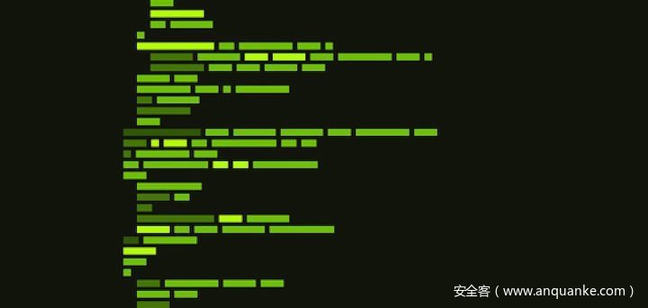

# Android OLLVM反混淆实战


                                阅读量   
                                **892961**
                            
                        |
                        
                                                            评论
                                <b>
                                    <a target="_blank">10</a>
                                </b>
                                                                                                                                    
                                                                                            


[](./img/200744/t01496d2eb266e235ee.jpg)


## 前言

小弟我最近在研究ollvm平坦化的反混淆，但网上的参考资料大多是x86的反混淆，关于arm的少之又少，现正好手头有个app样本中运用了这种混淆技术，所以拿来练一练手。

app样本：douyin9.9.0<br>
so样本：libcms.so<br>
逆向工具：ida,jadx


## 观察函数控制流程图(CFG)

所要获取的签名算法位于leviathan方法中，该方法是个native方法，在libcms.so中没有静态关联函数，所以我们需要找到其动态注册的位置。

[](https://p5.ssl.qhimg.com/t01212f81c9840a4c7b.png)

首先，分析Jni_OnLoad函数，Jni函数的动态注册一般都在这里进行：

[](https://p0.ssl.qhimg.com/t01e5e51e0c83574943.jpg)

关于ollvm的基本原理，大家可以在 [https://github.com/obfuscator-llvm/obfuscator](https://github.com/obfuscator-llvm/obfuscator) 上进行详细了解，在这里不做过多说明。

可以看到 JNI_OnLoad已经被彻底地混淆，通过流程图结构，我们可以初步推断是ollvm的指令平坦，进一步观察发现大部分流程块都会跳转至0x46FE，从而可以得出0x46FE是主分发器所在块，r0寄存器作为保存索引值的寄存器(在这里我将混淆里用于索引到相关块的常量值称为索引值)。

[](https://p3.ssl.qhimg.com/t014ccc59cbc35471d7.png)


## 去除一般混淆

仔细观察函数内容，发现其中还包含另外一种混淆结构，如下图所示：

[](https://p5.ssl.qhimg.com/t01816c6a766dd74d12.png)

从0x478c的位置PUSH {R0-R3}开始是另一个混淆结构的开始，功能比较简单，分析之后其作用是直接跳转到另一个地址，跳转的位置是到POP {R0-R3}指令的下一个地址，即0x47E4的位置。<br>
去除这中混淆的方式也比较简单，直接把0x478c处修改成到0x47E4的跳转即可，中间的混淆代码可以用nop填充掉，鉴于整个函数有多处这样的混淆，可以写个ida脚本批量处理，通过搜索特征字节码来定位混淆代码的起始与结束位置，例如混淆开始处的opcode为0F B4 78 46 79 46(为了避免错误识别可以多判断几个字节码)，结束处的opcode为0F BC。

脚本内容如下：

```
from idc import *
from idautils import *
from idaapi import *
from keystone import *

ks=Ks(KS_ARCH_ARM,KS_MODE_THUMB)

def ks_disasm(dis_str):
    global ks
    encoding,count=ks.asm(dis_str)
    return encoding

func_start=0x44c8
func_end=0x498c
patch_start = None
patch_end = None
for i in range(func_start, func_end):
    #PUSH{R0-R3} or PUSH{R0-R3,R7}
    #MOV R0,PC
    #MOV R1,PC
    if get_bytes(i,6,0) == b'x0fxb4x78x46x79x46' or get_bytes(i,6,0) == b'x8fxb4x78x46x79x46':
        patch_start = i
    #POP{R0-R3}
    if get_bytes(i,2,0) == b'x0fxbc':
        if patch_start != None:
            patch_end = i + 2
    #POP{R7},POP{R0-R3}
    if get_bytes(i,4,0) == b'x07xbcx88xbc':
        if patch_start != None:
            patch_end = i + 4
    if nop_start != None and nop_end != None:
        for i in range(0, patch_end - patch_start, 2):
            patch_byte(nop_start+i,0x00)
            patch_byte(nop_start+i+1,0xbf)
        dis_str = 'b #{}-{}'.format(patch_end, patch_start)
        jmp_addr.append(patch_start)
        encoding = ks_disasm(dis_str)
        for item in encoding:
            print('{}'.format(hex(item)))
        for j in range(len(encoding)):
            patch_byte(patch_start+j,encoding[j])
        patch_start = None
        patch_end = None
```

#### <a class="reference-link" name="%E5%AF%BB%E6%89%BE%E7%9B%B8%E5%85%B3%E5%9D%97"></a>寻找相关块

准备工作已完成，正式进入我们的主题，还原ollvm的混淆代码——关于如何还原流程平坦化，有三个问题需要解决：

一、找出流程里所有的相关块

二、找出各个相关块之间执行的先后顺序

三、使用跳转指令将各个相关块连接起来

第一个问题，通过以下规律找到差不多所有的相关块：

1、后继是分发器块的，一般是相关块(注意是一般，因为有的次分发器也会跳转至主分发器

2、相关块的前继块中，有且只有当前相关块一个后继块的，也是相关块

Github上有许多二进制分析框架(angr，barg，miasm等等)，可以对函数生成CFG(控制流程图)，由于barg和miasm对arm-v7a指令的支持不是很完全，有些代码无法反汇编，最终我选用了angr。(github地址：[https://github.com/angr/angr）](https://github.com/angr/angr%EF%BC%89)

这里我参考了github上的一个x86 ollvm反混淆脚本([https://github.com/SnowGirls/deflat](https://github.com/SnowGirls/deflat)):

```
filename = 'your sopath/libcms.so'
#start of JNI_Onload
start_addr=0x44c8
end_addr=0x498c
project = angr.Project(filename, load_options={'auto_load_libs': False})
cfg = project.analyses.CFGFast(regions=[(startaddr,endaddr)],normalize='True')
#函数为Thumb-2指令，所以寻找functions时的函数地址应该加上1
target_function = cfg.functions.get(start_addr+1)
#将angr的cfg转化为转化为类似ida的cfg
supergraph = am_graph.to_supergraph(target_function.transition_graph)
#手动寻找主分发器，返回块，序言块
main_dispatcher_node=get_node(supergraph,0x46ff)
retn_node=get_node(supergraph,0x4967)
prologue_node=get_node(supergraph,0x44c9)
#手动填入保存索引值的寄存器
regStr='r1'
```

project.analyses.CFGFast方法可以快速生成一个二进制代码的控制流程图，但这种流程图和ida的流程有一些不同(比如会将BL函数调用前后的代码分割成两个基本块)，而am_graph.to_supergraph方法，则可将其进一步转化为类似ida流程图的结构。

生成cfg后我们通过之前提到的规律来寻找所有的相关块，先找出所有跳转至主分发器的基本块，再筛选其中的相关块。

[](https://p5.ssl.qhimg.com/t01d1dc9bd7c5510c3b.png)

还有一些如上图红框所示1其实是一个次分发器，但最后跳转到了主分发器，对于这种情况，我们需要通过匹配特征反汇编指令来过滤掉这些分发器。而红框所示2包含了栈指针操作，但可以发现其并未使栈平衡，观察整个函数也并未发现其他平衡栈的操作，所以可以初步判定此类型的块也可能是混淆块，也应该过滤掉。

在这里我把直接跳转到主分发器的相关块称作一级相关块，对于没有跳转到主分发器而是跳转到另一个相关块的相关块称为次级相关块，则可以通过递归的方块由一级相关快逐层向上寻找，直到找出所有相关块。

由于编译器的优化导致某些相关块在改变了后并未跳转至主分发器，而是跳到了另一个共用代码段。如下图所示，0x14f44处是主分发器，因为编译优化的原因上面三处相关块都会引用同一个代码块，这样在后面的符号执行时，需要将0x14ac8处的相关块看做是上面三个相关块的一部分，符号执行时应该跳过这个共用的相关块。最后在patch指令时，将共用的相关块添加至每个引用它的相关块的末尾，然后再进行跳转。

[](https://p4.ssl.qhimg.com/t0158722004d03cb20c.jpg)

寻找所有相关块的代码：

```
def get_relevant_nodes(supergraph):
    global pre_dispatcher_node, prologue_node, retn_node,special_relevant_nodes,regstr
    relevants = {}

    #寻找那些没有直接跳转到主分发器的相关块
    def find_other_releventnodes(node,isSecondLevel):
        prenodes = list(supergraph.predecessors(node))
        for prenode in prenodes:
            if len(list(supergraph.successors(prenode)))==1:
                relevants[prenode.addr] = prenode
                if isSecondLevel and not(is_has_disasmes_in_node(node, [['mov', regstr]]) or is_has_disasmes_in_node(node, [['ldr', regstr]])):
                    #由于编译器的优化导致某些相关块在改变了索引值后并未跳转至主分发器，而是跳到了另一个共用代码段。
                    special_relevant_nodes[prenode.addr]=node.addr
                find_other_releventnodes(prenode,False)

    nodes = list(supergraph.predecessors(main_dispatcher_node))

    for node in nodes:
        #获取基本块的反汇编代码
        insns = project.factory.block(node.addr).capstone.insns
        if node in relevant_nodes:
            continue
        #过滤跳转到主分发器的子分发器
        elif len(insns)==4 and insns[0].insn.mnemonic.startswith('mov') and 
                insns[1].insn.mnemonic.startswith('mov') and 
                insns[2].insn.mnemonic.startswith('cmp') and 
                is_jmp_code(insns[3].insn.mnemonic):
            continue
        elif len(insns)==1 and is_jmp_code(insns[0].insn.mnemonic):
            continue
        elif len(insns)==2 and insns[0].insn.mnemonic.startswith('cmp') and 
            is_jmp_code(insns[1].insn.mnemonic):
            continue
        elif len(insns)==5 and (is_has_disasmes_in_node(node,[['mov',''],['mov',''],    ['cmp',''],['ldr',regstr]]) or 
            is_has_disasmes_in_node(node,[['mov',''],['mov',''],['cmp',''],                ['mov',regstr]]) )and 
            is_jmp_code(insns[4].insn.mnemonic):
            continue

        #过滤有add sp操作但没有sub sp操作的块
        elif is_has_disasmes_in_node(node,[['add','sp']]) and 
                is_has_disasmes_in_node(node,[['nop','']]):
            continue

        #将认定为相关块的基本块保存
        relevants[node.addr]=node
        #寻找其他没有跳转到主分发器的相关块
        find_other_releventnodes(node,True)
    return relevants

def is_startwith(str1,str2):
    if str2=='':
        return True
    return str1.startswith(str2)

#是否是跳转指令
def is_jmp_code(str):
    if not str.startswith('b'):
        return False
    if str.startswith('bl'):
        if str.startswith('ble') and not str.startswith('bleq'):
            return True
        else: return False
    return True

#是否是函数调用指令
def is_call_code(str):
    if not str.startswith('bl'):
        return False
    if str.startswith('ble') and not str.startswith('bleq'):
        return False
    return True

def is_has_disasmes_in_insns(insns,disinfolist):
    size = len(disinfolist)
    for i in range(len(insns) - (size-1)):
        is_has = True
        for j in range(size):
            insn=insns[i+j].insn
            disinfo=disinfolist[j]
            if not (is_startwith(insn.mnemonic,disinfo[0]) and is_startwith(insn.op_str,disinfo[1])):
                is_has=False
                break
        if is_has: return True
    return False

def is_has_disasmes_in_node(node,disinfolist):
    insns=project.factory.block(node.addr,node.size).capstone.insns
    return is_has_disasmes_in_insns(insns,disinfolist)
```


## 符号执行

找到所有相关块后，下一步要做的就是找出各个相关块的执行先后关系。使用angr的符号执行框架是一个不错的选择，它能够模拟CPU指令执行。当我们对一个相关块进行符号执行时，它能够正确找到下一个相关块。

符号执行先从函数序言处开始，我们将所有符号执行到达的相关块保存至一个队列里，将已经进行过符号执行的相关块从栈中弹出，然后在队列中取出新的相关块进行符号执行；同时我们在符号执行到一个新的相关块时需要保存当前CPU执行环境(内存状态，寄存器状态)，以确保下次符号执行新的相关块时，所有的CPU执行环境都正确。

对于有分支结构的相关块，我们采用特征反汇编来识别：

[](https://p3.ssl.qhimg.com/t015846d37364b69a41.png)

可以看到，在有分支的相关块中，是通过IT(if then)指令来实现不同条件分支的。IT指令中T的个数代表了分支指令数量（比如 ITTT EQ成立则会执行执行该指令后三条指令，否则会跳过这三条指令），在这里，寄存器R1作为状态值，在相关块中进行更新，然后返回主分发器，通过更新后的R1的值再找到下一个相关块。<br>
为了实现两个分支流程，我们需要自行改变执行流程，而angr的hook功能正好为我们实现了这一点，我们对IT指令的位置进行hook，通过设置跳过的地址长度来实现分支流程。

符号执行代码如下：

```
#队列用于保存相关块的符号执行环境
    flow = defaultdict(list)
    queue = queue.Queue()
    addrinqueue=[]
    #从函数开始处符号执行
    queue.put((startaddr+1,None,0))

    while not queue.empty():
        env=queue.get()
        pc=env.addr
        #到达函数返回块或是相关块已经执行过，则跳过该次执行
        if pc in addrinqueue or pc==retaddr:
            continue
        state=env
           block=project.factory.block(pc,relevants[pc].size)
        has_branches=False
        bl_addr=[]
        it_addr=[]
        insns=block.capstone.insns

        for i in range(len(insns)):
            insn=insns[i].insn
            #判断相关块中是否有bl指令，有就将bl指令地址保存，后面符号执行时直接hook跳过
            if insn.mnemonic.startswith('bl'):
                bl_addr.append((insn.address,insn.size))
            if i==len(insns)-1:
                continue
            #判断相关块中是否存在分支结构，有就将IT指令地址保存，符号执行时通过hook到达不同分支
            if insn.mnemonic.startswith('it') and insns[i+1].insn.op_str.startswith(regstr):
                if pc in patch_info:
                    continue
                has_branches = True
                patch_addr_info=[]
                patch_addr_info.append(insn.address)
                j=insn.mnemonic.count('t')
                it_addr.append((insn.address,insns[i+j+1].insn.address-insn.address))
                it_addr.append((insn.address,insns[i+1].insn.address-insn.address))
                movinsns=None
                if insns[-1].insn.mnemonic.startswith('b'):
                    movinsns=insns[i+j+1:-1]
                else:
                    movinsns=insns[i+j+1:]
                movcodes=bytearray()
                #如果IT指令之后有改变ZF状态操作，则将改变ZF状态的功能去除，ZF状态改变会影响分支的执行
                for insnx in movinsns:
                    if insnx.insn.mnemonic.startswith('movs'):
                        encoding=ks_disasm('{} {}'.format('mov',insnx.insn.op_str))
                        movcodes.extend(encoding)
                    else: movcodes.extend(insnx.insn.bytes)
                patch_info[pc]=(patch_addr_info,insn.op_str,movcodes)

        if has_branches:
              #有分支结构，对两个分支都进行符号执行
            symbolic_execution(pc,state, bl_addr, it_addr[0])
            symbolic_execution(pc,state, bl_addr,it_addr[1])
        else:
            symbolic_execution(pc,state,bl_addr)
```

```
def symbolic_execution(start_addr, state, bl_addrs=None, branch_addr=None):
    global real_to_real_nodes
    global regs_init_info,queue,flow,addrinqueue
    def handle_bl(state):
        pass

    def handle_branch(state):
        pass

    def init_regs(state,regs_info):
        if len(regs_info)==0:
            return
        for regstr,regvalue in regs_info.items():
            if regstr=='r0': state.regs.r0=claripy.BVV(regvalue,32)
            elif regstr=='r1': state.regs.r1=claripy.BVV(regvalue,32)
            elif regstr=='r2': state.regs.r2=claripy.BVV(regvalue,32)
            elif regstr=='r3': state.regs.r3=claripy.BVV(regvalue,32)
            elif regstr=='r4': state.regs.r4=claripy.BVV(regvalue,32)
            elif regstr=='r5': state.regs.r5=claripy.BVV(regvalue,32)
            elif regstr=='r6': state.regs.r6=claripy.BVV(regvalue,32)
            elif regstr=='r7': state.regs.r7=claripy.BVV(regvalue,32)
            elif regstr=='r8': state.regs.r8=claripy.BVV(regvalue,32)
            elif regstr=='r9': state.regs.r9=claripy.BVV(regvalue,32)
            elif regstr=='r10': state.regs.r10=claripy.BVV(regvalue,32)
            elif regstr=='r11': state.regs.r11=claripy.BVV(regvalue,32)
            elif regstr=='r12': state.regs.r12=claripy.BVV(regvalue,32)
            elif regstr=='sp': state.regs.sp=claripy.BVV(regvalue,32)
            elif regstr=='lr': state.regs.lr=claripy.BVV(regvalue,32)
            elif regstr=='pc': state.regs.pc=claripy.BVV(regvalue,32)

    global project, relevant_block_addrs, modify_value
    if bl_addrs!=None:
        for addr in bl_addrs:
            #hook bl指令 跳过函数调用
            project.hook(addr[0], handle_bl, addr[1])
    if branch_addr!=None:
          #hook it指令 实现不同分支执行
        project.hook(branch_addr[0],handle_branch,branch_addr[1],replace=True)
    if state==None:
        #初始化,用于第一次符号执行时
        state = project.factory.blank_state(addr=start_addr, remove_options={angr.sim_options.LAZY_SOLVES},
                                        add_option={angr.options.SYMBOLIC_WRITE_ADDRESSES})
        #初始化寄存器
        init_regs(state,regs_init_info)
    sm = project.factory.simulation_manager(state)
    loopTime=0
    maxLoopTime=1
    skip_addr=None
    #如果是编译优化导致进行符号执行的相关块改变索引值后未跳转至主分发器，则跳过该相关块跳转到的下一个相关块
    if start_addr in special_relevant_nodes:
        skip_addr=special_relevant_nodes[start_addr]
        maxLoopTime+=1

    sm.step()
    while len(sm.active) &gt; 0:
        for active_state in sm.active:
            #多次循环至主分发器而不经过任何相关块，可认定该路径为死循环
            if active_state.addr==main_dispatcher_node.addr:
                if loopTime&lt;maxLoopTime:
                    loopTime+=1
                else:
                    return None
            if active_state.addr==start_addr:
                return None
            if active_state.addr==retaddr:
                return (active_state.addr, active_state, start_addr)
            #判断是否是相关块
            if active_state.addr in relevant_block_addrs and active_state.addr != skip_addr:
                #如果是相关块，将该块的地址符号执行状态保存放入队列里面
                queue.put((active_state))
                #将符号执行的相关块和其后续相关块对应保存在字典里
                flow[start_addr].append(active_state.addr)
                #保存已经符号执行过的相关块，以免重复执行浪费时间
                addrinqueue.append(start_addr)
        sm.step()
```

其中project.hook用于直接跳过一些指令：

```
project.hook(self, addr, hook=None, length=0, kwargs=None, replace=False)
```

addr参数为hook的地址，length参数用于设置跳过的地址长度，hook参数可以设置一个在执行到这条指令时的回调方法。

sm.step会执行到下一个基本块的位置，这时判断如果该块是相关块的话，就停止符号执行，将该基本块的地址和当前的符号执行环境保存至之前所说的符号执行队列里，用于下一次对该块的符号执行。

这样等队列里所有块都符号执行完毕后，我们就理清了相关块之间的关系，下面一步，就是需要通过修改指令来建立相关块之间的跳转。


## patch指令建立相关块间的跳转

通过B系列指令来构建跳转，因为大部分相关块最后一条指令都是跳转回主分发器，对于还原混淆来说是无用的，所以我们选择在这里进行patch，将该指令替换成到下一个相关块的指令。如果是有分支结构的相关块，则需要patch两条跳转指令，这时哪里有空间存放另一条跳转指令呢？有两种方案可以解决：

1、相关块里最后用于改变索引值的指令都是无用的，所以我们可以将IT指令及其后面的分支指令去除，再将后面的指令移上去，这样就可以腾出空间放入另一条跳转指令。注意分支跳转指令的条件要和原先IT指令的条件保持一致。

patch前：

[](https://p1.ssl.qhimg.com/t01f11066e0b0ad3c97.png)

patch后：

[](https://p2.ssl.qhimg.com/t01d98ebb552ea5bafb.png)

2、如果去除IT相关指令后空间依然不够，第二种方法则是构建一个跳板，先跳转到一块无用代码区域(足够放下我们的跳转指令)，再从这块区域跳转到后面的相关块。无用代码区域从哪里找呢？可以从我们之前寻找相关块时过滤掉的代码块中获取，在过滤的时候将这些无用块的地址和大小保存起来，当需要构建跳板时再从中找到符合条件的代码区域。

[](https://p0.ssl.qhimg.com/t01047fa4cbb3b97888.png)

[](https://p2.ssl.qhimg.com/t0183b41c2f69733c85.png)

patch过程中其他需要注意的地方因为该函数是Thumb-2代码，长度可以为2字节或4字节，如果原本到主分发器的跳转是2字节，而新的跳转范围如果过大则可能是4字节，所以在patch前都要先判断下预留空间是否足够，如果不够的话，再通过上述一二两种方法进行处理。


## 最终效果查看

我们对JNI_OnLoad函数进行完上述处理，可以看到平坦化结构已经被消除

ida CFG：

[](https://p5.ssl.qhimg.com/t018c60249c13749c7b.png)

ida f5的效果：

[](https://p1.ssl.qhimg.com/t018ccff831f11ebffd.png)<br>[](https://p0.ssl.qhimg.com/t01da5e33e58bfb7be4.png)

当然啦，这只是完成了万里长征的第一步，里面的内容还需我们继续跟进。


## 总结

这篇主要讲一下ollvm反平坦化的思路和方法，下一篇我们再通过具体分析，找到其中的算法。

敬请关注！！！
