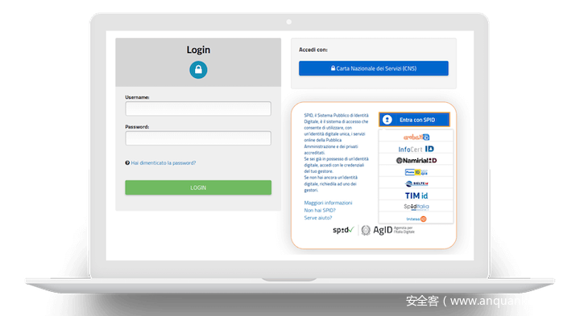

# Apereo CAS 4.X反序列化漏洞分析


                                阅读量   
                                **847694**
                            
                        |
                        
                                                            评论
                                <b>
                                    <a target="_blank">3</a>
                                </b>
                                                                                                                                    
                                                                                            


[](./img/198842/t01cd8c14994344403e.png)


## 0x01 漏洞描述

其实这个洞在2016年时候就出来了，Apereo Cas一般是用来做身份认证的，所以有一定的攻击面，漏洞的成因是因为key的默认硬编码，导致可以通过反序列化配合Gadget使用。


## 0x02 环境搭建

[下载地址](https://mvnrepository.com/artifact/org.jasig.cas/cas-server-webapp)，直接选择对应的版本，选择war进行下载，然后导入到tomcat中，运行即可。

[](https://p4.ssl.qhimg.com/dm/1024_503_/t0192830af556688cec.png)


## 0x03 漏洞分析

这里做个区分，因为内部逻辑稍微有点不一样。

### <a class="reference-link" name="Apereo%20CAS%204.1.X%20~%204.1.6"></a>Apereo CAS 4.1.X ~ 4.1.6

因为我不确定这个的流程是什么样的，但是我知道一点这个的 **demo** 目前是基于 **spring mvc** 的，因此我在`org/springframework/web/servlet/FrameworkServlet`处的 **doPost** 方法下断点，为什么是 **doPost** 原因就是我现在登录的数据包是 **Post** 。

[](https://p2.ssl.qhimg.com/dm/1024_591_/t01994e61f54e5447a6.png)

**doPost** 方法中调用 **FrameworkServlet#processRequest** 进行处理 **request** 对象和 **response** 对象。

```
protected final void doPost(HttpServletRequest request, HttpServletResponse response) throws ServletException, IOException {
        this.processRequest(request, response);
    }
```

跟进 **FrameworkServlet#processRequest** ，调用 **DispatcherServlet#doService** 处理 **request** 对象和 **response** 对象。

```
protected final void processRequest(HttpServletRequest request, HttpServletResponse response) throws ServletException, IOException {
...
        try {
            this.doService(request, response);
```

继续跟进 **DispatcherServlet#doService** ，调用 **DispatcherServlet#doDispatch** 处理 **request** 对象和 **response** 对象。

```
protected void doService(HttpServletRequest request, HttpServletResponse response) throws Exception {
    ...
        try {
            this.doDispatch(request, response);
        } finally {
            if (!WebAsyncUtils.getAsyncManager(request).isConcurrentHandlingStarted() &amp;&amp; attributesSnapshot != null) {
                this.restoreAttributesAfterInclude(request, attributesSnapshot);
            }

        }
```

继续跟进 **DispatcherServlet#doDispatch** ，而 **handle** 实际上是一个 **Implement** ，而这里进行经过处理之后来到的是 **FlowHandlerAdapter.handle** 中。

```
protected void doDispatch(HttpServletRequest request, HttpServletResponse response) throws Exception {
        HttpServletRequest processedRequest = request;
        HandlerExecutionChain mappedHandler = null;
        boolean multipartRequestParsed = false;
        WebAsyncManager asyncManager = WebAsyncUtils.getAsyncManager(request);

        try {
        ...
                    mv = ha.handle(processedRequest, response, mappedHandler.getHandler());
```

[](https://p5.ssl.qhimg.com/dm/1024_191_/t01eb56043057fa789e.png)

跟进 **FlowHandlerAdapter.handle** ，这里首先通过 **getFlowExecutionKey** 方法从 **request** 对象中获取我们传入的 **execution** 中的值，也就是 **flowExecutionKey** ，然后把这个 **flowExecutionKey** 交给 **resumeExecution** 方法进行处理。

[](https://p3.ssl.qhimg.com/dm/1024_266_/t01f53ed715b08ad46c.png)

跟进 **resumeExecution** 方法，来到`org/springframework/webflow/executor/FlowExecutorImpl`这个类中，调用 **getFlowExecution** 方法处理，从前面 **execution** 中的获取到的 **key** 值。

```
public FlowExecutionResult resumeExecution(String flowExecutionKey, ExternalContext context) throws FlowException {
        ...
        FlowExecutionKey key = this.executionRepository.parseFlowExecutionKey(flowExecutionKey);
        ...
            try {
                FlowExecution flowExecution = this.executionRepository.getFlowExecution(key);
                flowExecution.resume(context);
```

跟进 **getFlowExecution** 方法，先把之前的 **key** 调用 **getData** 方法，转变化成byte数组，之后调用 **transcoder.decode** 处理前面的byte数组。

[](https://p3.ssl.qhimg.com/dm/1024_144_/t01bae5ef7c0e35a5dc.png)

```
public FlowExecution getFlowExecution(FlowExecutionKey key) throws FlowExecutionRepositoryException {
        if (!(key instanceof ClientFlowExecutionKey)) {
            throw new IllegalArgumentException("Expected instance of ClientFlowExecutionKey but got " + key.getClass().getName());
        } else {
            byte[] encoded = ((ClientFlowExecutionKey)key).getData();

            try {
                ClientFlowExecutionRepository.SerializedFlowExecutionState state = (ClientFlowExecutionRepository.SerializedFlowExecutionState)this.transcoder.decode(encoded);
```

跟进 **transcoder.decode** ，首先需要先`cipherBean.decrypt`进行一步解密操作，解密传入的byte数组，然后就会来到反序列化入口 **readObject** 了。

[](https://p4.ssl.qhimg.com/dm/1024_595_/t0129ddb2b3ae1d492a.png)

再看一下加密算法，算法是 **AES/CBC/PKCS7** ，**KeyStore** 是硬编码在 **spring-webflow-client-repo-1.0.0.jar/etc/keystore.jcek** 。

[](https://p3.ssl.qhimg.com/dm/1024_189_/t017aa61f0c894a2cdc.png)

[](https://p5.ssl.qhimg.com/dm/1024_235_/t01a135cb082cd1fbc8.png)

而实际上当你全局搜索login关键字的时候，你会在 **WEB-INF/cas-servlet.xml** 中看到 **loginHandlerAdapter** 对应的类是 **SelectiveFlowHandlerAdapter** ，而 **loginFlowExecutor** 对应的类是 **FlowExecutorImpl** ，实际上和上面从输入下断点来看是一样的。

```
&lt;bean id="loginHandlerAdapter" class="org.jasig.cas.web.flow.SelectiveFlowHandlerAdapter"
        p:supportedFlowId="login" p:flowExecutor-ref="loginFlowExecutor" p:flowUrlHandler-ref="loginFlowUrlHandler" /&gt;

  &lt;bean id="loginFlowUrlHandler" class="org.jasig.cas.web.flow.CasDefaultFlowUrlHandler" /&gt;

  &lt;bean name="loginFlowExecutor" class="org.springframework.webflow.executor.FlowExecutorImpl" 
        c:definitionLocator-ref="loginFlowRegistry"
        c:executionFactory-ref="loginFlowExecutionFactory"
        c:executionRepository-ref="loginFlowExecutionRepository" /&gt;
```

### <a class="reference-link" name="Apereo%20CAS%204.1.7%20%EF%BD%9E%204.2.X"></a>Apereo CAS 4.1.7 ～ 4.2.X

这个版本的key默认是随机生成的，所以需要先硬编码一下`WEB-INF/cas.properties`这个文件，方便调试。

[](https://p4.ssl.qhimg.com/dm/1024_115_/t01cedfd1995c472d1b.png)

实际上到`ClientFlowExecutionRepository#getFlowExecution`这里之前数据流还是没有变。

[](https://p1.ssl.qhimg.com/dm/1024_479_/t0165dd9dc6b7427afb.png)

改变的地方是 **decode** 时候解密 **decrypt** 操作来到的是 **CasWebflowCipherBean** 当中。

[](https://p1.ssl.qhimg.com/dm/1024_146_/t0152544360c8e2081d.png)

在 **CasWebflowCipherBean** 当中调用的是 **webflowCipherExecutor.decode** 进行操作。

```
public byte[] decrypt(final byte[] bytes) {
        return webflowCipherExecutor.decode(bytes);
    }
```

跟进 **webflowCipherExecutor.decode** ，这里的 **key** 就是从我们刚刚默认的配置文件`WEB-INF/cas.properties`中拿出来的。

[](https://p5.ssl.qhimg.com/dm/1024_292_/t01850d591087356474.png)

[](https://p0.ssl.qhimg.com/dm/1024_114_/t0162247cfbb3c1d5e7.png)


## 0x04漏洞利用

### <a class="reference-link" name="Apereo%20CAS%204.1.X%20~%204.1.6"></a>Apereo CAS 4.1.X ~ 4.1.6

由于在当前版本中有 **Commons-collections4** 这个库。

[](https://p3.ssl.qhimg.com/t0146991a751fb10e41.png)

使用可以利用 **yso** 中的 **CC2** 这个payload进行poc构造，构造时候直接使用

**org.jasig.spring.webflow.plugin.EncryptedTranscoder.encode** 进行加密即可，然后替换 **execution** 这个参数位置的值。

[](https://p4.ssl.qhimg.com/dm/1024_301_/t01a7d5e01cd6be3f80.png)

漏洞复现。

[](https://p5.ssl.qhimg.com/dm/1024_394_/t01cf7d573a87761df8.png)

根据，这个[文章](http://www.00theway.org/2020/01/04/apereo-cas-rce/)里面，提到的

> 对整个项目进行搜索发现了一个静态方法满足我们的需求
<pre><code class="hljs css">org.springframework.webflow.context.ExternalContextHolder.getExternalContext()
</code></pre>
通过这个方法可以获取到当前进行关联的上下文信息，然后通过“getNativeRequest()”方法获取request对象通过getNativeResponse()方法获取response对象。
可以通过 “org.springframework.cglib.core.ReflectUtils.defineClass().newInstance();”这个public方法来加载我们的payload。

根据这个方式，自己写一个 **ApereoExec** 类，修改 **ysoserial/payloads/util/Gadgets** 里面的部分东西，使用javassist进行patch就好了。

[](https://p5.ssl.qhimg.com/dm/1024_335_/t01904c776586eecca3.png)

[](https://p2.ssl.qhimg.com/dm/1024_316_/t01a5539bf9840adeac.png)

### <a class="reference-link" name="Apereo%20CAS%204.1.7%20%EF%BD%9E%204.2.X"></a>Apereo CAS 4.1.7 ～ 4.2.X

这里需要自己构造了，看一下前面的加密过程，加密的时候把 **Object** 传入，然后调用 **GZIPOutputStream** 进行压缩，序列化，然后调用 **cipherBean.encrypt** 进行加密，最后 **base64** 再加密一下。

```
public byte[] encode(Object o) throws IOException {
        if (o == null) {
            return new byte[0];
        } else {
            ByteArrayOutputStream outBuffer = new ByteArrayOutputStream();
            ObjectOutputStream out = null;

            try {
                if (this.compression) {
                    out = new ObjectOutputStream(new GZIPOutputStream(outBuffer));
                } else {
                    out = new ObjectOutputStream(outBuffer);
                }

                out.writeObject(o);
            } finally {
                if (out != null) {
                    out.close();
                }
            }
            try {
                return this.cipherBean.encrypt(outBuffer.toByteArray());
            } catch (Exception var7) {
                throw new IOException("Encryption error", var7);
            }
        }
    }
```

而这个版本demo中存在C3P0 gadget，因此可以利用这个来操作。

[](https://p0.ssl.qhimg.com/dm/1024_437_/t0111658c325eb62c24.png)

当然也可以把这部分内容抓出来，手动写一个反序列化解密操作。

[](https://p4.ssl.qhimg.com/dm/1024_278_/t012e09d31b5b4cae03.png)


## Reference

[https://apereo.github.io/2016/04/08/commonsvulndisc/](https://apereo.github.io/2016/04/08/commonsvulndisc/)

[http://www.00theway.org/2020/01/04/apereo-cas-rce/](http://www.00theway.org/2020/01/04/apereo-cas-rce/)
