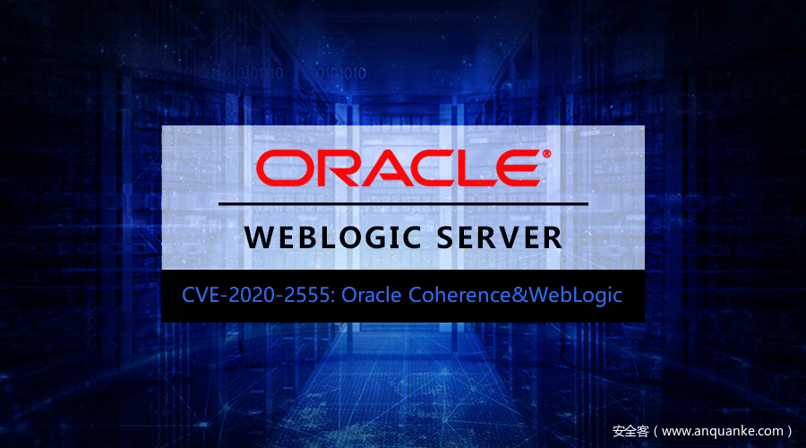

# CVE-2020-2555：Oracle Coherence&amp;WebLogic反序列化远程代码执行分析

                                阅读量   
                                **655912**
                            
                        |
                        
                                                                                    

作者：Hu3sky@360CERT

## 0x01 漏洞背景

2020年3月6日，Oracle Coherence 反序列化远程代码执行漏洞（CVE-2020-2555）的细节被公开，Oracle Coherence为Oracle融合中间件中的产品，在WebLogic 12c及以上版本中默认集成到WebLogic安装包中，攻击者通过t3协议发送构造的序列化数据，能过造成命令执行的效果

## 0x02 影响版本
- Oracle Coherence 3.7.1.17
- Oracle Coherence 12.1.3.0.0
- Oracle Coherence 12.2.1.3.0
- Oracle Coherence 12.2.1.4.0

## 0x03 漏洞分析

测试版本：
1. jdk: 8u191
1. weblogic: 12.2.1.4.0
官方修补了LimitFilter.toString()方法，修补前的该方法如下

主要关注我标记了的地方，如果m_comparator属性是ValueExtractor的实例，那么就会去调用extract方法，并且传入m_oAnchorTop属性，这里的属性都可控，这里我们就需要明确最终的目的，造成命令执行，比较理想的就是能够调用Method.invoke()，通过反射调用任意方法，通过寻找，发现了com.tangosol.util.extractor.ReflectionExtractor类的extract方法中，存在利用点，并且该类可被序列化

我们看到他的extract方法，调用了method.invoke，两个参数都为序列化中的可控变量

直接通过构造方法进行赋值

不过我们知道，单凭这一个method.invoke是没法调用到Runtime.getRuntime().exec()的，需要再去寻找一个中间点去反复调用这个方法，这里就十分的类似Commons Collections的gadgets，那么这个中间点就是com.tangosol.util.extractor.ChainedExtractor方法，他的extract方法

每执行一次method.invoke的结果都会return，作为下一次执行的参数。不过要注意第一次循环的时候，需要手动传入oTarget参数，也就是LimitFilter.toString()传入extract的m_oAnchorTop参数，如果我们要达到命令执行的目的，就需要赋值为Runtime.class 这样就能够将一整个反射给连接起来了，通过反射来造成java.lang.Runtime.getRuntime().exec的效果

那么回到最开始，我们还没有说怎么去调用LimitFilter.toString()方法，看到BadAttributeValueExpException重写的readObject方法，这里的readObject的valObj变量是我们可控的，在进行反序列化时，java会调用ObjectInputStream类的readObject()方法。如果被反序列化的类重写了readObject方法，那么该类在进行反序列化时，Java会优先调用重写的readObject方法

类似的gadgets也出现在[CommonsCollections5](https://github.com/frohoff/ysoserial/blob/master/src/main/java/ysoserial/payloads/CommonsCollections5.java)里，

这样，一条完整的gadget chain就被连接起来。

## 0x04 漏洞证明

通过t3协议将反序列化数据发送给weblogic server

## 0x05 修复建议

升级补丁，参考oracle官网发布的补丁[https://www.oracle.com/security-alerts/cpujan2020.html](https://www.oracle.com/security-alerts/cpujan2020.html) 如果不依赖T3协议进行JVM通信，禁用T3协议。

进入WebLogic控制台，在base_domain配置页面中，进入安全选项卡页面，点击筛选器，配置筛选器。 在连接筛选器中输入：weblogic.security.net.ConnectionFilterImpl，在连接筛选器规则框中输入 7001 deny t3 t3s 保存生效（需重启）

## 0x06 时间线

2020-03-06 漏洞细节被公开

2020-03-06 360-CERT 发布预警

2020-03-09 360-CERT 发布分析

## 0x07 参考链接
1. [https://www.thezdi.com/blog/2020/3/5/cve-2020-2555-rce-through-a-deserialization-bug-in-oracles-weblogic-server](https://www.thezdi.com/blog/2020/3/5/cve-2020-2555-rce-through-a-deserialization-bug-in-oracles-weblogic-server)