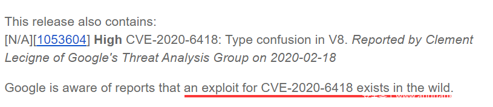

# Chrome漏洞调试笔记3-CVE-2020-6418

                                阅读量   
                                **848880**
                            
                        |
                        
                                                            评论
                                <b>
                                    <a target="_blank">3</a>
                                </b>
                                                                                                                                    
                                                                                            

CVE-2020-6418是2020年2月24日Google公布的一个Chrome浏览器的高危漏洞，这也是19年至今被发现的第三个Chrome在野漏洞利用：

最近笔者发现Google公布了该漏洞的细节，并且Exodus的blog也公布了相关利用代码。基于上述信息，笔者对该漏洞做了一些调试，这里将分析过程分享给大家。由于笔者水平有限，文中错误之处恳请斧正。

## 0x0 漏洞原理分析

首先理解Google提供的漏洞细节：

根据@saelo给出的分析报告可以看出，这里漏洞属于JIT优化过程中单个OpCode的side effect问题。NodeProperties::InferReceiverMapsUnsafe函数在遍历effect chain时，遇到kJSCreate时认为不存在side effect，因此未将推导结果标记成NodeProperties::kUnreliableReceiverMaps。导致Turbofan在对Array.prototype.pop()等函数的builtin inlining阶段，认为kJSCreate不会改变对象Map，从而优化删除了对象的类型检查。最终通过kJSCreate的回调造成了对象的类型混淆。

存在漏洞的代码流程分析如下：

Turbofan在Inlining阶段会调用JSCallReducer::ReduceJSCall对builtin函数进行优化，主要逻辑就是根据builtin_id跳转到不同的优化分支：

这里选择Builtins::kArrayPrototypePop进行分析，跳转到Array.prototype.pop()函数对应的优化实现JSCallReducer::ReduceArrayPrototypePop:

JSCallReducer::ReduceArrayPrototypePop 函数主要流程是根据Array的ElementsKind，获取length属性，计算pop后的length属性，返回Array的最后一个元素并将移除元素地址值设置成hole。显然这一切优化的前提是ElementsKind是确定的并且是否会发生变化也是可以推导的，而这一类型推导工作是由MapInference完成的。MapInference根据effect chain判断对象（receiver）类型（Map）是否可靠，也就是effect chain是否存在修改对象类型的可能：

MapInference函数调用NodeProperties::InferReceiverMapsUnsafe进行对象类型可靠推断：

NodeProperties::InferReceiverMapsUnsafe通过遍历effect chain的opcode，判断effect chain中是否存在opcode会修改对象类型，如果对象类型不会改变则返回kReliableReceiverMaps，否则返回kUnreliableReceiverMaps。返回MapInference函数后根据result设置maps_state_：

最后返回JSCallReducer::ReduceArrayPrototypePop，调用MapInference::RelyOnMapsPreferStability根据maps_state_决定是否需要加入CheckMaps节点做对象类型检查：

理解了代码逻辑，我们再来看下PoC是如何触发漏洞的。根据Google公布的漏洞细节修改PoC如下：

首先在可以触发Array.prototype.pop优化流程的js代码a.pop()参数中加入Reflect.construct。虽然Array.prototype.pop不需要参数，但是Reflect.construct仍然会加入到effect chain中。通过设置Proxy拦截遍历对象原型链时的get操作。

函数f在多次调用后被JIT。在isLastIteration后置TRIGGER为true，通过Proxy回调修改a[2] = 156842099844.51764。这样数组a的类型由PACKED_SMI_ELEMENTS转为PACKED_DOUBLE_ELEMENTS。但是由于Turbofan在优化过程中不知道kJSCreate（Reflect.construct触发）存在side effect，NodeProperties::InferReceiverMapsUnsafe函数返回result = kReliableReceiverMaps，从而maps_state_ = kReliableOrGuarded。导致调用MapInference:: RelyOnMapsPreferStability函数认为effect chain是安全的，从而没有加入CheckMaps节点，最终忽略了对象的类型检查。

动态调试中可以看到：生成的JIT code没有对数组a进行类型检查，而直接根据PACKED_SMI_ELEMENTS的偏移取a[4]的值：

（这里r9保存了a.elements的基址；r8保存了a[4]的索引4；乘4是因为V8 8.0后引入的指针压缩技术pointer compression，SMI类型和Pointer类型只占4字节；+7是跳过elements的Map和length字段）

可以看到PACKED_SMI_ELEMENTS类型的a原来存放a[4]值的地址现在对应PACKED_DOUBLE_ELEMENTS类型a[2]的低4字节 0x4242424242，按照指针压缩SMI最终被解析为0x21212121:

## 0x1 任意地址读写

由漏洞原理分析部分可以知道，通过设置Proxy，可以获得一次回调修改数组类型机会。第一部分的PoC我们将PACKED_SMI_ELEMENTS转为PACKED_DOUBLE_ELEMENTS，从而pop出了PACKED_DOUBLE_ELEMENTS第二个元素的低4个字节。同理，如果将PACKED_DOUBLE_ELEMENTS转换为PACKED_ELEMENTS，就可以通过Array.prototype.pop和Array.prototype.push实现越界读写功能，具体看Exodus的Blog给出的PoC：

这里在回调修改数组a类型后，紧接着创建了一个新的数组b，由于内存分配的连续性，b会紧接着a后面分配。因此可以通过设置a的元素个数，精确地将a越界写的地址指向b的length属性，从而修改b的长度。

首先观察回调中修改a类型为PACKED_ELEMENTS，创建b数组后的内存布局情况：

通过a.push(156842065920.05)越界写入b.length字段地址 （156842065920.05的内存表示为0x0000066642424242）：

最终b的长度被修改成了0x333=819。

那么得到了一个越界读写的数组b后，如何实现任意地址读写呢，Exodus给出了这样的内存布局：

这里vuln对应了上面的数组a，float_rel对应了数组b，float_carw用来实现pointer compression下的内存读写，uint64_aarw用来实现完整的内存读写，obj_leaker用来实现对象地址泄露。

一次调试中的内存布局如下：

参照上面的内存布局图，具体利用步骤说明：
1. 利用漏洞修改float_rel的长度为0x333：

获得相对float_rel索引的越界读写功能：

1. 利用float_rel，修改float_carw的elements指针（float_rel[0x14]）,实现pointer compression下的内存读写：

（这里原始的exp有个bug，elements_addr等变量没有设置成局部变量，导致cabs_write4里调用cabs_read4时，elements_addr变量值会被cabs_read4里的elements_addr变量值覆盖，从而导致写入地址错误。）
1. 利用float_rel，修改uint64_aarw的external_pointer和base_pointer，实现任意地址读写：

1. 利用float_rel，读取obj_leaker.b的值，实现任意对象地址泄露：

## 0x2 Shellcode执行

有了任意地址读写功能后，shellcode执行还是利用WebAssembly实现，原理可以参考笔者的《Chrome漏洞调试笔记1——CVE-2019-5768》，这里不再详述：

最后安装80.0.3987.87版本的Chrome，关闭sandbox，执行exp：

## 0x3 参考文献
1. [https://bugs.chromium.org/p/chromium/issues/detail?id=1053604](https://bugs.chromium.org/p/chromium/issues/detail?id=1053604)
1. [https://blog.exodusintel.com/2020/02/24/a-eulogy-for-patch-gapping/](https://blog.exodusintel.com/2020/02/24/a-eulogy-for-patch-gapping/)
1. [https://chromium.googlesource.com/v8/v8/+/73d8e45534b6ceeedeb7da0b884791566d478c51](https://chromium.googlesource.com/v8/v8/+/73d8e45534b6ceeedeb7da0b884791566d478c51)
1. [https://docs.google.com/document/d/10qh2-b4C5OtSg-xLwyZpEI5ZihVBPtn1xwKBbQC26yI](https://docs.google.com/document/d/10qh2-b4C5OtSg-xLwyZpEI5ZihVBPtn1xwKBbQC26yI/edit)
1. [https://www.anquanke.com/post/id/194351](https://www.anquanke.com/post/id/194351)