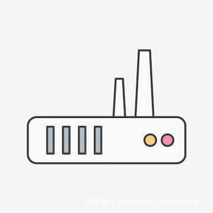

# D-Link DSL-2640B多个漏洞分析


                                阅读量   
                                **562362**
                            
                        |
                        
                                                                                                                                    
                                                                                            


##### 译文声明

本文是翻译文章，文章原作者raelize，文章来源：raelize.com
                                <br>原文地址：[https://raelize.com/posts/d-link-dsl-2640b-security-advisories/#cve-2020-9276----d-link-dsl-2640b---do_cgi-buffer-overflow](https://raelize.com/posts/d-link-dsl-2640b-security-advisories/#cve-2020-9276----d-link-dsl-2640b---do_cgi-buffer-overflow)

译文仅供参考，具体内容表达以及含义原文为准

[](./img/202213/t01be047370312b6192.jpg)


## 0x00 前言

在前一篇[文章](https://raelize.com/posts/security-impact-of-eol-devices/)中，我们介绍了超出产品支持生命周期（EoL）物联网设备中漏洞可能造成的影响，我们选择[D-Link DSL-2640B DSL](https://eu.dlink.com/uk/en/products/dsl-2640b-adsl-2-wireless-g-router-with-4-port-10-100-switch)网关作为分析案例。在本文中，我们将介绍这些漏洞的具体细节。

在深入分析技术细节前，我们需要了解如下几点事实：

1、所有漏洞（至少）都适用于D-Link DSL-2640B型号（HW revision B2）；

2、所有漏洞都适用于官网最新提供的固件（截至2020年3月27日）；

3、所有漏洞均已反馈至D-Link；

4、我们没有收到D-Link发布的任何安全补丁；

5、由于这些设备处于EoL状态，根据D-Link的政策，官方可能永远不会提供安全补丁。

本文介绍的这些漏洞可能适用于其他硬件版本、其他固件版本甚至其他完全不同的型号。我们并没有进一步调查，D-Link也没有提供其他信息。

这里涉及到的漏洞包括：
- CVE-2020-9275 – D-Link DSL-2640B远程凭据泄露
- CVE-2020-9279 – D-Link DSL-2640B硬编码特权账户
- CVE-2020-9278 – D-Link DSL-2640B未授权配置重设
- CVE-2020-9277 – D-Link DSL-2640B CGI身份认证绕过
- CVE-2020-9276 – D-Link DSL-2640B `do_cgi`缓冲区溢出
我们提供了这些漏洞的技术细节，后续可能会进一步提供其他信息（如演示视频），有任何意见或建议可随时联系<a>@raelizecom</a>。


## 0x01 CVE-2020-9275：远程凭据泄露

利用该[漏洞](https://raelize.com/advisories/CVE-2020-9275_D-Link-DSL-2640B_Remote-Credentials-Exfiltration_v1.0.txt)，攻击者可以向设备的`65002`端口发送特定的UDP报文，从而获取设备管理密码。

如果攻击者已连入Wi-Fi或者本地LAN，或者可以通过其他方式访问到内部设备接口，那么就能通过一个UDP请求，拿到设备密码。

该设备的大多数功能（包括管理面板以及Web服务器）都由`cfm`这个进程实现，该进程会在设备启动时运行。`cfm`进程会在`UDP` `65002`端口上监听，可能是提供设备配置功能的一个专用应用。相关通信协议如下图所示，函数名`pcApplication`直接来自于程序中的符号。

[](https://p3.ssl.qhimg.com/t01b41c9b250d402e00.png)

通信过程采用D-Link的专有协议，该协议并没有公开文档。经过逆向分析`cfm`程序后，我们能得到协议包的结构，如下所示：

[](https://p3.ssl.qhimg.com/t01a64b3a07b52ebcc1.png)

该协议可以在2字节的`cmd`字段中指定命令代码，从而支持多个命令。通信流量采用明文形式，不需要经过身份认证。对于某些命令，代码只会检查报文中的MAC地址是否匹配目标设备的MAC地址。

`\x00\x01`命令可以从设备中获取系统信息，包括设备管理密码，设备以明文返回响应包。比如：

```
python -c 'print("\x00\x01"* 5)' | nc -u 192.168.1.1 65002
####MAC_ADDRESS####&lt;boardID=D-4P-W&gt;&lt;sysVersion=EU_3-10-02-3B00.A2pB022g2.d20h&gt;
&lt;sysModel=DSL-2640B&gt;&lt;local_username=admin&gt;&lt;local_password=password&gt;
&lt;local_ipaddress=192.168.1.1&gt;
```

设备并没有检查`\x00\x01`命令中的MAC地址，并且会忽略后面的附加字节，因此我们很容易就能探测目标设备是否存在该漏洞。

我们其实使用了非常直接的fuzz方法发现了这个漏洞。我们首先尝试将`/dev/urandom`管道的数据送入UDP `65002`端口，但并不认为这种方法能找到漏洞，因为我们没有监控流量、没有选择payload，也没有针对性进行调试。令人惊讶的是，经过几分钟后，设备就返回了管理员密码。

```
time cat /dev/urandom | nc -u 192.168.1.1 65002
&amp;ZLM���&lt;boardID=D-4P-W&gt;&lt;sysVersion=EU_3-10-02-3B00.A2pB022g2.d20h&gt;
&lt;sysModel=DSL-2640B&gt;&lt;local_username=admin&gt;&lt;local_password=a&gt;
&lt;local_ipaddress=192.168.1.1&gt;^C

real    2m53.240s
user    0m0.599s
sys    0m21.439s
```

由于目标设备的逻辑非常简单，UDP报文中只要`\x00\x01`处于合适的位置，设备就会返回管理员密码。因此即使我们采用的是最粗鲁的方法，也能在几分钟内拿到管理密码。

经过初步测试，我们发现该漏洞能在LAN网络中使用。然而设备服务似乎会在所有接口上监听，如下所示：

[](https://p5.ssl.qhimg.com/t012c7c2b32bf309271.png)

不幸的是，由于我们缺少适当的DSL连接，因此没有在WAN端验证该漏洞。根据我们目前掌握的信息，我们不排除该漏洞在WAN端被利用的可能性。如果大家可以提供更多信息，欢迎与我们交流。


## 0x02 CVE-2020-9279：硬编码特权账户

该[漏洞](https://raelize.com/advisories/CVE-2020-9279_D-Link-DSL-2640B_Hard-coded-privileged-account_v1.0.txt)对应的是设备中硬编码的一个用户账户，攻击者可能利用这些凭据来登录目标设备，执行管理任务。

我们分析了通过Web接口的身份认证过程，从而发现了这个漏洞。`cfm`进程提供的是通信“管道”，实际的认证过程委派给外部程序库`libpsi.so`。这个库使用了面向对象的方法来处理身份认证凭据以及传入的身份认证请求。

分析`cfm`进程的执行流后，我们找到了针对`user`用户的一个身份认证代码路径。

[](https://p4.ssl.qhimg.com/t0154c34fec14cab193.png)

这里用于身份认证的默认密码已经硬编码到`libpsi.so`文件中。

[](https://p0.ssl.qhimg.com/t01a3d15d6335f4b23c.png)

逆向分析这个库后，我们发现该库会使用如下默认凭据来登录设备的Web口。

```
Username: user
Password: 00202b004720
```

虽然`user`用户的密码可以修改，但设备并没有提供Web空间来供用户修改。因此，这个密码在整个设备的使用周期内应该都会被设置为默认状态。重要的是，整个账户可以通过基于`lipsi.so`的任何服务（比如ftp、telnet及ssh）的身份认证。目前据我们所知，`user`用户具备与`admin`账户类似的功能。

有趣的是，尽管`libpsi.so`只提供了二进制格式的文件，但我们也能在设备的GPL源代码中看到这些凭据，如下图所示：

[](https://p1.ssl.qhimg.com/t01b35b150774092288.png)

另一点也比较有趣，这些凭据都与`ASUS_USER_ACCOUNT`有关。这里大家可能比较好奇，为什么ASUS有关的账户会出现在D-Link设备中。

源代码本身并没有经过太多混淆处理，我们发现这些凭据同样适用于其他ASUS设备。ASUS在某些过时页面中将这些账户称为“ASUS Super account”（ASUS超级账户）。

[](https://p4.ssl.qhimg.com/t011cd721493ccf1980.png)

有人会认为这是ASUS的一个“特性”，然后因为某些未知的原因，最终这些“特性”出现在了D-Link设备上。IoT设备的供应链比较复杂，我们认为这可能是因为某些特殊的“供应链关系”所导致，而不是特意为之。

这里我们还想提一点，该漏洞可能通过浏览器pivot攻击方式来利用。如果连接Wi-Fi/LAN的设备访问了某个恶意站点，那么攻击者就有可能向网关发送精心涉及的请求。


## 0x03 CVE-2020-9278：未授权配置重置

利用该[漏洞](https://raelize.com/advisories/CVE-2020-9278_D-Link-DSL-2640B_Unauthenticated-configuration-reset_v1.0.txt)，攻击者可以访问特定URL，将目标设备重置为默认配置状态，整个过程不需要任何身份认证。

在不经过身份认证的情况下，任何人都可以访问目标设备的如下URL：

```
rebootinfo.cgi
ppppasswordinfo.cgi
qosqueue.cmd?action=savReboot
restoreinfo.cgi
```

更具体一些，我们只要请求如下URL，就可以将设备恢复为出厂设置状态：

```
http://&lt;device_IP_address&gt;/restoreinfo.cgi
```

攻击者可能将管理密码重置为默认值`admin`，登录设备然后执行各种管理任务，比如上传恶意固件、配置恶意DNS服务器等。

虽然攻击者需要访问设备的LAN口才能利用该漏洞，但也可以通过浏览器pivot技术来远程利用。控制恶意站点的攻击者可能随意重设目标设备的配置，在某种情况下完全控制该设备。


## 0x04 CVE-2020-9277：CGI认证绕过

攻击者可以利用CVE-2020-9277[漏洞](https://raelize.com/advisories/CVE-2020-9277_D-Link-DSL-2640B_CGI-Authentication-bypass_v1.0.txt)绕过受限资源的身份认证过程。比如，攻击者不需要提供有效的凭据，就可以直接访问Web接口的管理功能

Web服务器首先会确认所请求的URL是否需要身份认证。这个检查过程中会分析所请求文件的扩展名，而文件扩展名位于URL的尾部。比如，用户访问`cgi`管理模块时就需要身份认证。在代码中，身份认证并没有立即进行，而是会稍后处理。

随后，代码会确认不需要经过身份认证的特定资源，比如图像或者Javascript脚本等。代码会使用`strncmp()`函数，将URL开头部分与特定字符串（比如`/images/`、`utils.js`）进行匹配。如果匹配成功，就不会执行身份认证过程，并且会无视上一步的身份认证条件。随后，设备会将该请求当成已通过身份认证的请求来处理。

最后，如果请求了`cgi`模块，`do_cgi()`函数就会使用`strstr()`函数搜索URL中的任意位置，来确定待执行的模块。

以上检查过程都互相独立，没有继承任何状态。攻击者随后可以构造恶意URL来绕过针对`cgi`模块的身份认证。比如，攻击者可以通过如下URL，将设备的管理密码重置为`newpass`，整个过程不需要任何身份认证：

```
原始URL: http://&lt;device_IP_address&gt;/redpass.cgi?sysPassword=newpass
攻击URL: http://&lt;device_IP_address&gt;/images/redpass.cgi?sysPassword=newpass
```

攻击者可以利用该漏洞完全控制目标设备，未经身份认证执行管理功能。该漏洞需要访问设备的LAN口，但可以通过浏览器pivot方式来利用，因此远程攻击者也可以通过互联网进行攻击。


## 0x05 CVE-2020-9276：do_cgi缓冲区溢出

这是`do_cgi()`函数中的一个缓冲区溢出[漏洞](https://raelize.com/advisories/CVE-2020-9276_D-Link-DSL-2640B_do_cgi-buffer-overflow_v1.0.txt)，设备在解析用户请求的`cgi`模块名时存在漏洞。攻击者可以在URL中提供恶意的`cgi`模块名，从而以管理权限在设备上执行任意代码。

为了识别待执行的模块，`do_cgi`函数会将模块名拷贝到栈上。然而，设备并没有检查用户提供的模块名是否适合已分配的缓冲区，如下图所示：

[](https://p4.ssl.qhimg.com/t01196bee889960c6b7.png)

因此，较长的`cgi`模块名会覆盖栈上保存的返回地址，从而导致经典的栈溢出漏洞，容易被利用。

从原理上讲，`do_cgi()`函数只能在经过身份认证后才能访问。然而，攻击者可以结合[CVE-2020-9277](https://raelize.com/posts/d-link-dsl-2640b-security-advisories/#cve-2020-9277----d-link-dsl-2640b---cgi-authentication-bypass)漏洞，绕过身份认证来利用该漏洞。如下图所示，我们可以绕过身份认证来利用该漏洞，执行反向shell payload。

[](https://p3.ssl.qhimg.com/t01085a27d1aafd0259.png)
