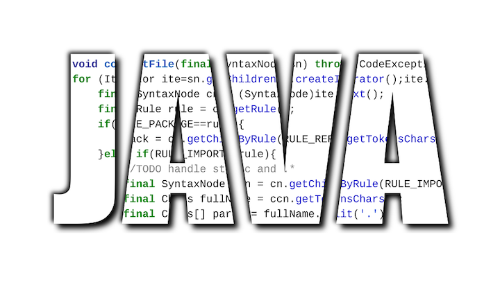

# Java CORBA


                                阅读量   
                                **817834**
                            
                        |
                        
                                                            评论
                                <b>
                                    <a target="_blank">1</a>
                                </b>
                                                                                    


[](./img/199227/t013f4f999ae3780445.png)


作者：Lucifaer@360CERT

在说到JNDI的时候，我们最常接触到的都是较为上层的JNDI SPI（服务端提供的接口），除了常用的RMI、LDAP这些服务，还存在CORBA服务，这篇文章的重点就是来学习一下JNDI如何使用CORBA服务，并以尽量详尽的用例子来解释清楚如何使用CORBA的各个流程。


## 0x01 基础概念

这部分可能会较为枯燥，但是对后续理解有很大的帮助，我尽量用简单的话来描述清楚几个名词。

### <a class="reference-link" name="1.1%20IDL%E4%B8%8EJava%20IDL"></a>1.1 IDL与Java IDL

IDL全称（Interface Definition Language）也就是接口定义语言，它主要用于描述软件组件的应用程序编程接口的一种规范语言。它完成了与各种编程语言无关的方式描述接口，从而实现了不同语言之间的通信，这样就保证了跨语言跨环境的远程对象调用。

在基于IDL构建的软件系统中就存在一个OMG IDL（对象管理组标准化接口定义语言），其用于CORBA中。

就如上文所说，IDL是与编程语言无关的一种规范化描述性语言，不同的编程语言为了将其转化成IDL，都制定了一套自用的编译器用于将可读取的OMG IDL文件转换或映射成相应的接口或类型。Java IDL就是Java实现的这套编译器。

### <a class="reference-link" name="1.2%20ORB%E4%B8%8EGIOP%E3%80%81IIOP"></a>1.2 ORB与GIOP、IIOP

ORB全称（Object Request Broker）对象请求代理。ORB是一个中间件，他在对象间建立一个CS关系，或者更简单点来说，就是一个代理。客户端可以很简单的通过这个媒介使用服务器对象的方法而不需要关注服务器对象是在同一台机器上还是通过远程网络调用的。ORB截获调用后负责找到一个对象以满足该请求。

GIOP全称（General Inter-ORB Protocol）通用对象请求协议，其功能简单来说就是CORBA用来进行数据传输的协议。GIOP针对不同的通信层有不同的具体实现，而针对于TCP/IP层，其实现名为IIOP（Internet Inter-ORB Protocol）。所以说通过TCP协议传输的GIOP数据可以称为IIOP。

而ORB与GIOP的关系是GIOP起初就是为了满足ORB间的通信的协议。所以也可以说ORB是CORBA通信的媒介。


## 0x02 CORBA

CORBA全称（Common ObjectRequest Broker Architecture）也就是公共对象请求代理体系结构，是OMG（对象管理组织）制定的一种标准的面向对象应用程序体系规范。其提出是为了解决不同应用程序间的通信，曾是分布式计算的主流技术。

一般来说CORBA将其结构分为三部分，为了准确的表述，我将用其原本的英文名来进行表述：
- `naming service`
- `client side`
- `servant side`
这三部分组成了CORBA结构的基础三元素，而通信过程也是在这三方间完成的。我们知道CORBA是一个基于网络的架构，所以以上三者可以被部署在不同的位置。`servant side`可以理解为一个接收`client side`请求的服务端；`naming service`对于`servant side`来说用于服务方注册其提供的服务，对于`client side`来说客户端将从`naming service`来获取服务方的信息。这个关系可以简单的理解成目录与章节具体内容的关系：

目录即为`naming service`，`servant side`可以理解为具体的内容，内容需要首先在目录里面进行注册，这样当用户想要访问具体内容时只需要首先在目录中查找到具体内容所注册的引用（通常为页数），这样就可以利用这个引用快速的找到章节具体的内容。（相信对RMI有所理解的对这种关系不会陌生）

后面我将用一个具体的CORBA通信的demo来具体描述这这三者在通信间的关系。

### <a class="reference-link" name="2.1%20%E5%BB%BA%E7%AB%8B%E4%B8%80%E4%B8%AACORBA%20Demo"></a>2.1 建立一个CORBA Demo

在阐述CORBA通信前，首先先建立一个用于调试的demo，方便更加清楚的理解上面的概念，以及理清相关关系，之后会深入分析各部分的具体实现。

#### <a class="reference-link" name="2.1.1%20%E7%BC%96%E5%86%99IDL"></a>2.1.1 编写IDL

CORBA使用IDL供用户描述其应用程序的接口，所以在编写具体实例前，我们需要使用IDL来描述应用的接口，然后通过Java自身提供的`idlj`编译器将其编译为Java类。

[](https://p1.ssl.qhimg.com/t0198f4a5c4efbf3e30.jpg)

这里的IDL代码描述了一个module名为`HelloApp`中存在一个`Hello`接口，接口中有一个`sayHello()`方法。

#### <a class="reference-link" name="2.1.2%20%E7%94%9F%E6%88%90client%20side"></a>2.1.2 生成client side

这里直接使用`idlj`来生成`client side`的java类：

```
idlj -fclient Hello.idl
```

该命令会自动生成如下的文件：

[](https://p4.ssl.qhimg.com/t019e5fa458c2bdeefe.jpg)

其关系如下图所示：

[](https://p0.ssl.qhimg.com/dm/1024_878_/t01bc38a1eec1273fb7.jpg)

其中：
<li>
`HelloOperations`接口中定义了`Hello.idl`文件中所声明的`sayHello()`方法</li>
<li>
`Hello`继承于`HelloOperations`。</li>
<li>
`_HelloStub`实现了`Hello`接口，`client side`将使用该类以调用`servant side`的`Hello`接口的具体实现。</li>
<li>
`HelloHelper`包含帮助函数，用于处理通过网络传输的对象，例如数据编组与反编组的工作（或者说是编码与反编码的工作）。</li>
- IDL有三种参数传递方式：in、out和inout。in类型的参数以及返回结果与Java的参数传递方式与结果返回方式完全相同。而out和inout两种类型的参数允许参数具有返回结果的能力，无法直接映射到Java语言的参数传递机制，所以IDL为out和inout参数提供了一个holder，也就是具体实例中的`HelloHolder`。
其中关键的两个类便是`_HelloStub`与`HelloHelper`。这里简单的叙述一下，后面会详细的分析这两个类中的具体逻辑。

首先看先`_HelloStub`或者直接称其为`Stub`:

[](https://p0.ssl.qhimg.com/t0125273b930beb4e7f.jpg)

这里先不看`readObject`及`writeObject`的部分，主要看一下其中实现的`sayHello()`方法。可以看到这里实现了`Hello`接口，而此处的`sayHello()`方法并非其具体的实现，具体的实现是保存在`serant side`处的，这里的`sayHello()`方法更像一个远程调用真正`sayHello()`方法的“委托人”或者“代理”。

可以注意到关键的两个点是`_request()`及`_invoke()`，而`_request()`完成的流程就是从`naming service`获取`servant side`的“引用”（简单来说就是`servant side`所注册的信息，便于`client side`访问`servant side`以获取具体实现类），`_invoke()`完成的就是通过“引用”访问`servant side`以获取具体实现类。

之后我们看一下`HelloHelper`。在`HelloHelper`中有一个常用且重要的方法，那就是`narrow`：

[](https://p3.ssl.qhimg.com/t01069093dce61c45b2.jpg)

代码很简单，其接受一个`org.omg.CORBA.Object`对象，返回其`Stub`这里可能现在比较难理解，简单看一下`narrow`的使用场景：

[](https://p4.ssl.qhimg.com/dm/899_1024_/t01be1ab650e485001c.jpg)

关键点时`ncRef.resolve_str()`，这里的`ncRef`是`ORB`（`naming service`）返回的一个命名上下文，主要看`resolve_str()`的实现：

[](https://p2.ssl.qhimg.com/t01762aea81f9e59ff8.jpg)

可以说基本上与`_HelloStub`的`sayHello()`方法一模一样。所以可以说这里是返回一个`Stub`来获取远程的具体实现类。

#### <a class="reference-link" name="2.1.3%20%E7%94%9F%E6%88%90servant%20side"></a>2.1.3 生成servant side

同样也直接可以用`idlj`来生成：

```
idlj -fserver Hello.idl
```

[](https://p5.ssl.qhimg.com/dm/1024_816_/t01e19c42dfc8029e70.jpg)

注意到除了`HelloPOA`外，其余的两个接口是和`client side`是相同的。

在这里又要涉及到一个新的概念，那就是POA（Portable Object Adapter）便携式对象适配器（翻译会有所误差），它是CORBA规范的一部分。这里的这个POA虚类是`servant side`的框架类，它提供了方法帮助我们将具体实现对象注册到`naming service`上。

具体看一下其代码，截图中的代码是其主要的功能：

[](https://p4.ssl.qhimg.com/t011605923be9a84acb.jpg)

着重看红框所标注的代码，首先`POA`是`Operations`的实现，也是`org.orm.CORBA.portable.InvokeHandler`的实现，同时继承于`org.omg.PortableServer.Servant`，这保证了`POA`可以拦截`client side`的请求。

`POA`首先定义了一个Hashtable用于存放`Operations`的方法名，当拦截到请求后会触发`_invoke`方法从Hashtable中以方法名作为索引获取`Operations`具体实现的相应方法，之后创建返回包，并通过网络将其写入`client side`。

综上，我们可以总结一下`idlj`帮助我们所生成的所有类之间的关系:

[](https://p5.ssl.qhimg.com/t01cdb03e786b4eebaa.jpg)

从图中我们能看到这些类之间的关系，以及看到`client side`与`servant side`间所共用的类。不过单单只是这些类是无法完成构成完整的通信的，还需要一些方法来实现一些具体的客户端和服务方法类。

#### <a class="reference-link" name="2.1.4%20servant%20side%E5%85%B7%E4%BD%93%E5%AE%9E%E7%8E%B0"></a>2.1.4 servant side具体实现

根据前面几个小结的叙述不难知道`servant side`需要有两个具体的实现类：
<li>
`HelloOperations`的具体实现，需要具体的实现`sayHello()`方法。</li>
<li>
`servant side`的服务端实现，将具体实现的`HelloOperations`注册到`naming service`上</li>
先来看第一个需要实现的类，通过上文我们知道我们具体实现`Operations`的类需要被注册到`naming service`上，而`POA`作为一个适配器的工作就是帮助我们完成相应的工作以及完成相应请求的响应，所以这里只需要创建一个具体实现类`HelloImpl`继承于`POA`即可：

[](https://p5.ssl.qhimg.com/t01e9cf7fdfe2472f04.jpg)

现在`servant side`的服务类关系及变成了：

[](https://p1.ssl.qhimg.com/dm/1024_558_/t01587bf9089996b719.jpg)

现在我们实现了`_HelloStub`要获取的具体实现类`HelloImpl`，同时又有`HelloPOA`来处理网络请求（实际上是由ORB完成处理的），接下来就只需要实现一个服务来接收`client side`的请求，并将结果返回给`client side`。

[](https://p5.ssl.qhimg.com/t01bd60c26a017842de.jpg)

这里可以将服务端分为三部分。

第一部分就是激活`POAManager`。CORBA规范定义`POA`对象是需要利用`ORB`从`naming service`中获取的，同时其在`naming service`中的命名是`RootPOA`。所以如上图中第一个红框所示，就是初始化`ORB`，并利用`ORB`去访问`naming service`获取`RootPOA`之后完成激活。

第二部分就是将具体实现类注册到`naming service`中，具体实现如第二个红框所示。首先会实例化`HelloImpl`，然后通过`ORB`将其转换为`org.omg.CORBA.Object`，最后封装成一个`Stub`。之后从`naming service`获取`NameService`并将其转换为命名上下文，将`HelloImpl`的别名Hello及其`Stub`绑定到命名上下文中，至此完成了具体注册流程。

第三部分就是将server设置为监听状态持续运行，用于拦截并处理`client side`的请求，返回相应的具体实现类。

#### <a class="reference-link" name="2.1.5%20client%20side%E5%85%B7%E4%BD%93%E5%AE%9E%E7%8E%B0"></a>2.1.5 client side具体实现

通过`servant side`的实现应该可以看出`naming service`只是负责保存具体实例的一个“引用”，如果`client side`想要真正的获取到具体实现类，就需要首先访问`naming service`获取这个“引用”，然后访问服务端，之后通过POA的交互返回具体的实例。梳理清楚这一部分后`client side`的实现就呼之而出了:

[](https://p5.ssl.qhimg.com/t01286b988b2861a919.jpg)

首先和服务端一样，需要初始化`ORB`，通过`ORB`来获取`NameService`并将其转换成命名上下文。之后通过别名在命名上下文中获取其对应的`Stub`，调用`Stub`中的`sayhello()`方法，这个时候才会完成`client side`向`servant side`发送请求，`POA`处理请求，并将具体实现的`HelloImpl`包装返回给`client side`。

这里有一个需要注意的，`helloImpl = HelloHelper.narrow(ncRef.resolve_str(name))`返回的是一个`_HelloStub`而非真正的`HelloImpl`。只要理解清楚这一点，会避免很多误解。

#### <a class="reference-link" name="2.1.6%20naming%20service%E7%9A%84%E5%85%B7%E4%BD%93%E5%AE%9E%E7%8E%B0"></a>2.1.6 naming service的具体实现

ORBD可以理解为ORB的守护进程，其主要负责建立客户端(`client side`)与服务端(`servant side`)的关系，同时负责查找指定的IOR(可互操作对象引用，是一种数据结构，是CORBA标准的一部分)。ORBD是由Java原生支持的一个服务，其在整个CORBA通信中充当着`naming service`的作用，可以通过一行命令进行启动：

```
$ orbd -ORBInitialPort 端口号 -ORBInitialHost url &amp;(表示是否后台执行)
```

#### <a class="reference-link" name="2.1.7%20%E6%89%A7%E8%A1%8C"></a>2.1.7 执行

当设置并启动`naming service`后，还需要在`server`和`client`中增添一些代码用来指定ORB在初始化的时候所访问的ORBD的地址，如：

[](https://p0.ssl.qhimg.com/t01fea869bf514eb5bb.jpg)

之后完成编译并首先运行`server`保证将具体实现类绑定到`orbd`上，然后再运行`client`完成远程类加载：

[](https://p1.ssl.qhimg.com/dm/885_1024_/t01e96b7e039440ef91.jpg)

至此就完成了CORBA demo的编写。

### <a class="reference-link" name="2.2%20CORBA%E7%9A%84%E9%80%9A%E4%BF%A1%E8%BF%87%E7%A8%8B%E5%8F%8A%E5%90%84%E9%83%A8%E4%BB%B6%E4%B9%8B%E9%97%B4%E7%9A%84%E5%85%B3%E7%B3%BB"></a>2.2 CORBA的通信过程及各部件之间的关系

根据2.1的叙述，我们大致知道了CORBA编写的流程，同时粗略的了解了CORBA的执行流，这一小节就来梳理一下其中的几种模型以及关系。

#### <a class="reference-link" name="2.2.1%20CORBA%E9%80%9A%E4%BF%A1%E8%BF%87%E7%A8%8B"></a>2.2.1 CORBA通信过程

首先来看一下CORBA的整体通信过程：

[](https://p0.ssl.qhimg.com/dm/1024_505_/t01fd0c09c0b355e90a.png)
1. 启动orbd作为`naming service`，会创建`name service`服务。
<li>
`corba server`向`orbd`发送请求获取`name service`，协商好通信格式。</li>
<li>
`orbd`返回保存的`name service`。</li>
<li>
`corba server`拿到`name service`后将具体的实现类绑定到`name service`上，这个时候`orbd`会拿到注册后的信息，这个信息就是IOR。</li>
<li>
`corba client`向`orbd`发起请求获取`name service`。</li>
<li>
`orbd`返回保存的`name service`。</li>
<li>
`corba client`在`name service`中查找已经注册的信息获取到“引用”的信息(`corba server`的地址等)，通过`orb`的连接功能将远程方法调用的请求转发到`corba server`。</li>
<li>
`corba server`通过`orb`接收请求，并利用`POA`拦截请求，将请求中所指定的类封装好，同样通过`orb`的连接功能返回给`corba client`。</li>
#### <a class="reference-link" name="2.2.2%20orb%E5%9C%A8%E9%80%9A%E4%BF%A1%E4%B8%AD%E7%9A%84%E4%BD%9C%E7%94%A8"></a>2.2.2 orb在通信中的作用

`orb`在通信中充当的角色可以用一张图来表明：

[](https://p1.ssl.qhimg.com/t0164501dad50c4c0cc.jpg)

可以看到`orb`就是充当客户端与服务端通信的一个媒介，而因为处于不同端的`orb`在不同的阶段充当不同的角色，有的时候充当接收请求的服务端，有的时候充当发送请求的客户端，但是其本质一直都是同一个对象（相对于一端来说）。举个例子对于`corba client`来说在与`corba server`进行通信的过程中，`corba clint`的`orb`在发送请求的时候充当客户端，在接收返回的时候充当服务端，而`orb`从始至终都是其第一次从`orbd`获取的一个`orb`。对于这样具有通用性质的`orb`，称之为`common ORB Architecture`也就是通用ORB体系。所以`CORBA`最简单的解释就是通用`orb`体系。

#### <a class="reference-link" name="2.2.3%20Stub%E5%8F%8APOA%E7%9A%84%E4%BD%9C%E7%94%A8"></a>2.2.3 Stub及POA的作用

`Stub`是`client side`调用`orb`的媒介，`POA`是`servant side`用于拦截`client`请求的媒介，而两者在结构上其实都是客户端/服务端调用`orb`的媒介，可以用下面这个图来说明：

[](https://p5.ssl.qhimg.com/t01d659924c4b53566a.jpg)

`orb`充当客户端与服务端通信的媒介，而客户端或服务端想要调用`orb`来发送/处理请求就需要`Stub`和`skeleton`，这两部分的具体实现就是`Stub`与`POA`。

`Stub`与`POA`分别充当客户端和服务器的代理，具体的流程如下（以2.1的demo为例）：
<li>
`client`发起调用：`sayHello()`
</li>
<li>
`Stub`封装`client`的调用请求并发送给`orbd`
</li>
<li>
`orbd`接受请求，根据`server`端的注册信息，分派给`server`端处理调用请求</li>
<li>
`server`端的`orb`接收到请求调用`POA`完成对请求的处理，执行`sayHello()`，并将执行结果进行封装，传递给`orbd`
</li>
<li>
`orbd`接收到`server`端的返回后将其传递给`Stub`
</li>
<li>
`Stub`收到请求后，解析二进制流，提取`server`端的处理结果</li>
<li>
`Stub`将经过处理后的最终结果返回给`client`调用者</li>


## 0x03 CORBA流程具体分析

接下来将深入代码实现层对CORBA流程进行具体的分析，主要是从`client`端进行分析。

如2.1.5中所提及的，client端的实现大致分为两部分:
- 初始化`ORB`，通过`ORB`来获取`NameService`并将其转换成命名上下文。
- 获取并调用`Stub`中相应的方法，完成rpc流程。
可以发现client的大部分操作都是与`Stub`所关联的，所以我们需要首先深入的分析`Stub`的相关生成过程，才能理解后面的rpc流程。

### <a class="reference-link" name="3.1%20Stub%E7%9A%84%E7%94%9F%E6%88%90"></a>3.1 Stub的生成

`Stub`有很多种生成方式，这里列举三种具有代表性的生成方式：
- 首先获取`NameServer`，后通过`resolve_str()`方法生成（`NameServer`生成方式）
- 使用`ORB.string_to_object`生成（`ORB`生成方式）
- 使用`javax.naming.InitialContext.lookup()`生成（JNDI生成方式）
而以上三种方法都可以总结成两步：
- 从`orbd`获取`NameService`，`NameService`中包含`IOR`。
- 根据`IOR`的信息完成rpc调用。<li>通过`NameServer`生成方式：
<pre><code class="lang-java hljs"> Properties properties = new Properties();
 properties.put("org.omg.CORBA.ORBInitialHost", "127.0.0.1");
 properties.put("org.omg.CORBA.ORBInitialPort", "1050");

 ORB orb = ORB.init(args, properties);

 org.omg.CORBA.Object objRef = orb.resolve_initial_references("NameService");
 NamingContextExt ncRef = NamingContextExtHelper.narrow(objRef);

 String name = "Hello";
 helloImpl = HelloHelper.narrow(ncRef.resolve_str(name));
</code></pre>
</li>
<li>通过`ORB`生成方式：
<pre><code class="lang-java hljs"> ORB orb = ORB.init(args, null);
 org.omg.CORBA.Object obj = orb.string_to_object("corbaname::127.0.0.1:1050#Hello");
 Hello hello = HelloHelper.narrow(obj);
</code></pre>
或
<pre><code class="lang-java hljs"> ORB orb = ORB.init(args, null);
 org.omg.CORBA.Object obj = orb.string_to_object("corbaloc::127.0.0.1:1050");
 NamingContextExt ncRef = NamingContextExtHelper.narrow(obj);
 Hello hello = HelloHelper.narrow(ncRef.resolve_str("Hello"));
</code></pre>
</li>
<li>通过JNDI生成方式：
<pre><code class="lang-java hljs"> ORB orb = ORB.init(args, null);
 Hashtable env = new Hashtable(5, 0.75f);
 env.put("java.naming.corba.orb", orb);
 Context ic = new InitialContext(env);
 Hello helloRef = HelloHelper.narrow((org.omg.CORBA.Object)ic.lookup("corbaname::127.0.0.1:1050#Hello"));
</code></pre>
</li>
通过`NameServer`生成方式我们已经很熟悉了，接下来我们来着重看一下通过ORB的生成方式，其实和`Stub`反序列化处的处理是一样的：

[](https://p5.ssl.qhimg.com/t01d00b9da9435d0e89.jpg)

关键点就是在`string_to_object()`方法上，跟进看一下，具体实现在`com.sun.corba.se.impl.orb.ORBImpl`：

[](https://p1.ssl.qhimg.com/t016772490b5723b05c.jpg)

[](https://p4.ssl.qhimg.com/t0127ff85d8b42724d7.jpg)

在`operate`中会对出入的字符串进行协议匹配，这里支持三种协议：
- `IOR`
- `Corbaname`
<li>
`Corbaloc`与`IOR`最终都会生成一个`Stub`
</li>
在这里`IOR`是在获取到`IOR`后生成`Stub`完成rpc调用的，而真正无需事先声明获取`NameService`过程，**直接可以完成rpc调用的就只有`Corbaname`协议和`Corbaloc`协议了**。`Corbaname`与`Corbaloc`在实现上有相近点，具体体现在对url_str的解析以及处理流上。这里我们首先看一下`insURLHandler.parseURL()`对于url_str的解析流程：

[](https://p4.ssl.qhimg.com/dm/639_1024_/t01269debda52f88661.jpg)

可以看到`CorbanameURL`的生成过程就是将`corbaname:`到`#`这段内容提取出来重新填充到`corbaloc:`后，也就是说最终与`orbd`通信所利用的协议仍然是`Corbaloc`，之后将`#`后的内容作为`rootnaming context`的引用名。

接下里我们看一下处理流当中的相似点：

[](https://p5.ssl.qhimg.com/t01dec92b3ff7d94f5f.jpg)

[](https://p4.ssl.qhimg.com/t0193e2833fc150ac95.jpg)

可以看到都是通过`getIORUsingCorbaloc()`方法来从`orbd`获取IOR的。而在`resolveCorbaname`中又在后续增加了和`NamingService`相同的操作。所以通过这两部分能看出具体通信使用的是`Corbaloc`。

### <a class="reference-link" name="3.2%20rpc%E6%B5%81%E7%A8%8B"></a>3.2 rpc流程

通过上面的分析，我们大致知道了生成`Stub`的几种方式，其中有非常重要的一个方法`resolve_str()`完成了具体的rpc流程，接下来将详细的分析一下流程。

`resolve_str()`在客户端的具体实现逻辑在`org.omg.CosNaming._NamingContextExtStub`：

[](https://p3.ssl.qhimg.com/dm/1024_572_/t010cee4a16192ac6e6.jpg)

在红框所示的这两行代码中完成了rpc调用及反序列化流程，其主要完成了根据IOR完成通信初始化、发送请求、接受请求、反序列化等流程，接下来将一个一个详细的说明。

#### <a class="reference-link" name="3.2.1%20%E9%80%9A%E4%BF%A1%E5%88%9D%E5%A7%8B%E5%8C%96"></a>3.2.1 通信初始化

这一部分的功能实现在`_request()`方法中体现。通信初始化可以简单的表现在两个方面：
<li>
`CorbaMessageMediator`初始化</li>
<li>
`OutputObject`初始化</li>
具体跟进一下代码`_request()`的具体实现在`com.sun.corba.se.impl.protocol.CorbaDelegateImpl#request`：

[](https://p0.ssl.qhimg.com/t01a109fd8b14682904.jpg)

这里可以看到首先设置了客户端调用信息，之后获取到`ClientRequestDispatcher`也就是客户端请求分派器并调用了`beginRequest()`方法，由于`beginRequest()`方法过于长，我将比较重要的代码直接截下来分析：

[](https://p0.ssl.qhimg.com/t01553047c03da59181.jpg)

首先初始化拦截器，这里的拦截器主要负责拦截返回信息。

[](https://p0.ssl.qhimg.com/t0150d1ede8bb93c8ed.jpg)

之后根据连接状态来确定是否需要新建`CorbaConnection`，由于是第一次进行通信，没有之前的链接缓存，所以需要创建`CorbaConnection`。在创建新链接后，就创建了`CorbaMessageMediator`，这是完成后续数据处理过程中重要的一环。

[](https://p2.ssl.qhimg.com/t01f1d35c330648e9b5.jpg)

紧接着通过`CorbaMessageMediator`来创建`OutputObject`，这里其实创建的是一个`CDROutputObject`：

[](https://p3.ssl.qhimg.com/t016a10f29fce2a490c.jpg)

所以底层的数据是由`CDROutputObject`及`CDRInputObject`来处理的。这一点会在后面的反序列化中有所提及。

[](https://p1.ssl.qhimg.com/t011b28c1cd2e4a9e6b.jpg)

完成上述初始化过程后需要首先开启拦截器，以防止初始片段在消息初始化期间发送。

[](https://p4.ssl.qhimg.com/t01f3878364e6f8e26c.jpg)

最后完成消息的初始化：

[](https://p5.ssl.qhimg.com/t0194036d8aa45b015f.jpg)

将序列化字符写入请求头中，完成消息的初始化，这里所调用的序列化是是`OutputStream`的原生序列化过程。

#### <a class="reference-link" name="3.2.2%20%E5%8F%91%E9%80%81%E5%B9%B6%E6%8E%A5%E6%94%B6%E8%AF%B7%E6%B1%82"></a>3.2.2 发送并接收请求

发送并接收请求主要是在`_invoke()`方法中完成的：

[](https://p3.ssl.qhimg.com/t014340d2cb8d0947ea.jpg)

首先获取到客户端请求分派器，之后调用`marshlingComplete()`方法完成具体的处理流程：

[](https://p5.ssl.qhimg.com/t0198e6d3f9059c32f7.jpg)

这里涉及到两个关键的处理流程`marshalingComplete1()`及`processResponse()`。

##### <a class="reference-link" name="marshalingComplete1%E6%B5%81%E7%A8%8B"></a>marshalingComplete1流程

首先先看一下`marshalingComplete1()`流程：

[](https://p1.ssl.qhimg.com/t01cd028fd5023cffbd.jpg)

`finishSendingRequest()`中完成了请求的发送：

[](https://p4.ssl.qhimg.com/t015162355ad3980cf3.jpg)

[](https://p0.ssl.qhimg.com/t0104f76a5445aae946.jpg)

可以看到获取了连接信息，将`OutputObject`进行发送。

`waitForResponse()`完成了等待返回接收返回的功能：

[](https://p1.ssl.qhimg.com/t01f1b28756ac366f3a.jpg)

通过标志位来判断是否已经接收到了请求，如果接收到请求则把序列化内容进行返回：

[](https://p5.ssl.qhimg.com/t01981896253f07f49b.jpg)

[](https://p5.ssl.qhimg.com/t017d328166d435f06f.jpg)

##### <a class="reference-link" name="processResponse%E6%B5%81%E7%A8%8B"></a>processResponse流程

`processResponse`的具体实行流程很长，但是关键的运行逻辑只是如下的代码：

[](https://p0.ssl.qhimg.com/t010e8fbd1ba45240ca.jpg)

这里的`handleDIIReply`是需要着重说明一下，其中`DII`的全名是`Dynamic Invocation Interface`也就是动态调用接口，这是CORBA调用的一种方式，既可以用`Stub`方式调用，也可以通过`DII`方式调用。目前我们所需要知道的是`handleDIIReply`就是用于处理CORBA调用返回的方法就好：

[](https://p3.ssl.qhimg.com/t019a455845e36e106e.jpg)

这里会判断调用的请求是否是`DII`请求，如果是，则会对返回结果及参数进行处理，触发反序列化流程，**这一点属于`client`端的反序列化利用手法，后面会有文章进行总结，**目前只是将这一个关键单抛出来详细的说一下流程。

[](https://p1.ssl.qhimg.com/t018f1bdef462bdfab4.jpg)

这里的`switch case`就是判断我们前面所提过的IDL的三种参数传递方式，当参数传递方式为`out`和`inout`时将会调用`Any.read_value`方法：

[](https://p4.ssl.qhimg.com/t01a44cf4e86300a784.jpg)

在`TCUtility.unmarshalIn()`中有一个很长的`switch case`，会根据类型来将调用分发到不同的处理方法中，其中有两个链路：

[](https://p1.ssl.qhimg.com/t012123005f203332dd.jpg)

以`read_value()`来举例：

[](https://p2.ssl.qhimg.com/t0133367233d315212a.jpg)

可以看到`read_value()`在选择具体实现的时候是有分支选项的，这其实都可以通过构造来进行指定，这里我们只看`IDLJavaSerializationInputStream`：

[](https://p2.ssl.qhimg.com/t01573868109a0414cd.jpg)

会直接触发JDK原生反序列化。

也就是只要在`server`端精心构造打包结果，当`client`端发起`DII`的rpc请求处理请求返回时会触发JDK原生的反序列化流程。

#### <a class="reference-link" name="3.2.3%20%E5%8F%8D%E5%BA%8F%E5%88%97%E5%8C%96%E6%B5%81%E7%A8%8B"></a>3.2.3 反序列化流程

反序列化触发在`org.omg.CORBA.ObjectHelper#read()`方法中，最终是调用`CDRInputStream_1_0#read_Object`来处理，这里我只截关键点：

[](https://p2.ssl.qhimg.com/t01fa4a03f9b785a062.jpg)

`createStubFactory()`会指定class的加载地址为提取出来的`codebase`：

[](https://p1.ssl.qhimg.com/t0176908795f3aec61a.jpg)

[](https://p4.ssl.qhimg.com/t01f7651fb0fdd43db9.jpg)

[](https://p4.ssl.qhimg.com/t010549fed915bdf291.jpg)

可以看到具体的远程调用逻辑还是使用的RMI完成的。当完成远程类加载后便初始化`StubFactoryStaticImpl`：

[](https://p5.ssl.qhimg.com/t01f930cb3b01587476.jpg)

这里会设定`stubClass`，后面会使用使用`makeStub()`方法完成实例化。

在完成了远程类加载后，就需要将远程的类变为常规的本地类，这一部分的工作是由`internalIORToObject()`方法完成的：

[](https://p1.ssl.qhimg.com/dm/562_1024_/t01e37326501ed084e9.jpg)

红框所示的两处最终的逻辑都一样，都是`stubFactory.makeStub()`:

[](https://p5.ssl.qhimg.com/t0188444874ca32cdce.jpg)

我们在`createStubFactory()`中已经将完成远程类加载的类置为`stub`，在`makeStub()`方法中则完成将其进行实例化的操作，至此便完成了全部的rpc流程。

### <a class="reference-link" name="3.3%20%E5%B0%8F%E7%BB%93"></a>3.3 小结

通过上文对代码的跟踪，不难看出三端都是通过序列化数据来进行沟通的，都是`CDROutputObject`与`CDRInputObject`的具体实现。所以说`CDROutputObject`与`CDRInputObject`是CORBA数据的底层处理类，当在实际序列化/反序列化数据时，具体的处理流程大致可分为两类：
<li>
`CDROutputStream_x_x`/`CDRInputStream_x_x`
</li>
<li>
`IDLJavaSerializationOutputStream`/`IDLJavaSerializationInputStream`
</li>
这里可以将这两类简述为：
- CDR打/解包流程
- JDK serial 序列化/反序列化流程
可以看到只有在JDK serial流程中，才会触发CORBA的反序列化流程。CDR更多是用于完成rpc流程。

无论是在接收或者发送的流程中，我们都可以看到本质上都是底层数据（`CDROutputObject`或`CDRInputObject`）-&gt;`CorbaMessageMediator`的处理过程，具体的发送与接收请求都是通过`CorbaMessageMediator`来管控与拦截的，所以想要具体分析CORBA通信过程中请求的发送与接收方式，只需要以`CorbaMessageMediator`为入手点即可。

无论`client side`还是`servant`在接收请求时基本上都是通过`com.sun.corba.se.impl.transport.SocketOrChannelConnectionImpl#read`或`com.sun.corba.se.impl.transport.SocketOrChannelConnectionImpl#doWork`处理请求到`com.sun.corba.se.impl.transport.SocketOrChannelConnectionImpl#dispatch`，后续会因为message类型的不同而进入到不同的处理逻辑中。在选取处理逻辑时主要凭借2点：
- header信息决定的版本
- message信息决定的具体类型


## 0x04 CORBA网络通信分析

纵观整个CORBA的通信流程，不难看出大致分为3个部分：
<li>与`orbd`通信获取`NamingService`
</li>
<li>
`servant side`注册</li>
- rpc通信
在具体的流量中也可以清楚的看到整个过程。（由于我是在本地做的测试，所以在流量中的源地址和目的地址都是127.0.0.1）

这里的2条流量展现了与`orbd`通信获取`NamingService`的流程：

[](https://p0.ssl.qhimg.com/dm/1024_29_/t017e3e3cf35d9797ac.jpg)

这里着重看一下返回包:

[](https://p2.ssl.qhimg.com/dm/1024_747_/t019e2f42ead7bec3fe.jpg)

可以看到返回了`RootPOA`，且将`NameService`指向`orbd`处的NC0文件。

在获取到`NamingService`后，在`servant side`注册前，有如下两端流量：

[](https://p3.ssl.qhimg.com/dm/1024_29_/t016e6243ffc95b7c1f.jpg)

这段流量对应的代码是：

[](https://p2.ssl.qhimg.com/t01737ddacbde85ca10.jpg)

主要的作用是用于检查获取到的`NamingService`是否是`NamingContextExt`的实现。

实现注册的流量如下:

[](https://p5.ssl.qhimg.com/dm/1024_62_/t01571f3f9100aa2e39.jpg)

`op=to_name`对应的代码是：

[](https://p3.ssl.qhimg.com/t0107e1b48da8feab7f.jpg)

可以简单的理解为设定引用名。

`op=rebind`对应的代码是：

[](https://p4.ssl.qhimg.com/t01136a0d3e4a12865b.jpg)

这一部分就是通过GIOP传输的CORBA接口的一部分，Wireshark可以将其解码，并将其协议类型标注为`COSNAMING`，具体来看一下请求包：

[](https://p1.ssl.qhimg.com/dm/1024_845_/t01481875574d2f9466.jpg)

这里在IOR中我们注意到指定了：
<li>
`type_id`：用于指定本次（资料库或者说是引用）注册的id（实际上是接口类型，就是用于表示接口的唯一标识符），用于实现类型安全。</li>
<li>
`Profile_host`、`Profile_port`：`servant side`地址。</li>
<li>
`Profile ID`：指定了`profile_data`中的内容，例如这里的`TAG_INTERNET_IOP`所指定的就是`IIOP Profile`。</li>
通过IOR信息表示了`servant side`的相关rpc信息。

在rpc流程中的关键流量就是rpc调用，这里不再赘述获取`NamingService`的流量，直接看远程调用流量：

[](https://p5.ssl.qhimg.com/dm/1024_67_/t010a8eca452896e8fb.jpg)

这里涉及到3.2中所说到的发送和接受请求的流程，想要了解详情可以回看这一部分的内容。简单来说可以把这一部分理解成如下流程：
- 根据引用名获取`servant side`的接口`Stub`。
- 利用`Stub`中的代理方法二次发起请求，通过发送方法名在`servant side`调用具体的方法，`servant side`将方法的结果返回给`client side`完成rpc调用。


## 0x05 检测方式

由于CORBA的数据传递与传统的序列化传输方式不同，即在二进制流中没有`ac ed 00 05`的标识，所以单纯从流量的角度是很难识别的，只能从流量上下文中进行识别。

通常可以从这两个角度来进行判断：
- 请求ip是否为白名单中的ip
- 是否存在外部ip向`orbd`发送`COSNAMING`请求
以weblogic为例，正常的CORBA交互模型应为白名单（业务）ip向weblogic（codebase或中间件）发送rpc请求，完成远程类加载，同时白名单ip处应该有缓存机制以防止频繁向weblogic发送GIOP请求。而恶意攻击者在尝试进行攻击时可能产生如下的反常动作：
- 非白名单ip向weblogic发送GIOP请求
- 非白名单ip向weblogic发送`COSNAMING`请求
- 白名单ip但是非开发机ip向weblogic发送`COSNAMING`请求
第一点就不赘述了，第二点和第三点解释一下。通过0x04中对流量的分析，我们知道当一个`servant side`尝试向`orbd`注册新的引用时会产生`COSNAMING`类型的流量，那么`COSNAMING`类型的流量就可以作为一个判别注册的标志，如果是非权限区域（非开发机或者内部云平台）的机器尝试进行注册一个新的引用的话，就有可能标明存在攻击尝试。

当然这并不是一种非常准确且高效的检测方式，但是由于CORBA的特殊性，除非上RASP或者在终端agent上加行为检测规则，想要单纯的通过镜像流量做到监测，是非常难的。


## 0x06 Reference
- [http://weinan.io/2017/05/03/corba-iiop.html](http://weinan.io/2017/05/03/corba-iiop.html)
- [https://docs.oracle.com/javase/7/docs/technotes/guides/rmi-iiop/tutorial.html#7738](https://docs.oracle.com/javase/7/docs/technotes/guides/rmi-iiop/tutorial.html#7738)
- [https://docs.oracle.com/javase/8/docs/technotes/guides/idl/GShome.html](https://docs.oracle.com/javase/8/docs/technotes/guides/idl/GShome.html)
- [https://www.omg.org/corba/faq.htm](https://www.omg.org/corba/faq.htm)
- [https://en.wikipedia.org/wiki/Common_Object_Request_Broker_Architecture](https://en.wikipedia.org/wiki/Common_Object_Request_Broker_Architecture)