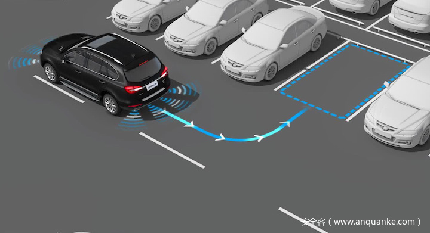

# MobilBye：利用摄像头欺骗对ADAS进行攻击

                                阅读量   
                                **803822**
                            
                        |
                        
                                                                                                                                    
                                                                                            

##### 译文声明

本文是翻译文章，文章原作者arxiv，文章来源：arxiv.org
                                 原文地址：[ttps://arxiv.org/abs/1906.09765](ttps://arxiv.org/abs/1906.09765)

译文仅供参考，具体内容表达以及含义原文为准

## 0x01 Abstract

驾驶辅助系统（ADAS）通过发出警报或控制车辆来减少车祸的数量。本文测试了流行的ADAS Mobileye的自身安全性。 通过向Mobileye注入了欺骗性交通标志，从而评估环境变化（例如，颜色，形状，投射速度，直径和环境光线的变化）对攻击结果的影响。 为了在一个真实的场景中进行这个实验，使用无人机携带便携式投影仪，将投射的欺骗性交通标志投射到驾驶汽车上。实验表明无人机携带的欺骗交通标志有可能愚弄Mobileye以便将它解释为真正的交通标志。

## 0x02 ADAS

驾驶辅助系统（ADAS）是电子系统，可以帮助汽车驾驶员在驾驶时使用。 这种系统旨在通过以下方式帮助驾驶员：

1）发出潜在威胁的警报（例如，碰撞避免和车道偏离警报）。

2）识别即将到来的交通标志。

为了支持上述功能，这些系统使用从多个传感器获得的输入，包括：摄像机，LiDAR和雷达。 ADAS已经成为当前汽车发动机不可或缺的一部分，它们将为下一代汽车（自动驾驶汽车）提供自动化功能。

涉及到ADAS时，有六个级别的自动化，最高级别(5)是完全自动化的，ADAS控制汽车的所有方面。最低级别(0)中司机控制汽车的所有方面，并且只能从ADAS接收输入(以警报的形式)。

Mobileye是一种外部ADAS，不提供完全自动化（级别5），而是提供功能特定的车辆自动化（级别0）。 Mobileye 630 PRO包含两个主要部件，如下图所示。第一个是安装在挡风玻璃上的摄像头，位于后视镜下方，第二个是安装在前挡风玻璃前面的小型显示器。 驾驶员并根据需要提供有关周围环境的视觉和听觉警报。 Mobileye具有以下功能：

1）车道偏离警告：当发生车道偏差而驾驶员没有正确的信号通知时将被激活; 当行驶速度超过每小时55公里时，此功能被激活。

2）行人碰撞警告：此功能通知驾驶员即将与行人或骑车人发生碰撞; 此功能只能在白天使用，并在行驶速度低于50 km / h时激活（此功能可配置为最高70 km / h）。

3)前向碰撞警告：此功能通知驾驶员与任何类型车辆的尾部碰撞。

4)车道监控和警告：当驾驶员的车辆与前面的车辆之间存在不安全距离时，此功能会通知驾驶员，当车辆行驶时该功能将被激活。 速度超过30公里/小时。

5)智能远光灯控制：它根据光线和与其他车辆的相对距离来开启或关闭远光灯，这是一种只在夜间使用的特性。

6）识别即将到来的交通标志：识别和阅读交通标志（限速、进入高速公路等）。

## 0x02 Threat Model

本文将攻击者视为任何恶意实体，其目的是攻击驾驶汽车。 攻击者可以使用安装在无人机上的便携式投影仪将欺骗性交通标志注入到Mobileye中。 攻击者的目标可能是：

1）破坏或操纵特定受害者的汽车，

2）导致环境混乱（例如，在特定区域（如城市，街区，高速公路等）破坏多辆汽车）。

**1、实验设置**

在本小节中描述了所进行实验的设置。为方便起见，使用白色投影仪屏幕作为投影交通标志的屏幕。 便携式投影仪用于提供标志的内容。 注入由投影仪和屏幕组成。 便携式投影仪放置在离屏幕约2.5米的三脚架上，并将交通标志投射到屏幕中心; 当标志以这种方式投射时，以大约25公里/小时的速度直线驾驶汽车（配备Mobileye 630 PRO的雷诺Captur）。 下图显示了实验设置，投影标志用红色方框，被攻击车辆用黄色方框。

**2、投影标志直径的影响**

这种情况下调查投影标志的大小是否影响Mobileye 630 PRO的传感器可以检测到投影标记的距离。 重复实验五次，每次投射不同大小的标记，并计算平均检测距离。

下图显示了该实验的结果。 可以看出如果标志太小（直径小于16厘米），Mobileye 630 Pro传感器根本检测不到它。 图中的红点表示设法误导传感器的平均距离，灰色区域显示整个样本集的范围。直径范围广，在投射交通标志时提供了很大的误差空间。 根据测量结果，距离范围约为5-16米。

**3、投射标志颜色的影响**

评估Mobil eye 630 PRO传感器是否对标志的颜色敏感。 实验尝试了各种颜色，如下图a所示。 首先用真实的颜色投射标志，然后验证了Mobileye 630 PRO传感器设法识别标志。 接下来投射相同的标志，但这次使用的颜色方案与真实的颜色方案不同。

Mobileye对颜色不敏感，因为所有测试的标志都设法误导了传感器（即使是图4a中所示的黑白限速标志）。于这些结果得出结论，Mobileye 630 PRO传感器在尝试对符号内容进行分类时仅考虑符号的形状。

**4、投影标志形状的影响**

在这种情况下评估Mobileye 630 PRO传感器是否能够检测到不符合其原始形状的标志。 对于这个实验只需要一个限速标志并修改它的形状（如下图b所示）。 该实验是二分类，即只想知道是否可以检测到符号。使用其他三种不同寻常的形状 – 星形，箭形和随机多边形），Mobileye 630 PRO的传感器无法检测到任何这些形状。

Mobileye系统会考虑符号的形状，不会被未知的形状所欺骗。

**5、数字对投影标志的影响**

在这种情况下调查Mobileye 630 PRO传感器是否也可以检测速度值的数字，这些速度值在现实世界中没有使用（例如下图c）。下表显示了该实验的结果。

基于这些结果可以得出结论，不正确的限速标志在误导系统方面是有效的。 系统不会忽略它们并将它们归类为其他类似的交通标志。

**6、环境光的影响**

在这种情况下测试了环境光的影响，使用了每天每小时20个样本(驾驶中)来检查注入成功率。

下图显示了该实验的结果; 成功被视为一个样本（驾驶中），其中Mobileye识别出预计的标志。根据对这些结果的分析得出结论，可以在一天中的所有时间注入欺骗性交通标志，但是在当天晚些时候（傍晚和夜间）表现最佳。 关于环境光应该考虑的一件事是所使用的设备，因为投影标志的不透明度取决于环境光以及所使用的投影仪（使用更好的投影仪可以实现更好的成功率）。

**7、投影时间速度的影响**

在这里评估了欺骗系统所需的投影时间的速度。做了一些实验测评注入所需的时间。

结果发现100毫秒的投影速度足以欺骗系统。 无法以更快的投影速度欺骗系统可能是由于Mobileye的光学传感器的每秒帧速率。快的投射速度使得目标上的攻击矢量非常容易注入，并且不需要长时间停留。

## 0x03 Attacking a driving car

本节将演示攻击者如何使用无人机远程进行攻击。在无人机（DJI Matrice 600）上安装了便携式投影仪（下图a）。 在这个实验装置中，汽车（配备Mobileye 630 PRO的雷诺Captur）在城市环境中驾驶，攻击者操作无人机，将对无人机进行定位从而可以将欺骗的速度限制标志注入Mobileye传感器。 路线如下图b所示。在地图上的已加星标的位置，攻击者投射了不正确的限速标志（如下图c所示）。

接下来成功误导了Mobileye传感器，该传感器将该标志识别为90 km / h的限速标志（见下图）。 实施的攻击可以在上传的攻击视频（ **[https://www.youtube.com/watch?v=PP-qTdRugEI&amp;feature=youtu.be](https://www.youtube.com/watch?v=PP-qTdRugEI&amp;feature=youtu.be)** ）中看到。城市道路的车速限制仅为30 km/h时，成功地欺骗了Mobileye，将车速限制定为90km/h。

## 0x04 Countermeasures

本节中将讨论可用于防止ADAS的计算机视觉分类器被攻击者误导的对策方法。 建议的措施是被动的，这意味着:

（1）不需要任何发射器的电源，

（2）防止各种视觉欺骗攻击，包括误导系统考虑的预测交通标志和图像扰动（分类）一个标志作为一个真正的标志。

实验发现将二维码插入交通标志是防止Mobileye传感器被欺骗性交通标志误导的最有效方法; 更具体地在该对策方法中，二维码包含接近的汽车的签名消息，在识别过程中向汽车通知前方的交通标志及其类型，坐标和数字签名以进行认证。 以这种方式：

1）可以验证标志和标志类型的准确位置，

2）数字签名用于验证交通标志不是假的。

然而，该解决方案可能易受GPS欺骗的影响，并且可能导致Mobileye系统将当前标志识别为位于其他位置的另一个标志，这是由于坐标的变化（下图中可以看到标志和消息的示例）。

3D交通标志也可用于消除可能的交通标志威胁。 由于本文的攻击模型（2D投影）针对的是无法区分2D和3D标志的摄像机，反制攻击的明显方法是使用可以检测3D物体的传感器（例如LiDAR）; 但是，攻击者可以制作包含攻击者所需内容的3D标志，并将其放置在任何地方。

最后一个对策是建议使用社交导航应用程序（如Waze），该应用程序可以映射所有交通标志并创建交通标志数据库; 通过这种方式，ADAS可以使用数据库验证交通标志。 此解决方案需要网络连接才能使用其他驱动程序发送的信息更新交通标志，但容易受到网络攻击和GPS欺骗。

这些建议可以在短时间内实施，而下一代交通标志的出现将需要更长的时间。 下一代“车对车通信”将包括交通信号灯和标志的发射器，它们将信号传输到汽车，有效地为汽车提供指令; 然后汽车将按照说明操作。 根据这些变化适应整体运输环境需要一些时间; 在此之前，本文提出的对策可能会对问题有所帮助。
