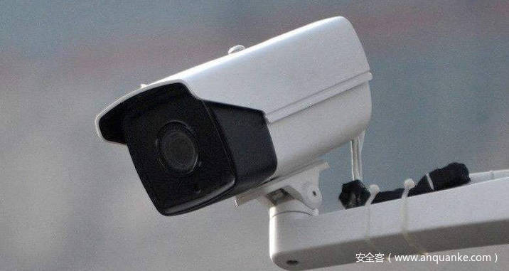

# SurFi：通过Wi-Fi通道状态信息检测监控摄像头回放攻击

                                阅读量   
                                **636887**
                            
                        |
                        
                                                                                                                                    
                                                                                            

##### 译文声明

本文是翻译文章，文章原作者nus，文章来源：comp.nus.edu.sg
                                 原文地址：[https://www.comp.nus.edu.sg/~kangms/papers/lakshmanan2019surfi.pdf](https://www.comp.nus.edu.sg/~kangms/papers/lakshmanan2019surfi.pdf)

译文仅供参考，具体内容表达以及含义原文为准

## 0x01 Absert

近些年监控摄像头的数量激增，极大地改善了商店和房屋在内的许多关键安全属性的物理安全性。但是，最近的监控摄像头回放攻击（surveillance camera looping attacks ）显示出新的安全威胁，攻击者可以在闯入或偷窃贵重物品的同时重播某地点看似正常的视频而不会被抓住。不幸的是由于成本和实施约束，这种攻击非常难以实时检测。

在本文中，建议通过利用常见的Wi-Fi信号实时检测这些攻击。特别是利用来自Wi-Fi信号的信道状态信息（CSI，channel state information）可以感知人类活动。 SurFi处理并关联实时视频源和Wi-Fi CSI信号，以检测可能识别监视摄像机回放攻击的任何失配。

本文提出的SurFi不需要部署其他基础架构，因为在城市室内环境中很容易找到Wi-Fi收发器。设计和实施SurFi系统，并评估其在检测监控摄像机循环攻击中的有效性。

## 0x02 Threats To Cameras

监控摄像头现在无处不在。世界上的大城市都严重依赖视频监视来保护自己免受各种威胁。自然地，视频监视系统成为有吸引力的攻击目标。最近的攻击通过对摄像头发起软件攻击或窃听其以太网电缆来演示监控摄像头回放攻击。通过循环播放看似合法的视频源，这种新的攻击途径可以潜在地使未经授权的人员进入安全敏感区域或未经授权的活动（例如，窃取贵重物品或破坏财产）。

首先，许多现有的传统监控摄像机时代都没有适当的端到端完整性保护，并且其硬件更换/升级将产生高昂的成本。

其次，仅基于视频信号分析来检测重放的视频馈送是不切实际的，因为监控摄像机经常会捕获几乎相同但真实的视频馈送（例如，空荡荡的走廊或珠宝店），这会产生太多的误报。

第三，部署用于检测的其他基础架构（例如，LED灯以预定义的模式闪烁）将需要付出额外的努力，例如秘密共享，这可能会引入新的攻击面。

## 0x03 SurFi

在这项工作中提出了SurFi，它通过将视频馈送与通道状态信息（CSI）信号进行比较来实时检测视频馈送循环攻击，该信号可以通过商用Wi-Fi收发器轻松捕获。下图举例说明了一个场景，在攻击者闯入该保管库时，他首先重放了一个看似合法的保管库文件。 SurFi通过将循环视频源与Wi-Fi CSI信号进行比较，成功地实时检测到了这种攻击。

由于在两种不同的感应方式之间进行信号比较，因此设计SurFi面临着艰巨的挑战。首先，直接的信号比较是不可能的，因为来自异构感测模态的信号（即，视频和CSI信号）在语义上本质上是不同的。特别是，最新的视频处理（例如OpenPose）会导致主体点（包括头部，肘部，腰部和膝盖）的位移，而CSI信号是接收到的无线符号的时间序列样本跨不同的频段。

第二，不能简单地依赖于CSI信号的机器学习分类，不像许多利用CSI信号进行活动识别的研究。这是因为不能期望针对特定场所（例如，珠宝店或银行ATM办公室）任意访客的所有可能的授权和未经授权的活动收集培训数据。为了解决这些主要挑战，建议从不同传感器类型的信号的时频分析中提取共同属性。

特别是观察到这两个信号捕获了活动发生的公共时间信息和相应的主频率分量。此外通过实际实施评估了SurFi，并证明SurFi可以检测潜在的攻击（即，不匹配的视频和CSI对），其攻击检测准确度高达98.8％，误报率为0.1％。

## 0x03 Threat Model

首先将特定地点定义为在视频监视下的室内开放空间。特定地点的某些活动被定义为未经授权（例如，未经授权的人员破坏/打开珠宝盒，破坏/移动ATM机），并且视频监视系统旨在识别此类未经授权的活动。还假设监视摄像机时代的视场覆盖了整个景点。这是一个合理的假设，因为人们安装了视频监控系统以保护有价值的资产，从而有目的地使盲点（即不在摄像机视野范围内的盲区）最小化。

在本文中，考虑了监控摄像头回放攻击，在这种攻击中，攻击者能够重播看似合法的视频源（即仅包含授权活动），以欺骗目标监视监视系统。攻击的最终目的是逃避当局（例如安全卫士和人员）发现对手的未经授权的活动。

不同，迄今为止没有已知的CSI测量循环攻击。 因此假设对手无法循环进行CSI测量。

## 0x04 System Design

现在描述SurFi如何利用Wi-Fi信号来验证监视摄像头系统是否受到攻击。下图描绘了由四个步骤组成的SurFi设计流程图。 SurFi不断接收来自监控摄像机的实时视频以及来自Wi-Fi接收器的CSI数据。两组信号输入到数据预处理模块。此模块从视频源中提取主体关键点的位移，并从CSI信号中消除噪声。

随后，SurFi监视降噪后的CSI信号以检测事件的开始。在检测到事件开始时，Attribute Extraction模块从主体关键点和去噪的CSI信号中提取三个属性（即事件的开始时间，结束时间和突出频率）。然后，Comparison模块比较属性，然后输出相似性得分。最后，Decision模块获取多个事件的相似性分数，并输出有关视频是否循环播放的最终决策。

## 0x05 Data Pre-processing Module

在此步骤中，预处理从Wi-Fi接收器和监控摄像头获得的两个原始信号。原始CSI信号由每个子载波中的多个时间序列CSI值组成（例如，IEEE 802.11n中每个天线对30个子载波）。可以使用各种开源工具可靠地收集这些信号。对这些原始CSI值进行去噪，以便可靠地提取属性。

因为没有在特定地点可能发生的一组预先指定的授权和未经授权的人类活动，所以从接收到的CSI值的宽频率范围内降低了噪声。即一个具有公共访问权限的开放空间，例如ATM和办公室。因此，利用离散小波变换（DWT）滤波器，它可以减少原始CSI数据中可用的所有频带中的噪声（例如，在实验中为1–500 Hz）。

对于实时视频源，使用最先进的实时视频处理工具OpenPose来检测视频源中的主体关键点。 OpenPose返回每个视频帧25个身体关键点的X-Y坐标。下图显示了OpenPose检测到的主体关键点的示例。

## 0x06 CSI Event Detector Module

事件检测器模块接收去噪的CSI值和25个主体关键点的X-Y坐标，并检查是否检测到新事件的开始。该模块仅监视CSI值，因为视频馈送可以通过回放攻击来操纵。使用称为运动能量的度量来检测事件的开始，该度量是CSI信号频带中包含的能量。

当检测到事件开始时，SurFi触发下一个属性提取模块，并向其提供去噪的CSI值和视频关键点，直到检测到事件结束为止。

## 0x07 Attribute-Extraction Module

属性提取模块的两个目标是（1）选择能够可靠比较两个信号的一组属性，以及（2）实时计算属性。

**可靠比较的要求：**第一个要求是必须同时从视频信号和CSI信号中捕获属性。从视频信号中检索到的细粒度信息（例如，人的精确身高或步态）可能无法从CSI 中充分提取出来，因此不适合本文目的。第二个要求是属性应以可接受的精度捕获活动的独特特征（例如重复动作的频率）。

尽管可能有用，但基于CSI信号准确识别大量人口（超过8-10人）的人仍然是一个悬而未决的问题。经过在各种环境，活动和人类参与者下的广泛实验，发现了满足上述要求的三个属性。

前两个是时域分量，最后一个是频域分量。时域属性是事件的开始和结束时间，而频域属性是事件的主要频率。从预处理的视频和CSI信号中提取这些属性时，从每个信号中选择一个时间序列分量，如下图所示。

也就是说选择一个关键点，该关键点在频域中具有最大信号幅度从处理后的视频数据中获取数据，该视频数据代表测量期间单个身体组件的最大位移。另外，从去噪的CSI数据中选择一个能量分量最大的子载波信号。这种简化简化了属性提取和与一维问题的比较，以进行实时分析，同时有效地捕获了在感兴趣的地方执行的主要活动。

**开始和结束时间：**分析视频和时域CSI信号，以调查是否可以可靠地捕获活动或事件的开始和结束时间。上图描绘了一个活动，其中一个人在任意时间范围内上下移动左臂，重复三遍。

请注意，可以从其他身体部位（例如，左肘）获得类似的视频信号，但是算法会选择左手腕，因为它包含的幅度最大。两种信号都显示相似的开始和结束时间，并且在多个试验，人员和事件中始终观察到这种趋势。这可以得出结论，它们可以作为视频和CSI信号之间比较的可靠属性。

为了提取事件的开始时间和结束时间，使用称为运动能量的度量，该度量捕获CSI信号不同频带中的能量。可以将运动能（E）计算为：

其中FFThalf(i)是在时间窗口L上计算的FFT系数幅值。

请注意，仅考虑前半部分是因为另一半是多余的，所以忽略了FFT系数，忽略了DC分量。将视频和CSI信号的总事件时间窗分为0.1秒的L，因为这为属性比较提供了足够的时间粒度。

当事件的运动能量E增加并超过阈值时，将检测事件的开始时间。对于视频反馈，监视瞬时E值，并在E变得比其移动平均值大十倍时确定事件的开始。对于仍然比视频信号嘈杂的CSI信号，当E的方差变得大于其移动平均值时，确定事件的开始。结束时间可以类似地计算。表示从视频和CSI信号为事件测量的开始时间和结束时间，如下所示：

**突出的频率：**提取的第三个属性是事件的突出频率分量。观察到有可能提取单个频率分量，该单个频率分量在主频率中表现出最大的信号幅度。下图显示了上述活动的选定视频和CSI信号的FFT图。观察到视频和CSI信号均显示约0.6 Hz的主频率分量。因此得出结论，重复事件被捕获为频域中的主要频率分量。

为了计算事件的突出频率，首先对视频信号应用FFT，然后将幅度最大的频率视为突出频率f V。然后以从视频信号f^V获得的频率对CSI信号应用带通滤波器，以去除无关的频率分量（例如，小于0.3 Hz的频率分量，主要捕获诸如姿态变化之类的较慢的运动），并且提取最大幅度频率f^C。

## 0x08 Comparison Module

给定视频和CSI信号的两组属性:

计算出相似度S(i)一个观察到的事件Event(i)。首先确定两个信号之间的每个属性相似度得分，如下所示：

其中Tj是每个属性的阈值，△j是两个信号的三个属性之间的差，如下所示：

根据经验选择每个属性阈值，以获得可接受的检测精度，并且每个属性的误报率低。为了实现这一点，计算每个属性将合法视频检测为合法，将重放视频检测为重放的准确性。较低的阈值可能会导致将合法视频误识别为重放视频，而较高的阈值会导致将重放视频错误地检测为合法视频，从而降低了准确性。

因此，选择精度最大的阈值作为每个属性阈值。观察到开始和结束时间属性阈值分别为2.5秒和2秒，而频率属性阈值为0.25 Hz是最佳的。随后计算每个事件的相似性得分，范围从0到3，如下所示：

## 0x09 Decision Module

决策模块将一个或多个单独观察到的事件的相似性得分作为输入，并输出是否重放视频馈送的最终决策。当考虑多个事件时，检测准确性（即SurFi检测到视频馈送何时重放的有效程度）将提高，误报率降低。

这是因为考虑到来自独立观察事件的更多相似性评分时，SurFi可以为最终决策获得更高的置信度。首先获取多个事件的相似性得分的平均值，然后将其与决策阈值进行比较。该阈值的选择会影响检测准确性和误报率。

## 0x10 Evaluation

### A、实验设置

下图显示了特定地点的设置。在一个小型室内办公室（宽4.9米×长2.6米）中进行了受控实验。使用两台配备Intel NIC 5300的Thinkpad W500笔记本电脑设置了收发器，它们在桌上的间隔为1.6米。在Ubuntu 14.04上使用Linux 802.11n CSI工具从5 GHz频率范围的Wi-Fi数据包中提取CSI值。发送器每1毫秒发送一个ping数据包，接收器收集CSI值。总体而言，由于两台笔记本电脑配备了一个发射器和三个接收器天线，因此获得了90个子载波的CSI值。

对于视频源采集，使用安装在墙中间的移动电话上的摄像头录制视频片段（分辨率为1300万像素，采样率为30帧/秒）。

要求参与者执行以下三个事件：

（E1）以0.6 Hz的频率重复站立和左臂上下移动；

（E2）以1 Hz的频率反复在桌子上坐着并重击右拳；

（E3）以1.6 Hz的频率反复坐着并拍手。

在实验中，让四个参与者测试了三个事件，每个参与者进行了21次试验。指示参与者以一定的频率执行选定的活动。为了表示更现实的事件发生时间，将每个试验的开始和结束时间随机化（分别在5到15秒的范围和25到35秒的范围内随机选择），使得每个试验的长度为10到30秒。

### B、基于属性的相似度比较

现在，评估SurFi如何利用这三个属性比较视频和CSI信号之间的相似性，从而最终检测出潜在的攻击。下图描绘了在三种事件类型中，合法事件和攻击事件的观察到Event(i)的每个事件相似性得分S(i)的分布。对于合法情况，通过比较从实时（因此是真实的）视频提要中提取的属性和CSI信号来计算S(i)。随后，将其余事件视为攻击事件。

因此，对于攻击事件，通过比较从循环视频源中提取的属性（包含不同事件类型）和CSI信号来计算事件S(i)。例如，在循环视频反馈中执行E1，而在实际实验中执行E2。总体而言，针对每种事件类型（例如E1，E2，E3）进行了84次代表合法事件的判断，并针对代表攻击事件的每种事件类型进行了14,112次判断。

合法事件的平均每次事件相似性得分（即2.6、2.5和2.8）比攻击事件（即0.81、0.77和0.79）高得多。两种事件的每次事件相似性得分的明显差异表明，所选属性可以独立于事件类型和主题有效地区分案例。但是，它们的高方差（例如，通常接近1）可能会导致某些错误的攻击检测和错误警报。

### C、攻击检测精度

现在在短时间内（例如几分钟）观察到多个事件评估SurFi的整体性能，以提高攻击检测的准确性。定义两个性能指标，如下所示：

（1）攻击检测准确度：正确地将循环视频馈送识别为循环的比率；

（2）误报率：合法视频提供的比率被错误地检测为循环。

将事件随机附加在一起以模拟多个事件序列。然后获取该序列的每个事件相似度得分的平均值。如前所述，观察到的事件越多，用于检测攻击的事件越多，对最终决定的准确率就越高，从而提高了攻击检测的准确性。下图显示了SurFi攻击检测对不同事件数量（从1到5）和目标误报率（0.1％至0.9％）的准确度。

可以观察到，当获得的误报率不超过0.1％时，SurFi仅一次事件即可达到36％的检测精度。当它对相同的目标误报率使用五个事件时，它可以实现高达98.8％的检测精度。如图所示，随着目标误报率的增加，检测精度进一步提高。将更多事件用于攻击检测时可以实现更高的检测精度，因为随着事件数量的增加，相似性分数分布的方差会减小。

## 0x11 Conclution

**更强大的攻击者模型：**攻击者击败SurFi的方法之一是模仿受攻击视频中对象的活动。但是，此类攻击所需的复杂程度非常高，因为小的差异将导致属性上的差异。此外，SurFi的决策模块要求攻击者一直模仿多个事件，这使得规避SurFi防御更加困难。

**部署注意事项：**在实际使用SurFi系统时，可能需要执行一些校准，因为在攻击检测中使用了一些阈值适应新环境。 SurFi还需要在战略上将接收器放置在离墙壁一定距离的位置，以最大程度地减少由于墙下活动引起的误报。

在本文中提出了SurFi，这是一种实时检测监控摄像头回放攻击的系统。SurFi利用现有的Wi-Fi基础架构（因此不需要额外的硬件或部署成本）来提取通道状态信息（CSI），以处理和关联视频和CSI信号以检测任何不匹配。

随着更多的事件被两种异质感测方式感知和关联，SurFi增加了其检测置信度。SurFi概念验证可实现高达98.8％的攻击检测精度和0.1％的误报率。在今后的工作中，计划针对更复杂的攻击者模型，针对各种事件和环境进行更全面的实验。
