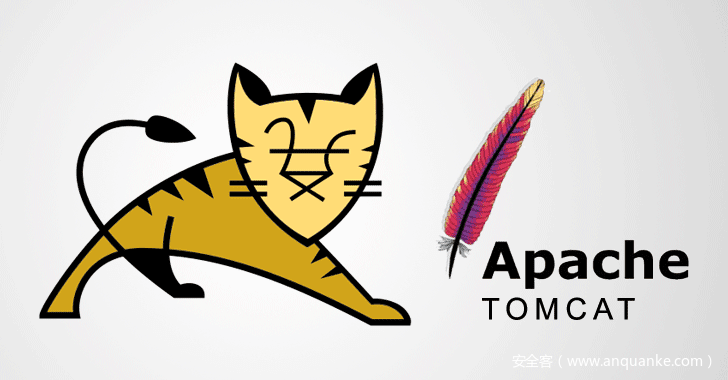

# Tomcat-Ajp协议漏洞分析


                                阅读量   
                                **808496**
                            
                        |
                        
                                                                                    


[](./img/199347/t010a397bd52873b715.png)


<a class="reference-link" name="@%E5%AE%89%E6%81%92%E5%AE%89%E5%85%A8%E7%A0%94%E7%A9%B6%E9%99%A2%20%E5%8D%AB%E5%85%B5%E5%AE%9E%E9%AA%8C%E5%AE%A4"></a>安恒安全研究院 卫兵实验室


## 漏洞描述

Apache与Tomcat都是Apache开源组织开发的用于处理HTTP服务的项目，两者都是免费的，都可以做为独立的Web服务器运行。<br>
Apache Tomcat服务器存在文件包含漏洞，攻击者可利用该漏洞读取或包含 Tomcat 上所有 webapp 目录下的任意文件，如：webapp 配置文件或源代码等。


## 漏洞危害等级

高


## 影响版本

该文件包含漏洞影响以下版本：<br>
7.<em>分支7.0.100之前版本，建议更新到7.0.100版本；<br>
8.</em>分支8.5.51之前版本，建议更新到8.5.51版本；<br>
9.*分支9.0.31之前版本，建议更新到9.0.31版本。


## 漏洞原理

tomcat默认的conf/server.xml中配置了2个Connector，一个为8080的对外提供的HTTP协议端口，另外一个就是默认的8009 AJP协议端口，两个端口默认均监听在外网ip。

如下图：

[](https://p4.ssl.qhimg.com/t01acb401f1720e7c07.png)

tomcat在接收ajp请求的时候调用org.apache.coyote.ajp.AjpProcessor来处理ajp消息，prepareRequest将ajp里面的内容取出来设置成request对象的Attribute属性

如下图：

[](https://p3.ssl.qhimg.com/t01ffde1bcc01361b60.png)

因此可以通过此种特性从而可以控制request对象的下面三个Attribute属性

```
javax.servlet.include.request_uri
 javax.servlet.include.path_info
 javax.servlet.include.servlet_path
```

然后封装成对应的request之后,继续走servlet的映射流程如下图所示:

[](https://p4.ssl.qhimg.com/t01a37c2a129182d2c7.png)

其中具体的映射方式就简略了，具体可以自己查看代码.


## 两种利用方式

### <a class="reference-link" name="1%E3%80%81%E5%88%A9%E7%94%A8DefaultServlet%E5%AE%9E%E7%8E%B0%E4%BB%BB%E6%84%8F%E6%96%87%E4%BB%B6%E4%B8%8B%E8%BD%BD"></a>1、利用DefaultServlet实现任意文件下载

当url请求未在映射的url列表里面则会通过tomcat默认的DefaultServlet会根据上面的三个属性来读取文件,如下图

[](https://p1.ssl.qhimg.com/t01b860a16114a66147.png)

通过serveResource方法来获取资源文件

[](https://p4.ssl.qhimg.com/t01de39ce8405116c66.png)

通过getRelativePath来获取资源文件路径

[](https://p5.ssl.qhimg.com/t01810d0a360535fae2.png)

然后再通过控制ajp控制的上述三个属性来读取文件,通过操控上述三个属性从而可以读取到/WEB-INF下面的所有敏感文件，不限于class、xml、jar等文件。

### <a class="reference-link" name="2%E3%80%81%E9%80%9A%E8%BF%87jspservlet%E5%AE%9E%E7%8E%B0%E4%BB%BB%E6%84%8F%E5%90%8E%E7%BC%80%E6%96%87%E4%BB%B6%E5%8C%85%E5%90%AB"></a>2、通过jspservlet实现任意后缀文件包含

当url（比如[http://xxx/xxx/xxx.jsp）请求映射在org.apache.jasper.servlet.JspServlet这个servlet的时候也可通过上述三个属性来控制访问的jsp文件如下图](http://xxx/xxx/xxx.jsp%EF%BC%89%E8%AF%B7%E6%B1%82%E6%98%A0%E5%B0%84%E5%9C%A8org.apache.jasper.servlet.JspServlet%E8%BF%99%E4%B8%AAservlet%E7%9A%84%E6%97%B6%E5%80%99%E4%B9%9F%E5%8F%AF%E9%80%9A%E8%BF%87%E4%B8%8A%E8%BF%B0%E4%B8%89%E4%B8%AA%E5%B1%9E%E6%80%A7%E6%9D%A5%E6%8E%A7%E5%88%B6%E8%AE%BF%E9%97%AE%E7%9A%84jsp%E6%96%87%E4%BB%B6%E5%A6%82%E4%B8%8B%E5%9B%BE):

[](https://p4.ssl.qhimg.com/t01bbd134d7e94ba37b.png)

控制路径之后就可以以jsp解析该文件 所以只需要一个可控文件内容的文件即可实现rce.


## 利用成功截图

[](https://p5.ssl.qhimg.com/t0175b50cd9f5b5e47e.png)


## 解决方案

1、临时禁用AJP协议端口，在conf/server.xml配置文件中注释掉&lt;Connector port=”8009″ protocol=”AJP/1.3″redirectPort=”8443″ /&gt;<br>
2、配置ajp配置中的secretRequired跟secret属性来限制认证<br>
3、官方下载最新版下载地址：<br>[https://tomcat.apache.org/download-70.cgi](https://tomcat.apache.org/download-70.cgi)<br>[https://tomcat.apache.org/download-80.cgi](https://tomcat.apache.org/download-80.cgi)<br>[https://tomcat.apache.org/download-90.cgi](https://tomcat.apache.org/download-90.cgi)<br>
或Github下载：[https://github.com/apache/tomcat/releases](https://github.com/apache/tomcat/releases)


## AJP协议规范

详见[https://tomcat.apache.org/connectors-doc/ajp/ajpv13a.html](https://tomcat.apache.org/connectors-doc/ajp/ajpv13a.html)
