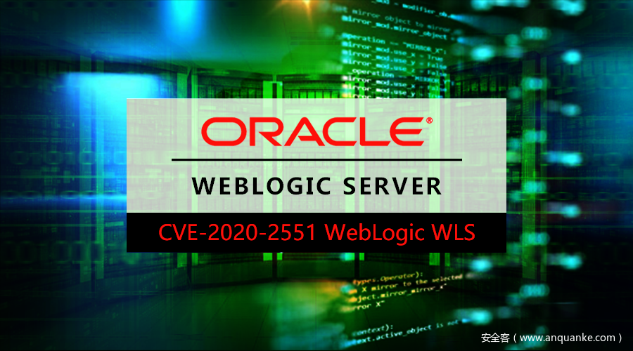

# WebLogic WLS核心组件RCE分析（CVE-2020-2551）


                                阅读量   
                                **886091**
                            
                        |
                        
                                                                                    


[](./img/199695/t01870efe86826eb5bc.png)


## 0x01 漏洞概述

[](https://p403.ssl.qhimgs4.com/t01cd9bf8721e6b214f.png)

Weblogic官方在1月补丁中修复了CVE-2020-2551漏洞，该漏洞位于WLS核心组件中，允许远程攻击者通过iiop进行网络请求，从而攻击Weblogic服务器，最终远程攻击者可以利用该漏洞完全接管Weblogic服务器。

从通告中我们能看到漏洞发生在WLS的核心组件，所以给了我们一个思路去分析该漏洞，只需要从接受并解析iiop请求点入手进行分析即可。


## 0x02 漏洞分析

分析该漏洞应该从两方面来进行：
- 客户端：通过分析Context的生成过程以及Context.bind()的流程来理解服务端解析的数据结构
- 服务端：通过分析解析流程最终找到漏洞触发点
本文也将从这两个方面进行分析。分析到最后其实会发现iiop只是触发方式，关键的触发点还是由于Weblogic应用本身的处理逻辑，也就是说本质上是个应用漏洞而非协议漏洞。

### 2.1 Context的生成以及bind的流程

无论利用rmi-iiop的方式去写客户端，还是写服务端，都需要在编写具体逻辑前获取Conetext对象，也就是如下的代码：

```
new InitialContext();
```

如果研究过CORBA通信过程的话，就能理解这一部分是获取Naming Service的过程，对于客户端来说是获取其中存在的IOR引用以供后面的rpc流程使用；对于服务端来说，用于完成对象注册。这里来跟进一下Context的生成过程，方便后续理解Weblogic的解析逻辑。

[](https://p403.ssl.qhimgs4.com/t01f43f44d2909ddd59.png)

这里有个很重要的参数environment，在该参数中可以设置Context的静态变量来指定Context的初始化参数，包括JNDI_FACTORY、PROVIDER_URL。这些初始化参数在后续的流程中有极其重要的作用。

[](https://p403.ssl.qhimgs4.com/t0146d56fea638f6522.png)

当在environment中设置了Context.INITIAL_CONTEXT_FACTORY后会尝试获取该Context factory：

[](https://p403.ssl.qhimgs4.com/t01000fde2ee458891c.png)

[](https://p403.ssl.qhimgs4.com/t01e118dca1c662fe87.png)

这里会根据设定的Context.INITIAL_CONTEXT_FACTORY，反射获取工厂类，之后调用getInitialContext()方法。首先看一下在JDK中原生以及在Weblogic中所拓展出的工厂类到底有哪些：

[](https://p403.ssl.qhimgs4.com/t01abf486e62e5cd8b5.png)

这里我们简单的看一下WLInitialContextFactory这个Weblogic拓展的工厂类：

[](https://p403.ssl.qhimgs4.com/t0129920c8a3f777c0c.png)

[](https://p403.ssl.qhimgs4.com/t012b34a39a6020ca09.png)

[](https://p403.ssl.qhimgs4.com/t01c566bc9b63b20cd0.png)

这里跟进看一下getORBReference()方法：

[](https://p403.ssl.qhimgs4.com/t014c171e3781aeb98c.png)

这里和CORBA的写法是一样的：

[](https://p403.ssl.qhimgs4.com/t01ae4e6427387557be.png)

都是初始化orb获取Naming Service的过程，如果想要了解详细的过程，可以研究一下上一篇讲[CORBA的文章](https://cert.360.cn/report/detail?id=d3f6666d6558f02a6204dd51cb749558)。

在获取了Context后，接着来看一下其绑定流程，此流程在bind()函数中有所体现：

[](https://p403.ssl.qhimgs4.com/t01cbd0f567a12d6ced.png)

熟悉CORBA的同学肯定一眼就能看出这里完成的是生成IOR，同时设定corba协议中的数据类型与java类型交互的约定为tk_value，并设定请求的op或者叫做operation为bind_any。这里不仅仅设定了服务端对注册请求的处理方式（bind_any的处理流程），同时设定了后面反序列化的方式（tk_value）。

### 2.2 Weblogic解析流程

在了解了Context的生成及bind()流程后，接着来看一下Weblogic的解析流程。Weblogic默认在7001端口接收iiop请求，所有的请求都是交由weblogic.rmi.cluster.ClusterableServerRef#invoke来处理的：

[](https://p403.ssl.qhimgs4.com/t01ec8739668d43ac40.png)

在handleRequest中的流程较为长，我只截关键处理点：

[](https://p403.ssl.qhimgs4.com/t01d095ecafa176a8f4.png)

直接跟进var2.invoke()，具体的实现方法在weblogic.rmi.cluster.ClusterableServerRef#invoke：

[](https://p403.ssl.qhimgs4.com/t016635b0766a582e75.png)

[](https://p403.ssl.qhimgs4.com/t0101571c1dc81c55bb.png)

这里首先会判断请求是否为objectMethods中已经存在的类型，当不存在时将会调用delegate.invoke()来处理，由于我们在发送注册请求时的请求类型为bind_any()并不在objectMethods中，所以会触发delegate.invoke()，具体的实现类为weblogic.corba.cos.naming._NamingContextAnyImplBase#_invoke：

[](https://p403.ssl.qhimgs4.com/t01c6771d5a682aeb52.png)

因为我们当前的请求类型为bind_any()，其所对应的var5为0，所以会进入两个关键的流程：
- WNameHelper.read()
- var2.read_any()
[](https://p403.ssl.qhimgs4.com/t0186dcf3c70de07233.png)

[](https://p403.ssl.qhimgs4.com/t01fd9ee2c9ff8aafaf.png)

在WNameHelper.read()主要负责提取IOR中的信息（id、kind）用于之后注册到orb的流程中。

而反序列化的触发点在var2.read_any()中：

[](https://p403.ssl.qhimgs4.com/t015cb97783fb3d5c6f.png)

在上一节中，已经说过在bind()流程中发起注册请求时，会构造一个Any类，并将交互类型设置为tk_value也就是this.read_TypeCode()。继续跟进：

[](https://p403.ssl.qhimgs4.com/t0191ffca3f2fb5b88a.png)

[](https://p403.ssl.qhimgs4.com/t0162c1f90fb9a7d305.png)

这里会根据TCKind来分派具体的处理流程，tk_value对应29：

[](https://p403.ssl.qhimgs4.com/t01c38f9900710c499b.png)

接下来就是之前CORBA文章中所提到过的反序列化流程：

[](https://p403.ssl.qhimgs4.com/t0182a1404cd9c80623.png)

由CDRInputStream跳转到JDK原生反序列化：

[](https://p403.ssl.qhimgs4.com/t01bbc9cad7b91d437a.png)

至此分析结束。


## 0x03 利用研究

根据0x02中的分析，可以梳理出攻击需要的两个元素：
- 构造一个bind_any()请求
- 寻找一条gadget填充到Any类中
攻击效果如下：

[](https://p403.ssl.qhimgs4.com/t012c68bd9f7b920d91.png)


## 0x04 时间线

2020-02-25 360CERT发布分析报告


## 0x05 参考链接
1. [https://cert.360.cn/report/detail?id=d3f6666d6558f02a6204dd51cb749558](https://cert.360.cn/report/detail?id=d3f6666d6558f02a6204dd51cb749558)
1. [https://cert.360.cn/warning/detail?id=8746760715a399499f8a46fb85edcda1](https://cert.360.cn/warning/detail?id=8746760715a399499f8a46fb85edcda1)
1. [https://www.oracle.com/security-alerts/cpujan2020.html](https://www.oracle.com/security-alerts/cpujan2020.html)