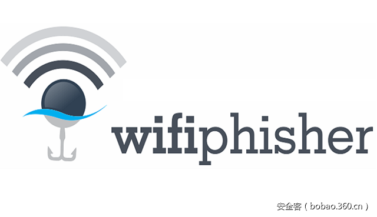

# 【安全工具】玩转社会工程学之WiFi钓鱼工具包：WifiPhisher


                                阅读量   
                                **205031**
                            
                        |
                        
                                                                                                                                    
                                                                                            


##### 译文声明

本文是翻译文章，文章原作者，文章来源：thevivi.net
                                <br>原文地址：[https://thevivi.net/2016/06/18/wifi-social-engineering-playing-with-wifiphisher/](https://thevivi.net/2016/06/18/wifi-social-engineering-playing-with-wifiphisher/)

译文仅供参考，具体内容表达以及含义原文为准

**[](./img/85834/t018202518e62e4fe07.png)**

翻译：[RcoIl](http://bobao.360.cn/member/contribute?uid=870482963)

预估稿费：200RMB

投稿方式：发送邮件至linwei#360.cn，或登陆网页版在线投稿


**背景**

[Wifiphisher](https://github.com/wifiphisher/wifiphisher)是一种安全工具，可以对WiFi客户端进行自动受害者定制的网络钓鱼攻击。Wifiphisher是用Python编写的，由希腊安全研究员[George Chatzisofroniou](https://twitter.com/_sophron)开发。

Wifiphisher由于其非常规的攻击方式，在无线安全领域造成了浪潮。与传统WiFi攻击不同，它不涉及任何握手捕获或密码爆破，任何测试无线网络的人都习惯了。Wifiphisher的攻击能否成功主要依赖于能否使得受害者将无线网络密钥或更多的资料交付给您，如下所示。

Wifiphisher的操作可以归纳为3阶段攻击：

1 启动一个假的无线接入点（AP） – 也被称为”[evil twin](http://searchsecurity.techtarget.com/definition/evil-twin)“

2 强制受害者通过向他们和他们所连接的接入点发送去认证数据包，从合法AP中去认证。

3 让他们连接到你的evil twin，并为他们提供一个网页，让他们给你无线网络密码。

[](https://p0.ssl.qhimg.com/t01fd55b3ae11456822.png)

看起来似乎是有很多的工作量，但是Wifiphisher的最好的一个地方是它的自动化。以上所有这些都可以通过操作者的最小工作量的交互来完成。Wifiphisher的认证攻击的灵感来自于Dan McInerney的Wifijammer，您应该肯定会检查出来。

要运行Wifiphisher，您将需要：

一个Linux系统。

2个无线网卡; 一个能够进行注射（用于去认证攻击）。我更中意阿尔法卡，所以我会推荐其中的一个; 像Alfa AWUS036H或Alfa AWUS051NH。


**玩转Wifiphisher**

最初构建了Wifiphisher来捕获无线网络凭据。在撰写本文时，它有3个网络钓鱼场景; 它最受欢迎的是下面的“固件升级”页面。

[](https://p5.ssl.qhimg.com/t01c4a3c56b79f79493.png)

Wifiphisher使用此网页来说服他们需要进行路由器固件升级，从而诱骗目标的无线网络密码。一旦用户输入密码，它将显示在操作员的终端上，Wifiphisher会关闭假接入点，这样目标就不知道发生了什么事情。

[](https://p1.ssl.qhimg.com/t01e8fc218bf1ace48d.png)


**添加钓鱼场景**

使用Wifiphisher几个星期后，我认为添加更多的钓鱼场景到它的武器库将是一件好事。不幸的是，由于版权原因，Wifiphisher不能包含任何第三方材料（如徽标或专有模板）; 所以没有流行的社交媒体网站的钓鱼网页

但是，由于我无意在Github上发布这个修改版本，所以我认为这样做还是可以的。

创建网络钓鱼页面通常很简单; 将原始的钓鱼页面下载到您的系统上，并修改页面的登录表单以收集凭据。

与Wifiphisher，唯一的缺点是，正在执行的攻击时，BOTH其经营者（你），目标将失去互联网连接，这意味着所有的网络钓鱼网页需要是独立的，即它们不能依赖于任何在线资源。幸运的是，使用wget下载他们的所有要求的网页将会非常简单：

```
$ wget -E -H -k -K -p &lt;insert URL here&gt;
```

运行这个应该得到所有的文件你需要设置你的钓鱼页面。我将这篇文章使用LinkedIn的登录页面。

[](https://p4.ssl.qhimg.com/t017f29011379031d7a.png)

Wifiphisher 通过记录以字符串“ wfphshr ” 为前缀的所有POST请求来以捕获凭据，这意味着我们必须在我们的网页中编辑用户名/电子邮件和密码字段，并将其附加到“ wfphshr ” 。

[](https://p4.ssl.qhimg.com/t0112afc53d7da74a09.png)

前缀可以是任何你想要的，只要Wifiphisher的代码和网页中的前缀是统一的。登录表单方法也必须是POST请求，而且现在几乎请求方法都是这样。最后，我们将新的网络钓鱼选项添加到Wifiphisher的菜单中。就是这样,需要准备一个使用的钓鱼页面，现在我只需要重复所有想要添加的场景的过程。从那以后，我改变了Wifiphisher的钓鱼页面菜单，我添加包括所有的网络钓鱼的选项。


**测试**

1.运行Wifiphisher并选择最强的接口。

[](https://p3.ssl.qhimg.com/t012892a0d681424708.png)

注意：我还修改了Wifiphisher的界面选择菜单。如果运行不带任何参数,Wifiphisher将自动选择最强大的无线接口作为干扰界面。它通过扫描在该地区所有无线网络所有可用的无线适配器,无线网络接口,可检测最被选为干扰界面。

这是好的和工作相当好于大多数运行，但我发现，在一些场合，错误的（弱）接口将被选中。如果选择了这一些接口，攻击阶段可能提示运行失败，因为大多数情况下，笔记本电脑内置的网络适配器不支持数据包注入。你仍然可以用手动指定的参数运行Wifiphisher干扰界面,但我仍然想要改变默认运行选项使用手动界面选择。选择我是受Wifite的接口。

2.选择一个网络钓鱼场景

[](https://p5.ssl.qhimg.com/t01553cb4ab766b2bc7.png)

3.选择一个WiFi网络的目标，并等待Wifiphisher启动假的AP。

[](https://p3.ssl.qhimg.com/t010c0ca77dcee6fcf2.png)

4.目标开始连接到你的evil twin

[](https://p4.ssl.qhimg.com/t01b81c7833e74000eb.png)

目标方：无论他们浏览的网站如何，目标都会为您选择的网络钓鱼页面提供服务。

[](https://p0.ssl.qhimg.com/t0130c3ee48952a2fbd.png)

[](https://p4.ssl.qhimg.com/t010f6616e244be2851.png)

收获凭证

[](https://p5.ssl.qhimg.com/t014191385fa89c00d7.png)

注意：我也不得不修改Wifiphisher的请求处理程序。它配置为在1个用户输入凭据后自动关闭。但是，由于我希望能够收集超过1个用户的凭据，所以我删除了自动关机。


**进一步说**

如果我们在一个目标上能够显示任何网站页面，而他们能成功地连接到我们的假冒AP，那为什么不能成为有这么一个页面，其建议他们下载并安装一些“ 有用” 的软件？选择个大家最喜欢的的Adobe Flash Player？

1.首先下载安装Adobe Flash Player页面

[](https://p0.ssl.qhimg.com/t0107f4180db79ab6a7.png)

2.接下来，我们将下载按钮指向我们系统上托管的文件（adobe_ update.exe）。我们还将重写页面的文字，以说服我们的目标下载更新文件。

[](https://p1.ssl.qhimg.com/t01751bd40ffb96d0c9.png)

3.准备payload。有无数的方法可以做到这一点，我现在无法进入各种可用的选择。所以在这篇文章中，我会用shellter生成Metasploit的反弹shell的payload到任何Windows可执行文件。你可以改变可执行文件的图标Adobe的标志，使其更有说服力。

[](https://p3.ssl.qhimg.com/t0166ffca1203fb8c79.png)

4.启动Wifiphisher 并选择有效载荷下载选项。当选择“Adobe Flash Update” 方案时，我添加了有效载荷选择提示。我们在这里所做的一切都是给我们准备的有效载荷的完整路径。

[](https://p2.ssl.qhimg.com/t0145a046b29bbc94f7.png)

[](https://p5.ssl.qhimg.com/t01c9a1717a8f82ff3a.png)

5.等待目标连接到我们。

[](https://p2.ssl.qhimg.com/t01765fb935d5ab6d1e.png)

6.目标方：目标服务器是Adobe 更新页面，当他们尝试浏览并确信下载并安装更新。我们甚至将我们的目标扫描与他们的AV首先，以防万一更新是不合法的。

[](https://p3.ssl.qhimg.com/t013c759b91c79ba7b9.png)

[](https://p4.ssl.qhimg.com/t01bf8ea0fcb5bda4d5.png)

7.目标运行更新文件，我们拿到反弹的shell

[](https://p5.ssl.qhimg.com/t01fe4b4452d8bc89ee.png)

[](https://p2.ssl.qhimg.com/t01c04e3d0c8f17bb9f.png)

注意：我建议使用连接到公共Metasploit侦听器的payload，所以当你关闭你的假冒ap，无论用户连接到下一个网络，你将成功获得一个shell。


**结论**

在捣鼓Wifiphisher的时候发现了很多乐趣。我是不是能贡献任何的情景在这个岗位到正式版 ，因为所有潜在的侵犯版权前面提到过，但我没有贡献一个通用的无版权的有效载荷的下载情况。如果您想自己尝试上面的有效负载攻击，可以在官方的Wifiphisher中查看“浏览器插件更新”情景。
