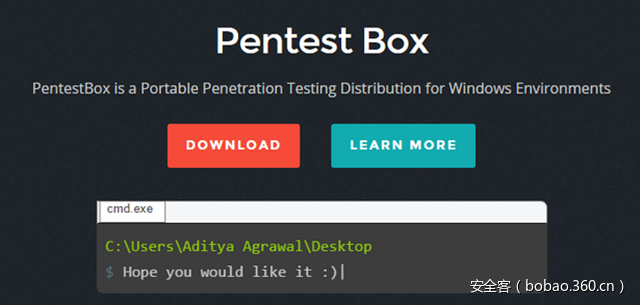

# 【工具推荐】Windows渗透测试神器“PentestBox”


                                阅读量   
                                **314415**
                            
                        |
                        
                                                                                                                                    
                                                                                            


****

[](./img/85813/t010d56b6a31b749d96.png)

作者：[厦门安胜网络科技有限公司](http://bobao.360.cn/member/contribute?uid=2857332556)

稿费：300RMB

投稿方式：发送邮件至linwei#360.cn，或登陆网页版在线投稿

**工具官网：**[**https://pentestbox.org/zh/******](https://pentestbox.org/zh/)** **

**前言**

你是否在日常渗透测试过程中总是开着好几个虚拟机？Kali、BackTrack、xp…然后各种切换各种卡？如果是这样，那你可以试试接下来要介绍的这款windows下运行的神器——PentestBox。

<br>

**Windows下便携式渗透测试环境：PentestBox**

PentestBox是一款Windows平台下预配置的便携式开源渗透测试环境。说起渗透测试环境，Linux下有很多好用的渗透测试系统，如Kali、BackTrack、Parrot Security OS等;这些Linux系统中都集合了很多渗透测试过程中所需要的工具。但是毕竟多数人日常使用的都是Windows系统，若想要同时使用Windows及Linux系统的话，那就只能设置为双系统或将linux系统装在虚拟机中了。PentestBox就能解决这样的麻烦，官网是这样介绍的：

它打包了所有的安全工具，并且可以在Windows系统中原生地运行，有效地降低了对虚拟机或者双启动环境的需求。

PentestBox的一些优点特性如下：

1.	**易于使用：**只是一个简单的命令行工具。

2.	**没有依赖需求：**所有的依赖需求都已经安装在 PentestBox 内部，甚至可以直接在新安装的 Windows 系统上运行。

3.	**方便携带：**PentestBox 具有高度的便携性，现在可以将您的渗透测试环境直接放在USB存储设备中。它完美得解决了运行工具所需要的所有依赖和配置。

4.**Linux工具集：**PentestBox 包含了几乎所有的Linux工具集，比如bash、cat、chmod、curl、git、gzip、ls、mv、ps、ssh、sh、uname等。它甚至包含了编辑器之神"vim"。

5.	**无驱动问题：**Windows 平台已经有了完善的图形卡和无线网络驱动支持，不用担心驱动兼容性问题。假如您想使用 RainbowCrack 驱动GPU破解 Hash，这在类 Linux 环境下是无法实现的，但是 PentestBox 可以帮您完成。

6.	**模块化：**在开发 PentestBox 的过程中，我们总是选择最好的工具，但是我们仍然可能错过了一些您想要使用的工具。您可以使用 PentestBox 内置的 toolsmanager 轻松安装/更新/卸载您想使用的工具。

7.	**更少的内存占用：**PentestBox 运行不需要虚拟机的支持，与运行在虚拟机上的至少占用2GB内存的发行版相比，仅需要20MB的内存。

8.	**内置浏览器：**PentestBox 内置一个安装有几乎所有安全相关插件的 Firefox 浏览器

9.	**可更新特性：**PentestBox 包含有更新模块，可以保持您的工具总是处于最新版本。

PentestBox有两个版本可以选择，一款安装了Metasploit，另一款则没有安装。需要注意的是，在安装和使用“安装有Metasploit的PentestBox” 时需要关闭杀毒软件和防火墙，因为metasploit生成的攻击载荷对于windows的安全来说是个威胁。

安装过程其实就是文件的释放，随后会在安装目录下生成5个文件夹，2个库文件，一个bat批处理以及exe启动程序。其中base文件夹集合了ruby、jdk、python等需要用到的环境变量；vendor下是程序运行框架；icons存放程序的图标；config则是一些配置文件，bin文件夹下就是程序打包的所有安全工具了，我们日常渗透测试所用到的工具如sqlmap、burpsuite、nmap、wpscan、cmsmap、dirbuster、ipscan、wireshark、metasploit等等都囊括其中，还有firefox这个渗透必不可少的浏览器，程序还为firefox预安装了一些安全插件，包括firebug、hackbar、live http headers等等。也就是说，你可以把安装目录下的文件复制到你的U盘中，然后你就拥有一个便携式的渗透测试环境了。

接下来介绍一下如何使用PentestBox：

[](https://p1.ssl.qhimg.com/t01f792cbf62972508f.png)

输入 list ，菜单显示不同类型工具的查看命令；

[](https://p1.ssl.qhimg.com/t01339a4556553fd495.png)

我们想看一下web应用程序都有哪些工具，只需要输入 list webapplication ，屏幕会显示当前PentestBox中安装好的web应用程序的启动命令及其工具名。

[](https://p2.ssl.qhimg.com/t013fc76de6e296fd01.png)

输入 sqlmap 来运行SQL注入软件SQLMAP；

[](https://p4.ssl.qhimg.com/t01bb740b1faac3974e.png)

输入 nmap 来运行网络发现和安全审计软件Nmap；

[](https://p0.ssl.qhimg.com/t017a356fed281e1d1d.png)

输入 firefox 来运行火狐浏览器；

想要了解所有PentestBox预安装工具的启动命令可以访问：

[https://tools.pentestbox.org/#linux-utilities](https://tools.pentestbox.org/#linux-utilities) 

<br>

**扩展PentestBox**

PentestBox具有很好的拓展性，如果你有自己写的工具或者发现其它好用的工具但未被收集在PentestBox中，只需要简单的几个步骤就可以将之添加在其中，让我们来尝试将WebLogic反序列化漏洞利用工具加入PentestBox中：

[](https://p3.ssl.qhimg.com/t016635e12d2e618969.png)

1. 将工具复制/下载到 C:/PentestBox/bin/customtools 目录下；


[](https://p4.ssl.qhimg.com/t013ec3ef8c1a878540.png)

2. 尝试输入文件名运行工具，很明显这是无效的，因为PentestBox中并没有这么一个工具；

[](https://p2.ssl.qhimg.com/t01563c8d7ebaa28d9a.png)

3.	打开位于 C:/PentestBox/bin/customtools 目录下的customaliases文件，输入命令

```
weblogic=start javaw -jar "%pentestbox_ROOT%bincustomtoolsWebLogic_EXP.jar" $*
```

其中weblogic是自定义的alias，即工具的别名，作为工具的启动命令；

[](https://p1.ssl.qhimg.com/t012328169cae8192a6.png)

4.	在PentestBox控制终端输入weblogic，工具顺利启动；

5.	上面的例子是一个基于Java的工具，那么如果我们要添加的是基于python或者ruby呢？原理步骤是一样的，只是在customaliases文件中写入的命令有所区别而已：

基于Python的工具：

```
tool=python "%pentestbox_ROOT%bincustomtoolstool.py" $*
```

基于Ruby的工具：

```
tool=ruby "%pentestbox_ROOT%bincustomtoolstool.rb" $*
```

基于可执行文件的工具：

```
tool="%pentestbox_ROOT%bincustomtoolstool.exe" $*
```

基于Java的工具：

```
tool=start javaw -jar "%pentestbox_ROOT%bincustomtoolstool.jar" $*
```

PentestBox v2.0中引入了一个新功能——Tools Manager，用户可以使用此功能安装/更新/卸载工具。一些并未预安装在PentestBox中，但又值得推荐了工具便可以在Tools Manager中进行安装，这也使得PentestBox更加模块化。

你也可以浏览以下网页来了解可以使用toolsmanager安装的工具列表及介绍：

[https://modules.pentestbox.org/](https://modules.pentestbox.org/) 

下面演示一下如何使用toolsmanager安装工具joomlascan：

[](https://p3.ssl.qhimg.com/t01ef932e26d55938ff.png)

1. 先尝试输入 joomlascan 来运行，程序报错了；

[](https://p5.ssl.qhimg.com/t0149692e489511d7b5.png)

2.	输入命令 toolsmanager ，toolsmanager会先从Github存储库更新自己，然后将显示菜单；如果没有连接网络，脚本会等待一小会再显示菜单；

[](https://p4.ssl.qhimg.com/t01937d7f19ad7d4b7f.png)

3.	输入 10 ，进入Web Applications，输入 install joomlascan 来安装工具。安装后将会显示工具的别名；

[](https://p0.ssl.qhimg.com/t01936a955a28644263.png)

4.	重启程序，输入 joomlascan ，程序成功启动。

<br>

**总结**

总而言之，这是一款集合了众多渗透工具的便携式渗透测试环境，不仅帮你集合了众多常用渗透工具，还具有良好的拓展性；个人常用工具的添加方便快捷 ；有了它，你就可以打造出专属的Windows渗透测试环境，无需使用Linux啦。
