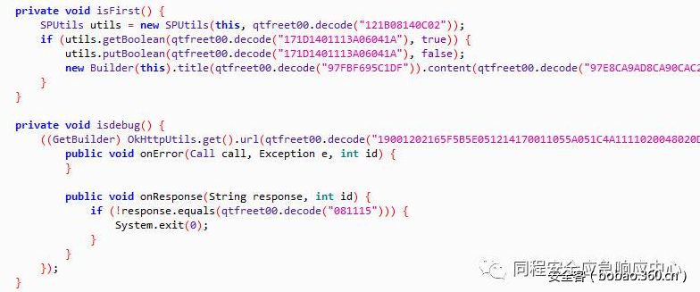

# 【技术分享】Android 字符串及字典混淆开源实现


                                阅读量   
                                **193781**
                            
                        |
                        
                                                                                    


[](./img/85637/t0173ebd60a3aea70d2.png)

Android上对App进行混淆是常见的事情，目的就在于一定程序上保护app的逻辑不被逆向，同时还可以减少app的体积。

在开发中常用的混淆工具首先就要提ProGuard了，这是一款免费工具，默认已被Android IDE集成，开发者只需要适当的进行配置混淆规则就可以使用proguard来混淆app，但既然是免费软件，局限性自然也比较大，首先就是不支持字符串混淆，如果要使用字符串混淆，就需要使用它的商业版本DexGuard。

既然没有免费的字符串混淆工具，那就自己先实现一个，分析了JEB(Android反编译工具)，Zelix(JAVA混淆器)，BurpSuite(网络代理工具)等几款混淆效果比较好的软件，了解了它们的实现思路后，自己写了个简单的字符串混淆工具，先上效果：

[](./img/85637/t01e1032164c9223ec1.png)

可以看到，这里的字符串已经被处理成16进制了，每次执行时，会调用decode方法对字符串进行还原，decode方法也很简单

```
(str) {
    ByteArrayOutputStream(str.length() );
    (; str.length(); )
        .write((.indexOf(str.charAt()) .indexOf(str.charAt())));
    [] .toByteArray();
    .;
    .length();
    (; ; ) {
        [] () ([] .charAt());
    }
    String();
}
```

原理很简单，那是如何实现的呢，这里的实现思路是在smali层进行处理，即在App编译生成apk后再进行处理，使用apktool将apk进行反编译，然后再对smali中字符串进行混淆。

既然是混淆，就需要遍历每个smali文件，这个很简单

```
(filePath) {
    [] File(filePath).listFiles();
    () {
        ;
    }
    () {
        (.isDirectory()) {
            (.getPath());
        } {
            .add(.getPath());
        }
    }
}
```

使用迭代方式将每个文件添加到list中，之后就是对遍历到的文件进行处理了，直接上代码，注释写的很清楚

```
(path) {
    StringBuilder();
    {
        InputStreamReader(FileInputStream(path), );
        BufferedReader();
        ;
        ((.readLine()) ) {
            .().matcher();
            (.find()) {
                .group();
                (.equals()) {
                    .append();
                    ;
                }
                .();
                .group();
                .();
                ;
                ;
                (.(.substring()) .startsWith()) {
                    ;
                    } (.startsWith() (.startsWith() .(.substring()) )) {
                    ;
                } {
                    .append();
                    ;
                }
                ;
                .append();
                .append();
                .append();
            } {
                .append();
            }
        }
        .close();
        .close();
        FileOutputStream(File(path));
        .write(.toString().getBytes());
        .flush();
        .close();
    } (e) {
    }
}
```

这里没有去考虑全局变量，有兴趣的可以一起交流下

既然要使用字符串加密，那加密方法自然不能漏：

```
(str) {
    [] str.getBytes();
    .;
    .length();
    (; ; ) {
        [] () ([] .charAt());
    }
    StringBuilder(.);
    (; .; ) {
        .append(.charAt(([] ) ));
        .append(.charAt(([] ) ));
    }
    .toString();
}
```

插入解密smali文件，这里可以自己写个Android工程，将解密方法写入，然后打包反编译成smali即可，注意插入代码的路径要和方法中对应上，最后再使用apktool打包签名即可。

使用字符串混淆，可以更大程度上保护一些敏感信息的安全性，如加密方式，JAVA中一般使用原生加密api时会在字符串中注明类型，如”AES/CBC/PKCS5Padding”，以及一些密钥硬编码，当然想还原这种字符串混淆也并不难。

说完了字符串混淆，那字典混淆又是什么，在ProGuard中默认混淆过的效果如下：

[](https://p5.ssl.qhimg.com/t01556b543c647e08b7.png)

可以看到变量名，方法名以及目录名都已经以abcd等字母替换，但这种混淆只能一定程度上提高逆向难度，可以语意还是可以慢慢对变量名等进行人工恢复的，那如何大幅度提高难度呢，就需要借助字典了，在ProGuard中，允许用户使用自定义字典，并提供了三个命令

```
-obfuscationdictionary dic.txt
-classobfuscationdictionary dic.txt
-packageobfuscationdictionary dic.txt
```

那这个自定义字典的效果如何呢？如下：

[](https://p5.ssl.qhimg.com/t01a7a7af640385cdee.png)

正常使用中需要注意proguard-rules.pro中的配置，以免app无法运行或者运行异常。

搜索“同程安全”关注YSRC公众号，关注公众号后发送“混淆”获取文中的代码实现。
