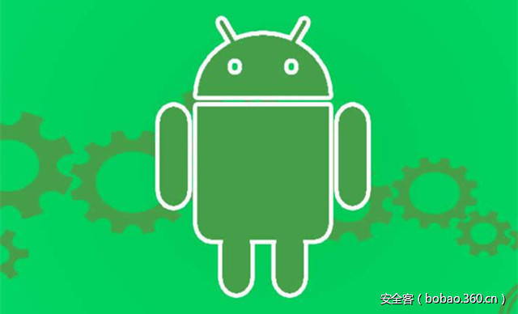

# 【技术分享】Android恶意软件模拟器检测技术


                                阅读量   
                                **127555**
                            
                        |
                        
                                                                                                                                    
                                                                                            


##### 译文声明

本文是翻译文章，文章原作者，文章来源：sophos.com
                                <br>原文地址：[https://news.sophos.com/en-us/2017/04/13/android-malware-anti-emulation-techniques/](https://news.sophos.com/en-us/2017/04/13/android-malware-anti-emulation-techniques/)

译文仅供参考，具体内容表达以及含义原文为准

[](./img/85943/t019cd753f5cd6edd60.jpg)

****

**翻译：[大脸猫](http://bobao.360.cn/member/contribute?uid=52887766)**

**预估稿费：300RMB**

**投稿方式：发送邮件至linwei#360.cn，或登陆网页版在线投稿**

**<br>**

**前言**

下面的报告来自SophosLabs实验室的Android安全专家陈宇，还有来自Android组的成员William Lee, Jagadeesh Chandraiah and Ferenc László Nagy的帮助。

随着Android恶意软件的数量的持续增长，它紧随Windows下的应用采用的用于逃脱模拟器的技术，用来防止被动态分析。在这篇文章中，我们将展示一些用于模拟器检测的技术。

模拟器是一种可以允许一台电脑（主机）模拟另外一台电脑（客户机）的硬件或软件。通常，它允许主机系统运行软件或者使用外部设备来模拟器客户机系统。在安全方面，用它很容易检测恶意软件的行为，这也是为什么恶意软件的作者很想避免运行于模拟器。

模拟器检测技术在许多不同的Android恶意软件家族中均被发现了，最近的一款是在Google Play发现的Android加载广告的恶意软件。

于是，下面是SophosLabs实验室发现的6中常用的模拟器检测技术：

<br>

**1.	检测手机服务信息**

所有模拟器检测的关键是确定模拟器和真机设备的运行环境之间的差异。首先，模拟器上面的设备ID、手机号、IMEI号和IMSI号都不同于真机设备。android.telephony.TelephonyManager类提供了用于获取设备信息的方法。Android应用程序可以通过该类里面的方法用于检测手机服务和状态，访问一些运行商信息，注册用于接收手机状态变化通知的监听器。例如，你能用getLine1Number方法来获取卡1上的手机号信息。在模拟器上面，它将是“1555521”后面紧跟模拟器端口数字。例如如果模拟器端口是5554，它将返回15555215554。

Andr/RuSms-AT使用下面这种代码用于检测模拟器：

[](https://p5.ssl.qhimg.com/t01a63b8636ac75e137.png)

<br>

**2.	检测制造商信息**

我们发现许多恶意软件家族通过检测制造商信息来判断它是否运行在模拟器中。例如，下面这款银行类的恶意软件使用如下的模拟器检测代码：

[](https://p5.ssl.qhimg.com/t01e4bfedbda3b185d5.png)

其中的字符串被加密了，解密后的内容如下：

[](https://p5.ssl.qhimg.com/t0173656a685ff77176.png)

上面的方法是被一个广播接收器调用的。在这款APP的manifest文件中，这个广播接收器被定义为用于接收android.intent.action.BOOT_COMPLETED和 android.intent.action.SCREEN_ON事件。这意味着它将在手机启动时或者被唤醒时调用。这是恶意软件常用来启动它们恶意行为的地方。但是，这款恶意软件在模拟器检测函数返回true时将什么都不做，如下所示：

[](https://p2.ssl.qhimg.com/t01a2d99f2d993a74d1.png)

<br>

**3.	检测系统属性**

另外一种方法是检测系统属性。模拟器上面的一些系统属性和真机上面的不同。例如，设备厂商、硬件和model。下面这张表展示了模拟器上面一些系统属性的值：

[](https://p3.ssl.qhimg.com/t01442a63be0f3ffd79.png)

<br>

**4.	检测模拟器相关文件**

这是另外一种在恶意软件样本中使用的技术。它们检测QEMU (Quick Emulator)或者其他模拟器相关的文件是否存在。例如，下面的代码片段在Andr/Pornclk变种中发现的。

[](https://p2.ssl.qhimg.com/t0165be1f9dac13ab2d.png)

<br>

**5.	检测调试器和安装器**

下面这种方法不是为了检测模拟器，但是主要目的也是为了阻止动态分析。像下面这款诈骗广告软件，它使用Debug.isDebuggerConnected()和Debug.waitingForDebugger()来检测是否存在调试器。更有趣的是，它同时也通过getInstallerPackageName获取安装器来查看它是否是通过Google Play安装的（com.android.vending）。因此，像大部分的逆向分析者一样，如果你是通过adb安装应用程序到设备上的，这个应用程序就不会运行了。

<br>

**6.	时间炸弹**

下面是另外的一种方法，许多恶意软件/广告软件利用这种方法在被动态分析时隐藏它们自身。在安装后，它们在等待指定的时间后才启动Activities。例如，某款恶意广告软件中发现了下面的配置文件：


```
“settings”: {
    “adDelay”: 180000,
    “firstAdDelay”: 86400000,
    “unlockDelay”: 2,
    “bannerDelay”: 180000,
    “bannerPreDelay”: 10000,
    “bannersPerDay”: 25
},
```

firstAdDelay是第一条广告被投递到客户端的毫秒时间，在上面的例子中是24小时。这也可以防止用户怀疑。

我们相信，android恶意软件和恶意广告软件的作者将会继续编写模拟器检测技术的代码，同时他们也已经获得了一定程度的成功。安全公司必须使用较好的检测方法匹配它们。

<br>

**参考引用**

[https://github.com/strazzere/anti-emulator](https://github.com/strazzere/anti-emulator) 

[http://blog.checkpoint.com/2017/03/08/skinner-adware-rears-ugly-head-google-play/](http://blog.checkpoint.com/2017/03/08/skinner-adware-rears-ugly-head-google-play/) 
