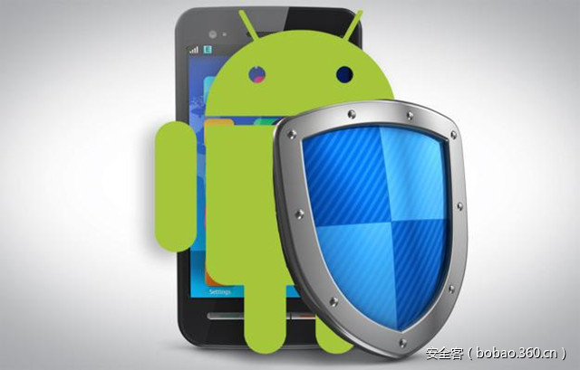

# 【技术分享】Android欺诈僵尸网络Chamois的检测和清除

                                阅读量   
                                **80729**
                            
                        |
                        
                                                                                                                                    
                                                                                            

##### 译文声明

本文是翻译文章，文章原作者，文章来源：googleblog.com
                                 原文地址：[https://security.googleblog.com/2017/03/detecting-and-eliminating-chamois-fraud.html](https://security.googleblog.com/2017/03/detecting-and-eliminating-chamois-fraud.html)

译文仅供参考，具体内容表达以及含义原文为准

作者：[shan66](http://bobao.360.cn/member/contribute?uid=2522399780)

稿费：120RMB

投稿方式：发送邮件至linwei#360.cn，或登陆网页版在线投稿

**前言**

一直以来，Google都在致力于为各种设备和环境中的用户提供全面的保护，其中就包括设法让用户免受潜在有害应用程序（PHAs）的侵害，因此，我们就有机会观察针对我们的生态系统的各种类型的威胁。例如，我们的安全团队最近发现了一个针对我们的广告和Android系统的新型PHA家族，我们将其命名为Chamois。同时，我们也迅速为用户提供了相应的防护措施。Chamois是一个Android PHA家族，它们能够：

通过广告弹窗中的欺骗性图像生成无效流量

通过在后台自动安装应用来进行人工应用推广

通过发送高级文本消息进行电话欺诈

下载和执行其他插件 

 

**扰乱广告生态系统**

我们是在日常的广告流量质量评估中检测到Chamois的。我们针对基于Chamois的恶意应用程序进行了细致的分析，发现它们可以通过多种方法来规避检测，并试图通过显示欺骗性图像来诱骗用户点击广告。有时，这还会诱骗用户下载其他发送短信欺诈的应用程序。因此，我们果断通过Verify Apps阻止了Chamois应用系列，同时将试图扰乱我们的广告系统的不良分子清除了出去。

正是由于我们在处理广告诈骗应用程式方面已经积累了大量经验，因此我们的小组才能立即采取行动，迅速为广告客户和Android使用者提供了及时的保护。由于这种恶意应用程式并不会显示在手机的应用程式清单中，因此大部分用户都觉察不到这个恶意程序的存在，更别提卸载它了。这时Google的Verify Apps就显示出巨大的威力了，因为它可以帮助用户发现PHA并删除它们。

 

**解开Chamois的神秘面纱**

Chamois是Android平台上迄今为止最大的PHA家族之一，它可以通过多种渠道进行分发。据我们所知，Google是第一个公开发现和跟踪Chamois的公司。

Chamois有一些特殊的功能，使它看起来与众不同，这些功能包括：

**多阶段有效负载：**其代码能够在4个不同的执行阶段使用不同的文件格式，具体如图所示。

这种功能提高了及时识别这种PHA的难度，因为必须首先剥离多层伪装，才能接触到恶意代码部分。不过，Google早就为针对这种情况提供了相应的措施。

**自我保护：**Chamois试图通过混淆技术和反分析技术来逃避检测，但我们的系统能够有效对抗这些诡计，从而可以有效地对各种应用程序实施检测。

**定制的加密存储：**Chamois为其配置文件和一些重要代码使用了自定义的加密文件存储技术，而我们只有深入分析这些加密资料才能对它进行定性。

**软件大小：**我们的安全团队筛选了超过100K行的复杂代码，这些代码看上去都是由专业的开发人员编写的。由于APK的规模庞大，需要耗费大量时间才能深入细致的了解Chamois。

 

**Google针对PHA的抵御之道**

当用户下载已确认为PHA的应用时，Verify Apps会向用户提出警告，从而保护用户免受已知PHA的攻击，并且还允许用户卸载已安装的恶意应用。此外，Verify Apps还会监视Android生态系统状态的异常情况，并针对这些情况进行深入的调查。它还有助于通过设备上的行为分析找出未知的PHA。例如，许多由Chamois下载的应用程序，其DOI得分都比较靠前。此外，我们已经在Verify Apps中实施了相应的规则，来保护用户免受Chamois的攻击。

今后，Google还将继续加大在Android及其广告系统的反滥用技术方面的投入，同时，我们也为在幕后为对抗诸如Chamois等PHA而辛勤工作的团队感到自豪。我们希望本文能够对读者洞悉日益复杂的Android僵尸网络有所帮助。若要深入了解Google在反PHA方面的工作以及如何降低PHA对用户、设备和广告系统带来的风险的话，敬请关注即将发布的“Android安全2016年年度回顾”报告。
