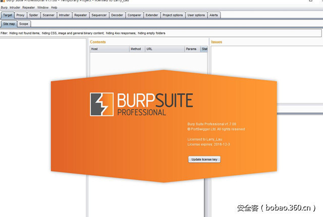

# 【技术分享】BurpSuite 代理设置的小技巧


                                阅读量   
                                **1300807**
                            
                        |
                        
                                                            评论
                                <b>
                                    <a target="_blank">6</a>
                                </b>
                                                                                                                                    
                                                                                            


[](./img/85925/t010a686e719be4ea8b.jpg)


作者：[三思之旅](http://bobao.360.cn/member/contribute?uid=1630860495)

预估稿费：300RMB

投稿方式：发送邮件至linwei#360.cn，或登陆网页版在线投稿

<br>

在Web渗透测试过程中，BurpSuite是不可或缺的神器之一。**BurpSuite的核心是代理Proxy**，通常情况下使用BurpSuite的套路是：浏览器设置BurpSuite代理——&gt;访问Web应用程序——&gt;BurpSuite抓包分析。**本人从事Web渗透测试尚不足一年，这期间在代理设置过程中踩到过一点『小坑』，现在将我踩过的『小坑』总结一下。**本文主要面对新人朋友，老司机们请不吝赐教~

<br>

**0x01 一般情形**

最一般的情形是针对采用HTTP协议的Web应用程序的渗透测试。这种情况下，直接设置浏览器的代理服务器为BurpSuite即可，默认为127.0.0.1:8080。

[](https://p1.ssl.qhimg.com/t01bb374b162b40b51b.png)

当然，直接更改浏览器的代理服务器设置比较繁琐，更好的办法是使用浏览器插件，预先设置好代理方案，然后根据实际情况一键切换。Chrome推荐使用[**Proxy SwitchyOmega**](https://chrome.google.com/webstore/detail/proxy-switchyomega/padekgcemlokbadohgkifijomclgjgif)插件：

[](https://p0.ssl.qhimg.com/t013308c1e1fcf74557.png)

Firefox推荐使用[**FoxyProxy**](https://addons.mozilla.org/zh-CN/firefox/addon/foxyproxy-standard/)：

[](https://p5.ssl.qhimg.com/t01a12cdf1a9ac2ceee.png)

至于IE浏览器，说实在话用得很少，不建议用于渗透测试。一方面，IE不支持扩展插件；另一方面，IE的代理设置也就是系统全局代理，一旦更改了IE的代理，除了那些自带代理设置的程序外（如安装了Proxy SwitchyOmega扩展的Chrome浏览器），其他程序请求数据都要走代理，给我们的测试带来很大不便。但是，如果你非要用IE的话（比如针对某些不支持Chrome和Firefox的网银系统进行渗透测试），也有比较方便的解决办法，容我先卖个关子，后文会有说明。

<br>

**0x02 HTTPS网站的情形**

许多人在第一次使用BurpSuite抓取HTTPS网站报文时都会遇到『您的连接不是私密连接』（Chrome）、『此网站的安全证书存在问题』（IE）或者『您的连接不安全』（Firefox）的问题，这时候怎么办？

[](https://p1.ssl.qhimg.com/t01b9f7596d3aa1aa03.png)

这个问题其实很简单，安装一个证书即可解决，想知道原因的可以自行Google一下HTTPS原理就能够得到答案。

首先，浏览器设置好BurpSuite代理服务器后，访问http://burp，然后点击右上角的CA Certificate，这时会自动下载一个名为cacert.der的证书文件。

[](https://p5.ssl.qhimg.com/t01268c22f5962b5c67.png)

打开这个证书文件，根据提示安装这个证书，基本上是一路『下一步』，唯一需要注意的是，在『证书存储』这一步选择将证书存储在『受信任的根证书颁发机构』。

[](https://p2.ssl.qhimg.com/t01d1c8f1600971ddf6.png)

证书安装好之后，Chrome和IE就能够正常访问HTTPS网站了（由于Google一直在推全网HTTPS，Chrome对证书要求很严格，我们安装的证书不是权威机构颁发的，因此地址栏会一直提示『不安全』，但是不影响使用）。

不过，如果你使用Firefox浏览器的话，还需要增加一步，即将证书导入到Firefox中。打开Firefox的『选项——高级——证书』，然后点击『查看证书』按钮打开『证书管理器』。

[](https://p1.ssl.qhimg.com/t0137a4698200cbc594.png)

在『证书管理器』中，点击下方的『导入』按钮，导入之前下载的cacert.der证书文件，并且在弹出的『下载证书』对话框中，勾选3个『信任使用此CA标识的……』复选框，最后点击『确定』即可。

[](https://p1.ssl.qhimg.com/t01c8b30911f1b966ee.png)

[](https://p2.ssl.qhimg.com/t01222e2866941951cb.png)

这时候，Firefox也可以正常使用了。

<br>

**0x03 移动端流量抓取**

有时候，我们还需要对移动APP进行抓包分析，这时候该怎么办？

其实很简单，两步即可解决。

第一步，在BurpSuite的Proxy Listeners中，选中当前在用的代理，点击左侧的Edit按钮，在弹出的对话框中，将Bind to address选项设置为All interfaces。

[](https://p2.ssl.qhimg.com/t013287c3983f911140.png)

第二步，手机和PC连接同一Wifi，打开手机Wifi设置，设置HTTP代理服务器为BurpSuite所在的PC的IP地址，端口为BurpSuite的代理端口。以iPhone为例，其设置如下图所示。

[](https://p1.ssl.qhimg.com/t011fa1917f6a3fb2a0.png)

然，如果APP走的是HTTPS通道，仍然需要安装证书才能正常访问，方法同前，不再赘述。

<br>

**0x04 多重代理的情形**

在某些网络环境中，访问目标网站需要走代理。比如说，为了访问google.com，我已经给浏览器设置了SS代理（默认127.0.0.1:1080），现在我想对google.com进行渗透测试，那么该怎么设置浏览器代理？这时候不能简单的把浏览器代理设置为BurpSuite，这样虽然可以进行抓包，但是没有了SS的帮助，我们是无法访问google.com的，抓包也就没有意义了。这时候该怎么办？

在这种情况下，我们必须借助代理链了。

顾名思义，代理链就一系列的代理形成的链条。像刚才那种情形，我们首先设置浏览器的代理为BurpSuite以便能够抓包；然后为BurpSuite再设置一个上游代理即SS。这样访问google.com时，请求数据先经过BurpSuite，于是可以进行抓包了；然后再流向SS，最后经过SS服务器到达google.com。服务器端返回的响应则刚好相反。通过这个BurpSuite——SS的代理链，我们就解决了本节开头所描述的问题。

作为一个神器，BurpSuite是具备这个功能的。在BurpSuite的User options下的Connections页面中，有『Upstream Proxy Servers』和『SOCKS Proxy』这两个配置项，都是跟代理链相关的。接下来逐一进行说明。

[](https://p5.ssl.qhimg.com/t01c3fffd20acfe3bf7.png)

**1. Upstream Proxy Servers**

在该设置项中，可以设置多个上游代理服务器规则，满足规则的请求将被发送至相应的代理服务器。只说概念过于无聊，还是以google.com为例进行说明。

为了对google.com进行抓包分析，我们首先要设置浏览器的代理为BurpSuite，这一点是毫无疑问的。为了能正常访问google.com，还需要设置BurpSuite的上流代理为SS（127.0.0.1:1080）。点击Upstream Proxy Servers列表框左侧的Add按钮，打开『Edit upstream proxy rule』对话框。这里一共有8个设置项，一般情况下只需关注前4个：

Destination host：这里填入目标网站域名或者IP，支持通配符（*表示0个或者任意个字符，?表示除点号之外的任意一个字符）。在本例中，我们可以填入*.google.com。

Proxy host：填入SS代理服务器的IP地址，即127.0.0.1。如果为空表示直接连接。

Proxy port：填入SS的代理地址，即和1080。

Authentication type：这里选择认证类型，由于SS本地代理无需认证，这是选择None。

如果Authentication type为None，则接下来的4项内容无需理会，否则需要根据实际情况设置以下4项内容。

Username：用户名。

Password：密码。

Domain：域。仅用于NTLM认证类型。

Domain hostname：域主机名。仅用于NTLM认证类型。

设置内容如下图所示，最后点击OK即可。

[](https://p2.ssl.qhimg.com/t01681cad0d70ad387b.png)

这时候你会发现google.com已经能够访问了，并且BurpSuite中也成功地抓取到了相应的请求报文。

你可以同时设置多个Upstream Proxy Servers，在使用过程中，BurpSuite会按顺序将请求的主机与Destination host中设置的内容进行比较，并将请求内容发送至第一个相匹配的Proxy server。因此，Proxy Server的顺序很重要，讲究个先来后到！

**2. SOCKS Proxy**

与Upstream Proxy Servers的作用类似，SOCKS Proxy的功能也是将请求内容发送至相应的代理服务器。不同之处在于，SOCKS Proxy作用于TCP协议层，因此如果设置了该项，那么所有的请求数据都会被发送至SOCKS代理服务器。所以，SOCKS Proxy的设置更简单。同样以google.com为例，先在下方的输入框中依次填入SOCKS代理服务器的IP、端口（如果SOCKS代理服务器需要认证，还需要填写用户名和密码），然后勾选Use SOCKS proxy即可。

[](https://p4.ssl.qhimg.com/t01f8ee17f4f2135e5d.png)

需要注意的一点是，如果同时设置了Upstream Proxy Servers和SOCKS Proxy，则根据规则应该发送至上游代理的请求将会通过SOCKS Proxy发送。

<br>

**0x05 被测客户端不支持代理设置的情形**

有时候，我们想对电脑上的某客户端进行抓包分析，然而这个客户端并没有代理设置的功能，怎么办？如果直接设置系统代理当然也是可以的，但是这样一来所有程序的流量都要经过BurpSuite，一方面有可能影响非测试软件的使用；另一方面，BurpSuite中非测试软件的请求记录过多也影响我们的分析测试。有没有更好的解决方案？

答案是肯定的，这时候就需要[Proxifier](https://www.proxifier.com/)登场了。Proxifier是什么？且看官网的说明：

```
Proxifier allows network applications that do not support working through proxy servers to operate through a SOCKS or HTTPS proxy and chains.
```

简单的说，使用Proxifier能够为那些本身不能设置代理的软件设置SOCKS或者HTTPS代理（链）。Proxifier的体积虽小，但功能却十分强大，除了有Windows版之外，还有Mac版的。因此，非常值得关注。

还是通过实例进行说明。有一次，需要对某微信公众号进行渗透测试，有些微信公众号的链接复制到浏览器中可以直接打开，但是这个公众号做了限制，只能在微信中打开，即使改了UA也不行。

[](https://p1.ssl.qhimg.com/t01e10c73685a986fdf.png)

微信网页版中只能看到公众号发的文章，而不能进行交互。设置手机代理倒是可以进行测试，但是一边在手机上操作、一边在PC上抓包很不方便，而且容易给领导一种一直在玩手机的错觉……微信PC版功能倒是挺全，然而却不能设置代理！

怎么办？貌似山穷水尽了。最后寄希望于Google，经过一番搜索，直到Proxifier的出现，总算柳暗花明！言归正传，接下来看看Proxifier怎么玩。

Proxifier的界面很简洁，我们重点关注其中的两个功能，即Proxy Servers和Profication Rules。工具栏中最左侧的两个图标分别对应这两个功能。

[](https://p3.ssl.qhimg.com/t013699567df9d4cb42.png)

首先点击工具栏第一个图标，打开Proxy Servers对话框。Proxy Servers对话框分为上下两部分，上半部分用于设置代理服务器，下半部分用于设置代理链。

[](https://p0.ssl.qhimg.com/t0157cb1d25ed8cae41.png)

**1. 代理服务器设置**

我们先讲讲代理服务器设置。点击Add按钮，增加一个代理服务器，填入相应的代理服务器地址和端口，这里填入BurpSuite的代理127.0.0.1:8080；Protocol中选择HTTPS；点击Advanced按钮，设置一个Custom Label以方便区分。

[](https://p2.ssl.qhimg.com/t0128d27087717f4cfe.png)

设置完成之后，可以点击下方的Check按钮测试一下代理是否设置成功。如果出现下图所示的Proxy is ready to work with Proxifier!说明代理设置成功。不过默认的用于测试的目标网站是www.google.com，很有可能出现误判，建议点击右上角的Test Settings按钮将Target host更改为不挂代理也可正常访问的网站。

[](https://p5.ssl.qhimg.com/t01619dc766af130bf6.png)

Proxy Server设置完成之后会提示你尚未设置当前启用的代理服务器，是否要进入规则设置，点击『是』即可进行代理规则设置。也可以点击工具栏第二个图标进入『Proxification Rules』对话框。

[](https://p1.ssl.qhimg.com/t01f3e1092ee7c82751.png)

默认有两条直连的规则。点击左下方的Add按钮，进入具体的规则设置页面。

[](https://p3.ssl.qhimg.com/t01081172b0998e5a71.png)

设置内容并不复杂，一共五个设置项：

**Name：可任意设置，建议设置有意义的名称以方便使用。**

**Applications：设置代理的应用，此处设置的是微信的主程序wechat.exe。**

**Target hosts：设置访问哪些网站走代理，根据实际情况填写。**

**Target ports：设置访问目标网站的哪些端口才走代理，根据实际情况填写即可。**

Action：这里选择上一步设置的代理服务器即可。除了自定义的代理服务器外，这里还有Direct和Block的选项，分别是直连和阻止连接，说明Proxifier还可以有选择的屏蔽某些站点，在某些情况下还是很有用的。

[](https://p4.ssl.qhimg.com/t01834d8b530bc378ee.png)

规则设置好之后，可点击规则列表框右侧的方向按钮，更改规则的顺序。和BurpSuite的Upstream Proxy Servers一样，这里也讲究个先来后到，所以当前在用的规则越靠前越好。如果你设置好代理及规则之后不起作用，可以到这里看看顺序是不是没有调整好。

[](https://p5.ssl.qhimg.com/t015d8eb3564d509984.png)

一切设置就绪，别忘了点击OK按钮保存。这时候，在PC版的微信中对目标公众号进行相应的操作与访问，BurpSuite就能够抓取到HTTP报文了。同时，在Proxifier中能够看到连接状态与日志。（PS：我发现每次使用Proxifier一开始总会出错，过几秒钟就正常了，不知道啥原因？）

[](https://p1.ssl.qhimg.com/t0109d86316a2a9d634.png)

回到本节开头的那个问题，对于那些无法设置代理的客户端程序，可以使用Proxifier为其设置代理，进而使用BurpSuite等工具抓包分析。此外，如果将Proxification Rule中的Application设置为IE浏览器，即可选择性地将目标站点的HTTP请求发送至BurpSuite，这就解决了使用IE进行渗透测试时代理设置不方便的问题。

**2. 代理链设置**

接下来说一说Proxifier的代理链功能。为了实现代理链，首先需要设置多个代理（在Proxifier中，仅有一个代理服务器的代理链也是允许的，但那没什么意义）。还拿google.com的例子进行说明，我们需要两个代理：BurpSuite（127.0.0.1:8080）和SS（127.0.0.1:1080）。先在Proxy Servers中增加一个SS（127.0.0.1:1080）的SOCKS5代理服务器。然后点击下方右侧的Create按钮，新建一个代理链，名称随意，比如BurpSuite-&gt;SS。最后用鼠标依次将上方的BurpSuite和SS代理服务器拖到下方即可。注意，这里的顺序也很重要。

[](https://p2.ssl.qhimg.com/t017f9b1e3d35431409.png)

点击Create按钮下方的Type按钮可以设置代理链的类型，一共有3种类型的代理链：

Simple Chain：简单类型，请求数据从上到下依次经过各代理服务器，这个是默认选项。

Redundancy：冗余类型，如果第一个代理服务器无法连接，则尝第二个，以此类推。

Load Balancing：负载均衡类型，请求数据会随机地发送到列表中的各个代理服务器。

[](https://p5.ssl.qhimg.com/t012e0fef3e78adc427.png)

按照我们的需求，需要选择默认的Simple Chain。有了代理链，接下来仍然需要设置代理规则，设置方法同前，只不过在Action中选择刚才设置的代理链即可。

BurpSuite自带的Upstream Proxy Servers和SOCKS Proxy完全可以解决google.com的问题，这里仅仅是以此为例进行说明。Proxifier的代理链功能十分强大，至于怎么用就看大家的脑洞了~

<br>

**0x05 结束语**

本文总结了我在使用BurpSuite过程中所学会一点关于代理设置的小技巧。个人感觉平时在使用BurpSuite的过程中，仅仅用到了一小部分功能。今后应该抽空多研究一下自带的帮助文档，也希望大家多分享相关的技巧，大家共同进步！
