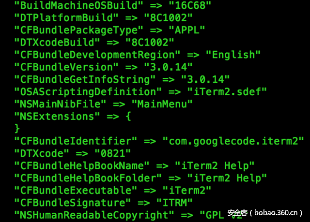

# 【技术分享】Cocoa应用逆向工程简介

                                阅读量   
                                **95255**
                            
                        |
                        
                                                                                                                                    
                                                                                            

##### 译文声明

本文是翻译文章，文章原作者，文章来源：fireeye.com
                                 原文地址：[https://www.fireeye.com/blog/threat-research/2017/03/introduction_to_reve.html](https://www.fireeye.com/blog/threat-research/2017/03/introduction_to_reve.html)

译文仅供参考，具体内容表达以及含义原文为准

****

翻译：[机车复古侠](http://bobao.360.cn/member/contribute?uid=38652219)

预估稿费：160RMB

投稿方式：发送邮件至[linwei#360.cn](mailto:linwei@360.cn)，或登陆[网页版](http://bobao.360.cn/contribute/index)在线投稿

** **

**Cocoa应用逆向工程简介**

虽然不像Windows平台上恶意软件那么常见，但是在OS X操作系统上，这几年恶意软件还是保持着相当稳定的出勤率。二月份就有三篇专门介绍macOS恶意软件的文章发表：一篇介绍了一款发送包含keychain数据在内的系统信息给攻击者的Cocoa木马程序，另外两篇分别描述了一款macOS版本的APT28 Xagent恶意软件和一款新的木马勒索软件。

在本文中，FLARE团队将会介绍两款小工具。可以为macOS上的Cocoa应用逆向工程提供帮助。为了更好的介绍这些工具，我们会先给读者介绍一些特定苹果主题的基础知识。比如，我们会解释Objective-C的Runtime特性如何使得代码分析在诸如IDA Pro工具中变得复杂，以及如何在一份Cocoa应用程序的代码中找到开始分析的入口点。

如果你对这个主题很感兴趣或者你希望在你自己的环境中更好的研究macOS恶意软件，可以来参加我们今年在Black Hat Asia和Black Hat USA举办的两日快速课程。

 

**Cocoa应用剖析**

当我们说到名词“Cocoa应用”时，我们一般指使用AppKit framework构建的程序，属于苹果公司所指的Cocoa应用层。在macOS中，应用程序都部署在应用bundle包里面。这是一个包含可执行代码和相关资源的目录结构文件，如图1所示。

图1：iTerm应用bundle包的目录结构	

bundle包里面可以包含多种不同的文件，但是所有的bundle包里面至少必须含有两个关键文件：Info.plist和一个在MacOS文件夹里面的可执行文件。这个可执行文件可以是任何允许执行的文件，甚至是一个python或者shell脚本，但是通常是一个原生可执行文件。Mach-O是这种原生可执行文件macOS和iOS平台中的文件格式。Info.plist文件用以描述应用bundle包，包含系统加载bundle包时需要的关键信息。Plist文件可以是XML，JSON或者一个叫bplist的专用二进制格式这三种格式中的一种。在macOS上有一个方便实用的工具叫plutil。它可以转换plist文件的格式，或者轻松的打印plist文件，而不论是什么格式。Info.plsit文件里面最重要的属性就是CFBundleExecutable。它来指定MacOS文件夹里面将会被执行的可执行文件名。图2显示的是用plutil工具打印出的iTerm应用的Info.plist文件信息。

图2 iTerm应用的Info.plist文件信息

 

**Objective-C**

Cocoa应用基本都是用Objective-C或者Swift语言编写的。Swift是这两种语言中更新的那一个，正迎头赶上甚至已经快超过Objective-C了。尽管如此，Objective-C历史要比Swift要早很多年，这意味着现在你将运行的恶意Cocoa应用都是实用Objective-C语言编写的。此外，在进行恶意软件分析时会遇到版本更旧的Objective-C API。这都是由恶意软件的年龄或者出于向前兼容的目的造成的。Objective-C是一种动态反射型编程语言，拥有runtime特性。大约10年前，Objective-C 2.0版本面世，在语言和runtime特性上都有很大的变化。本文中讲述的细节都是针对的2.0版本。

在编译时，Objective-C编写的程序会被转化为C，这对于大多数逆向工程师来说至少过渡起来会更舒服些。在过渡时最大的障碍就是Objective-C中method是如何被调用的。Objective-C method在概念上和C函数差不多；他们都是一段执行特定任务的代码，可能伴有输入参数和返回值。但是，由于Objective-C的动态特性，method一般不是被直接调用的。而是通过一个发给对象的消息。一个method的名字称为一个selector，真正执行的函数被称为一个实现（implementation）。消息定义一个被调用selector的reference，同时给出一些method的参数。这就为一些特性的实现提供了支持，比如“method swizzling”，该特性允许应用可以替换一个给定的selector的具体实现。在Objective-C应用中最常用的发送消息方式就是objc_msgSend函数。图3显示了一个段在浏览器中打开URL的代码片段。图4给出了同一段代码的C实现。

图3 Objective-C代码片段

图4 Objective-C代码的等价C代码

如你所见，在方括号中的Objective-C代码相当于一个objc_msgSend函数调用。

不幸的是，消息发送机制导致了在IDA Pro中寻找selectors的cross-references时会遇到问题。你很容易发现，从任何地方对一个特定selector进行关联的所有cross-reference，实现都不会被直接调用或者被关联，所以没有一种简单的方法来直接从一个selector关联跳转到它的实现，反之亦然。图5对这个问题进行了演示，图中一个实现的唯一的cross-reference是在可执行文件的__objc_const节中，这是runtime用来保存类成员数据的地方。

图5 一个方法实现的cross-reference

当然，连接selector references和它们实现的信息是保存可执行文件中的，谢谢IDA Pro为我们分析了这些数据。在__objc_const节中，IDA Pro识别出该结构并定义为__objc2_meth。如图6所示。

图6 __objc2_meth结构

该结构的第一个值是指向method的selector。该值的cross-references中的一项将我们带到了可执行文件__objc_selrefs节，这个节中你可以找到selector reference。跟随该selector reference的cross-references我们可以在代码中找到任何selector被使用的位置。该结构的第三个值指向selector的实现，就是我们想要分析的函数。剩下要做的就是利用这个数据生成cross-references。我们要介绍的两个工具的第一个名叫objc2_xrefs_helper.py的IDAPython脚本就是专门用来做这项工作的，针对Objective-C 2.0版的x86_64 Mach-O可执行文件。这个脚本与之前的IPAPython scripts released by Zynamics很相似，但是那个不支持x86_64构架。我们的脚本和我们其他所有IDA脚本和插件都可以从我们的Github上获得。objc2_xrefs_helper.py针对可执行文件中的每一个定义的Objective-C method都会进行处理。交叉引用method的selector来引用实现函数本身，并创建一个从引用指令到实现函数的cross-reference。使用这个脚本可以让我们轻松的从一个selector的实现函数跳转到它的references，反之亦然。图7和图8进行了说明。

图7: 实现的cross-references

图8: 从selector的引用处查看它的实现

然而，这个工具有一个显著的缺点，如果几个类使用同一个名字来定义method，那么只会有一个selector在可执行文件中显示。现在，该工具会忽略这些不明确的selector。

 

**Cocoa应用－从哪里开始着手？**

另外一个Cocoa应用，或者说是任何从一个framework构建而来的程序，的逆向工程的难点就是如何判断哪里是作者代码的开始，哪里又是framework代码的结束。使用C/C++编写的程序，作者的代码几本都是从main函数开始。但是这条规则有许多例外，这里就是这种情况。使用Apple IDE Xcode的Cocoa应用模版生成的应用，main函数只是在结尾处执行一个跳转到AppKit framework导出的NSApplicationMain函数处。见图9.

图9： 一个Cocoa应用的main函数

那么我们如何找到程序作者写的第一行执行代码呢？答案就在NSApplicationMain里面。整体来说，NSApplicationMain执行三个重要步骤：构建NSApplication对象，加载主要的storyboard或nib文件，开始事件循环。NSApplication对象在程序运行时扮演重要的事件和通知协调者的角色。NSApplicationMain在应用的bundle包里的Info.plist文件中的NSPrincipalClass元素中寻找该对象类的名字。Xcode仅仅设置该元素到NSApplication类，但是这个累可能是子类或重写guo。NSApplication对象可以定位的一个重要的通知就是NSApplicationDidFinishLaunchingNotification。这个通知用来让程序员可以在合适的时候运行应用特殊的初始化代码。为了处理这个通知，应用程序需要指定根据NSApplicationDelegate协议来指定一个委托类。在Objective-C中，一个协议(protocol)扮演着传统面向对象说法里面的接口。在这个协议中包含初始化代码的对应method就是applicationDidFinishLaunching。Xcode默认为你创建这个委托类，名叫AppDelegate。同时还定义了一个空的applicationDidFinishLaunching method来让开发者在需要时进行更新。掌握了这些知识，那么最好的寻找大多数Cocoa应用的初始化代码的地方就是applicationDidFinishLaunching。如图10所示。

图10: 搜索applicationDidFinishLaunching方法

如果你找不到有用的信息，那么就返回研究main函数。需要指出的是所有这些信息都是针对利用Xcode Cocoa应用模版生成的应用的。Cocoa应用可以不需要使用NSApplicationMain。程序员可以编写改编实现他自己的NSApplicationMain来生成Cocoa应用。

 

**接口构建器（Interface Builder）和Nib文件**

之前已经提到NSApplicationMain的任务之一就是加载主要的storyboard和nib文件。"Nib"是NeXTSTEP Interface Builder的缩写。指的是Xcode的组件之一界面生成器。界面生成器可以让开发者轻松的编辑图形用户接口，还可以通过使用图形接口的代码连接控件到变量和方法。当一个用户使用界面生成器生成GUI时，对象的图形就会自动生成。一个对象图形将以XML格式保存在工程文件夹的一个.xib文件中。当编译生成工程时，每一个对象图形通过NSKeyedArchiver类进行序列化，保存在应用bundle包的一个.nib文件中，一般在Resources文件夹下。Xcode将主nib文件的名字写到应用Info.plist文件的NSMainNibFile元素中。当一个应用加载一个nib文件时，对象依次解压到内存中，所有GUI窗口，目录，控件，变量和方法之间的连接关系都被建立起来。这个连接清单包括程序委托和NSApplication类之间的连接。Storyboards是在Yosemite加入到macOS中的。它允许开发者列出所有展示给用户的应用变量视图，并说明它们之间的关系。在底层，一个storyboard就是一个包含一组nib文件和一个Info.plist文件的目录。主storyboard目录保存在应用的Info.plist文件的NSMainStoryboardFile元素中。

下面带给大家另外一个我们分享的工具，nib_parse.py,在我们的Github上可以下载。nib_parse.py使用ccl_bplist来解码和反序列化一个nib文件，打印出里面定义的连接关系列表。对于每个连接，它将会打印出连接的标签（一般是一个方法或者变量名字），源对象的类，目标对象的类。每一个对象都被NSKeyedArchiver编码，并分配一个唯一的数字标识符，该标识符输出在圆括号里面。对于某些GUI组件还会一起打印出文本信息，比如按键标签，文本信息输出在方括号中。通过这些信息，就可以认清代码和GUI组件之间的关系。甚至可以重写程序，改变GUI事件的处理函数。注意，如果一个nib不是平坦的，它就会被展示为一个包含nib文件的目录，你可以继续运行这个工具在keyedobjects.nib文件替换它的路径位置。对于storyboard文件，你可以对storyboard目录中的每个nib文件运行这个工具。图11中显示的是运行nib_parse.py在最近发现的MacDownloader威胁（图12所示）中的MainMenu.nib上的结果。你可能注意到了工具输出的GUI文本与截屏中的GUI文本不符。这种情况是因为很多GUI组件在运行时被代码修改。如图13所示。

图11: nib_parse.py对MacDownloader threat的输出

图12:MacDownloader的初始化窗口

图13:代码对按键文本进行更新

nib_parse.py的输出表明作者使用了Xcode提供了的默认委托类AppDelegate。AppDelegate类含有两个NSButton对象实例和四个NSTextField对象实例。一个名叫btnSearchAdware的selector连接到了一个拥有实例变量btnAction的button控件（id 49）。这就是一个值得去分析函数。

 

**总结**

希望你们能从这次旋风之旅般的Cocoa应用逆向工程简介中获得乐趣。如果你还有更多兴趣在深入macOS内部，分析工具的使用，逆向工程，调试技术和发现探索未知macOS恶意软件等方面，就来参加今年的Black Hat吧！
