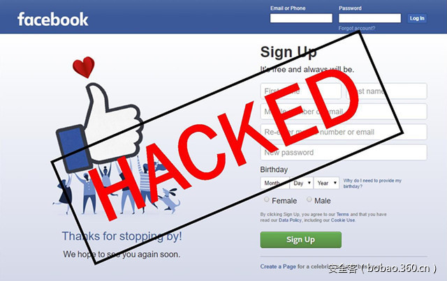

# 【技术分享】Facebook和Dropbox中的CSRF漏洞分析（含演示视频）


                                阅读量   
                                **82090**
                            
                        |
                        
                                                                                                                                    
                                                                                            


##### 译文声明

本文是翻译文章，文章原作者，文章来源：intothesymmetry.com
                                <br>原文地址：[http://blog.intothesymmetry.com/2017/04/csrf-in-facebookdropbox-mallory-added.html](http://blog.intothesymmetry.com/2017/04/csrf-in-facebookdropbox-mallory-added.html)

译文仅供参考，具体内容表达以及含义原文为准

**[](./img/85875/t0137f62497d291a9c2.jpg)**

****

翻译：[WisFree](http://bobao.360.cn/member/contribute?uid=2606963099)

预估稿费：150RMB

投稿方式：发送邮件至linwei#360.cn，或登陆网页版在线投稿

**<br>**

**概述**

Facebook允许用户直接加载Dropbox账号中的文件，这种整合进来的功能使用的是OAuth 2.0协议，而这个协议中存在一个经典OAuth CSRF漏洞的变种，具体请看下面这个视频：


**介绍**

Facebook给用户提供了一个非常方便的功能，而用户可以通过这个选项直接从Dropbox账号中加载文件：

[](https://p4.ssl.qhimg.com/t01d55b90537321ee15.png)

这个功能将允许用户直接在浏览器窗口查看并上传Dropbox账号中的文件：

[](https://p5.ssl.qhimg.com/t014d37ffb3940ddded.png)

这种功能性的整合是通过[OAuth 2.0](https://oauth.net/2/)协议的一个变种版本实现的，具体可参考这篇文章【[传送门](http://blog.intothesymmetry.com/search/label/oauth)】。注：OAuth是一种符合国际互联网工程任务组（[IETF](https://tools.ietf.org/html/rfc6749)）标注的访问代理协议。OAUTH协议为用户资源的授权提供了一个安全的、开放而又简易的标准。同时，任何第三方都可以使用OAUTH认证服务，任何服务提供商都可以实现自身的OAUTH认证服务，因而OAUTH是开放的。业界提供了OAUTH的多种实现如PHP、JavaScript，Java，Ruby等各种语言开发包，大大节约了开发人员的时间，因而OAUTH是简易的。互联网很多服务如Open API，很多大公司如Google，Yahoo，Microsoft等都提供了OAUTH认证服务，这些都足以说明OAUTH标准逐渐成为开放资源授权的标准。OAuth的工作流程如下图所示：

[](https://p5.ssl.qhimg.com/t01ab8d3d0f6c323f39.png)

通常情况下，客户端会采用下图所示的方法发起认证：

[](https://p4.ssl.qhimg.com/t01fe327a0424e84848.png)

接下来，资源的拥有者会对发起请求的客户端进行身份验证，验证完成之后，认证服务器会将验证码发送给客户端：


[](https://p4.ssl.qhimg.com/t01ffbda0d9349b59d3.png)


**Facebook与Dropbox的整合**

Facebook将Dropbox整合进自己的服务之后，Dropbox就成为了发起请求的客户端，而Facebook就是认证／资源服务器。

[](https://p0.ssl.qhimg.com/t01279a646ae9fb9282.png)

上图所示即为OAuth协议的标准工作流程，此时的资源请求应当由客户端发出，也就是Dropbox，但事实并非如此。请看下图：

[](https://p1.ssl.qhimg.com/t01ddc6ed785106bae1.png)

实际上，客户端（Dropbox）会通过下面的URL将资源拥有者重定向至认证服务器：

```
https://www.facebook.com/dialog/oauth?display=popup&amp;client_id=210019893730&amp;redirect_uri=https%3A%2F%2Fwww.dropbox.com%2Ffb%2Ffilepicker%3Frestrict%3D100000740415566%26group_id%3D840143532794003&amp;scope=publish_actions%2Cuser_groups%2Cemail&amp;response_type=code
```

除此之外，其他的步骤均是按照OAuth协议的标准流程走的。

[](https://p2.ssl.qhimg.com/t01f132169f5fe7695d.png)


**OAuth 2协议中的CSRF漏洞**

眼睛比较尖的同学可能已经注意到了下面这个初始链接了：

```
https://www.facebook.com/dialog/oauth?display=popup&amp;client_id=210019893730&amp;redirect_uri=https%3A%2F%2Fwww.dropbox.com%2Ffb%2Ffilepicker%3Frestrict%3D100000740415566%26group_id%3D840143532794003&amp;scope=publish_actions%2Cuser_groups%2Cemail&amp;response_type=code
```

而上面这个链接中缺少了一个名叫“state”的关键参数，根据OAuth协议的描述，这个参数的定义如下：

为了让大家能够更好地理解这个CSRF漏洞，我们用下面这张流程图来给大家解释：

[](https://p3.ssl.qhimg.com/t014c1250604bd6be89.png)

如果这张图片无法让您很好地理解这个漏洞的话，您也可以参考Egor Homakov的这篇关于OAuth2常见漏洞的文章。【[传送门](http://homakov.blogspot.ch/2012/07/saferweb-most-common-oauth2.html)】

<br>

**Facebook引入Dropbox之后的CSRF漏洞**

在对特定的攻击进行描述之前，我们还需要强调一件非常重要的事情：OAuth协议中针对CSRF的保护机制（即state参数的使用）在这里是不会奏效的。正如我们之前所看到的那样，发起请求的是Facebook，而不是Dropbox。这样一来，Dropbox将无法检查state参数是否进行了正确配置。此时，攻击者将能够通过[https://asanso.github.io/facebook/fb.html](https://asanso.github.io/facebook/fb.html) 中的一个恶意链接（包含伪造的验证码）来伪造出一个Web页面，并实施攻击。


```
&lt;html&gt;
&lt;img src="https://www.dropbox.com/fb/filepicker?restrict=100000740415566 
&amp;group_id=236635446746130 
&amp;code=AQAJspmJvIyCiTicc4QNr7qVU4EF05AYqBE_K9pl-fbhSuKyxtjHS_UyYU8K0S
czXZCTa9WxtG7I8EoxAIcyqhyO0tagiVSa1m2H3Umg8uZR6gixrlmUXKuyoXmYsb14yxPbwonY
xvepwP2N93gWxhVwl1me-qeenZIX2oKgqBuFMRHAW5SCaYCvYSYtaMlrDyYGoftTCAYM0QfU_
bX94LfkHUl81O1tmrLU2NtnU5Eh_XKvxjiD5j2ftSWfpCoxeb7ccaz_9UPZjsFnKGCtTTPX_2dCqi99aT
7B3M4idq6hzY-wUuDmaOL143WolrCGkDUu-np8gyEFx4wfMMdX0a0g#_=_" /&gt;
&lt;/html&gt;
```

接下来，当目标用户访问了这个地址之后，他的Dropbox将会以攻击者的身份上传任意文件。下面的这个视频演示了完整的攻击过程：


<br>

**漏洞上报时间轴**

大家都知道，报告这种产品整合方面的问题永远是很困难的，因为我们很难弄清楚到底谁才是导致这一漏洞出现的罪魁祸首。但是这一次，罪魁祸首很明显就是Dropbox，而Facebook才是受害者。但尴尬的地方就在于，Dropbox自身并不会受到这个漏洞的影响，所以Dropbox的技术团队对于我所提交的这个漏洞并不感兴趣。而对于Facebook来说，如果没有Dropbox的帮助，仅靠他们自己也是很难修复这个漏洞的。而我呢？我只是一个尴尬的中间人…

2017年1月13日 – 将漏洞上报给Facebook的安全团队。

2017年1月14日 – 通过Hackerone将该漏洞上报给Dropbox的安全团队。

Dropbox #1

2017年1月15日 – Dropbox回复称：“这个漏洞的存在是由于Facebook对Dropbox API的错误使用所导致的，而并非Dropbox的API存在安全问题。”

2017年1月15日 – 我给Dropbox的回复是：“这个漏洞的确是你们Dropbox的API设计不当所导致的。”

2017年1月15日 – Dropbox回复称：“我们会重新审查这个漏洞，如果我们认为这是一个有效漏洞的话，我们会进行处理。”然后给我的声望值减了五分…

[](https://p1.ssl.qhimg.com/t017755aafdeb01fe03.png)

2017年1月15日：虽然我不太在意这些积分，但我还是向Dropbox表示：“给你们提交了一个漏洞，却让我损失了五点声望值，这确实很令人沮丧。”

2017年1月17日：Dropbox重新开启了这个漏洞报告，我重新得到了这五点声望值。

Facebook

2017年1月20日至2017年2月25日 – 我与Facebook的技术人员在尝试复现这个漏洞。

2017年2月25日 – Facebok关闭了这个问题，并表示：“我们能够复现你所提交的这个漏洞，但是这个漏洞是由Dropbox（/fb/filepicker）导致的，我们这边无法进行修复。”

2017年3月4日 – 询问Facebook是否有可能与Dropbox方面沟通并解决这个问题。

Dropbox #2

2017年3月7日 – 再一次通过Hackerone向Dropbox安全团队上报这个漏洞。

2017年3月22日 – Dropbox向asanso提供了1331美元的漏洞奖金。

[](https://p4.ssl.qhimg.com/t01084ec8f8811a9491.png)

2017年4月10日 – 漏洞细节披露
