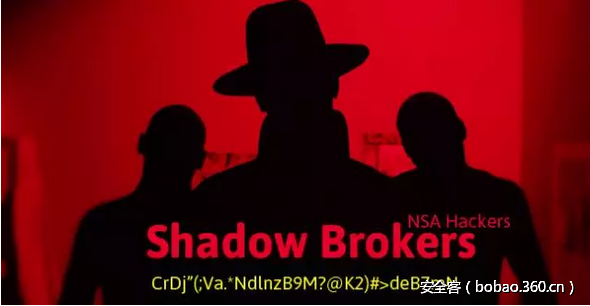

# 【技术分享】NSA泄露工具中的Dander Spiritz工具使用简易教程

                                阅读量   
                                **143623**
                            
                        |
                        
                                                                                                                                    
                                                                                            

##### 译文声明

本文是翻译文章，文章原作者，文章来源：MisterCh0c
                                 原文地址：[https://medium.com/@MisterCh0c/a-quick-look-at-the-nsa-exploits-dander-spiritz-trojan-1b5428b0ee65](https://medium.com/@MisterCh0c/a-quick-look-at-the-nsa-exploits-dander-spiritz-trojan-1b5428b0ee65)

译文仅供参考，具体内容表达以及含义原文为准

翻译：[testwot](http://bobao.360.cn/member/contribute?uid=2541372557)

预估稿费：100RMB

投稿方式：发送邮件至linwei#360.cn，或登陆网页版在线投稿

**环境**

**攻击机：192.168.174.128   win7**

**目标机：192.168.174.130   win7 x64**

 

**Dander Spiritz工具使用简易教程**

Dander Spiritz是NSA此次泄露的工具中那个类似MSF框架的工具（就是那个.jar文件），昨天看了一老外发的文章，现将搭建过程和过程中的我遇到的一些坑分享下（无技术含量，大佬勿喷）：

**1.运行：**直接双击start.jar或者运行configure_lp.py也可以（直接start_lp.py会跳过一些设置）运行后如图

这里有个坑就是设置里面的Log Directory要设置为你使用fb.py过程中的某个工程名

否则你在后面想进行start listening的时候程序会提示pc_listen不可用，运行完成后如图

**2.生成木马：**输入pc_prep命令就会一步步提示你怎么生成（目前看到的是这能生成dll和exe）

这里为了测试我们生成一个基于tcp的x64 exe文件（选7）

程序可以生成一key用于加密传输，如果是这里我们选默认2（如上图）

FC还不清楚是什么东西，目测是跟域名上线相关的，这里我们选no。

**3.	开启监听**

如果自己生成key了就自己导入，设置完后start listening

把生成程序拷到目标机改完后缀运行，然后几秒后连接就回来了

回车yes后程序后会进行一些基本任务收集（需要一段时间）

到这，搭建运行就基本差不多了，你也可以用此次泄露工具中的Doublepulsar中的run dll模式去加载用Dander Spiritz生成的dll。
