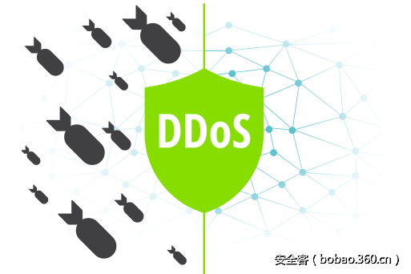

# 【技术分享】Necurs僵尸网络再次肆虐，威力强大可进行DDoS攻击

                                阅读量   
                                **87823**
                            
                        |
                        
                                                                                                                                    
                                                                                            

##### 译文声明

本文是翻译文章，文章原作者，文章来源：anubisnetworks.com
                                 原文地址：[http://blog.anubisnetworks.com/blog/necurs-proxy-module-with-ddos-features?hs_preview=qztxAuUY-4862144940&amp;utm_campaign=social%20media%20news&amp;utm_source=blog%20post%20necurs](http://blog.anubisnetworks.com/blog/necurs-proxy-module-with-ddos-features?hs_preview=qztxAuUY-4862144940&amp;utm_campaign=social%20media%20news&amp;utm_source=blog%20post%20necurs)

译文仅供参考，具体内容表达以及含义原文为准

翻译：[pwn_361](http://bobao.360.cn/member/contribute?uid=2798962642)

预估稿费：200RMB

投稿方式：发送邮件至[linwei#360.cn](mailto:linwei@360.cn)，或登陆[网页版](http://bobao.360.cn/contribute/index)在线投稿

 

**前言**

Necurs僵尸网络是世界上最大的恶意网络之一，曾经用于传播各种致命威胁，但是在很长一段时间内它都没有再出现过，似乎是已经消失了。然而现在，它又回来了，已知的主要功能是发送大量垃圾邮件，这里面最引人注目的是Locky勒索软件。然而，Necurs并不仅仅是一个垃圾邮件程序，它是一个模块化的恶意软件，包含了一个主僵尸网络模块、一个用户级Rootkit，并且它可以动态加载其它模块。

几年以来，已经有很多对它的研究，包括它的Rootkit([1](https://www.virusbulletin.com/virusbulletin/2014/04/curse-necurs-part-1)、[2](https://www.virusbulletin.com/virusbulletin/2014/05/curse-necurs-part-2)、[3](https://www.virusbulletin.com/virusbulletin/2014/06/curse-necurs-part-3))、[DGA](https://www.johannesbader.ch/2015/02/the-dgas-of-necurs/)、[通信协议和垃圾邮件模块](https://www.cert.pl/en/news/single/necurs-hybrid-spam-botnet/)，然而，除了它的垃圾邮件模块，其它模块没有太多的公共信息。

几个月之前，我们在一些被Necurs感染的系统中注意到，Necurs除了使用常用的80通信端口以外，它还使用了一个IP集和多个不同的端口，它的通信协议似乎发生了变化，下图显示了该网络流量的示例：

最近，在Necurs僵尸网络的一个解密的C2通信数据中，我们观察到了一个请求，目的是加载两个不同的模块，每一个模块包含了不同的参数列表。下图是解密的C2服务器响应数据包：

上半部分是C2服务器对垃圾邮件模块的响应数据，这是Necurs的知名模块，参数是C2服务器的地址(链接)，可以从该地址上接收到新垃圾邮件活动的通知。下半部分是C2服务器对一个未知模块的响应数据，通过判断响应数据中的参数值，我们看到它使用了5222端口。

我们是在2016年9月注意到这个模块的，该模块的编译时间是“2016年8月23日”，这个时间表明该模块是从这个时候开始应用的。当然，也有可能相同模块的另一个版本在以前部署过，只是没有被注意到。

我们下载了该模块，并对它进行逆向分析，试图了解它到底实现了什么功能。第一眼看上去，它好像是一个简单的SOCKS/HTTP代理模块，但是当我们看到该僵尸程序可以接收C2服务器的命令时，我们意识到这是一个新添加的命令，它可以引起僵尸主机向任意目标无限循环的发送HTTP或UDF请求，这种方式只能解释为是DDOS攻击。考虑到[**Necurs僵尸网络的规模很大**](http://blog.anubisnetworks.com/blog/monitoring-necurs-the-tip-of-the-iceberg)，这将是非常有趣的，规模这么大的僵尸网络可能会产生强大的DDOS攻击力。

需要注意的是我们还没有看到Necurs被用于DDOS攻击，我们只是在它加载一个模块中看到了它有这种能力。

接下来的内容里，我们会对该模块进行技术分析，详细介绍它的C2协议、SOCKS/HTTP代理功能、和DDOS攻击功能。

 

**一、模块启动/初始化**

当该模块被僵尸程序加载后，它会执行以下初始化操作：

1.对参数进行解析，并将解析结果存储到一个内部C2地址列表中。

2.用以下信息填充一个内存数据结构(下图中的botsettings数据结构)，它包含了以下信息：

**僵尸主机ID**：根据收集的独特系统信息产生的唯一标识。

**内部IP地址**：通过检查出站套接字连接google.com时所用的IP地址。

**外部IP地址**：通过ipv4.icanhazip.com或checkip.dyndns.org网站得到的主机外部IP地址。

可用带宽：通过从微软下载Windows 7 Service Pack 1文件来测量下载速度。

SOCKS/HTTP代理服务端口：大于1024的一个随机监听端口。

3.检查系统是否运行在NAT后面：通过检查出站套接字IP地址是否与本地地址、外部地址相匹配。如果系统没有在NAT后面，该僵尸程序会开启一个SOCKS/HTTP代理服务，监听一个大于1024的随机端口。

botsettings的数据结构如下图：

 

**二、C2通信协议**

在初始化之后，该僵尸程序会循环进入主C2连接过程，除非另有指令，否则，在这个过程中，它会每隔10秒钟尝试连接一次当前C2服务器，如果连接当前的C2服务器失败了，它会尝试连接C2地址列表中的下一个C2服务器。

该通信协议代码是二进制的，并且使用了自定义算法进行了加密/模糊。发送到服务器的信息(消息)采用了相似的数据结构(请看下图中botmsg和c2msg结构)，并包含了下面的数据：

**1.密钥**：32位加密密钥。

**2.加密头**：消息本身的一个被加密的头部数据结构(下图中botmsgheader和c2msgheader结构)，里面的信息用密钥加密了，包含了以下信息：

消息类型：定义了发送的消息/命令类型，大小为1字节。

载荷长度：发送的载荷长度。

头部HASH：代表了消息中第一字节的HASH值(key,msgtype,unknown和datalength)。

数据HASH：载荷的HASH，用于检查数据的完整性。

**3.加密的载荷**：一组被发送的数据，用密钥的反向值加密过。

这就是僵尸程序发送到C2服务器的三种类型的消息，可以通过头部信息中的msgtype字节来区分它们。通常，有以下三种类型的消息：

**1.信标(msgtype 0)**：这是僵尸程序每10秒钟发送会给C2服务器的主要消息，该消息的结构是前面提到过的botsettings结构。

**2.连通性检查(msgtype 1)**：这是一个简单的虚拟消息，除了加密的消息头，不包含其它数据。这个消息是在僵尸程序连接C2服务器超时时发送的，目的是查看当前C2服务器还能不能用。

**3.代理回连(proxybackconnect)(msgtype 2)**：在僵尸主机收到C2的开启socks回连命令时，僵尸主机会建立到C2服务器的连接，并给C2服务器发送这条消息，并且会将发送这条消息时建立的套接字(复用该套接字)直接用到SOCKS/HTTP代理连接中，这样做的好处是连接发起动作看起来就像是代理客户端发起的。

作为信标的响应包，C2服务器发送给僵尸程序的消息(或命令)也有三种类型，也可以通过头部信息中的msgtype字节来区分它们：

**1.开始回连代理(start proxybackconnect)(msgtype 1)：**

起初，僵尸主机给C2服务器发送一个代理回连(proxybackconnect)消息，然后，C2服务器给僵尸主机发送这条(start proxybackconnect)消息，告诉僵尸主机开始回连代理会话。该会话的套接字将会被重用，允许作为一个代理被僵尸程序使用，即使僵尸主机在防火墙之后，并且没有建立到它的直接连接。

**2.睡眠(msgtype 2)：**

这会使僵尸主机睡眠5分钟。

**3.开始DDOS(msgtype 5)：**

该命令下达后，会对消息有效负载中指定的目标开始进行DDoS攻击，攻击活动有两种模式： 

HTTP洪水攻击：如果消息载荷的前几个字节是“http:/”，僵尸程序会对目标开启HTTP洪水攻击。

UDP洪水攻击：如果消息载荷的前几个字节不是“http:/”，僵尸程序会对目标开启UDP洪水攻击。

 

**三、代理功能**

该SOCKS/HTTP代理服务和命令，允许僵尸网络拥有者将该僵尸主机作为一个代理(HTTP,SOCKSv4和SOCKv5协议)来使用，并使用两种操作模式来进行中继连接(直接代理和回连代理)。

在直接代理模式下，客户端会连接代理服务，然会代理服务会将连接转向到目的地，如下图所示：

这只有在僵尸主机没有受到NAT和防火墙保护时才有可能，这种情况在大多数僵尸网络中是不行的。

在代理回连模式下，客户端会连接到代理控制器，然后会从代理控制器的可用代理池中获得一个出站代理，并通过它来进行连接中继。如下图所示：

这种操作模式有几个优点。最大的一个优点是，即使被感染的系统运行在NAT后面也能正常工作，并且，这将允许僵尸网络能连接到内部网络资源中，就好像是来自内部机器的连接。这种代理的另一个常见用法是可以频繁的变换IP地址，方法是通过频繁和自动的改变僵尸主机的配置(充当代理的僵尸主机)。

简要的看一下这种代理方法是如何实施的，下图显示的是该C2命令处理函数的一部分：

在僵尸程序收到C2发来的“开始回连代理”(startproxybackconnect)命令时(msgtype 1)，僵尸程序会向C2服务器发送一个“回连代理”(proxybackconnect)命令(msgtype 2)，然后，C2服务器会使用相同的套接字(该套接字所在的连接是僵尸主机给C2服务器发送proxybackconnect命令的套接字)，并进入到startprocessincoming函数(请看上图)中处理实际的代理工作。这意味着用于连接C2服务器的通信连接同时也被用于了代理连接中。Processincomming函数会从传入连接中读取2字节(直接代理或通过回接代理)，然后，它会检查前面的值是否是5(SOCKSv5)、4(SOCKSv4)、或包含数字和字母(HTTP代理)然后，它会调用每个支持协议的相应函数，去处理实际的代理工作。

 

**四、DDOS攻击功能**

DDOS攻击方法可能是该模块最有趣、最意想不到的一个功能，这个模块只包含了两个基本的DDOS攻击方法，没有类似于“源IP地址欺骗”或“放大技术”的特殊功能。然而，考虑到Necurs僵尸网络的规模(每24小时有超过100万个活性IP)，即使是最基本的技术也能产生非常强大的攻击力。

来看一下它是怎么实施的，在僵尸程序接收到开始DDOS(startDDOS)命令后(msgtype 5)，如果在消息的有效载荷中发现“http:/”字符串，那么就调用HTTPflood函数，如果没有，就调用UDPFlood函数，如下图所示：

**HTTP洪水攻击模式**

使用该模式后，僵尸程序会开启16个线程用于HTTP攻击工作，并会发送一个无限循环的HTTP请求。下图显示的是16个线程队列，及发送HTTP请求的部分代码：

HTTP请求使用了以下格式的字符串：

**UDP洪水攻击**

UDP洪水攻击工作时，会发送一个128字节到1024字节之间的随机载荷，该函数包含了一个0.1秒的睡眠，这个时间是根据可用带宽而定的(在僵尸程序初始化时生成)，可能是为了避免在DDoS攻击时失去对僵尸主机的访问。下图显示了UDP洪水攻击的主循环：

 

**五、结论**

尽管主要以其垃圾邮件模块而著称，但是Necurs是一个模块化的恶意软件，它可以被用于多种不同的目的。在本文中，我们主要分析了该恶意软件的DDOS功能和添加SOCKS/HTTP代理功能。尽管我们还没有看到Necurs实施过DDOS攻击，但是这种能力目前已经被Necurs部署到了被感染的系统上，并且考虑到该僵尸网络的规模，它可以产生强大的攻击力。

 

**参考链接**

更多关于Necurs僵尸网络的信息，可以查看以下链接：

[https://www.virusbulletin.com/virusbulletin/2014/04/curse-necurs-part-1](https://www.virusbulletin.com/virusbulletin/2014/04/curse-necurs-part-1)

[https://www.virusbulletin.com/virusbulletin/2014/05/curse-necurs-part-2](https://www.virusbulletin.com/virusbulletin/2014/05/curse-necurs-part-2)

[https://www.virusbulletin.com/virusbulletin/2014/06/curse-necurs-part-3](https://www.virusbulletin.com/virusbulletin/2014/06/curse-necurs-part-3)

[https://www.johannesbader.ch/2015/02/the-dgas-of-necurs/](https://www.johannesbader.ch/2015/02/the-dgas-of-necurs/)

[http://www.malwaretech.com/2016/02/necursp2p-hybrid-peer-to-peer-necurs.html](http://www.malwaretech.com/2016/02/necursp2p-hybrid-peer-to-peer-necurs.html)

[https://www.cert.pl/en/news/single/necurs-hybrid-spam-botnet/](https://www.cert.pl/en/news/single/necurs-hybrid-spam-botnet/)

模块样本：f3aeafe50880cb9dd584b3669800c017de561f8f9654440f62c51319fda0e970
