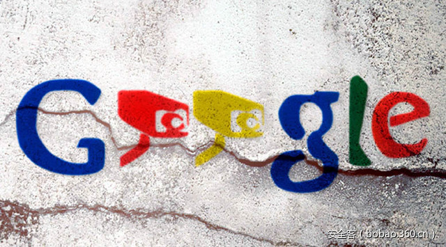

# 【技术分享】ReBreakCaptcha：利用谷歌来破解谷歌的验证码

                                阅读量   
                                **180610**
                            
                        |
                        
                                                                                                                                    
                                                                                            

##### 译文声明

本文是翻译文章，文章原作者，文章来源：east-ee.com
                                 原文地址：[https://east-ee.com/2017/02/28/rebreakcaptcha-breaking-googles-recaptcha-v2-using-google/](https://east-ee.com/2017/02/28/rebreakcaptcha-breaking-googles-recaptcha-v2-using-google/)

译文仅供参考，具体内容表达以及含义原文为准

****

翻译：[scriptkid](http://bobao.360.cn/member/contribute?uid=2529059652)

预估稿费：100RMB

投稿方式：发送邮件至[linwei#360.cn](mailto:linwei@360.cn)，或登陆[网页版](http://bobao.360.cn/contribute/index)在线投稿

**概述**

从2016年开始，我就在琢磨寻找一种新的绕过谷歌验证码v2的方法会有多难，如果这种方法能够适用于任何环境而不仅仅是针对特定的案例，那这种方法将是非常理想的。接下来我将向你介绍ReBreakCaptcha——一种全新的谷歌验证码v2的绕过技术。

ReBreakCaptcha分为三个阶段：

1、音频挑战-获得正确的挑战类型

2、识别-转换音频挑战音频并将其发送到谷歌的语音识别API

3、验证-验证语音识别结果并绕过验证码

注：截至发布时(2017.02.28)，该漏洞仍确认有效。

 

**ReBreakCaptcha阶段1：音频挑战**

一共有三种类型的验证码v2挑战：

图像挑战-挑战包含描述和9个子图像组成的图像。请求用户需选择与给定描述最为匹配的子图像。

音频挑战-挑战包含音频录音，请求用户需输入听到的数字。

文本挑战-挑战包含一个类别和5个候选短语，请求用户需选择与给定类别最匹配的短语。

ReBreakCaptcha知道如何解决验证码v2的音频挑战，因此，我们需要一种每次都获得音频挑战的方法。

当点击验证码v2的“我不是机器人”复选框时，我们经常会看到以下挑战类型：

要获得音频挑战，我们需要单击以下按钮：

然后我们就能看到一个可以轻松绕过的音频挑战：

也许你会注意到，有时候你会得到一个文本挑战，而不是音频挑战：

要绕过它并获得音频挑战，只需要点击“重新加载挑战”按钮，直到获得正确的类型即可。重新加载挑战按钮：

我们的目标是什么？绕过验证码。我们能做到吗？是的，用谷歌语音识别API!

 

**ReBreakCaptcha阶段2：识别**

接下来是一个有趣的部分，利用谷歌的一个服务来对付另一个谷歌的服务！让我们回到音频挑战（第三张图），如你所见，此挑战页面上的控件是：

1、播放按钮-听到挑战内容

2、文本框-给用户输入结果的。

3、下载按钮-下载音频挑战文件

让我们下载音频文件，并将其发送到Google语音识别API。在执行此操作之前，我们会将其转换为Google语音识别API要求的“wav”格式。现在我们有音频挑战文件，并准备好发送到Google语音识别。如何才能做到这一点？使用他们的 API。

有一个伟大的Python库，名为  [SpeechRecognition](https://pypi.python.org/pypi/SpeechRecognition/)，用于执行语音识别，支持多个引擎和API，在线和离线。我们将使用这个库实现Google语音识别API调用。我们发送'wav'音频文件，然后语音识别将以字符串（例如'25143'）形式将结果发回给我们。这个结果就是我们音频挑战的结果。

 

**ReBreakCaptcha阶段3：验证**

这个阶段相当短。我们现在需要做的只是将输出字符串从阶段2复制粘贴到文本框中，然后单击“验证”在ReCaptcha小部件。没错，我们现在半自动地使用Google的服务绕过自己的其他服务。

 

**ReBreakCaptcha完整PoC**

这里提供了一个完整的由Python编写的PoC脚本，github链接：[https://github.com/eastee/rebreakcaptcha](https://github.com/eastee/rebreakcaptcha)

 

**2017.03.02更新**

我注意到了不少人遇上了一个难度值较高的音频挑战版本。因此，我提交了一个解决方案到github repo，该方案应该能克服这种情况，虽然成功率比原来要低。目前仍不清楚为什么会触发这个较难的版本，但最被怀疑的原因是你的IP地址被谷歌认为是可疑的，通常情况下，不要使用公共代理/VPN，因为谷歌会将这些IP标记为可疑（这时将会出现较难的验证码版本）。
