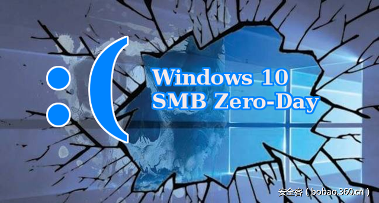

# 【技术分享】SMB 拒绝服务漏洞在web应用上的利用

                                阅读量   
                                **105106**
                            
                        |
                        
                                                                                                                                    
                                                                                            

##### 译文声明

本文是翻译文章，文章原作者，文章来源：secureworks.com
                                 原文地址：[https://www.secureworks.com/blog/attacking-windows-smb-zero-day-vulnerability](https://www.secureworks.com/blog/attacking-windows-smb-zero-day-vulnerability)

译文仅供参考，具体内容表达以及含义原文为准

****

翻译：[why233](http://bobao.360.cn/member/contribute?uid=2795848289)

预估稿费：110RMB

投稿方式：发送邮件至[linwei#360.cn](mailto:linwei@360.cn)，或登陆[网页版](http://bobao.360.cn/contribute/index)在线投稿

** **

**前言**

CVE-2017-0016 SMB 0 day 漏洞可导致Windows系统拒绝服务，本篇文章主要讲解漏洞在web应用上的利用。

2017年2月2日，安全研究人员公布了存在于Microsoft Windows SMB中的0 day 漏洞（[CVE－2017-0016](http://www.kb.cert.org/vuls/id/867968)），受影响系统版本有Windows 8.1，Windows 10，Windows Server 2012 R2及 Windows Server 2016.当客户端访问恶意SMB服务端时，攻击者能够造成其拒绝服务（denial of service，DoS）。研究人员还发布了[PoC](https://github.com/lgandx/PoC/tree/master/SMBv3%20Tree%20Connect)来利用这个安全问题。

为了利用这个漏洞，受影响终端必须访问恶意SMB服务器，这个利用门槛富有挑战性。不过，SecureWorks 研究人员确认2015年发布的“[重定向至SMB攻击](https://blog.cylance.com/redirect-to-smb)”能够成功的利用本次的SMB 0 day。

 

**连锁攻击来利用SMB zero－day**

后文描述来怎么通过结合SMB重定向漏洞和SMB 0 day 漏洞来攻击windows系统。

1.   攻击者在自己控制的系统中运行PoC（见图1），攻击者控制的系统本例中运行PoC（Win10.py）和监听TCP端口445

图一 攻击者控制的系统运行着SMB 0 day 利用代码（来源：SecureWorks）

2.   攻击者在另外一个系统设置并运行一个web服务。

3.   攻击者将图2中列出的“redirect-smb.php”PHP文件放在公共目录中。 此PHP文件使用了SMB重定向漏洞。

图2 放入公共目录的php文件（来源：SecureWorks）

4.   使用受害者的Windows 10系统上的Internet Explorer访问攻击者的Web服务器，受害者单击与“redirect-smb.php”文件相对应的链接（见图3）

图3 受害者点击php恶意链接（来源：SecureWorks）

5.   单击此链接将受害者的系统重定向到攻击者的SMB服务器并启动DoS攻击（见图4）

图4 发送SMB DoS利用代码到受害者的系统（来源：SecureWorks）

6.   一段时间后，受害者Windows 10系统崩溃，显示蓝屏（BSOD），见图5，且自动重启。

图5 执行SMB利用代码后受害者系统显示蓝屏（来源：SecureWorks）

 

**相关联的攻击方法**

SecureWorks研究人员发现了其他可能与“重定向到SMB”漏洞一样有效的攻击方法。 图6显示了通过超链接形式引入SMB DoS利用代码的HTML代码，图7显示了通过引入图像的形式链接SMB DoS利用代码的HTML代码。

图6 超链接至SMB Dos利用代码（来源：SecureWorks）

图7 引入图像连接SMB Dos利用代码（来源：SecureWorks）

SecureWorks研究人员在主流的Web浏览器上测试了这些攻击方法，表1列出了结果。 Internet Explorer和Edge是可利用的。 Firefox和Google Chrome不可利用，因为默认情况下禁用UNC路径。

表1 web浏览器版本及受影响情况

 

**通过web应用攻击**

SecureWorks研究人员还发现这些攻击方法还可以与web应用漏洞结合攻击。

例如，图8 所示PHP代码利用未验证的重定向漏洞展示Dos 利用代码，图9 所示攻击链接。

图8 PHP例子展示Dos利用（来源：SecureWorks）

图9 攻击链接例子（来源：SecureWorks）

通过访问链接，SMB重定向漏洞被执行（见图10）

图10 受害者点击链接（来源：SecureWorks）

图11 所示为浏览器发出的HTTP请求，图12所示为服务器返回的HTTP响应，响应包含重定向至SMB

图11 HTTP请求（来源：SecureWorks）

图12 HTTP响应（来源：SecureWorks）

结果为，受害者Windows 10 系统崩溃，显示蓝屏（BSOD）见图13

图13 受害者系统蓝屏 （来源：SecureWorks）

此结果表明未验证的重定向漏洞可用于利用SMB DoS。 还可以使用其他Web应用程序漏洞，如跨站点脚本（XSS），HTTP标头注入，因为可以使用这些漏洞放置攻击链接或重定向。

 

**总结**

SecureWorks分析表明，可以使用Web应用程序漏洞（如跨站点脚本（XSS），HTTP标头注入和未验证的重定向）执行SMB 0 day 攻击。 当受害者单击恶意链接时，可以对受害者的Windows系统执行SMB DoS攻击。 SecureWorks研究人员建议用户在发布之后快速执行2017年3月的Windows Update。 作为临时措施，相关人员应考虑阻止从本地网络到外部网络的出站SMB连接（端口139/TCP，445/TCP，137/UDP和138/UDP）
