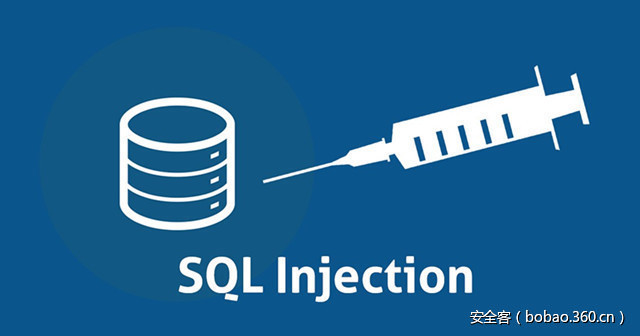

# 【技术分享】SQL注入防御与绕过的几种姿势


                                阅读量   
                                **545774**
                            
                        |
                        
                                                            评论
                                <b>
                                    <a target="_blank">1</a>
                                </b>
                                                                                    


**[](./img/86005/t01deedacd960b8194f.jpg)**

**前言**

本文章主要以后端PHP和MySQL数据库为例，参考了多篇文章后的集合性文章，欢迎大家提出个人见解，互促成长。

<br>

**一、 PHP几种防御姿势**

**1、关闭错误提示**

**说明：**

PHP配置文件php.ini中的display_errors=Off，这样就关闭了错误提示。

**2、魔术引号**

**说明：**

当php.ini里的magic_quotes_gpc=On时。提交的变量中所有的单引号（'）、双引号（"）、反斜线（）与 NUL（NULL 字符）会自动转为含有反斜线的转义字符。

魔术引号（Magic Quote）是一个自动将进入 PHP 脚本的数据进行转义的过程。（对所有的 GET、POST 和 COOKIE 数据自动运行转义）

PHP 5.4 之前 PHP 指令 magic_quotes_gpc 默认是 on。

本特性已自PHP 5.3.0 起废弃并将自 PHP 5.4.0 起移除，在PHP 5.4.O 起将始终返回 FALSE。

**参考：**

《magic_quotes_gpc相关说明》：

[http://www.cnblogs.com/qiantuwuliang/archive/2009/11/12/1601974.html](http://www.cnblogs.com/qiantuwuliang/archive/2009/11/12/1601974.html) 

**3、addslashes**

**说明：**

addslashes函数，它会在指定的预定义字符前添加反斜杠转义，这些预定义的字符是：单引号（'）、双引号（"）、反斜线（）与 NUL（NULL 字符）。

这个函数的作用和magic_quotes_gpc一样。所以一般用addslashes前会检查是否开了magic_quotes_gpc。

[](https://p0.ssl.qhimg.com/t01b896fd1349ff97b3.png)

magic_quotes_gpc与addslashes的区别用法：

**1）对于magic_quotes_gpc=on的情况**

我们可以不对输入和输出数据库的字符串数据作addslashes()和stripslashes()的操作,数据也会正常显示。

如果此时你对输入的数据作了addslashes()处理，那么在输出的时候就必须使用stripslashes()去掉多余的反斜杠。

**2）对于magic_quotes_gpc=off 的情况**

必须使用addslashes()对输入数据进行处理，但并不需要使用stripslashes()格式化输出，

因为addslashes()并未将反斜杠一起写入数据库，只是帮助mysql完成了sql语句的执行。

**参考：**

《addslashes函数说明》：

[https://secure.php.net/manual/zh/function.addslashes.php](https://secure.php.net/manual/zh/function.addslashes.php) 

《对于magic_quotes_gpc的一点认识》：

[http://www.phpfans.net/bbs/viewthread.php?tid=6860&amp;page=1&amp;extra=page=1](http://www.phpfans.net/bbs/viewthread.php?tid=6860&amp;page=1&amp;extra=page=1) 

**4、mysql_real_escape_string**

说明：

mysql_real_escape_string()函数转义 SQL 语句中使用的字符串中的特殊字符。

下列字符受影响：


```
x00
n
r

'
"
x1a
```

如果成功，则该函数返回被转义的字符串。如果失败，则返回 false。

本扩展自 PHP5.5.0 起已废弃，并在自 PHP 7.0.0 开始被移除。

因为完全性问题，建议使用拥有Prepared Statement机制的PDO和MYSQLi来代替mysql_query，使用的是mysqli_real_escape_string

**参考：**

《 PHP防SQL注入不要再用addslashes和mysql_real_escape_string了》：[http://blog.csdn.net/hornedreaper1988/article/details/43520257](http://blog.csdn.net/hornedreaper1988/article/details/43520257) 

《PDO防注入原理分析以及使用PDO的注意事项》：

[http://zhangxugg-163-com.iteye.com/blog/1835721](http://zhangxugg-163-com.iteye.com/blog/1835721) 

**5、htmlspecialchars()**

**说明：**

htmlspecialchars()函数把预定义的字符转换为 HTML实体。

预定义的字符是：


```
&amp; （和号）成为 &amp;amp;
" （双引号）成为 &amp;quot;
' （单引号）成为 '
&lt; （小于）成为 &amp;lt;
&gt; （大于）成为 &amp;gt;
```

**6、用正则匹配替换来过滤指定的字符**


```
preg_match
preg_match_all()
preg_replace
```

参考：

《preg_match说明》：

[http://php.net/manual/zh/function.preg-match.php](http://php.net/manual/zh/function.preg-match.php) 

《preg_replace说明》：

[https://secure.php.net/manual/zh/function.preg-replace.php](https://secure.php.net/manual/zh/function.preg-replace.php) 

**7、转换数据类型**

**说明：**

根据「检查数据类型」的原则，查询之前要将输入数据转换为相应类型，如uid都应该经过intval函数格式为int型。

**8、使用预编译语句**

**说明：**

绑定变量使用预编译语句是预防SQL注入的最佳方式，因为使用预编译的SQL语句语义不会发生改变，在SQL语句中，变量用问号?表示，攻击者无法改变SQL语句的结构，从根本上杜绝了SQL注入攻击的发生。

**代码示例：**

[](https://p4.ssl.qhimg.com/t017c3e178b42dbea96.png)

**参考：**

《Web安全之SQL注入攻击技巧与防范》：

[http://www.plhwin.com/2014/06/13/web-security-sql/](http://www.plhwin.com/2014/06/13/web-security-sql/) 

<br>

**二、 几种绕过姿势**

下面列举几个防御与绕过的例子：

**例子1：addslashes**

**防御：**

[](https://p2.ssl.qhimg.com/t01caf36fac95a91e52.png)

这里用了addslashes转义。

**绕过：**

1）将字符串转为16进制编码数据或使用char函数（十进制）进行转化（因为数据库会自动把16进制转化）

2）用注释符去掉输入密码部分如“– /* #”

**payload:**

```
http://localhost/injection/user.php?username=admin-- hack
```

(因为有的SQL要求–后要有空格，所以此处加上了hack)

```
http://localhost/injection/user.php?username=admin/*
```

（escape不转义/*）

```
http://localhost/injection/user.php?username=admin%23
```

（这里的%23即为#，注释掉后面的密码部分。注意IE浏览器会将#转换为空）

```
http://localhost/injection/user.php?username=0x61646d696e23
```

（admin# –&gt;0x61646d696e23）

```
http://localhost/injection/user.php?username=CHAR(97,100, 109, 105, 110, 35)
```

（admin# –&gt;CHAR(97, 100, 109, 105, 110, 35)）

**关于编码原理：**

因为一般前端JavaScript都会escape()、encodeURL或encodeURIComponent编码再传输给服务器，主要为encodeURL，如下，所以可以利用这点。

**JavaScript代码如：**

[](https://p2.ssl.qhimg.com/t010364b315a95e385d.png)

**拦截请求：**

[](https://p1.ssl.qhimg.com/t011aefbeed43845420.png)

**1)escape( )**

对ASCII字母、数字、标点符号"@* _ + – . /"不进行编码。在u0000到u00ff之间的符号被转成%xx的形式，其余符号被转成%uxxxx的形式。（注意escape()不对"+"编码，而平时表单中的空格会变成+）

**2) encodeURL**

对" ;  / ? : @ &amp; = + $ , # ' "不进行编码。编码后，它输出符号的utf-8形式，并且在每个字节前加上%。

**3) encodeURIComponent**

用于对URL的组成部分进行个别编码，而不用于对整个URL进行编码。

常用编码：

```
@ * _ + - ./ ;   ? : @ &amp; = + $ , # ' 空格
```

转码工具可用：

[http://evilcos.me/lab/xssor/](http://evilcos.me/lab/xssor/) 

参考：

《URL编码》：

[http://www.ruanyifeng.com/blog/2010/02/url_encoding.html](http://www.ruanyifeng.com/blog/2010/02/url_encoding.html) 

**例子2：匹配过滤**

**防御：**

[](https://p3.ssl.qhimg.com/t0188a5e4e98f248eb3.png)

**绕过：**

关键词and,or常被用做简单测试网站是否容易进行注入攻击。这里给出简单的绕过使用&amp;&amp;,||分别替换and,or。

过滤注入： 1 or 1 = 1    1 and 1 = 1

绕过注入： 1 || 1 = 1    1 &amp;&amp; 1 = 1

关于preg_match过滤可以看参考文章，文章里讲得很详细了。

**参考：**

《高级SQL注入：混淆和绕过》：

[http://www.cnblogs.com/croot/p/3450262.html](http://www.cnblogs.com/croot/p/3450262.html) 

**例子3：strstr**

**防御：**

[](https://p3.ssl.qhimg.com/t0115db48bf1e8ba0fb.png)

strstr ()查找字符串的首次出现，该函数区分大小写。如果想要不区分大小写，使用stristr()。(注意后面这个函数多了个i)

**绕过：**

strstr()函数是对大小写敏感的，所以我们可以通过大小写变种来绕过

**payload:**

```
http://localhost/injection/user.php?id=1uNion select null,null,null
```

**例子4：空格过滤**

**防御：**

[](https://p0.ssl.qhimg.com/t010b36af6b634ed67e.png)

**绕过：**

1)使用内联注释。

2)使用换行符代替空格。注意服务器若为Windows则换行符为%0A%0D，Linux则为%0A。

**payload:**


```
http://localhost/injection/user.php?id=1/**/and/**/1=1
http://localhost/injection/user.php?id=1%0A%0Dand%0A%0D1=1
```

**例子5：空字节**

通常的输入过滤器都是在应用程序之外的代码实现的。比如入侵检测系统（IDS），这些系统一般是由原生编程语言开发而成，比如C++，为什么空字节能起作用呢，就是因为在原生变成语言中，根据字符串起始位置到第一个出现空字节的位置来确定字符串长度。所以说空字节就有效的终止了字符串。

**绕过：**

只需要在过滤器阻止的字符串前面提供一个采用URL编码的空字节即可。

**payload:**

[](https://p1.ssl.qhimg.com/t01e318a03c3cc9eb3b.png)

**例子6：构造故意过滤**

**防御：**

[](https://p4.ssl.qhimg.com/t01c531438cd4a16e0a.png)

**绕过：**

文件的63行开始可以看到，此处将传入的%27和%2527都进行删除处理，也就是还没传入数据库前就已经被该死的程序吃了，但是在67行看到他还吃了*，这样我们就有办法了，我们构造%*27，这样程序吃掉星号*后，%27就会被传入。

**payload:**

```
http://localhost/injection/user.php?id%3D1%*27%*20and%*20%*271%*27%3D%*271
```

（id=1' and '1'='1–&gt;id%3D1%*27%*20and%*20%*271%*27%3D%*271）

**参考：**

《phpcms_v9.6.0_sql注入与exp》：

[https://zhuanlan.zhihu.com/p/26263513](https://zhuanlan.zhihu.com/p/26263513) 
