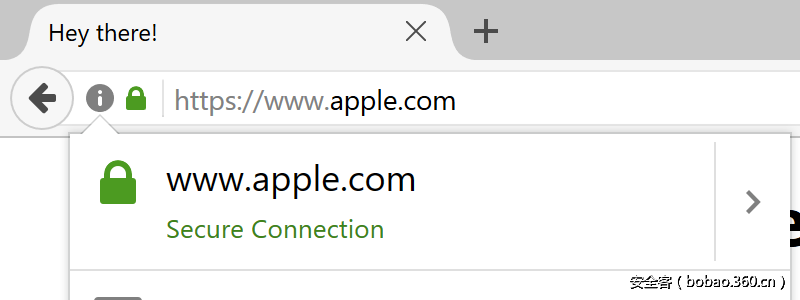

# 【技术分享】任意伪造大站域名（以Apple官网为例）

                                阅读量   
                                **170128**
                            
                        |
                        
                                                                                                                                    
                                                                                            

##### 译文声明

本文是翻译文章，文章原作者，文章来源：xudongz.com
                                 原文地址：[https://www.xudongz.com/blog/2017/idn-phishing/](https://www.xudongz.com/blog/2017/idn-phishing/)

译文仅供参考，具体内容表达以及含义原文为准

****

翻译：[陈匡kk](http://bobao.360.cn/member/contribute?uid=2818953166)

预估稿费：60RMB

投稿方式：发送邮件至linwei#360.cn，或登陆网页版在线投稿

**你相信这是一个钓鱼网站的域名吗？**

Punycode可以让域名由外文组成。Punycode使用ASCII字符集，可以把外文域名转换成有意义的字符。例如，域名「[xn--s7y.co](http://xn--s7y.co)」，会被转换成「[短.co](http://%E7%9F%AD.co)」。

在安全角度看，由於Unicode字符与ASCII字符难以区分，所以注册Unicode域名「xn--pple-43d.com」，会被转换成「apple.com」。乍看下域名没大分别，可是「apple.com」的a用编码Cyrillic (U+0430)，而不是编码ASCII (U+0041)。这就是传统的IDN欺骗。

幸运的是，现在的浏览器有防御机制限制IDN欺骗。像火狐和Chrome浏览器，如果域名包含多个不同语言的外文编码，就会把域名的Unicode编码以正则表达式显示。例如，「apple.com」会被显示为「xn--pple-43d.com」，这就避免与真正的苹果官网混淆。

火狐和Chrome的IDN欺骗防御机制是可以被绕过的，如整个钓鱼网站域名都是由一种语言的外文编码组成，例如[**「apple.com」**](http://apple.com)，是由Cyrillic编码[**「xn--80ak6aa92e.com」**](http://xn--80ak6aa92e.com)所组成。经常发生IDN欺骗，是因为在火狐和Chrome上，所有英文都是采用同一字体，因此在视觉上难以区分域名是由哪种编码组成。在这情况下，用户只能靠SSL证书来识别网站的真伪性。

2017年1月20日，这漏洞已经提交给火狐和Chrome，而Chrome 59已经把这漏洞修复。Chrome团队决定把Chrome 58也纳入修复中，预计在4有25日就能完成修复。而火狐则表示这漏洞未能解决。在火狐漏洞平台中，这漏洞状态由「修复中」转为「不会修复」，并把危险级别标为「低危」。

火狐用户想修复这漏洞，可以前往about:config并设置network.IDN_show_punycode为true，以正则表达式来显示IDN域名，从而分辨域名的真伪性。

**各浏览器测试截图**

**Chrome**

****

**Firefox**

**Firefox SSL**

**总结**

当用户从网站输入个人资料，必须注意域名的真伪性。同时，希望火狐能够考虑修复这个漏洞。
