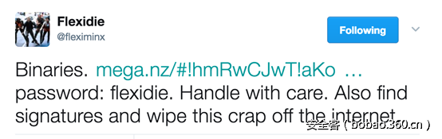

# 【技术分享】全球知名移动间谍软件FlexiSpy的分析(part1)


                                阅读量   
                                **123591**
                            
                        |
                        
                                                                                                                                    
                                                                                            


##### 译文声明

本文是翻译文章，文章原作者，文章来源：cybermerchantsofdeath.com
                                <br>原文地址：[http://www.cybermerchantsofdeath.com/blog/2017/04/23/FlexiSpy.html](http://www.cybermerchantsofdeath.com/blog/2017/04/23/FlexiSpy.html)

译文仅供参考，具体内容表达以及含义原文为准

[](./img/85954/t0185c18e9393eac3c1.png)

****

翻译：[myswsun](http://bobao.360.cn/member/contribute?uid=2775084127)

预估稿费：100RMB

投稿方式：发送邮件至linwei#360.cn，或登陆网页版在线投稿

传送门：[全球知名移动间谍软件FlexiSpy的分析(part2)](http://bobao.360.cn/learning/detail/3776.html)


**0x00 前言<br>**


2017/04/22，FlexiDie释放了移动端间谍软件FlexiSpy的源代码和二进制文件。身为逆向工程师的我做了如下分析。IOC节是为其他逆向工程师和反病毒厂商准备的。概述是为提供给记者。我将在一两天内公布详细技术细节。

[](./img/85954/t01448f8c27d0475260.png)

[](./img/85954/t01c0445eccfc08368b.png)


**0x01 IOCs**


下面URL和String节内容提供给AV公司。这可以用于识别目的。当我有时间我将输出一些yara规则。


**0x02 URLs**

[](http://58.137.119.229/RainbowCore/)

[http://58.137.119.229/RainbowCore/](http://58.137.119.229/RainbowCore/)（在com.vvt.phoenix.port.test.CSMTest中找到）

[http://trkps.com/m.php?lat=%f&amp;long=%f&amp;t=%s&amp;i=%s&amp;z=5](http://trkps.com/m.php?lat=%25f&amp;long=%25f&amp;t=%25s&amp;i=%25s&amp;z=5)（在source//location_capture/tests/location_capture_tests/src/com/vvt/locationcapture/tests/Location_capture_testsActivity.java）

另一个IP地址在代码注释中找到//private String mUrl = [http://202.176.88.55:8880/](http://202.176.88.55:8880/)


**0x03 Strings**


下面的字符串在泄漏的源代码中找到，文件名：

/source/phoenix/test/phoenix_demo/src/demo/vvt/phoenix/PhoenixDemoActivity.java：


```
"/sdcard/pdemo/";
"http://58.137.119.229/RainbowCore/";
"http://192.168.2.116/RainbowCore/";
"gateway/unstructured";
/sdcard/data/data/com.vvt.im"
```


**<br>**

**0x04 概述**


本节是为记者和那些想要写间谍软件的技术文章的人准备的。这个分析通过简单的逆向两个安卓应用和检查泄漏的源代码完成。源代码的版本是1.00.1，安卓应用的版本是2.24.3和2.25.1。版本是重要的，因为1.00.1只能监控一个及时通信应用，而2.24.3版本监控一打流行的及时通信客户端。请注意本文只有几个小时的分析，代码库中还有更多的功能。

应用安装在移动设备上。如果设备root过，将发生一系列操作来确保间谍软件驻留在受害者设备中。本文编写时，我还没有发现间谍软件如何root一个未root的设备。

恶意软件支持各种命令，包含但不限于：音频记录，视频记录，通话记录（来电和去电），擦除设备数据，SMS拦截，SMS消息关键字监控，监控摄像头照相，通讯录，日历信息，位置跟踪，gmail应用消息和一组设计来监控特殊的及时通信应用的插件。

所有的能力是可能的，因为移动应用程序请求了大量的权限。但是我的理解是除非root了，否则监控其他应用：whatsapp，snapchat等不能实现。

[](https://p1.ssl.qhimg.com/t015939351f3f3d2be9.png)


**0x05 应用监控**


APK有一个模块系统，允许提取大量应用的敏感信息。正常情况下，这些应用的应用数据是受保护的，但是如果手机root了，间谍软件能够抓取任何应用的敏感信息。

[](https://p5.ssl.qhimg.com/t01ee0862a2512ba3d3.png)


**0x06 Whatsapp**


能够抓取设备上所有的私有Whatsapp的文件。是否包含私有消息和附件需要测试。

[](https://p1.ssl.qhimg.com/t012b94fced99adde28.png)


**0x07 Snapchat**


参考代码，能抓取到snapchat文件。手机需要root


```
public static String a(String arg10, String arg11) {
        String v0;
        String v1 = null;
        String[] v3 = new String[]{String.format("%s/%s/%s/%s", "/data/data", "com.snapchat.android", arg10, arg11), String.format("%s/%s/%s/%s", "/dbdata/databases", "com.snapchat.android", arg10, arg11)};
        int v4 = v3.length;
        int v2 = 0;
        while(true) {
            if(v2 &lt; v4) {
                v0 = v3[v2];
                if(ShellUtil.b(v0)) {
                }
                else {
                    ++v2;
                    continue;
                }
            }
            else {
                return v1;
            }
 
            return v0;
        }
 
        return v1;
```


**0x08 接下来**


我将完成逆向APK并提供深入技术分析。

<br>


传送门：[全球知名移动间谍软件FlexiSpy的分析(part2)](http://bobao.360.cn/learning/detail/3776.html)


