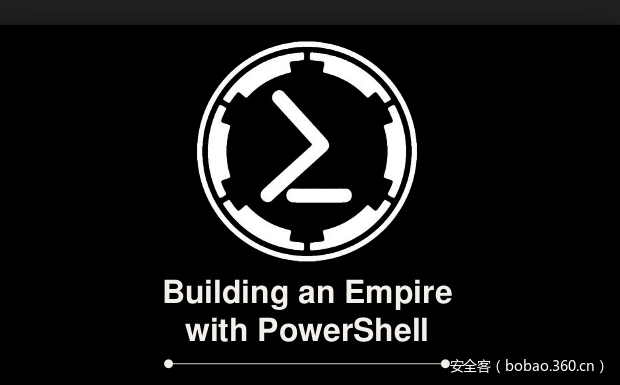

# 【技术分享】利用PowerShell Empire生成网络钓鱼文件

                                阅读量   
                                **138087**
                            
                        |
                        
                                                                                                                                    
                                                                                            

##### 译文声明

本文是翻译文章，文章原作者，文章来源：enigma0x3.net
                                 原文地址：[https://enigma0x3.net/2016/03/15/phishing-with-empire/](https://enigma0x3.net/2016/03/15/phishing-with-empire/)

译文仅供参考，具体内容表达以及含义原文为准

****

****

翻译：[pwn_361](http://bobao.360.cn/member/contribute?uid=2798962642)

预估稿费：180RMB

投稿方式：发送邮件至[linwei#360.cn](mailto:linwei@360.cn)，或登陆[网页版](http://bobao.360.cn/contribute/index)在线投稿

** **

**前言**

目前，大部分网络攻击的第一步还是对目标进行网络钓鱼攻击。一旦网络钓鱼攻击成功，那么你就得到了一个进入目标网络的立足点，然后，你就可以畅快的继续玩耍了。一个好用的钓鱼邮件往往能起到很好的效果，下面我使用PowerShell Empire为大家介绍几种生成钓鱼文件的方法。Empire的载荷包含了多种输出格式，这些输出格式包括宏、HTML应用程序(HTAs)、OLE对象的批处理文件等等。在本次实践中，我将结合实例，对其中的三个受欢迎的输出格式进行详细介绍和示范。

 

**包含恶意宏的Office文件**

为了产生一个Office宏格式的Empire钓鱼文件，需要使用Empire的“macro”载荷，同时，当成功钓鱼后，为了能收到目标发来的信息，你肯定还得设置一个监听，下图为开启监听：

如上图所示，监听已经开启，需要注意的是，上图中监听的名称是“test”，你可以对该名称重命名，当需要开启多个监听时，多个监听必须有不同的名称，并使用不同的端口。

然后，使用“macro”载荷，如下图：

如上图，在这里需要设置一个参数，需要将该载荷对应到“test”监听上。然后执行，会生成一个宏，并存储在“/tmp/macro”文件中，如下图：

从上图的VBA代码中可以看出，该宏实际上仅仅执行了一个Empire PowerShell载荷，该载荷使用PowerShell的编码命令进行了转换。

然后我们需要将上面的宏添加到一个Office文档中，我们只需要新建一个Word文件或Excel文件，并点击“视图”标签，选择“宏”，给这个宏起一个名称，然后在“宏的位置”选项中，选择当前文件。

然后点击“创建”，会跳出VB编辑界面，将里面已有的代码删除，然后，将刚才用Empire生成的宏复制粘贴进去，并保存为“Word 97-2003”或“Word Macro-Enabled Document”文件。

然后，你还需要做的是编辑一下Word文件的内容，最好用一些社会工程学的策略，增加目标启用宏的可能性。当目标收到该恶意文件，并打开它时，会呈现出如下的界面：

如果目标点击了“启用宏”，Empire载荷就会被执行，并连接到我们的Empire控制台。如下图：

为了在目标环境中得到一个立足点，Office宏是一个很好的办法。

 

**HTML应用程序(HTA)**

HTML应用程序实际上是一个包含HTML的文件，不过它支持VBScript或JavaScript脚本。通过将恶意代码嵌入到HTA文件中，并托管在一个WEB网站上，当目标用浏览器打开HTA链接时，在目标系统中就可以成功的执行HTA包含的代码。

为了在Empire中生成HTA，我们需要使用Empire的“HTA”载荷，当然，你要想让它成功上线，你必须时刻保持正常的监听状态，下图为开启监听，并生成hta：

如上图，Empire会将它输出到一个文件中，如下图所示：

实际上该HTA的目的还是想方设法的执行PowerShell。然后，为了使用HTA文件，你需要将它托管在一个你的目标可以访问到的地方。为了让大家能更好的理解，我将该文件托管在本地，并开启本地apache服务器，网站根目录是“/var/www/html”，将“test.hta”复制到“/var/www/html”文件夹。 如下图：

然后，将HTA的链接以网络钓鱼的方式发送给将要攻击的目标，需要注意的是，你最好使用一些社会工程学策略，让这个链接看起来更可信。

当目标访问该链接时，他们会看到类似于下图的一个对话框：

如果目标点击了“运行”，那么HTML应用程序就会被执行，然后，它会询问受害人是否允许应用程序，当点击“允许”后，如下图：

HTA就会执行内嵌的Empire PowerShell载荷，结果如下图：

看到了吧，目标已经成功上线了。

 

**OLE对象**

除了上面的方法，在微软Office中，我们还可以利用OLE对象，可以向Office中内嵌一个“.bat”文件。下面，我们使用Empire的“launcher_bat”载荷生成一个“.bat”文件，如下图：

如下图，已经生成了一个自删除的批处理文件，包含了一个Empire客户端载荷代码，实际上它的核心还是一段编码的PowerShell代码。

然后，我们需要将该文件插入到一个Office文件中，如下图，在“插入”标签中，点击“对象”按钮，如下图：

然后选择“由文件创建”(Create from File)标签，点击“浏览”(Browse)，并选择你刚才创建的批处理文件，然后点击“显示为图标”(Display as Icon)复选框，如下图：

同时，你可以点击“更改图标”(Change Icon)来添加一个新图标。添加微软Excel、Word或PowerPoint图标是一个不错的选择。并且，在“更改图标”的界面里，你可以更改文件的名称，和任何你想要的扩展名。下图是更改后的结果：

点击“确定”后，该对象就会被插入到该Word文档的内容中，和插入一个图片相比，看起来差不多。如下图Word内容所示：

然后，你需要做的是将这个文件发送给攻击目标，一旦攻击目标双击了这个图标，并运行了内嵌的批处理文件，那你就成功了，如下图，成功返回SHELL：

下图是执行“PS”命令后的部分结果：

以上就是利用PowerShell Empire生成三种钓鱼文件的方法，通常都会以钓鱼邮件附件或链接的形式发送给攻击目标，其次PowerShell Empire还有其它几种输出格式，有兴趣的可以逐个试一试。

在以上三种方法中，目前，包含恶意宏的Office文件是现在最常见的方法。当然，在基本的免杀没问题的情况下，为了使钓鱼攻击最终能成功，需要非常重视的一点是：精心设计的社会工程学策略。

 

**参考链接**

[http://www.powershellempire.com/?page_id=104](http://www.powershellempire.com/?page_id=104) 

[http://www.darkoperator.com/blog/2016/4/2/meterpreter-new-windows-powershell-extension](http://www.darkoperator.com/blog/2016/4/2/meterpreter-new-windows-powershell-extension) 

[https://attackerkb.com/Powershell/Powershell_Empire](https://attackerkb.com/Powershell/Powershell_Empire) 

[http://www.powershellempire.com/](http://www.powershellempire.com/) 

[http://www.sixdub.net/?p=627](http://www.sixdub.net/?p=627) 

[http://www.freebuf.com/articles/web/76892.html](http://www.freebuf.com/articles/web/76892.html) 
