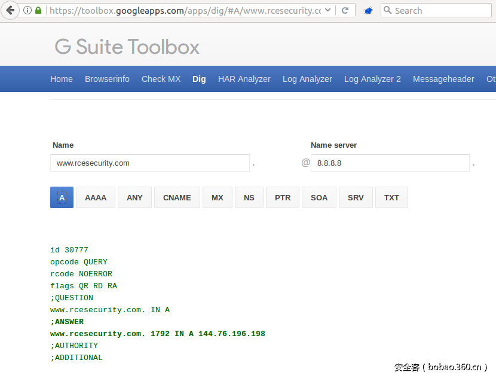
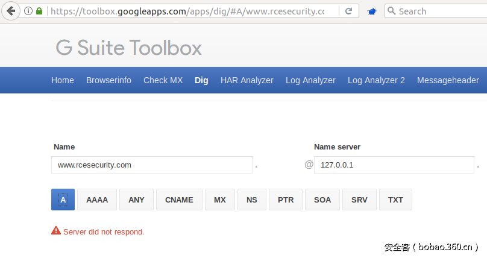
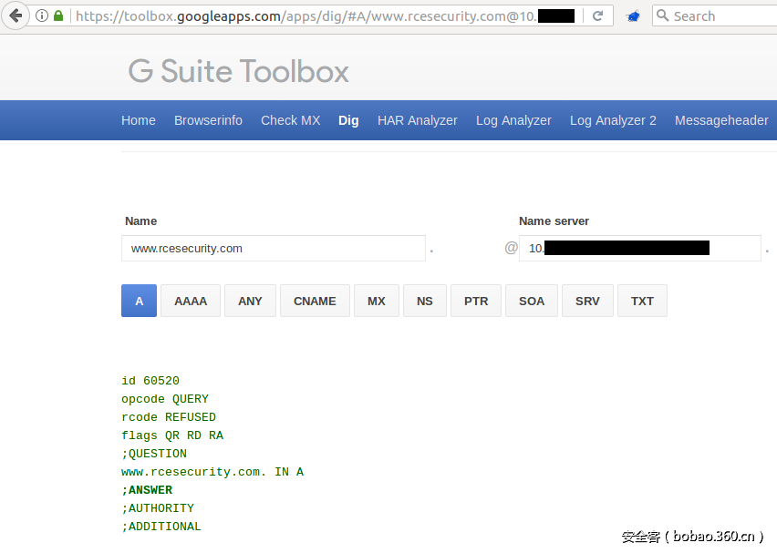
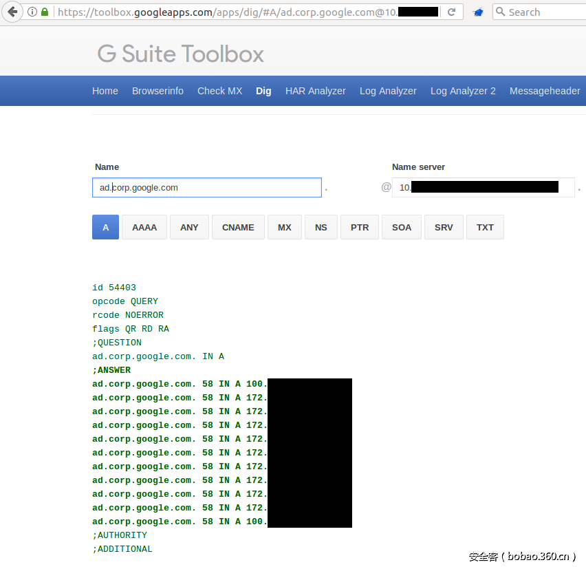
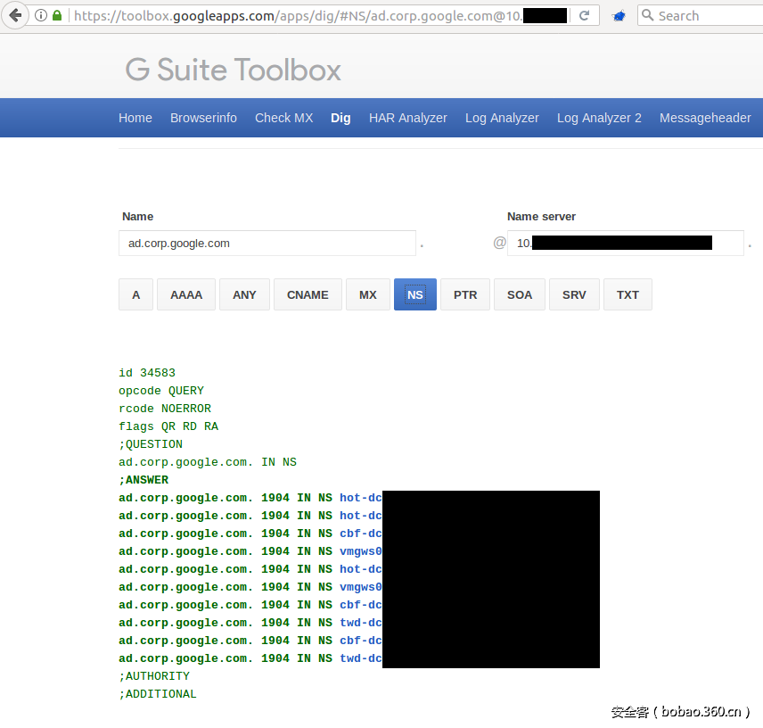
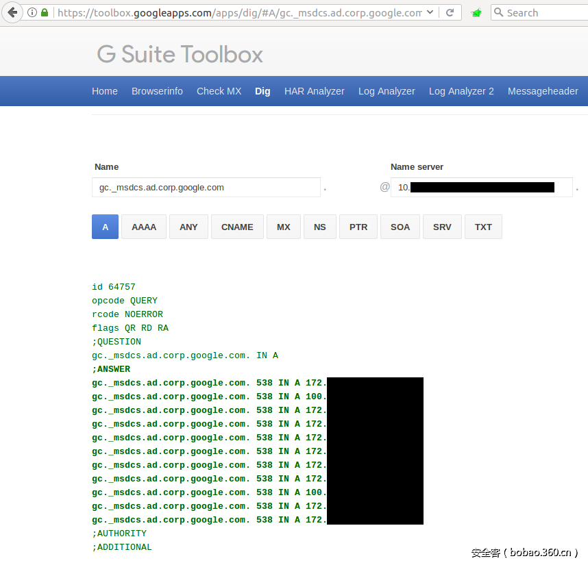
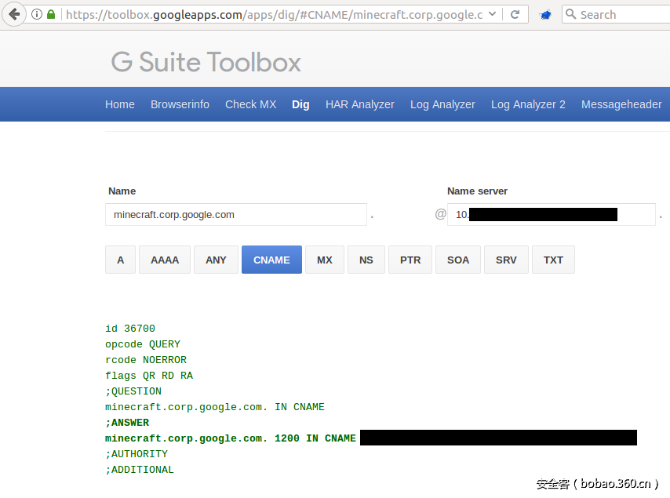

# 【技术分享】利用ssrf漏洞获取google内部的dns信息


                                阅读量   
                                **156708**
                            
                        |
                        
                                                                                                                                    
                                                                                            


##### 译文声明

本文是翻译文章，文章原作者，文章来源：rcesecurity.com
                                <br>原文地址：[https://www.rcesecurity.com/2017/03/ok-google-give-me-all-your-internal-dns-information/](https://www.rcesecurity.com/2017/03/ok-google-give-me-all-your-internal-dns-information/)

译文仅供参考，具体内容表达以及含义原文为准


[](./img/85615/t01fe5a52a590e64c30.jpg)

翻译：[派大星](http://bobao.360.cn/member/contribute?uid=1009682630)

预估稿费：100RMB

投稿方式：发送邮件至[linwei#360.cn](mailto:linwei@360.cn)，或登陆[网页版](http://bobao.360.cn/contribute/index)在线投稿


**前言**

一月下旬，我发现和向谷歌VRP部门报告了[toolbox.googleapps.com](https://toolbox.googleapps.com/)的一个服务器端请求伪造漏洞（ssrf）。可用于发现和查询Google内部 DNS服务器，以提取各种公司信息，例如公司内部使用的内部IP地址，以及通过A记录和NS记录暴露的各种主机，如谷歌的Active Directory结构和一个有趣的Minecraft服务器。接下来是这个漏洞的简要说明。

你可能已经知道，G-Suite工具箱可以用来排除各种故障。在这所有有用的工具中，有一款叫做“Dig”的工具，在Linux上 ，可用于查询给定域名的DNS记录，比如A-或MX记录。Google为该工具实现了一个漂亮的web界面，以便直观的查找DNS信息。它看起来像一个从谷歌的角度来查询DNS的有用的工具。

[](./img/85615/t013b5d807cd3e67230.png)

“Name server”字段可能会引起每个bug猎人的注意。当我们试图请求127.0.0.1关于我域名DNS记录时，该程序的响应为“Server did not respond message”。

[](./img/85615/t01d820e317dee943f3.png)

这看起来像是该工具试图连接到127.0.0.1:53去取回我域名的DNS信息。这看起来很像是服务器端请求伪造漏洞，不是吗？

<br>

**Ok Google，给我一个响应的内部DNS服务器！**

多亏了BurpSuite的intrude模块，可以通过检测相应的HTTP　POST“nameserver”参数快速的暴力破解响应的IP地址。

```
POST /apps/dig/lookup HTTP/1.1
Host: toolbox.googleapps.com
User-Agent: Mozilla/5.0 (X11; Ubuntu; Linux x86_64; rv:51.0) Gecko/20100101 Firefox/51.0
Accept: application/json, text/javascript, */*; q=0.01
Accept-Language: en-US,en;q=0.5
Content-Type: application/x-www-form-urlencoded; charset=UTF-8
X-Requested-With: XMLHttpRequest
Referer: https://toolbox.googleapps.com/apps/dig/
Content-Length: 107
Cookie: csrftoken=NE5nKGrbPNRoEwm0mahDzop9iJfsxU4H; _ga=GA1.2.2102640869.1486420030; _gat=1
Connection: close
 
csrfmiddlewaretoken=NE5nKGrbPNRoEwm0mahDzop9iJfsxU4H&amp;domain=www.rcesecurity.com&amp;nameserver=§127.0.0.1§&amp;typ=a
```

几分钟之后我就发现了一个有希望的内网IP，它响应了我的请求，但是只是关于我域名的一个空的DNS A记录。

[](./img/85615/t0180b609a40ee16351.png)

由于我对自己的域名非常了解，因此更有趣的是，是否可以从Google提取一些不可公开的内部信息。

<br>

**Ok Google，给我你的内部域名！**

Et voila，在[这里](https://news.ycombinator.com/from?site=corp.google.com)发现了一些东西。 看来Google正在使用“corp.google.com”作为其公司的域名。至少有一些工具，包括一个名为“MoMa  –  Inside Google”的工具托管在该域名下。现在，你可以使用完全相同的POST请求来发现“corp.google.com”的子域名。或者也可以用用google搜索一下，你将会发现一个“ad.corp.google.com”的有趣的A记录。

Ok Google，只要提供「ad.corp.google.com」的所有A纪录即可！

[](./img/85615/t016fb66ab45f0df524.png)

与公共DNS记录上的内容比较一下，看起来会更有趣：

```
dig A ad.corp.google.com @8.8.8.8
 
; &lt;&lt;&gt;&gt; DiG 9.8.3-P1 &lt;&lt;&gt;&gt; A ad.corp.google.com @8.8.8.8
;; global options: +cmd
;; Got answer:
;; -&gt;&gt;HEADER&lt;&lt;- opcode: QUERY, status: NXDOMAIN, id: 5981
;; flags: qr rd ra; QUERY: 1, ANSWER: 0, AUTHORITY: 1, ADDITIONAL: 0
 
;; QUESTION SECTION:
;ad.corp.google.com.INA
 
;; AUTHORITY SECTION:
corp.google.com.59INSOAns3.google.com. dns-admin.google.com. 147615698 900 900 1800 60
 
;; Query time: 28 msec
;; SERVER: 8.8.8.8#53(8.8.8.8)
;; WHEN: Wed Feb 15 23:56:05 2017
;; MSG SIZE  rcvd: 86
```

现在我们已经接触到了内网！

<br>

**Ok Google，给我与该域名相关联的NS记录（及其内部IP）！**

[](./img/85615/t019f52848839d6210c.png)

<br>

**Ok Google，让我们更具体一点。 给我有关“gc._msdcs”的信息！**

[](./img/85615/t01cbdaf7878145295a.png)

<br>

**Ok Google，还有什么你想让我看到吗？**

[](./img/85615/t01545c88fc1e475ce4.png)

通过其VRP部门向Google报告此漏洞后，他们迅速修复了此漏洞。 感谢Google的赏金！
