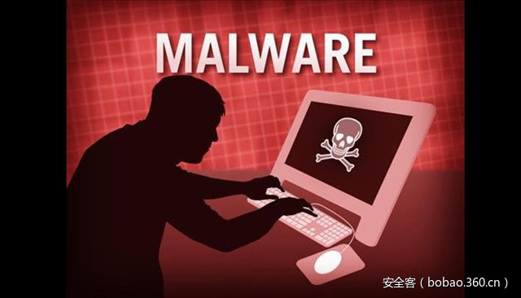

# 【技术分享】勒索软件最新趋势——使用NSIS安装程序逃避检测


                                阅读量   
                                **116931**
                            
                        |
                        
                                                                                                                                    
                                                                                            


##### 译文声明

本文是翻译文章，文章原作者，文章来源：安全客
                                <br>原文地址：[https://securingtomorrow.mcafee.com/mcafee-labs/ransomware-families-use-nsis-installers-to-avoid-detection-analysis/](https://securingtomorrow.mcafee.com/mcafee-labs/ransomware-families-use-nsis-installers-to-avoid-detection-analysis/)

译文仅供参考，具体内容表达以及含义原文为准

**[](./img/85835/t01578eebd34ad10325.jpg)**

****

翻译：[华为未然实验室](http://bobao.360.cn/member/contribute?uid=2794169747)

预估稿费：200RMB

投稿方式：发送邮件至linwei#360.cn，或登陆网页版在线投稿

**<br>**

**前言**

恶意软件家族在不断寻求隐藏代码、阻止复制及逃避检测的新方法。勒索软件递送的最新趋势是使用带加密有效载荷的Nullsoft脚本安装系统(NSIS)。很多知名勒索软件均采用该技术，比如Cerber、Locky、Teerac、Crysis、CryptoWall及CTB-Locker。

我们很少看到多个家族一直使用相同的打包方法。在本文所述情况中，有效载荷依赖安装程序来执行，解密的恶意软件有效载荷不会接触磁盘。使用NSIS打包方法使我们较难采用批量采集技术采集和发现恶意软件。传入的样本可能只包含负责解压缩的DLL，不包含加密的有效载荷或NSIS安装程序。在本文中，我们将看看该种递送机制如何运作，为何使用这样的机制，及这种机制对试图研究恶意软件的研究人员提出的挑战。

<br>

**这种递送方法为何很流行？**

该攻击途径以垃圾邮件下载器的有效载荷为起始。不知情的用户打开包含恶意JavaScript或Word文档的电子邮件附件。恶意安装程序（检测为NSIS / ObfusRansom。*）在％TEMP％中下载、启动并释放一个DLL文件和一个加密数据文件。安装程序随后加载负责解密和执行加密有效载荷的DLL。解包器DLL从NSIS安装程序的导入地址表中窃取五个API。然后，DLL将加密文件读入内存，转到文件中的随机硬编码偏移量，并解密解压缩、写入内存及执行加密恶意软件有效载荷所需的其他API。这种依赖性使得静态分析、仿真及复制变得更加困难，并产生了一种解密勒索软件不接触磁盘的递送系统。在分析这些打包器时，我们未发现提交到任何知名样品处理网站（比如VirusTotal）的解密的恶意软件可执行的样本。

<br>

**打包器执行**

[](https://p5.ssl.qhimg.com/t01b12308d436e5e06b.jpg)

以上流程图总结了该打包器的基本执行流程，发现各种水平的混淆均采用该流程，但功能上等同。我们选择了一个混淆程度较低的样本（MD5: F9AE740F62811D2FB638952A71EF6F72），以方便技术解释。

大多数版本还尝试一定的代码流混淆来延迟静态分析。我们观察到的两种常见的代码流混淆方法是结合可报警Sleep调用的QueueUserAPC：

[](https://p2.ssl.qhimg.com/t0115259ea8ba2fa5d3.jpg)

或结合除零的结构化异常处理：

[](https://p0.ssl.qhimg.com/t01a53a4daa38523f42.jpg)

这些方法均不是该递送方法所独有，在执行静态分析时也不是很难看到。一旦进入主函数，恶意软件首先进行反混淆三个乱码字符串。在某些情况下，在样本上运行“字符串”即可查看，如以下截图所示：

[](https://p5.ssl.qhimg.com/t01638b801fd06f9925.jpg)

大多数情况下，这些字符串包含“Kernel32”（ Microsoft API调用）和由安装程序释放的加密文件的名称。以下是正在解密的Kernel32的样本。所有这三个字符串都以类似的方式进行反混淆。

反混淆算法：

[](https://p0.ssl.qhimg.com/t01f6422b2177a5a6ca.jpg)

混淆字符串内存：

[](https://p0.ssl.qhimg.com/t0171eb1dd6b1f3b71b.jpg)

反混淆字符串内存：

[](https://p3.ssl.qhimg.com/t014bc1c761b9bb2568.jpg)

字符串被反混淆后，恶意软件接下来会创建一个指向安装程序内存空间的指针，并保存FirstThunk和OriginalFirstThunk的偏移量（“thunk”是一个自动生成的代码段，用于协助调用另一个子例程）。本质上，OriginalFirstThunk是导入名称表，FirstThunk是导入地址表。

[](https://p4.ssl.qhimg.com/t01a1eb44954961999b.jpg)

解包器DLL然后遍历OriginalFirstThunk，查找直接从相应的FirstThunk条目窃取和保存其地址所需的五个API的名称。该循环使用一些基于字符串大小和字母位置的基本逻辑来准确获取其所需的API。

GetProcAddress：

[](https://p3.ssl.qhimg.com/t01a300e2609f17ad79.jpg)

GetModuleHandle：

[](https://p1.ssl.qhimg.com/t0118ab5d1d353860e8.jpg)

GetFileSize：

[](https://p1.ssl.qhimg.com/t0167be9cb84cc2c184.jpg)

GlobalAlloc：

[](https://p0.ssl.qhimg.com/t0162a793b1e7a866ee.jpg)

ReadFile：

[](https://p2.ssl.qhimg.com/t014e64d5310259f487.jpg)

这五个窃取的API用于将加密的文件读入内存，然后在其中解密其所需的第二层API。

打包器接下来准备有效载荷。当父NSIS安装程序运行时，其释放的其中一个文件是加密和压缩的文件。该文件是打包器正准备启动的恶意软件的主要有效载荷。正如我们提到的，我们的研究表明，该有效载荷可以是各种恶意软件（包括若干勒索软件变体）的有效载荷。

恶意软件首先使用CreateFile API打开有效载荷的文件句柄。有效载荷名称和扩展名是已经反混淆的字符串之一。

[](https://p4.ssl.qhimg.com/t01d98b921f1c95c85a.jpg)

ECX值（文件名）：

[](https://p3.ssl.qhimg.com/t017f9250364938332c.jpg)

恶意软件获取解密和读取文件所需的文件大小。然后使用文件大小为将要读入内存的文件新分配一块内存：

[](https://p4.ssl.qhimg.com/t016425efad2e9c1a85.jpg)

加密的文件现已存储在内存中，恶意软件开始通过解密API的名称来处理这个文件。我们研究的每个样本都具有API名称和硬编码在样本中的解密密钥的位置。我们还发现，这两项通常可以在文件的第一个0x1FFF字节中找到。API字符串的解密使用简单的算法在一个循环中完成。

[](https://p3.ssl.qhimg.com/t01412a236d8183ac0f.jpg)

加密API：

[](https://p5.ssl.qhimg.com/t015003e5a307ccda26.jpg)

该代码混淆程度可能极高（视样本而定）。我们反编译了该样本，并将此循环中使用的解密算法简化为了如下所示的相关行：


```
do{
api = *(api_base + counter);
key = ~*(counter + randomoffset);
*(api_base + counter) = api &amp; key | ~key &amp; ~api;
++counter;
}while ( counter &lt; 330 );
```

我们可以看到此处的“加密”是非常基础的。我们发现的一些样本具有稍微不同的解密算法，但都是对存储的密钥的非常基本的算术运算。该函数对密钥和加密值进行按位AND一次，然后再对这些值NOTed。然后对结果按位ORed。在我们的样本组中，被解密的字符串总是相同的，因此迭代次数保持恒定，为0x14A (330)。

解密的API：

[](https://p3.ssl.qhimg.com/t013ad31c70a7a6facd.jpg)

下一个主要任务是有效载荷本身的解密。下图显示了加密有效载荷的内存位置：

[](https://p3.ssl.qhimg.com/t01a6ad33f161e30c5b.jpg)

整个文件不经过解密流程（仅可执行文件本身经过）。恶意软件使用从GetFileSize收集的大小和硬编码值来确定要解密的字节数。

[](https://p3.ssl.qhimg.com/t0192b7a4a6ab431860.jpg)

我们样本中有效载荷的解密算法与API解密算法相同。

[](https://p0.ssl.qhimg.com/t01ddbc3ac7dd4cfedd.jpg)

基于循环结束时间，与API解密流程有一个小的明显不同之处。如上所示，ebx保存要解密的字节数，而现在充当计数器。

解密的有效载荷：

[](https://p3.ssl.qhimg.com/t01f76be533f56af999.jpg)

文件和API现已解密，随后恶意软件解压缩其有效载荷。恶意软件作者使用标准Windows API执行压缩，并在解密后通过调用RtlDecompressBuffer再次使用。在这个API中，推送到栈上的“2”表示使用的压缩类型。根据Microsoft文档，2代表LZ解压缩。

[](https://p1.ssl.qhimg.com/t01537b9812024d6332.jpg)

有效载荷在内存中完全解密和解压缩后，我们现在可以使用Windbg的“.writemem”函数转储功能完整的独立有效载荷。这让我们可以研究有效载荷并确定其是否是已知的勒索软件变体，但是，这些具体的有效载荷尚未被常见的恶意软件研究网站观察到。

现在需要进行设置，以在内存中执行此有效载荷。解密的有效载荷从不接触磁盘，有助于降低被检测到的可能性。第一步是调用处于挂起状态的CreateProcess。恶意软件在此进程中执行：

[](https://p3.ssl.qhimg.com/t01c76ec3a43f60b883.jpg)

CreateProcess API后，恶意软件使用标准的进程空白技术。在准备将其有效载荷写入新线程过程中使用了VirtualAlloc、GetThreadContext、ReadProcessMemory及NtUnmapViewofSection。WriteProcessMemory将未加密的有效载荷复制到新线程中。接下来一个Sleep和ResumeThread调用启动线程。线程启动后，恶意软件立即终止父线程。

[](https://p5.ssl.qhimg.com/t0147779775551e95cd.jpg)

<br>

**总结**

这些样本的核心功能非常简单，未展现任何新的行为，但递送方法提出了一个新的有意思的挑战。在带加密有效载荷的NSIS安装程序中递送勒索软件已被证明是递送各种恶意软件的独特而有效的方法。目前，已研究的所有样本都只包含勒索软件的变体，但我们可以猜测，其他家族的恶意软件也在使用这种技术。我们已经观察到了广泛的反仿真方法、强的代码混淆技术及硬编码值的差异。字段和API所用的加密通常非常弱，并不是逆向或检测的主要挑战。原因很可能是一个威胁实施者在分发多种形式的勒索软件，或者是多个威胁实施者在使用相同的组来分发其勒索软件。
