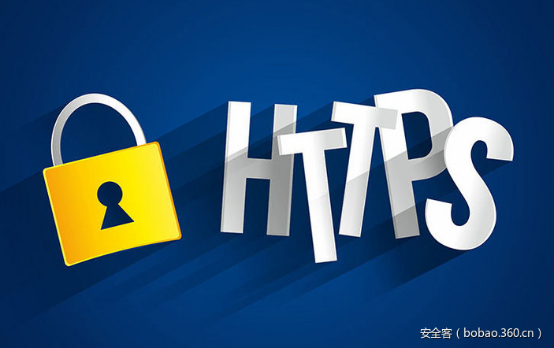

# 【技术分享】后HTTPS时代：网站身份认证比加密更重要

                                阅读量   
                                **93790**
                            
                        |
                        
                                                                                    

**前言**

HTTPS加密应用在过去两年间取得了惊人成果，全球互联网超50%的网站流量启用HTTPS加密。然而，100%的加密环境，就等于安全吗？借助缺乏真实身份认证的免费DV SSL证书，越来越多的恶意软件、钓鱼网站转向100%加密，从而逃避安全工具检测、欺骗用户信任，而浏览器UI标识混淆多变，使用户困惑。加密概念得到广泛普及的“后HTTPS时代”，网站身份认证比加密更重要！如果你正在与欺诈网站通信，加密又有什么意义呢？

 

**加密的恶意软件站点和钓鱼网站**

浏览器厂商极力推动HTTPS加密成为新常态；免费DV SSL证书以及证书颁发/安装自动化等产品工具，使得HTTPS加密更易于实施；SEO排名优先，鼓励更多网站加入HTTPS行列，这些都是HTTPS加密取得的积极进展。

然而，HTTPS加密应用的攀升，使得恶意软件得以隐藏在加密流量中，更难被发现和阻止，今年近一半的网络攻击，使用隐藏在加密流量中的恶意软件逃避检测；DV SSL证书正在成为欺诈者的“好搭档”，仿冒域名、身份匿名、免费、挂锁、没有UI警告，DV SSL证书给网络钓鱼网站塑造了“看起来很真实”的假象，让受害者更加难以辨别。

图一：使用免费DV SSL证书的钓鱼网站

 

**DV SSL证书的缺陷**

SSL证书设计之初被赋予两个重要使命，一方面是实现数据加密传输，保护数据安全，另一方面是进行服务器身份认证，确保网站身份真实可信。由于网站身份认证成本较高，最初的SSL证书应用推广进程缓慢。DV SSL证书简化了身份认证流程，仅验证域名即可颁发证书，大大降低了证书成本，受到市场广泛欢迎。

但是，经过简化的DV SSL证书仅起到数据传输加密的作用，完全失去了SSL证书原有的身份认证功能。存在功能缺陷的DV SSL证书，虽然推动了HTTPS加密的广泛应用，但也成为了黑客利用的工具。普及DV SSL证书不仅无法实现互联网安全可信，反而为网络攻击提供了隐藏之地，让互联网安全更加岌岌可危。

 

**浏览器UI标识的混淆多变**

大多数普通用户（非极客或非IT人士）看到HTTPS时，都给予强烈的信任，即使是仅为网站提供加密的DV SSL证书，也被认为与使用OV SSL证书或EV SSL证书的网站具有同等信任水平。为什么会出现这样的误解？

因为现在的**浏览器用户界面(UI)在证书展示方面存在很大问题**：

1、浏览器对DV SSL证书和OV SSL证书展示的UI相同，用户无法区别；

2、在Chrome未来的版本中，EV SSL证书的UI可能降级为和OV/DV SSL证书一样；

3、各浏览器UI的安全标识不统一；

4、个别浏览器经常更换UI，用户无法跟上步伐；

5、增加很多普通用户无法理解的UI警告（小问题、主要问题）；

6、大多数移动设备没有任何加密符号。

这些问题使得用户对于浏览器UI安全标识的含义感到非常困惑（图二至图四展示了令人困惑的浏览器UI案例）。

图二：各浏览器UI的安全标识

 

图三：各浏览器对HTTP/DV/OV/EV的展示方案

 

图四：各浏览器对HTTPS小错误和主要错误的展示方案

基于市场对HTTPS和安全挂锁的宣传，用户便认为所有带挂锁和HTTPS的网站都是安全的。然而，事实并非如此！当钓鱼网站paypal.com.summary-spport.com仅通过域名验证获取到合法的DV SSL证书后，Chrome直接给出了“安全HTTPS”的标识。 

图五：使用DV SSL证书的钓鱼网站，Chrome标记为“安全”

谷歌去年6月的新版UI方案，虽然是逐步淘汰HTTP的良好开始，但继续执行强化“安全/不安全”两种状态的UI、弱化身份认证信息甚至可能让EV SSL证书UI消失的展示方案，那么未来真实的PayPal登录页面和钓鱼页面将看起来是一样的（都显示“安全”），看不出有任何区别！

图六：EV绿色地址栏取消后，真假PayPal网站将看起来一样

 

**仅靠HTTPS已经不够，网站身份认证比加密更重要**

过去HTTPS被视为网站可信度的标志，获取有效的HTTPS证书对于典型的钓鱼网站来说太难，但现在HTTPS已经不再是识别钓鱼网站的有用信号，因为恶意网站支持HTTPS已经是再寻常不过的事情。**如果你不知道正在跟谁通信，加密就失去了意义！和错误的通信方通信，如果加密了危害更大。**

网站身份信息才是反钓鱼、反恶意网站的最佳防御机制，由于OV和EV SSL证书申请需要完成严格的身份验证，用户身份是可以追溯的。所以，几乎没有恶意网站或钓鱼网站使用OV或EV SSL证书。2016年颁发的证书中，25%是包含网站身份信息的OV和EV SSL证书，这么多网站的真实身份信息被大多数浏览器隐藏起来了，没有直观展示，需要用户多次点击才能获取。为什么不使用通过可信第三方验证的身份数据来阻止网上诱骗和恶意软件网站呢？

图七：2016年各类型证书占比

非常遗憾的是，目前的浏览器UI却往相反的方向发展，对身份认证信息的弱化展示，强化“安全”与“不安全”的两极化标识，不仅不利于用户的判断，而且使得真正有价值的身份认证信息被浪费，无法帮助用户方便地识别欺诈网站。

 

**公开支持网站身份原则（Endorse Website Identity）**

网站身份比加密更重要，充分利用网站身份信息来抵御恶意站点和钓鱼网站，需要全球CA的合作，更需要浏览器和网站所有者的支持。浏览器应该将包含网站身份信息的证书（OV和EV SSL证书）与匿名证书（DV SSL证书）区分开来，采用通用的浏览器UI安全标识显示网站身份，并教育用户认识安全标识的含义。对此，CA安全理事会(CASC)发起了一项“[支持网站身份](https://casecurity.org/identity/)”的活动，倡导CA、浏览器和网站所有者公开支持网站身份五项原则：

1、TLS/SSL服务器证书中的身份应该被浏览器用作提升用户安全的媒介

2、CA应该鼓励用户申请和部署更高身份认证级别的证书

3、OV SSL证书应该得到不同于DV SSL证书的浏览器UI，向用户展示网站身份信息

4、EV SSL证书应该继续获得独特的绿色地址栏的浏览器UI，区别于OV和DV，向用户展示更高的安全性

浏览器应该商定通用UI安全标识，避免频繁更改UI，并与其他方合作，教育用户了解通用UI的安全标识的含义，提升用户安全性。

**全球各大CA(包括沃通CA)都已经公开支持网站身份原则。**如果您对网站身份原则表示支持，欢迎登录CASC网站签署支持，共同铸造更加安全的互联网环境。欲了解更多信息请点击[这里](https://casecurity.org/identity/)。

 

注：本文由[沃通CA](http://www.wosign.com/news/2017-0228-01.htm)根据CAB Forum主席Kirk Hall在RSA 2017的[演讲稿](http://www.wosign.com/news/RSAC%202017%20PDAC%20W10%20Hall%20presentation%20(2-10-2017).pdf)编译整理
