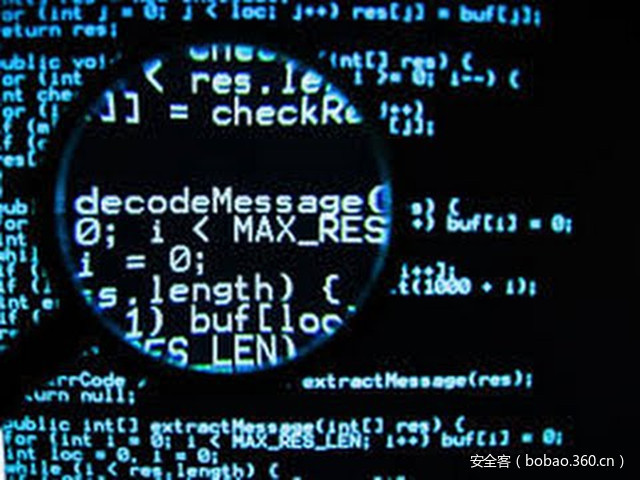

# 【技术分享】如何反汇编二进制代码打补丁

                                阅读量   
                                **98288**
                            
                        |
                        
                                                                                                                                    
                                                                                            

##### 译文声明

本文是翻译文章，文章原作者，文章来源：infosecinstitute.com
                                 原文地址：[http://resources.infosecinstitute.com/patching-reversing-binary/](http://resources.infosecinstitute.com/patching-reversing-binary/)

译文仅供参考，具体内容表达以及含义原文为准

****

****

翻译：[testvul_001](http://bobao.360.cn/member/contribute?uid=780092473)

稿费：130RMB（不服你也来投稿啊！）

投稿方式：发送邮件至linwei#360.cn，或登陆网页版在线投稿

** **

**前言**

生产环境中的软件通常会存在一些漏洞，这些漏洞可能是由于糟糕的编码实践或者在软件开发生命周期里对安全的处理代码参数缺乏足够的认识造成的，最终导致漏洞被黑客利用。攻击软件同时需要安全策略能力和开发技能，但是很不幸，很多开发商本身也不具备这些能力。在本篇中，我们将展示在没有源代码的情况下怎么通过反汇编来给软件打补丁（存在缓冲区溢出漏洞）。

 

**有漏洞的软件**

给软件打补丁是一种通过反汇编找到有问题的代码段并修改有问题代码的方法。我们的例子是一个很简单的程序，它接受用户输入的一段字符串，然后再输出到屏幕上。

但是这个程序存在一个问题，机智的黑客很容易就会发现它。这里开发者忘记验证用户的输入了，假如用户输入的字符串长度超过了预期怎么办？现在我们就输入超长的字符串，程序出现了一些异常，系统提示了一个缓冲区溢出错误并终止了（缓冲区溢出漏洞不属于本篇的内容，请读者自行了解）。这个异常不是程序的预期结果。

 

**分析BUG**

现在我们已经知道程序存在缓冲区溢出漏洞了，但是我们没有源代码该怎么修复呢？当然有办法，现在已经有很多著名的逆向工程工具了，这里我们将使用IDA Pro和Ollydbg来完成任务。首先使用IDA Pro打开可执行程序，通过查看汇编代码我们很快就能发现漏洞的原因了，scanf函数没有检查输入字符串的长度（%s）。

我们已经找到要修复的代码段了（scanf），现在只需要在格式化输入字符串中加入一个整数就可以解决问题了（例如%10s）。但是我们现在不知道原来代码里存储用户输入字符串的字符数组的大小，要解决这个问题我们在Ollydbg中打开可执行程序。我们可以很轻松的发现数组的大小是16，OD同时也显示了 %s 字符串的偏移地址。

所以用%15s替换%s就可以修复这个漏洞，找到下图高亮的代码段并按下CTRL+G我们就可以直接访问地址0040401B了。

下面我们就要修改指令了AND EAX 590A0073（16进制的代码25 73 实际上就是%s）。

为了更好的理解，我们可以在16进制编辑器中查看需要修改的代码块（地址0040401B）。

 

**打补丁**

要在二进制代码中打上补丁，我们需要选中地址0040401B并按空格键（我们需要把%15s写到这里）。

在把%15s输入前，我们需要先把它转换为16进制。

现在我们可以用31:35:73 (%15s) 替代590A073了，但是在内存中我们需要调换一下位置，即733531，因为16进制代码在执行时总是后进先出。

最后，右击0040401B地址处，然后点击Edit标签中的“copy to executable”来永久保存我们的修改。

这时会出现一个新的窗口，关闭它的时候会提示是否保存。我们保存并为程序取一个新名字，然后在OD中再次打开这个新的程序，因为还有一些工作没有做完。一次成功的补丁不仅恩能够修复漏洞，而且程序还要能够像以前一样正常运行。这里我们修复了缓冲区漏洞，但是程序并不能正常运行，原因是我们增加的字节影响了原来的程序执行流程。CTRL+G跳转到0040401E：

这里我们可以发现JNB SHORT 00404020指令跳转出错了，它应该跳转到输出字符串的printf函数处，正确的地址是0040402D。

在0040401E处我们按下空格键并修改代码。

然后我们在0040401E处再次右键并“copy to executable”保存一个新的可执行文件。现在我们执行可执行文件，并随便输入超过16个字节的字符串，可以看到一切正常。

 

**总结**

软件里的漏洞会被黑客以任何可能的理由利用，不管这些漏洞是有意或者无意形成的，在这篇文章中我们都学会了如果通过逆向工程在没有源代码的情况下给程序打补丁。
