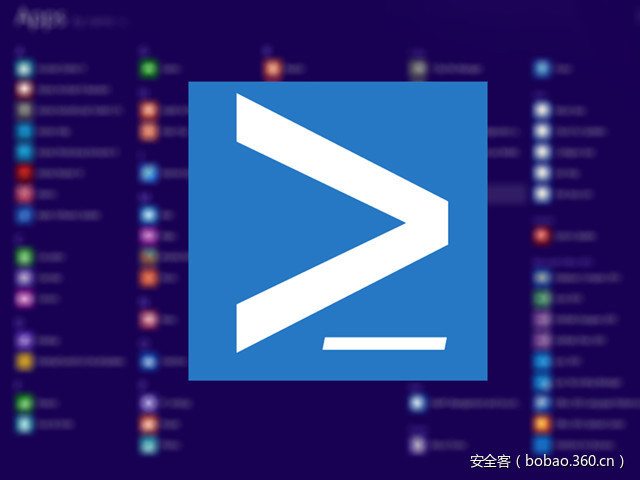

# 【技术分享】如何绕过应用程序白名单和受限的PowerShell

                                阅读量   
                                **117099**
                            
                        |
                        
                                                                                                                                    
                                                                                            

##### 译文声明

本文是翻译文章，文章原作者，文章来源：improsec.com
                                 原文地址：[https://improsec.com/blog//babushka-dolls-or-how-to-bypass-application-whitelisting-and-constrained-powershell](https://improsec.com/blog//babushka-dolls-or-how-to-bypass-application-whitelisting-and-constrained-powershell)

译文仅供参考，具体内容表达以及含义原文为准

****

翻译：[myswsun](http://bobao.360.cn/member/contribute?uid=2775084127)

预估稿费：200RMB

投稿方式：发送邮件至[linwei#360.cn](mailto:linwei@360.cn)，或登陆[网页版](http://bobao.360.cn/contribute/index)在线投稿

** **

**0x00 前言**

过去几年，我一直对应用程序白名单绕过很有兴趣，并且阅读了Casey Smith（@subtee）和Matt Graeber（@mattifestation）的成果。从他们的成果中得出的主要结论是应用程序白名单必须被锁定，以避免受信任的程序运行攻击者的代码。在Windows 7和8.1上面非常明确，Powershell是一个绕过应用程序白名单的简单方法，即通过反射PE注入，Windows10上面将会不同。随着Windows 10中AppLocker的Powershell受限语言模式的激活，这条路被堵死了。Casey Smith有大量的关于绕过应用程序白名单的其他方式的[研究](https://github.com/subTee/ApplicationWhitelistBypassTechniques)。我是Veris Group发布的[PowerShell Empire](https://www.powershellempire.com/)攻击框架的忠实粉丝，并且我非常喜欢[HTML应用](https://en.wikipedia.org/wiki/HTML_Application)攻击向量。正如我将在下面展示的，这种攻击在开启[Powershell受限语言模式](https://msdn.microsoft.com/en-us/powershell/reference/4.0/microsoft.powershell.core/about/about_language_modes)时不能起作用。但是我将思考使用先前公布的研究和代码使得这种攻击向量再次有效。本文将描述我如何做到的，尽管有大量的嵌套技术和代码。

 

**0x01 HTA攻击**

如果你没有听说过HTML应用作为一个攻击向量或者没有看过PowerShell Empire，我将快速的描述和展示它如何工作的。在开始看PowerShell Empire和创建一个Listener（在我的例子中称为test）之后，我们创建一个HTA stager，且设置Listener名字和输出文件：

我们将它放在一个web服务器上面，且保证能被受害者访问。HTA文件包含如下代码：

因为HTA文件是在浏览器沙盒之外打开的，ActiveX对象被允许执行。它将以base64加密的命令行启动PowerShell，以获取另一个更大的Empire agent stager，并在内存中执行它。受害者的浏览器看起来像下面这样：

接下来：

在点击运行之后，回调触发，Empire在受害者机器上启动一个新的agent：

 

**0x02 Applocker和PowerShell 受限语言**

本文是关于即使开启了Applocker和PowerShell受限语言模式，如何通过一个HTA文件获取Empire agent。在那之前，我想强调下做坏事后果自负。如果我试图在机器上面运行一个恶意程序（Malware.exe），得到下面的提示：

并且如果我尝试在PowerShell中使用.NET组件运行命令，也会被阻止：

同样，如果我试图在使用HTA之前启动相同的攻击，也被阻止了：

由于受限语言模式，我们从PowerShell中得到了相同的错误。现在我不得不绕过它。

 

**0x03 PowerShell without PowerShell**

有一些[研究](http://www.blackhillsinfosec.com/?p=5257)是不使用powershell.exe运行PowerShell命令。这个想法是因为PowerShell.exe只是.NET集合System.Management.Automation的解释器，并且完全可以自己写解释器调用那个集合。我们面对的问题是应用程序白名单，因此我们需要启动自定义的解释器。而且这个解释器不得不运行在一些进程地址空间内。我想把它注入到一个存在的进程中，而不是它自己创建自己，且要保持和agent一起使用。在搜索之后，我发现Veris Group发布的PowerPick[项目](https://github.com/leechristensen/UnmanagedPowerShell)，包含了一个ReflectivePick模块（以Lee Christensen (@tifkin_)的项目为基础重建）。它是一个C++程序，编译后是一个DLL，且调用了一个来自System.Management.Automation的自定义运行空间，能允许PowerShell命令运行。

为了测试，我使用简单的命令编译了ReflectivePick DLL，以便在运行空间中执行。

我从白名单文件夹中使用rundll32来运行ReflectivePick DLL，结果如下：

PowerShell命令执行了，甚至更重要的是运行空间的语言模式是FullLanguage，即使AppLocker锁定powershell.exe为受限语言模式。

使用这个，我更新了参数列表，其包含上面的base64编码的Powershell Empire stager和一个解码的函数过程，因为我们不再需要使用-Encoded参数。我也将解码的命令行保存到文件中，以便调试。所有的命令行显示如下：

从命令行运行更新的DLL，显示解码的Empire stager的文本文件如下：

和一个Empire agent已启动：

 

**0x04 注入其他进程**

目前为止，我们创建了一个新进程rundll32，且加载了DLL。这不是一个可行的方案，因为这个DLL不是白名单内的，而且我们还创建了一个新进程。为了避免这两个问题，我们能通过Powershell脚本Invoke-ReflectivePEInjection注入ReflectivePick DLL到其他进程。这在受限语言模式启用时当然会触发启动Powershell脚本的问题，过会我们在回到这看。Invoke-ReflectivePEInjection使用两个参数，字节数组的DLL和被注入的进程ID，因此我们先找到PID：

然后我们将ReflectivePick DLL转化为一个字节数组，显示如下：

Invoke-ReflectivePEInjection脚本，以函数形式编写，因此我们首先要导入这个模块，确保它放在白名单目录，以避免触发受限语言模式。然后以PID和DLL为参数调用它：

我们注意到Empire stager创建的调试文本文件，如下所见，我们成功让agent运行在explorer进程中：

让我们将用于获取的PID和字节数组DLL的命令行嵌入Powershell脚本，同时我们不必导入它就能调用这个函数。添加完后的脚本如下：

然后我们无参数运行Powershell脚本：

并且我们得到了Empire agent的回调：

我们一直面对一个问题，即ReflectivePick DLL以文件形式存在磁盘上，因此让我们将它嵌入到Powershell脚本中。将DLL字节数组base64编码，显示如下：

然后把文件的内容编码拷贝到Powershell脚本中，并赋值给一个变量：

并且，代替从磁盘取得文件字节，我们将从保存base64编码的内容的变量中获得：

我们再一次得到了Empire agent：

 

**0x05 从InstallUtil.exe调用Powershell**

原则上，我们还没有实现任何东西，因为现在我们使用Powershell将DLL加载进内存中调用Powershell，仍会被受限语言模式阻止。然而，我们已经确保Powershell在一个存在的进程中执行，而不是创建一个新的。我们需要克服调用Invoke-ReflectivePEInjection会被受限语言模式阻止的问题。为了实现这个，我们使用InstallUtil.exe来运行一个自定义的EXE，以创建一个非托管的Powershell运行空间。Casey Smith发布了一种使用InstallUtil.exe绕过AppLocker的方法和创建Powershell运行空间的PoC代码。

我修改了代码，来执行一个预定义的命令，其开始只是一些假的代码来确保能工作，显示如下：

把它编译为Bypass.exe，且尝试在受害者机器上面运行它，很明显会被AppLocker阻止:

然后我们运行InstallUtil.exe来执行卸载方法，下面是Casey Smith描述的命令行参数：

从上图得知，命令执行了且自定义的Powershell运行空间不会开启受限语言模式。从这里，我们将测试命令改变为整个Invoke-ReflectivePEInjection脚本及嵌入的DLL和添加的启动命令。我们现在面临了另一个困难，Powershell以新行或分号分割命令。Invoke-ReflectivePEInjetion有很多行，但是把它嵌入到C#代码则需要的是一行。为了修改这个问题，我们将整个文件base64编码。显示如下：

将它和base64解码例程一起嵌入到EXE中：

我们也将解码的Powershell命令写入test5.txt文件，来确保工作正常。以新代码运行InstallUtil.exe：

Invoke-ReflectivePEInjection脚本被解码其保持了一行，Empire stager也被写入了调试文件。如下所见，Empire agent成功启动了：

 

**0x06 调用InstallUtil.exe**

目前为止，我们设法将绕过Powershell的受限语言模式转化为EXE文件绕过AppLocker。虽然我们成功执行了EXE，我们还是需要一些方法来调用InstallUtil.exe并下载EXE到磁盘上。为了实现这个我们来看下regsvr32.exe，它是Casey Smith描述的另一个绕过AppLocker的方法。

Regsvr32.exe能用来只想能够包含JavaScript的脚本。因此，我们开始欺骗且EXE还是在磁盘上，但是通过regsvr32.exe来运行脚本执行InstallUtil.exe。Casey Smith的PoC代码修改如下：

运行如下：

能得到一个Empire agent回调：

现在你可能知道为什么我使用regsvr32.exe来启动InstallUtil.exe，因为我事实上没有得到任何东西。但是关键点是regsvr32.exe也能用来下载EXE到磁盘上，而且脚本文件也存储在一个web服务器上，显示如下：

 

**0x07 下载文件**

为了通过regsvr32.exe测试下载，我base64编码了一个假的文本：

然后我们使用Casey Smith发现的另一个滥用certutil.exe来解码并写磁盘文件方法。Base64编码的文本放置在BEGIN CERTIFICATE和END CERTIFICATE标记中，来给certutil.exe提供正确的格式。然后我们将base64编码的文本写入一个文件，且使用certutil.exe解码它：

像下面这样执行它：

文件内容被解码成功。现在是时候做点微调，代替嵌入EXE给InstallUtil.exe。因此，我们在另一台电脑上使用certutil编码它：

为了允许base64编码内容多行显示，我们在每行的末尾添加一个反斜杠：

测试结果是我们不能嵌入编码的EXE到一个脚本中。因此我不得不将它分割为4部分。每个携带一些base64代码且将它写入一个文件：

执行后，写入的文件显示如下：

然后，我创建第5个脚本，将磁盘上的4个文件组合为一个文本文件，并调用certutil.exe解码它，将EXE写入磁盘：

运行所有的脚本：

有Empire agent回调：

为了压缩这个，我将4个脚本片段的调用嵌入到主脚本中：

再次运行，得到一个Empire agent回调：

 

**0x08 回到HTA**

现在我们有了一个单独的命令，我们能调用后创建我们的Empire agent。为了启动它，我们能嵌入这个命令到HTA文件中，就像AppLocker不存在一样：

在调用邮件中放入这个文件的链接，最终在用户的浏览器中调用：

运行后，能得到我们期望的Empire agent，尽管AppLocker和Powershell受限语言模式都开启了：

 

**0x09 总结**

总结下这个方法，有web服务器提供一个HTA，其调用Regsvr32.exe来只想执行5个脚本，脚本用来下载base64编码的EXE，解码并写入磁盘。然后执行InstallUtil.exe绕过AppLocker，继而执行EXE的卸载方法。EXE包含了base64编码的Powershell脚本，其被解码并在EXE创建的一个自定义的Powershell运行空间中只执行。Powershell脚本包含一个base64编码的DLL，其被解码且反射加载进explorer进程。反射加载的DLL包含一个base64编码的Powershell脚本，其被解码且在explorer进程中创建的自定义的Powershell运行空间中执行。Powershell脚本是Powershell Empire agent的普通的stager。

对于这种攻击能生效，下面的二进制文件需要被AppLocker标记为白名单：

mshta.exe

regsvr32.exe

certutil.exe

installutil.exe

四个都需要在白名单中，如果使用默认AppLocker规则或所有微软签名的二进制文件是受信任的，它们将是白名单。虽然这种攻击确实能绕过AppLocker和Powershell受限语言模式，并且在另外的AMSI中，将不能绕过ScriptBlock日志记录，因此检测是可能的，如下所见：

我想感谢Casey Smith，Lee Christensen和本文所参考的其他人的成果。独立的代码部分能在[github](https://github.com/MortenSchenk/Babuska-Dolls)找到。
