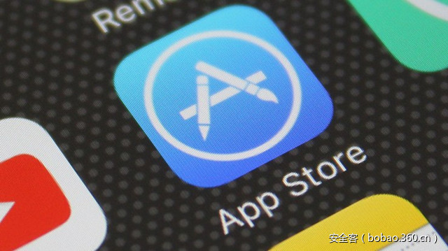

# 【技术分享】对iPhone安装PP助手后可能带来的安全隐患分析


                                阅读量   
                                **448185**
                            
                        |
                        
                                                                                                                                    
                                                                                            


##### 译文声明

本文是翻译文章，文章原作者，文章来源：trendmicro.com
                                <br>原文地址：[http://blog.trendmicro.com/trendlabs-security-intelligence/third-party-app-stores-delivered-via-ios-app-store/](http://blog.trendmicro.com/trendlabs-security-intelligence/third-party-app-stores-delivered-via-ios-app-store/)

译文仅供参考，具体内容表达以及含义原文为准

**[](./img/85805/t01b06f5e992ebe22a7.jpg)**

****

翻译：[興趣使然的小胃](http://bobao.360.cn/member/contribute?uid=2819002922)

稿费：200RMB

投稿方式：发送邮件至linwei#360.cn，或登陆网页版在线投稿

**<br>**

**一、前言**

我们通常会认为iOS生态系统是一个封闭的生态系统，受到Apple的严格控制。然而，攻击者还是有办法能够突破这种限制。读者应该还记得[Haima](http://blog.trendmicro.com/trendlabs-security-intelligence/how-a-third-party-app-store-abuses-apples-developer-enterprise-program-to-serve-adware/)应用，它使用了Apple的企业证书方式来打破限制，但这种方法需要频繁更换证书，代价较为昂贵。

近期，我们观察到了第三方应用开始通过改进技术来突破iOS限制。我们注意到官方的iOS应用商店上有一个第三方应用，该应用伪装成一个合法的记账应用以逃避安全检测，实际上这是一个第三方应用商店，上面提供了具有越狱功能的应用程序。

目前尚不清楚这个恶意应用的确切目标。这个记账应用使用了日语字符集，但应用商店本身是用中文编写的。此外，这个应用可以在多个国家的官方应用商店上找到。

<br>

**二、应用初探**

该应用名为“こつこつ家計簿-無料のカレンダー家計簿”，翻译过来就是“家庭记账应用”。该应用表面看来似乎是服务于家庭的财务助手类应用，但实际上是一个第三方应用商店。本文发表时Apple已将其从官方应用商店中移除。

[](https://p2.ssl.qhimg.com/t01b44ea36f24df2c7d.png)

图1. iOS官方应用商店中的家庭记账应用

[](https://p1.ssl.qhimg.com/t0101aa818ea1b4551d.png)

[](https://p1.ssl.qhimg.com/t014bb2e7d208a119b1.png)

图2~4. 应用启动的各个阶段截图

应用的代码如图5所示，首次运行时，应用会检查系统用户偏好设置文件中的PPAASSWOpenKey值，利用该值来判断应用是否已在设备上运行过，如果该值不存在，则代表这是首次执行。首次执行时应用会向用户请求数据访问权限来访问第三方应用商店。受制于iOS的权限机制，应用的请求需要用户的授权许可（图2）。权限请求失败后，应用程序跳转到记账视图，伪装为一个合法的应用（图3）。应用在图3中对话框中声明，若要使用信息导出功能，用户需要允许应用的数据访问权限。

[](https://p2.ssl.qhimg.com/t01c25a100753e3bcca.png)

图5. 跳转到记账视图的代码

只要应用没被关闭或者转入后台运行，它会始终处于记账视图中。然而，一旦转入到后台运行状态，该应用会再次试图连接第三方应用商店。连接成功后，该应用会向用户呈现第三方应用商店界面（图4）。

这个第三方应用商店作者之所以这么做，主要是希望能够通过官方应用商店为用户提供便捷的分发渠道，虽然这一行为需要通过Apple的严格审查。

<br>

**三、安装其他应用**

成功进驻官方应用商店后，这个第三方应用商店还需要具备安装其他应用的能力。为了实现这一目标，应用开发者使用了常见的企业证书签名技术来安装非App Store应用。

这种技术需要创建一个plist文件来安装应用。图7是plist文件的一个样例（只是个例子，不是第三方应用商店所使用的plist文件）：

[](https://p4.ssl.qhimg.com/t01d3e74c0dbb474a27.png)

图7. plist文件示例

随后，该应用提供如下一个链接：

```
itms-services://?action=download-manifest&amp;amp;url=https://{web server address}/install_app.plist.
```

用户访问该URL即可安装应用。如果应用使用Apple证书签名，那么系统会弹框，提示该应用必须存在于用户Apple ID的购买记录中。这也是为什么这个第三方应用商店需要用户提供Apple ID，以便完成购买过程：

[](https://p4.ssl.qhimg.com/t01e4f27e771a55a8cf.png)

[](https://p1.ssl.qhimg.com/t010d19f247ef6f3c08.png)

图8~11. 应用安装的各个阶段

[](https://p5.ssl.qhimg.com/t01bca17ee9d8a0f464.png)

图12. 用于创建plist文件和安装链接的代码片段

[](https://p1.ssl.qhimg.com/t01ce90138a9054adb7.png)

图13. 用于创建应用安装进程的代码片段

<br>

**四、恶意软件分发方式**

除了能够安装官方应用商店中的应用，这个应用商店还可以销售不经过官方应用商店分发的其他应用。不幸的是，这些应用中包含恶意软件以及用户不需要的其他应用。

在此平台销售的一个应用名叫“PG Client”，这是iOS设备上的一个越狱应用。该应用曾经出现在官方应用商店中，现在已被移除。如下图所示。

[](https://p0.ssl.qhimg.com/t01b9dbe5a439da4204.png)

图14. PG Client应用

其他恶意应用会经常提示用户在电脑上下载PPHelper应用，这也是一个iOS越狱工具。应用在PC或Mac上安装完毕后，会要求用户将设备连接至电脑。PPHelper从连接的设备中读取与用户授权有关的一些文件，并以iTunes身份与设备进行通信，从而有效地绕过了iOS的DRM保护机制。

[](https://p0.ssl.qhimg.com/t0151f6b080e5bdeb11.png)

[](https://p0.ssl.qhimg.com/t018ab8f523f10a184e.png)

图15~17. 要求用户连接至电脑端的助手类应用步骤截图

[](https://p4.ssl.qhimg.com/t018169a7d680dec142.png)

[](https://p0.ssl.qhimg.com/t017264f27b4d2b6a1b.png)

图18~19. 请求用户设备授权的代码

<br>

**五、推广其他应用以谋取利益**

我们发现该商店中还存在另一类问题应用，如名为“爱应用助手”的应用。这个应用的功能是推广已在官方应用商店中销售的那些应用。这种推广方式可以绕过Apple的应用搜索排行和[付费搜索广告](http://searchads.apple.com/)选项。这款应用能够借助应用推广方式从开发者身上谋取利益，这些开发者不希望通过Apple的官方推广服务来推广应用。

iOS系统含有丰富的API，便于开发者显示应用程序销售页面。爱应用助手使用这种API，将用户从自身的应用列表引导到被推广应用所在官方商店页面。

[](https://p3.ssl.qhimg.com/t018ba87cd6501da118.png)

图20. 安装推广应用

“爱应用助手”在后台运行，前台窗口显示的是被推广应用在官方应用商店中的页面。相关代码如下所示：

[](https://p4.ssl.qhimg.com/t01f68e1aca2aedeb64.png)

图21. 打开官方应用商店窗口的代码

“爱应用助手”在用户隐私方面存在多个问题。首先，助手在安装过程中会将某些用户属性上传到远程服务器，其中包括广告标识符（advertising identifier，idfa）属性，这个属性主要用于统计软件的下载次数。

[](https://p1.ssl.qhimg.com/t013e8a63445d9420af.png)

    <br>

图22. 上传用户属性

此外，助手还使用了名为“TalkingData”的第三方SDK，用来收集与用户行为有关的信息：

[](https://p3.ssl.qhimg.com/t01c29841537922f3ae.png)

图23. 调用TalkingData

这个SDK提供了许多富有侵略性的API接口，其功能包括获取多个用户系统信息（包括Wi-Fi网络名、正在运行的进程信息以及IP地址信息）。如果用户手机已经越狱，这个SDK还可以收集用户的Apple ID和已安装应用信息。这足以让我们将其判定为潜在非必要应用（potentially unwanted application）。

[](https://p1.ssl.qhimg.com/t014c33c84e2039939b.png)

图24. 其他富有侵略性的API调用

<br>

**六、存在的风险及缓解措施**

我们建议用户谨慎下载第三方应用商店中的应用。Apple无法保证第三方应用商店所提供的应用的安全性，用户在这种环境下会面临各种威胁（如恶意软件以及其他不需要应用）。业内组织应该制定政策，如阻止未经批准的应用商店和保护私人设备，以减少这些恶意应用所带来的风险。

在本文发表之前，我们已经将此类应用的存在情况告知了Apple公司。

本文中分析的样本文件特征如下：

[](https://p0.ssl.qhimg.com/t015daf94bf2ac8c7b9.png)
