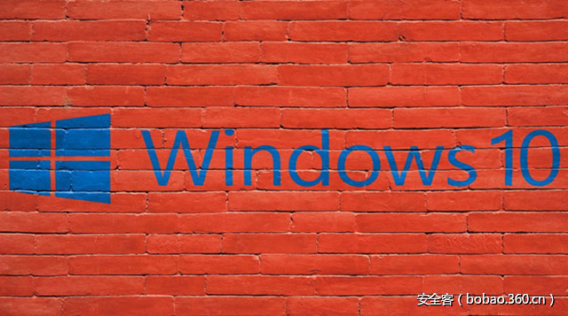

# 【技术分享】探索基于Windows 10的Windows内核Shellcode（Part 1）

                                阅读量   
                                **102745**
                            
                        |
                        
                                                                                                                                    
                                                                                            

##### 译文声明

本文是翻译文章，文章原作者，文章来源：improsec.com
                                 原文地址：[https://improsec.com/blog//windows-kernel-shellcode-on-windows-10-part-1](https://improsec.com/blog//windows-kernel-shellcode-on-windows-10-part-1)

译文仅供参考，具体内容表达以及含义原文为准

****

翻译：[金乌实验室](http://bobao.360.cn/member/contribute?uid=2818394007)

预估稿费：140RMB

投稿方式：发送邮件至[linwei#360.cn](mailto:linwei@360.cn)，或登陆[网页版](http://bobao.360.cn/contribute/index)在线投稿

****

**传送门**

[****](http://bobao.360.cn/learning/detail/3593.html)

[**【技术分享】探索基于Windows 10的Windows内核Shellcode（Part 2）**](http://bobao.360.cn/learning/detail/3593.html)

[**【技术分享】探索基于Windows 10的Windows内核Shellcode（Part 3）**](http://bobao.360.cn/learning/detail/3624.html)

[**【技术分享】探索基于Windows 10的Windows内核Shellcode（Part 4）******](http://bobao.360.cn/learning/detail/3643.html)

** **

**前言**

当创建Windows内核漏洞利用时，目标通常都是希望以某种方式获得更高的权限，通常是SYSTEM权限。这部分的漏洞利用撰写是最后一个部分，由于在它之前还有很多的步骤，所以它通常不会被讨论到。我见过的最常用的方法是窃取特权进程的进程token，或者是删除特权进程的ACL。我自己经常遇到并使用的技术来源于Cesar Cerrudo 2012年在Black Hat发表的演讲和技术白皮书（[地址](https://media.blackhat.com/bh-us-12/Briefings/Cerrudo/BH_US_12_Cerrudo_Windows_Kernel_WP.pdf)）。演示文稿和白皮书非常棒，值得大家阅读和学习。但是，在尝试运用白皮书中的方法时，出现了2个问题：首先，它只提供理论上的技术，不提供实际的shellcode；其次它是在Windows 8.1发布之前写的，时效性是个问题。

这是一个通常不被关注的领域，我想深入的去研究，并探知Cesar Cerrudo描述的这三种方法是否适用于Windows 10周年版。此外，我想开发出shellcode，实际的运行起来，并记录为了使这三种方法适用于Windows 10，可能需要做出的改变。

 

**分析**

在白皮书中，Cesar描述了下面三种方法：

替换进程token

清除ACL

启用权限

在这篇文章中，我将探讨如何替换进程token并获得SYSTEM权限，剩下的两种方法我将在后续的文章中和大家探讨。

替换进程token是最常见的两种方法之一，就像 Cesar所描述的，这个方法的原理是找到一个特权进程，并将该进程的token复制到当前进程。如果选择了任意特权进程，则使用此方法会导致bug check风险。因此我们通常使用系统进程，因为系统进程的引用计数器很高，不容易引起问题。但是可惜的是，白皮书中所描述的方法只有在被利用的进程没有在沙盒中运行时才有效，所以需要做一些修改，但是主要原理仍然是有效的。

思路如下：

查找当前进程的EPROCESS地址

找到SYSTEM进程的EPROCESS地址

将SYSTEM进程的token复制到当前进程

执行需要SYSTEM权限的操作

我开发内核漏洞利用是为了POC而不是将它武器化，我将它们编译为EXE’s，并从目标上的cmd.exe直接启动它们，而不是通过浏览器。我希望确保他们能在Low Integrity或AppContainer上工作。但是由于漏洞利用通常在执行其职责后退出，我想要cmd.exe进程获得提升的权限，而不是运行实际漏洞利用的进程。

下面假设漏洞利用获得了任意内核模式代码执行，我们可以手动运行汇编代码，虽然这听起来有些不太可能。但是即使是即将发布的Windows 10创造者版本，只要发现一个write-what-where漏洞，就会有很多种方法来实现这一点。

**The Shellcode**

有了所有的先决条件，我们接下来处理前面思路中列出的四个问题。首先，我们需要定位当前进程的EPROCESS，可以通过先找到进程的KTHREAD来实现，KTHREAD位于GS段的offset 0x188处。然后我们可以在KTHREAD的offset 0x220处找到一个指向KPROCESS的指针，如下图所示：

这就意味着当前进程的EPROCESS地址可以通过以下的汇编指令找到：

由于我想将权限转移给cmd.exe，会出现一个额外的步骤—找到cmd.exe的EPROCESS。我们使用进程ID，它是漏洞利用应用程序的parent进程，可以通过以下方式找到：

这意味着当前进程EPROCESS中的offset 0x3EO是cmd.exe的PID，这是通过以下方式捕获的：

接下来找到另一个进程的EPROCESS地址，我们注意到了下面的结构：

这意味着进程的PID在EPROCESS的offset 0x2E8处。在offset 0x2F0处，我们有一个所有EPROCESS的链表，可以通过执行它们来寻找cmd.exe的PID：

这个完成之后，我们想要找到token的地址，因为这是我们想要替换的东西。它位于offset 0x358处，如下图所示：

在我们继续往下进行之前，我们要确保存储好该地址：

现在我们已经找到了cmd.exe的EPROCESS，我们想要从这个进程中获得SYSTEM权限，接下来我们需要找到系统进程的EPROCESS。由于系统进程总是有4的PID，我们能用同样的方法找到它：

这样我们就找到了系统进程的EPROCESS地址，下一步就是替换cmd.exe进程的token，通过重写现有的token就能实现。

要记住RDX包含系统进程EPROCESS地址的offset 0x358，RCX包含cmd.exe EPROCESS地址的offset 0x358。执行实际的shellcode，如下图所示：

我们得到了预期的结果：

 

**结语**

这个shellcode是100％稳定的，并且授予parent进程，如果修改了执行进程，则授予SYSTEM权限。第一篇文章至此结束，shellcode可以在Github找到：

[https://github.com/MortenSchenk/Token-Stealing-Shellcode](https://github.com/MortenSchenk/Token-Stealing-Shellcode) 

 

****

**传送门**

[****](http://bobao.360.cn/learning/detail/3593.html)

[**【技术分享】探索基于Windows 10的Windows内核Shellcode（Part 2）**](http://bobao.360.cn/learning/detail/3593.html)

[**【技术分享】探索基于Windows 10的Windows内核Shellcode（Part 3）**](http://bobao.360.cn/learning/detail/3624.html)

[**【技术分享】探索基于Windows 10的Windows内核Shellcode（Part 4）******](http://bobao.360.cn/learning/detail/3643.html)

