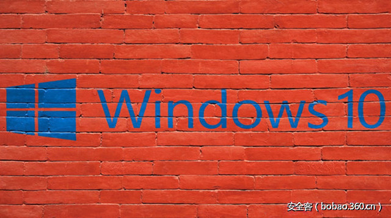

# 【技术分享】探索基于Windows 10的Windows内核Shellcode（Part 2）

                                阅读量   
                                **106099**
                            
                        |
                        
                                                                                                                                    
                                                                                            

##### 译文声明

本文是翻译文章，文章原作者，文章来源：improsec.com
                                 原文地址：[https://improsec.com/blog//windows-kernel-shellcode-on-windows-10-part-2](https://improsec.com/blog//windows-kernel-shellcode-on-windows-10-part-2)

译文仅供参考，具体内容表达以及含义原文为准

****

翻译：[金乌实验室](http://bobao.360.cn/member/contribute?uid=2818394007)

预估稿费：180RMB

投稿方式：发送邮件至[linwei#360.cn](mailto:linwei@360.cn)，或登陆[网页版](http://bobao.360.cn/contribute/index)在线投稿

****

**传送门**

[**【技术分享】探索基于Windows 10的Windows内核Shellcode（Part 1）******](http://bobao.360.cn/learning/detail/3575.html)

[**【技术分享】探索基于Windows 10的Windows内核Shellcode（Part 3）**](http://bobao.360.cn/learning/detail/3624.html)

[**【技术分享】探索基于Windows 10的Windows内核Shellcode（Part 4）**](http://bobao.360.cn/learning/detail/3643.html)

** **

**前言**

这篇文章是Windows内核shellcode系列的第二篇，我们接着探讨Cesar Cerrudo在2012年Black Hat上提出的三种方法中的第二种方法—清除ACL。（本系列的第一篇文章探讨的是替换进程token，地址是[链接](https://improsec.com/blog/windows-kernel-shellcode-on-windows-10-part-1)）。

 

**分析**

上篇文章中使用的假设同样适用于本篇文章，即假设漏洞利用已获得任意内核模式代码执行，我们可以手动运行汇编代码。ACL NULL技术使用的广泛性几乎与token替换一样，其理念是定位特权进程的SecurityDescriptor或ACL，并将其替换为NULL。Windows被告知进程没有被分配任何权限，因此每个人都有权限访问它。NULL SecurityDescriptor内核漏洞利用缓解已经在Windows 10周年纪念版实施了，来自Nettitude实验室的分析如下：

[https://labs.nettitude.com/blog/analysing-the-null-securitydescriptor-kernel-exploitation-mitigation-in-the-latest-windows-10-v1607-build-14393/](https://labs.nettitude.com/blog/analysing-the-null-securitydescriptor-kernel-exploitation-mitigation-in-the-latest-windows-10-v1607-build-14393/) 

清空特权进程的SecurityDescriptor，例如winlogon.exe，会导致BugCheck。我们可以通过查找winlogon.exe的EPROCESS和它的SecurityDescriptor来验证这一点：

手动设置为0，模拟shellcode，得到：

然后出现蓝屏死机：

这个结果和Nettitude实验室分析的一致。这意味着Cesar Cerrudo所描述的null ACL方法不再适用于Windows 10，但问题是我们是否可以通过对其做修改使之适用于Windows 10。内核漏洞利用缓解只检查SecurityDescriptor是否为零，并不检查ACL的内容，这意味着我们可以修改它，来达到同样的目的。

 

**探究ACL**

既然我们不能完全删除ACL，我们就必须想办法如何去修改它。ACL由很多部分组成，主要结构来自于MSDN上定义的_SECURITY_DESCRIPTOR，如下图：

我们注意到DACL或任意访问控制列表，它指定了特定用户对对象的访问权，在本例子中为winlogon.exe。根据MSDN，ACL具有以下的结构：

ACL对象只是一个header，实际内容是在随后的访问控制条目或ACE中。对于DACL，有两种类型的ACE，ACCESS_ALLOWED_ACE和ACCESS_DENIED_ACE，我们对ACCESS_ALLOWED_ACE更感兴趣。ACCESS_ALLOWED_ACE具有以下的结构：

ACCESS_ALLOWED_ACE通过ACCESS_MASK显示某个SID拥有哪些权限。

总结来说，SecurityDescriptor指针指向一个SECURITY_DESCRIPTOR对象，该对象包含具有一个或多个ACCESS_ALLOWED_ACE结构的DACL。有相当多的结构需要理清，可以使用！sd命令将其全部转储在WinDBG中。！sd将SecurityDescriptor指针作为参数。 我们可以找到SecurityDescriptor指针，如下图所示：

但是当调用！sd命令时，我们遇到了如下问题：

低位实际上是一个快速引用，在x64的情况下为4位，所以我们必须将它们置零，然后就能得到正确的结果：

我们从转储中得到很多信息。首先DACL的AceCount是2，这意味着它包含两个ACE，而且两个都是ACCESS_ALLOWED_ACE。一个用于NT AUTHORITY  SYSTEM，另一个用于BUILTIN  Administrators。它还显示SYSTEM对该进程拥有全部权限。有很多路线可以实现访问winlogon.exe，对于我来说，我想把SYSTEM权利给其他人。我的想法是更改SYSTEM SID到低特权组，然后给此组别里的任何成员该进程的全部权限。我们需要在内存中找到该ACE的SID。回到结构，DACL ACL结构应该在offset 0x20处，从WinDBG中可以看出：

转储ACL结构，得出：

这显然是错误的，因为我们看到DACL只有两个ACE。我发现在offset 0x30处转储，能得出正确的结果，这使我想到显示的符号不是最新的：

不幸的是，ACE结构的符号不存在，所以剩下的必须通过十六进制转储，在offset 0x30处我们发现：

ACL header占用8个字节，然后是每个ACE。每个ACE都以ACE_HEADER开始，根据MSDN，结构如下图：

这说明它的大小为4字节，然后是Mask，Mask只是一个DWORD，在本例子中为0x1FFFFF，最后是SID，SID从SecurityDescriptor的offset 0x40处开始。从上面的！sd命令，我们注意到第一个SID是S-1-5-18，这匹配我们有的十六进制数据，1在offset 0x41处，5在offset 0x47处，18或0x12在offset 0x48处。现在我们知道了拥有进程所有权限的SID所在的位置，以及它在内存中的结构。问题的关键是如何修改它，查找全局的SID我们发现S-1-5-11是已通过身份验证的用户SID，也就是我们自己。然后我们只需要将一个字节从0x12更改为0xb，我们便能将用户从SYSTEM更改为Authenticated Users（已通过身份验证的用户），如下图所示：

进程管理器也向我们展示了相同的结果：

按照惯例下一步是在winlogon.exe中创建一个线程，并用SYSTEM权限运行usermode shellcode。但是，当我们尝试操作的时候出现了错误：

我们没有权限处理进程，因为winlogon.exe在一个比Shellcode.exe进程更高的完整性级别上运行，所以即便我们是已通过身份验证的用户组的成员，并且对winlogon.exe有完全控制权，我们也无法处理进程，因为我们目前的完整性级别较低。这个问题不是来自winlogon.exe，而是来自我们自己的进程，以及我们的token。当前进程的token位于EPROCESS的offset 0x358处，如下图所示：

我们注意到指向token的指针是一个快速引用，所以我们需要忽略低4位，然后我们得到：

在本例中， MandatoryPolicy很有趣：

值0x3显示TOKEN_MANDATORY_POLICY_NO_WRITE_UP标志已经设置了，这意味着我们不能访问具有比当前级别更高的完整性级别的对象。我们还注意到，如果这个值变为0，我们将被允许执行此操作。在调试器中手动修改，结果如下：

很明显，通过修改这两个字节，我们将能够注入代码到winlogon.exe，就像NULL ACL。

 

**The Shellcode**

我们的做法是首先从GS寄存器中找到KTHREAD，然后从offset 0x220找到EPROCESS：

在EPROCSS的offset 0x450处，我们找到了进程可执行文件的名称：

我们可以使用它来循环访问所有的EPROCESSES，直到我们找到正确的那一个，这可以通过搜索名称的前4个字节来完成：

实现过程如下：

一旦我们定位到winlogon.exe的EPROCESS，我们就找到了它的SecurityDescriptor，删除快速引用，并将offset 0x48处的字节更改为0xb：

现在我们需要更改被利用进程的MandatoryPolicy，我们已经有了EPROCESS地址，所以接下来我们找到了Token指针，删除了快速引用，并将offset 0xd4处的字节更改为0：

 

**结语**

到此我们的操作就完成了，可能不像旧的ACL NULL技巧那么容易操作，但是它可以通过只更改内存中的两个字节来达到同样的效果。

汇编代码可以在GitHub找到：

[https://github.com/MortenSchenk/ACL_Edit](https://github.com/MortenSchenk/ACL_Edit) 

 

****

**传送门**

[**【技术分享】探索基于Windows 10的Windows内核Shellcode（Part 1）******](http://bobao.360.cn/learning/detail/3575.html)

[**【技术分享】探索基于Windows 10的Windows内核Shellcode（Part 3）**](http://bobao.360.cn/learning/detail/3624.html)

[**【技术分享】探索基于Windows 10的Windows内核Shellcode（Part 4）**](http://bobao.360.cn/learning/detail/3643.html)

