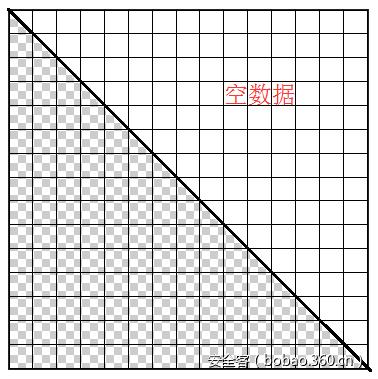
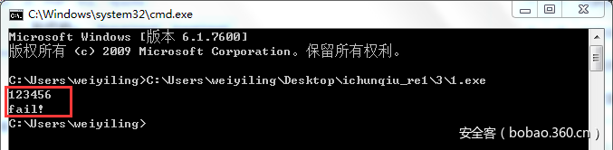

# 【技术分享】春秋杯逆向第一题writeup


                                阅读量   
                                **115505**
                            
                        |
                        
                                                                                    


[](./img/85952/t01568683f5905ed777.png)

最近被春秋杯逆向题坑了两天，记录一下解题过程。

程序一运行，就弹个控制台窗口，啥也没有，拖进IDA看了才知道，是在等待用户输入验证的key：

[](./img/85952/t01951b8e83cc271601.png)

程序的主框架很简单，就是一运行后初始化一些数据，等待用户输入验证的key，之后对输入数据进行验证，验证通过就输出“success”，否则输出“fail”：

[](https://p0.ssl.qhimg.com/t01b1bd1aed260529f9.png)

直接进入验证函数，看到对一个初始设定的64位大数值"0x1BEBAAB51"不断进行扣减操作，直到满足指定的条件（结果小于等于0），而输入的key用来影响减法操作。从循环的次数以及最后的一个判断条件可以推测，key的长度应该是169（=1014/6)：

[](https://p5.ssl.qhimg.com/t016d9e74dbcba953fe.png)

从循环扣减的算法进行分析，循环一共进行了1014次，每次从一个大数组里取到一个64位数值进行扣减。这个大数组是验证key之前就初始化好的“随机”二维矩阵，矩阵的大小是1014*1014，每个元素为一个8字节的64位数值。而每次循环对数值的选取，受函数“getstep”的影响。该函数的参数是输入字符（每循环6次使用一个输入的字符）和当前循环的次数，返回结果为0或者1，意为判断是否向前递进，因为结果被v5进行累加，而v5则直接影响二维数据矩阵每次在该行上对数值的坐标选取。依此分析，大致的选取方法如下，最终能够选取到的数在矩阵的下三角部分：

[](https://p5.ssl.qhimg.com/t0126e5ce2e961529a4.png)

到这里大概明白验证算法选数的过程，结合下图题目给出的提示，很容易想到我们的解题思路应该是要从二维矩阵里找出一条选数路径，使得路径上的数加起来最大，而取值的范围受上述图的限制，不能超越下三角部分。

[](https://p3.ssl.qhimg.com/t01e87ae78f4d2fa980.png)

先来看看这个二维矩阵具体长什么样吧，在IDA里按x对大数组“big_array0”找交叉引用，发现在一个初始化函数里进行了赋值：

[](https://p5.ssl.qhimg.com/t0163eb3c208dbb19be.png)

该初始化算法是一个双重循环，但仔细观察第二重循环的条件“j&lt;=i”，并且结合赋值的位置“pos = 1014 * i + j”可以想象，数据赋值的范围与上述取值范围一致，是在二维矩阵的下三角部分，如下图，上三角部分则全为0（后面dump内存大数组的数据也能得到验证）：

[](https://p5.ssl.qhimg.com/t01f9967dca744e8b5e.png)

进入生成赋值数据的“伪随机”函数“my_rand”，可以看到该函数为一个具有初始值的线性迭代取模的过程，从这里我们可以得到两个信息，一是每次生成的数值不超过模数（0x989677，0x989677 * 1014 &gt; 0x1BEBAAB51），二是这个程序使用该函数生成的数值是固定下来的，即无论程序运行几次，生成的二维矩阵是固定的同一个，里面的值不会发生变化，这样我们就可以专心去从这个矩阵里找最大和路径了。

[](https://p3.ssl.qhimg.com/t01e02a53e85021a188.png)

回到如何从二维矩阵里找出最大和路径的问题上，搜索一下“二维矩阵 路径 最大值”这些关键字，确定了这个问题是个坑爹的动态规划题（对于我这种大学算法没认真学的选手比较坑），没办法，只好现学现卖，发现动态规划就是一个数学迭代的思想，比如想求最大值MAX(n)，就假设一个次最大值MAX(n-1)，加上最后一个数NUM(n)就可得到最大值，这样不断的逆向推导可以到达第一个数MAX(1)=NUM(1)。按照这个思路，参考一下网上的代码，根据题目要求的路径走向，迭代计算每个网格元素能够取到的最大和（s[i-0][j-0] = a[i-0][j-0] + max(s[i-1][j-0], s[i-1][j-1])，a为二维矩阵，s为对应的最大和点阵，i、j代表行和列），也“比较容易”编程得到求出最大值的路径，注意这里的动态规划有一些限制条件，即“i&gt;=j”，保证只计算二维网格的下三角部分数据：

```
//输入二维矩阵的大数组和二维矩阵的边长，打印选择路径并返回路径节点和最大值__int64 get_max_sum(unsigned char * buf, int len) {
    __int64 *num = (__int64 *)buf;
    __int64 *r_sum = new __int64[len * len];
    memcpy(r_sum, num, len * len * 8);
    for (int i=0; i&lt;len; i++)
    {
        for (int j=0; j&lt;len; j++)
        {
            if (i == 0)
            {
                continue;
            } 
            __int64 val1 = 0, val2 = 0;
            if (i - 1 &gt;= 0)
            {
                val1 = r_sum[(i - 1) * len + j]; //上方节点，当前节点来源之一
                if (j - 1 &gt;= 0)
                {
                    val2 = r_sum[(i - 1) * len + j - 1]; //左上方节点，当前节点来源之一
                }
            }
            if (i &gt; j)//限制条件，下三角数据
            {
                r_sum[i * len + j] += (val1 &gt; val2 ? val1 : val2); 
            }
            else if (i == j)//边界数据
            {
                r_sum[i * len + j] += r_sum[(i - 1) * len + j - 1]; 
            }
            else
            {
                //
            }         }
    } 
    __int64 max_sum = 0;
    __int64 pos_max = 0;
    for (int i=0; i&lt;len; i++)
    {
        if (max_sum &lt;  r_sum[(len - 1) * len + i]) //求出矩阵最后一行边界最大值和节点坐标
        {
            max_sum = r_sum[(len - 1) * len + i];
            pos_max = i;
        }
    }     //打印路径
    for (int i=len-1; i&gt;0; )
    {
        for(int j=pos_max; j&gt;0; )
        {             if((r_sum[(i - 1) * len + j] &gt; r_sum[(i - 1) * len + j - 1]) &amp;&amp; ((i - 1) &gt;= j))
            {
                cout &lt;&lt; 'd'; //意为路径向下走
            }
            else
            {
                cout &lt;&lt; 'r'; //意为路径向右下走
                j--;
            }
            i--;
        }
        break;
    }
    cout &lt;&lt; endl;
    return max_sum;}
```

通过这个坑爹的动态规划算法，输入从程序内存dump出来的二维矩阵数组和边长1014，得到路径与节点和最大值，发现最大值刚好等于初始设定的64位大数“ 0x1BEBAAB51”，可见设定值是经过事先计算好的。接下来就是需要根据路径来反推每一位输入字符了，注意上述函数打印出来的路径（d、r数列）为从最大值节点到矩阵左上角边缘的路径，所以路径要补全到1014次（矩阵起点到边缘交点为直线，即应补上几个“d”），并且使用时应该反向取值。

下面根据得到的路径反推输入字符来得到key。在验证函数里，遍历二维矩阵的每一行，每次取一行的一个元素，共取到1014个数，其中每6个数为一组的取值实际和一个输入字符相关，也就是输入字符经过“getstep”函数能够影响6个一组的数值选取。相反，我们把得到的路径分为6个一组，最终共能分成169（=1014/6）组，而每组就能够确定一个输入字符，因为在“getstep”函数里，返回的结果正好也受“i % 6”的影响，这可以理解为每个输入字符经过“getstep”函数会得到一个确定的6节点路径。

[](https://p5.ssl.qhimg.com/t01d11ffd4d3924113c.png)

因此，我们根据选定的路径，每6个节点路径可以确定一个输入字符，但是每个输入字符影响路径的走向还和一个经过映射的数值有关（如上图num_map），这个数值是怎么映射的呢，和map函数的一个参数“step”有关，该参数是一个全局变量，可以看到其在初始化函数里也经过了初始化：

[](https://p1.ssl.qhimg.com/t013b6f492a466870c4.png)

这里就偷个懒，不去管它的初始化映射算法了，直接od调试得到它初始化完毕的映射关系字符集：

[](https://p3.ssl.qhimg.com/t018395eed8d132be16.png)

这个关系字符集怎么用呢？可以看到，字符集一共有0x40个，即64个，正好是2的6次方。而“getstep”函数在每次调用返回0或1，每6次调用正好能够确定一个字符，于是，6个节点的路径也就能够逆推到一个输入字符：

```
unsigned int num_map[0x80] = {0};unsigned char transfer[] = "EIFd6gwN42LR1vGrBYCnzHTStDqm+kxZpQVioj9O78es3UlAKhXcfybPM5W/0aJu";//调试得到的映射关系字符集 void init_map() //初始化关系映射数组{     int size_char = sizeof(transfer);
    for (int i=0; i&lt;size_char; i++)
    {
        char c = transfer[i];
        num_map[c] = i;
    }} int get_step(char c, int i) //步进函数{
    return  (num_map[c] &amp; (32 &gt;&gt; i % 6)) != 0;}
```

最后，根据得到的路径数列串反推得到key，简单使用测试位的方式：

```
//路径映射位转换void transfer_step(char *p, char *output) {
    for (int i=5; i&gt;=0; i--)
    {
        output[5 - i] = (p[i] == 'r' ? 1 : 0);
    }} 
init_map(); //初始化关系映射数组 FILE* f = fopen("dumped.dmp", "rb");unsigned char * buf = (unsigned char *)new unsigned char[0x7D8320 + 1024];memset(buf, 0, 0x7D8320 + 1024);for (int i=0; i&lt;0x7D8320 + 1024; i+=1024){
    fread(&amp;buf[i], 1, 1024, f); //读取二维矩阵的内存dump} 
__int64 max_sum = get_max_sum(buf, 1014); //得到和最大值路径char path_reverse[] = "drddrdrrdrdrrrdrrrrrddddrrdrrrrrrdddddddrrdrddrrrrrrrdrrrrdrrrdrddddddrrddrrrrrddrrdrdrdrdrrdrdrdrrddddddddrrddrrddddrrdddrdddrdddddddrddddddddrddddddddrdrddddddddrdddddddddrdrddddrrrdddrrrrdrdrrrdddddrrrdrdrrddddddrdddrdrdrdrdrddrddrdddddrrrrrdrddrddrdrddrdrrdrdrrrrrrdrrrrdddddrrddrrrrrdrddrrrrdrdrddrrrrddrddrdrddrrdrrrrddrdrrrrddddddrrrdrrdrdrdrrrdrdrrrdddrddddddrdrdddrdrrrrrrddddrrdrrddddrdrddddrddrrrrrrrrrrrrdrrdrrrdrrrdrrrdrdrddddrrrdrrddddrdrdrrdrrdrdddrrddrrrddrrrdddrddddddddddddddddddrddddddddddrrrrrdrrrrrrdrrrrrrdddddrrdrrdrrrrrrrrdrrdrdddddrdrrrrrrrdddrrrdrrrdrdddddrrdddddrrdrddrdrdrrrdrdrddrrdrdrrrdddrrrddddddrrddrrdrrddrdddrdrrdrrrdddrddddrddrdrrrrrrrrddrrrrrdrrrrdrrdrdrrddddrrrrdrrrddrdrrddrdrddrddddrrrrddrrrdrdrdddrrddrddrrrddddrrddrrdddrrrrrdddrrrrrrdrdrrrrddrrrrrdddrddrdrdddddddddddddddddddddrddddddrdrdrrddddrdddrrdrdddrrdrdrrrdrrddrdddddddrrrrrddddddrrdrddrrdrdddddddrdddddrdrrrdrdddddddrrrrrdrrrrrrrdrrrrdrrrrdddddrdddrrrdddddrrrdddddrrdrdrdddrdddrdrdrrrdddrrdrdrrdddddddddddddrrddddd"; //反转的路径数列串for (int i=1013; i&gt;0; i-=6){
    char r_path[6] = {0};
    transfer_step(&amp;(path_reverse[i - 5]), r_path); //路径映射位转换
    for (int i=0; i&lt;64; i++)
    {
        char test_char = transfer[i];
        if (get_step(test_char, 0) == r_path[0]) //位步进测试
        {
            if (get_step(test_char, 1) == r_path[1])
            {
                if (get_step(test_char, 2) == r_path[2])
                {
                    if (get_step(test_char, 3) == r_path[3])
                    {
                        if (get_step(test_char, 4) == r_path[4])
                        {
                            if (get_step(test_char, 5) == r_path[5])
                            {
                                cout &lt;&lt; test_char; //成功则输出匹配字符
                            }
                        }
                    }
                }
            }
        }
    }}
```

输出得到最终KEY：“IpEvtWVLK+N6NAZPKgf6IDtNK6PTR6vB4EEE8NcyJri1Gng+02nnAdTa0ufQNq23KGG3seTdIkhuBTubKZAPKEpEEYc9RqQlgkPmu0QBbNWLINSHlIWxXo0sXJtrZsCoApoe7pqMGANFpFEzEp6I6tDpwsHD0KRAZXKN/d/sC”。

[](https://p4.ssl.qhimg.com/t01f273f725a138eece.png)


